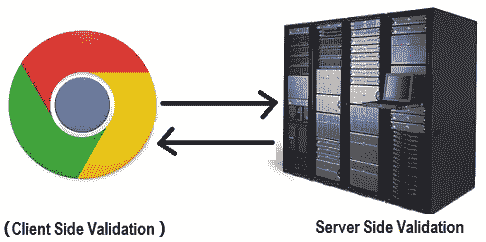
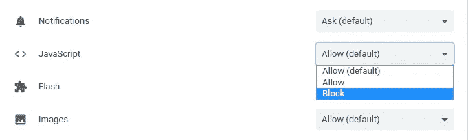

# 我如何“入侵”麻省理工学院技术评论网站(+更多)以获得所有故事的无限在线访问

> 原文：<https://medium.com/hackernoon/how-i-hacked-the-mit-technology-review-website-many-more-and-gained-unlimited-online-access-e89a57cdc248>

## 剧透:避免仅通过客户端阻止！


**免责声明:** **本文提供的所有数据和信息仅供参考。主要目标是提高安全意识，教授信息安全和对策，并向读者提供如何实现安全和功能性系统(在我们的例子中，是一个网站)的信息。如果您计划将这些信息用于非法目的，请立即离开本网站。我不能对给定信息的任何误用负责。我不会用这种方法来逃避付款，你也不应该。**

“黑客”这个词通常有很强的含义，大多数人会想到获得我在标题中提到的网站的 root 访问权限或对其数据库的洞察力。然而，在这种情况下，我想演示如何利用其设计中的特定错误，并让**访问最初被阻止的功能**。

从一开始，我就喜欢阅读 www.technologyreview.com 网站上的科学文章。然而，有一个方面困扰着我。**你每月只能阅读三篇免费文章**，更多(以及其他额外津贴)你需要订阅付费的“全访问数字节目”。


每当我阅读一篇故事时，就会出现一个横幅，告诉我我已经阅读了该月我有权阅读的故事的 1/3、2/3 或 3/3，当我试图打开一篇新文章时，在我一个月内阅读了 3 篇故事后，它会提示我订阅以便访问它。所以我开始思考这个功能是如何工作的，以及如何绕过它。或许可以通过**创建大量账户**(或**不断改变 IP 地址** ) 并从每篇账户中阅读三篇文章来规避这个问题，但**我不认为这是一个合理的解决方案。**

我开始想知道我正在阅读的故事是如何被计算的。我的**最初的假设**是*每次我点击一个 URL(我登录到我的帐户)，都会向服务器发出一个请求，检查我一个月内阅读的文章数量是否少于 3 篇，文章 ID 被保留(这样我可以重新访问那篇文章)，然后我会从服务器获得相应的响应(文章本身或我需要订阅更多的消息)。*



这似乎很符合逻辑，但是我决定**也看看源代码(Ctrl-U)** 。我开始像程序员一样思考，用我心爱的 **Ctrl-F** 搜索特定的变量名，结果！**这是我用一些逆向工程逻辑发现的。**

*   首先，我发现了下面的 HTML 代码片段，它表明了根据我阅读的文章数量向我显示的消息:

```
<!-- Reading Meter -->
<div class="**meter**"> 
<span show="meter.loggedIn.1">     
<span class="meter__line"> **You've read**  
<span text="meter.usageWord"></span> **of three free articles this month.**
</span>
```

*   之后，我在源代码中搜索单词“meter ”,因为它在上面的代码片段中无处不在。我想到的是一个脚本，它将一个 JSON 对象类型分配给一个名为“serverData”(！！！).这是其中一部分的样子:

```
**<script>** **serverData** = "user":{"id":1111111,"username":"John D","email":"myemail@gmail.com","status":"active","rss_token":"st45pew5rX2UQmFafadsgajtP92a","livefyre_id":"uid_11111111","notifications_unread":0,"profile":{"status":"public","display_name_from":"username","name":"John D","url":"/profile/john-d/","first_name":"John","last_name":"D"},**"meter":{"month":"2018-01","count":1,"ids":[600000],"hits":[{"id":600000,"date":"2018-01-01T15:11:32-04:00"}]},"email_notifications":....
</script>**
```

*   在那下面，还有一些链接到 JavaScript 文件的脚本，所以我也开始打开它们:

```
<script src="[https://cdn.technologyreview.com/js/example.js?v=2](https://cdn.technologyreview.com/_/dist/js/article.js?v=0890623a)2222222" defer></script>
```

*   通过搜索，在看似很多行的 JavaScript 中，我设法分离出一些“揭示性”的代码行(再次使用 Ctrl-F 并搜索关键字)。以下是我的一些发现:

```
function P(e,t){e.func.call(e.context,t,e.**count++**)}function w(){if(!y())return!1;**o.meter={usage:i.length>h.allowed?**h.allowed:i.length,allowed:h.allowed,allowedMax:h.allowedMax,...,loggedIn:{1:!1,2:!1,3:!1,"3b":!1},loggedOut:{"1a":!1,"1b":!1}},o.meter.loggedIn[o.meter.usage.toString()]=!0,null==e&&(b=11==(S=new Date).getMonth()...t(window).trigger("mittr:meterBlock",[{**reason:"User is above the allowed view limit"**,...**{if(o.meter={usage:e.ids.length>h.allowed?h.allowed:e.ids.length,allowed:h.allowed,allowedMax:h.allowedMax,visible:!0,open:!0,paywall:!1,usageWord:"",allowedWord:"",loggedIn:{1:!1,2:!1,3:!1,"3b":!1}**,....loggedOut:e.ids.length+1>o.meter.allowedMax?]}
```

**很明显，无论是计数器的递增还是对阅读文章是否少于三篇的检查，都是在客户端用 JavaScript 完成的！！(事实证明你甚至不需要登录)**

有人可以克服每月 3 篇文章的限制的方法现在摆在我面前。**我只要在网站上屏蔽 JavaScript 就行了！**



*从这种服务器端验证中，网站设计中甚至更多的错误都有可能受益，但在发现这个基本缺陷后，我给《麻省理工科技评论》发了一封电子邮件，报告了我的发现。*

总而言之，在这个实现中有两个基本错误:

**a)用户在一个月内阅读的文章数量的验证是在客户端进行的，因此通过禁用 JS，用户可以无限制地在线访问。**

**b)计数器在客户端递增，因此通过禁用 JS，阅读文章的数量保持不变。因此，即使验证是在服务器端进行的，我们仍然可以访问三篇以上的文章。**

*我还得提一下，* ***通过拦截 JavaScript*******新的 cookies 没有被创建*** *。如果删除旧的，就没有办法访问关于用户访问的数据，至少在当前的实现中是这样。因此，另一种绕过付费墙的方法是删除或屏蔽 cookies。**

*有人可能认为这种脆弱性没那么严重，但在我看来，这并不完全正确。*

*首先，它表明**缺乏基本的“最佳实践”**，并表明**在网站的实现中可能会发现更多的错误。***

*另一个重要的方面是**特性的重要性**。在这种情况下，例如，要访问*“无限制在线访问文章”* **的功能，您需要购买订阅**。根据网站的**商业计划**，这可能是一个**重要的收入来源**(通过提供无限制的在线访问服务获得)。*

> *这里要讲的一课，对于有丰富 web 开发经验的人来说，可能听起来简单而基本，就是:**避免仅通过客户端阻止！***

**一个很棒的黑客挑战也教会了我这一点，就是****【hack game 3】，由肖洛克*** *，* [*，*](https://hackgame.chaurocks.com/) *(解/提示* [*，*](https://github.com/KAUTH/HackGame3-solutions) *)。这篇文章是一个现实生活中的例子，你需要想出一个技巧来进行游戏的下一个级别。**

# *更新:*

*写完这篇文章**后，我遇到了许多其他网站，它们的付费 prime 程序可以用同样的方法** **(阻止 JavaScript)** 。此外，在某些情况下，你可以在上浏览插件拦截器，这在以前是不允许的。*

*到目前为止，我发现的受影响的网站有:*

*   *[**麻省理工科技评论**](https://www.technologyreview.com) **，***
*   *[**商业内幕**](https://www.businessinsider.com) **，***
*   *[**《纽约时报》**](https://www.nytimes.com) **，***
*   *[**《华盛顿邮报》**](https://www.washingtonpost.com) **，***
*   *[**学人**](https://www.economist.com) **，***
*   *[**《波士顿环球报》**](https://www.bostonglobe.com)*

**上述所有网站已被告知该缺陷。**

## *学到了什么？按住👏来支持和帮助别人找到这篇文章。感谢阅读！！*

***在 Twitter 上关注我**[**@ konpap 1996**](https://twitter.com/konpap1996)*