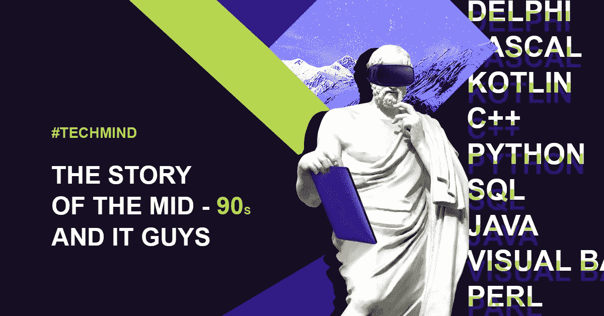

# 我是如何学会 15 种编程语言的，为什么你的孩子也会

> 原文：<https://medium.com/hackernoon/how-i-learned-15-programming-languages-3017dd24e8a6>

Crypterium 为您呈现我们的 CTO #TechMind 的生平故事。对于普通读者来说，这是一个简单的程序员故事，也是一个很好的技术世界入门读物。这个故事表明了相信自己梦想的重要性和强大家庭关系的重要性。我们走吧！

12 岁那年，我生病了，不得不去医院检查。不用担心，原来我只是心绞痛。但是我在医院度过的几个小时，在某种程度上，决定了我的一生。

在我等待考试的时候，有人给了我一本书——只是为了让我高兴起来。原来是关于 [BASIC](https://en.wikipedia.org/wiki/BASIC) ，一种早期的[编程语言](https://hackernoon.com/tagged/programming)，过去是，现在仍然是最简单和最流行的编程语言之一。我非常喜欢从零开始创造新事物的想法，以至于我在读完那本书后选择了我的人生旅程。

我开始在纸上写代码，随着时间的推移，学习了另外 14 种编程语言，以真正理解我们周围的世界是如何工作的。这可能看起来不现实，但你的孩子可能会跟随我的领导。

## **预测真人快打**

故事发生在 90 年代初的莫斯科。当时没有太多人对它和编程感兴趣。更有甚者，没有多少人拥有个人电脑。当我第一次读这本书的时候，我没有电脑，所以我试着在纸上写代码。

很快，我父亲——一所军事学院的教授——设法给我弄了一台这样神奇的设备，我开始用我新学到的基本编程技能来创建简单的应用程序，比如日历、日程表，甚至音乐应用程序。嗯，当我发出指令时，应用程序就会发出声音。

然而，我最大的骄傲是我创作的第一个游戏。它类似于最古老的真人快打版本。我设法想出了全新的脚本语言，这将有助于我编码字符将如何战斗，倒下，站起来，并赢得胜利。顺便说一下，这些都是我 13 岁时做的。

## **我的第一份咨询工作**

显然，不是每个人都能像我一样使用电脑。当我学会如何用 PASCAL(一种鼓励使用结构化编程的更高效的语言)编程时，我父亲把我带到他在学院的办公室，在那里我向他的同事展示了我的技能。学者们对一个拥有电脑的青少年所能做的事情感到震惊，甚至要求我帮助他们，所以我开始向他们咨询编程。

想知道我是怎么学会帕斯卡的吗？爸爸曾经告诉我，在他的工作中，人们已经在使用它，而我对我的基本技能非常守旧。他的话引发了我去学习如何编码，并成为一名多语种程序员。爸爸也是我学习 C 语言[和](https://www.techopedia.com/definition/24068/c-programming-language-c) [C++](https://www.techopedia.com/definition/30960/c) 的原因。他用这些技巧说服我进一步发展自己。

不久之后，我妈妈认为她也可以为我的技能找到一个用例。她为一家保险公司工作，让我写一个程序来帮助优化他们的工作。该程序基本上自动生成文档和电子邮件——在此之前，该公司一切都是手动完成的。我创造了一种优化参数的模式语言。哇——我赚到了我的第一个 50 美元！对一个 15 岁的孩子来说还不错，对吧？

## **Java 改变了这一切**

当 [Java](https://en.wikipedia.org/wiki/Java_(programming_language)) 最终诞生的时候，标志着 90 年代的结束，我不害怕这个词，这是 IT 和编程世界的一场革命。它有些简单和熟悉，但为全世界的程序员打开了新的视野。凭借自动内存管理、架构中立和可移植的特性，Java 让所有以前的编程语言看起来像手动汽车，同时也是配备自动变速箱的最新型号。

我不必担心内存，Java 会保护我。凭借其“一次编写，随处运行”的原则，它还使得从不同设备访问代码成为可能。此外，到 Java 出现的时候，互联网变得更加普及，我接触到了和我有着相同兴趣的爱好者。现在我不孤单了，学习和发展自己变得容易多了。

## **赚钱机器:语言 vs 人脉**

一旦我学会了 Java，我就在全国最大的银行之一找到了我的第一份工作——一个有关系的人工作的地方。我没有任何人脉，也刚刚进入大学，但我知道打开许多大门的神奇语言。

我不会透露任何名字，但在过去的 15 年里，我为 10 家不同的银行工作过，我的技能非常适合这些银行。我专门建造加工中心，但事情从来没有这么简单。IT 人员不仅仅是这些银行的程序员，而是真正的问题解决者。

新的语言，像 [PHP](https://en.wikipedia.org/wiki/PHP) (用于创建交互式 HTML 网页的脚本语言)和 [Perl](https://en.wikipedia.org/wiki/Perl) (在我看来，这种语言实际上是为了迷惑人们而创建的，但也有真正喜欢它的程序员)，不断出现，但没有一个真正赢得我的心。与此同时，我在处理现实世界的问题，比如为自动取款机创造第一个公用事业账单支付系统，或者把这些自动取款机带到小城市。

有一次我甚至不得不去阻止一场暴乱！我们安装在郊区的一台机器本来是要给我们的一个客户(一家工厂)的工人发工资的，但是却坏了，引起了大规模的抗议。尽管事实上我的错误是不存在的，我设法解决了所有的问题，甚至不得不与媒体交谈。那种语言对我来说真的很陌生。

## **科特林还是我加入 Crypterium 的原因**

如你所见，为银行工作很有趣。然而，整个系统是如此根深蒂固的传统和落后，以至于我不得不向前看，亲自看看这项技术能走多远，我能为未来的世界更快地出现做些什么。

回到 2013 年，我已经掌握了另一门语言[——kot Lin](https://en.wikipedia.org/wiki/Kotlin_(programming_language))，这是我自 Java 以来学到的最迷人的东西之一。它是由我的俄罗斯程序员同事创建的，并被 Google 支持为当今的主要编程语言。我个人非常喜欢 Kotlin，以至于我用它来写所有的东西，并把它视为停滞了几乎十年之后的一股新鲜空气。

我把科特林文化带到了我去年加入的区块链创业公司。我们试图在现有的金融基础设施上建立一个全新的层面。我们喜欢数字资产，主要是加密货币，以至于我们决定让它们像现金一样容易消费。结果， [Crypterium](http://crypterium.com/) 诞生了，[被毕马威和 H2 风险投资公司认定为](http://h2.vc/wp-content/uploads/2018/10/Fintech100-2018-Report_Final.pdf)最有前途的金融科技项目之一。

与银行不同，我们处于最新技术的边缘，当在 Crypterium 时，我们告诉候选人我们使用 Kotlin 作为我们的总账，他们受到鼓舞和激励，同时他们为我们工作的意愿以几何级数增长。

## **孩子们将加入 IT 人群**

看起来我写这个故事只是为了吹牛，但是学习新的编程语言并不是为了显得聪明，而是为了用最好的工具完成事情。当然，你可以试着用自行车把你所有的东西从一个房子搬到另一个房子，但这不是最好的解决方案，尤其是当你可以用卡车来代替的时候。

随着时间的推移，我只是在寻找完成事情的工具，不管是 Delfi 还是汇编 x86，Python 还是 JavaScript，我都忍不住想知道这些语言如何帮助我们以新的方式编写新的东西。

对你来说这可能听起来很奇怪，但对你的孩子来说不会，相信我。技术将塑造未来，是否学习如何编码将不是几年后的问题。新一代将会发现，就像我一样，整个新的星系会和我们“对话”。他们会更深入地了解事情的运作方式。当我乘公共汽车时，我想知道自动售票系统或付费卡是如何工作的。当我在电梯里时，我想知道它是如何按照指令到达所有楼层的。

技术无处不在，无处不在，甚至是地球上最偏远的地方——这就是明天的美好。为了理解这个未来世界将如何运作，今天的孩子需要从幼年开始学习技术，因为即使今天知道 15 种编程语言，明天也只是冰山一角。

## 关于隐密处

根据毕马威和 H2Ventures 的说法，Crypterium 是最有前途的金融科技公司之一。我们正在打造一款移动应用，以满足数字资产时代的银行需求。

我们的目标很明确:有了 Crypterium，无论你用传统货币做什么，你都可以用数字资产来做。这个想法得到了 TechCrunch 联合创始人 Keith Teare 和超过 40 万注册用户的支持，这个数字每天都在增长。

该团队由 Visa 中欧和东欧前总经理 Steven Parker 以及来自全球金融机构(如复兴保险、伦敦衍生品交易所、美国运通等)的高管领导。

加入我们的 [**电报新闻频道**](https://t.me/crypterium_en) 或其他社交媒体，保持更新！

[**网站**](http://crypterium.com)**๏**[**电报**](https://t.me/crypterium)**๏**[**脸书**](https://www.facebook.com/pg/crypterium.org)**๏**[**推特**](https://twitter.com/crypterium)**๏**[**bitcointalk**](https://bitcointalk.org/index.php?topic=2214098.0)****************