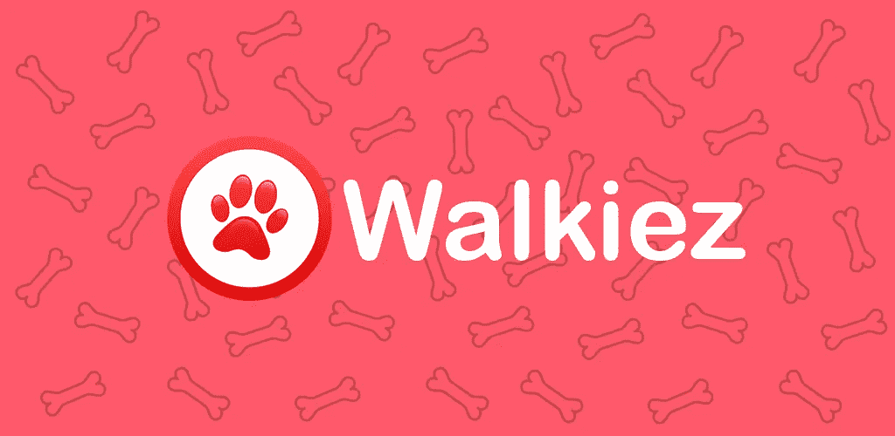
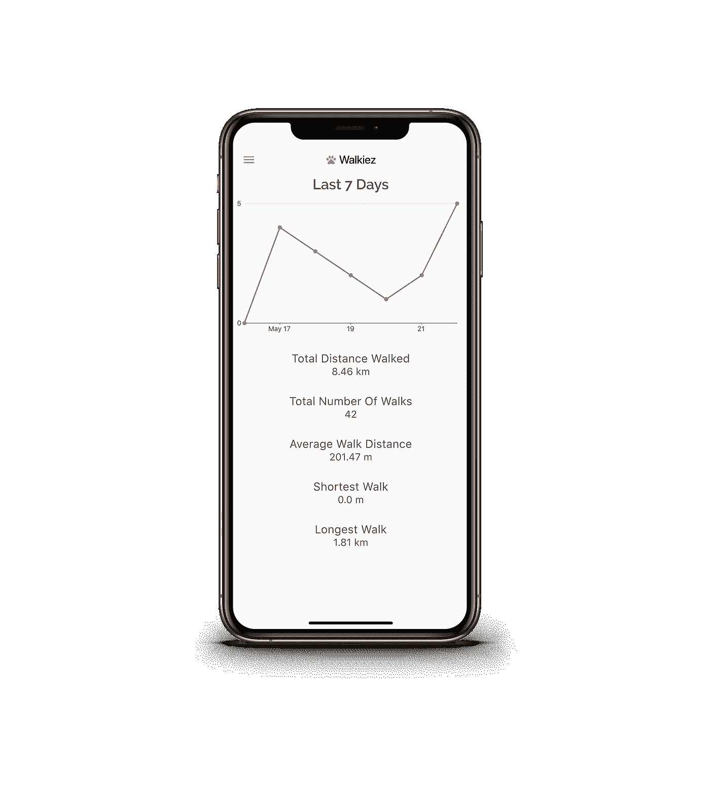
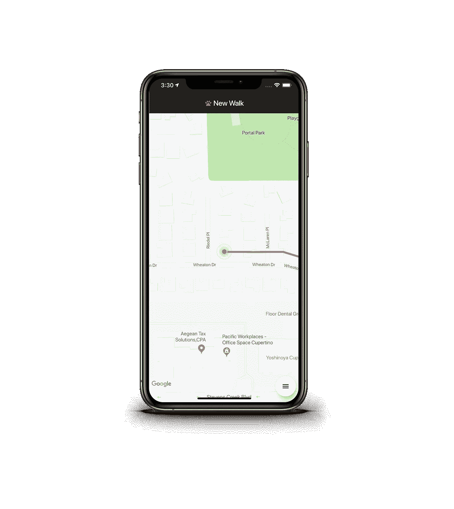
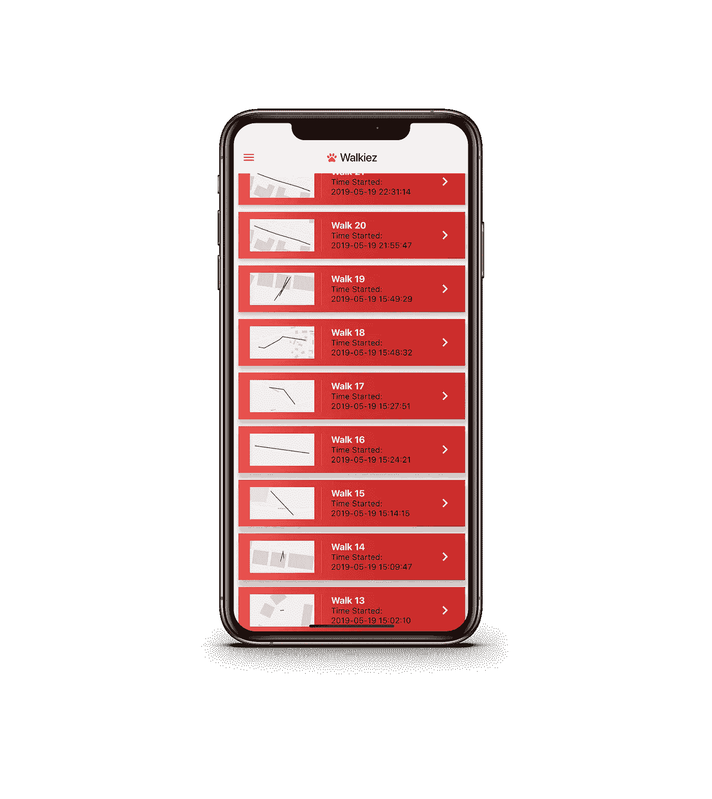

# 我 17 岁时的第一个应用是 Flutter

> 原文：<https://medium.com/hackernoon/how-i-made-my-first-app-at-17-with-flutter-843240e78d93>

## 我叫杰克·莉莉艾，是一名有抱负的应用程序开发人员。

# **我的第一个应用**

昨晚(2019 年 10 月 6 日),我的第一个应用程序通过了苹果的审查，并被苹果公司接受在应用商店上发布。我很兴奋，在我的应用被拒绝三次后，我很高兴看到它终于通过了审查。我不得不等了两个星期，让他们回复我的第一次审查请求(可能是因为 WWDC 周期间的糟糕时机)，但在第一次拒绝后，也就是昨晚，我修复了错误，并在应用商店列表中添加了信息，在与苹果公司来回几次后，他们接受了我的应用，我发布了我的应用。

这款应用名为“Walkiez”，是一款遛狗追踪应用。你可以把它想象成 Strava 或 MapMyRun(很棒的应用程序),不过是用来遛狗的。这个应用程序的想法是因为我自己有两只狗，我对自己说，如果我能跟踪我的散步就太好了…开个玩笑，我爸爸给了我这个想法，但现在想想，我不知道我怎么没有首先想到它。

在 Walkiez 中，您可以跟踪您的步行，查看您的步行历史和统计数据。

Stats Page

Walk Page

History Page

# 下一步是什么

由于我使用了 Flutter，我的应用程序几乎已经为 Android 做好了准备，我只需要想出一种在 Android 上进行后台位置跟踪的方法，我自己也想出了在 iOS 上如何做，但我不能在 Android 上做，我找到的唯一解决方案是一个 300 美元的 Flutter 插件，遗憾的是，我没有这笔资金。

我很高兴得到你的反馈，并看到人们真正使用我的应用程序，我认为这将是我最有收获的一部分。

## 在哪里找到它

Walkiez 目前只在 [iOS 应用商店](https://apps.apple.com/us/app/walkiez-dog-walk-tracker/id1464450487?ls=1)、[或网站](https://walkiez.app)上架。我的个人网站可以在这里找到

**查看[这里](http://jacklilliedev.com/)我的个人博客。**

**感谢您的阅读。**