# 我如何让我的 React 应用程序速度提高 4 倍。

> 原文：<https://medium.com/hackernoon/how-i-made-my-react-app-4-times-faster-7b929479cac4>

## 你可以实现的技术，让你的应用反应极快

如果页面没有在 3 秒内加载，几乎 60%的用户会离开。80%的用户不会回来。所以如果你想让你的业务/应用/网站成功，你需要它快。

# 基准

在我告诉你我有什么不同之前，这里有一些数字。这是假设你有一个快速的 3g 连接，但在现实中，大多数用户将有一个更快的连接。

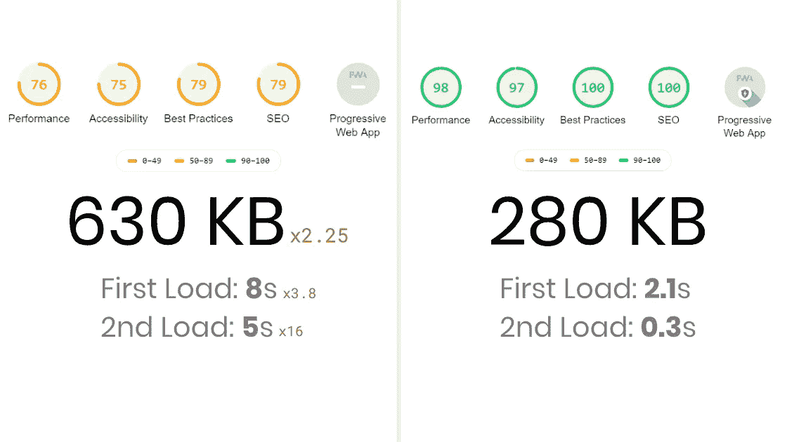

*   对于所有的加载基准，我启用了快速 3g 节流，并在 chrome dev tools > network 上测量了加载时间
*   首次加载=禁用缓存
*   第二次加载=启用缓存后加载

如你所见，这种差异非常大，尤其是在较慢的网络上。现在，是时候看看我是怎么做到的了。

我使用 source-map-explorer 测试了包的大小，它也显示了每个库占用了多少空间。对于性能、可访问性、最佳实践和 SEO 测试，我使用了 Google 的 Lighthouse。负载测试只是 Chrome DevTools 的网络标签加载时间，启用 3g 调节以获得一致的结果。

# 1.CSS 而不是 CSS-in-JS

在旧的实现中，我使用了样式化组件。问题？CSS 更快更小。现代浏览器不仅学会了并行获取 CSS 和 JavaScript 包，而且不需要另一个运行时库，减少了大约 43 KB 的开销，从而加快了加载速度，减少了样式改变时的处理量。

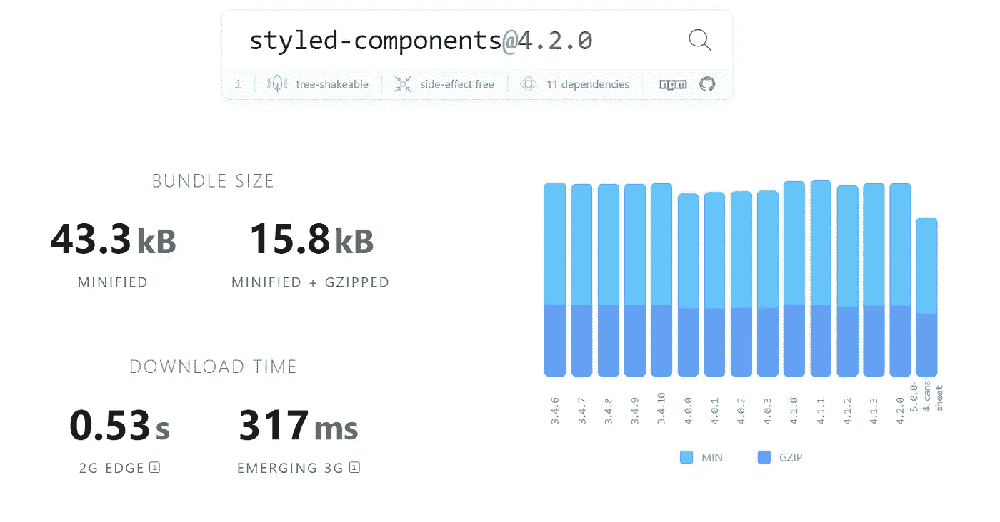

Simply switching from styled-components to CSS can shave off about 0.3s from your load times

为什么人们使用 CSS-in-JS？

*   作用域样式，没有全局样式
*   主题
*   因为这很酷

## 限定范围的样式

随着 create-react-app 现在正式支持作用域 CSS 模块([了解更多](https://facebook.github.io/create-react-app/docs/adding-a-css-modules-stylesheet))，您现在可以轻松地创建作用域样式表，而无需添加另一个库。

## 主题

对于样式化组件，如果你想添加一个主题变量，你需要做的就是把它包装在一个`ThemeProvider`中。那么，如果我告诉你，截至 2019 年 5 月，91%的浏览器都支持类似的功能，但原生支持 CSS，会怎么样？

如果你认为 91%还不够，再想想。默认情况下，IE 不再被 create-react-app 支持，除非你真的需要那些 IE 用户，你可以只使用 CSS 变量，它们[棒极了](https://developer.mozilla.org/en-US/docs/Web/CSS/Using_CSS_custom_properties)。

当然，还有更多原因我无法在本文中进一步阐述，但是 [Gajus Kuizinas](https://medium.com/u/ff373ec56620?source=post_page-----7b929479cac4--------------------------------) 在[他的文章](/@gajus/stop-using-css-in-javascript-for-web-development-fa32fb873dcc)中对此做了很好的阐述。

# 2.从大型 CSS 库迁移出来

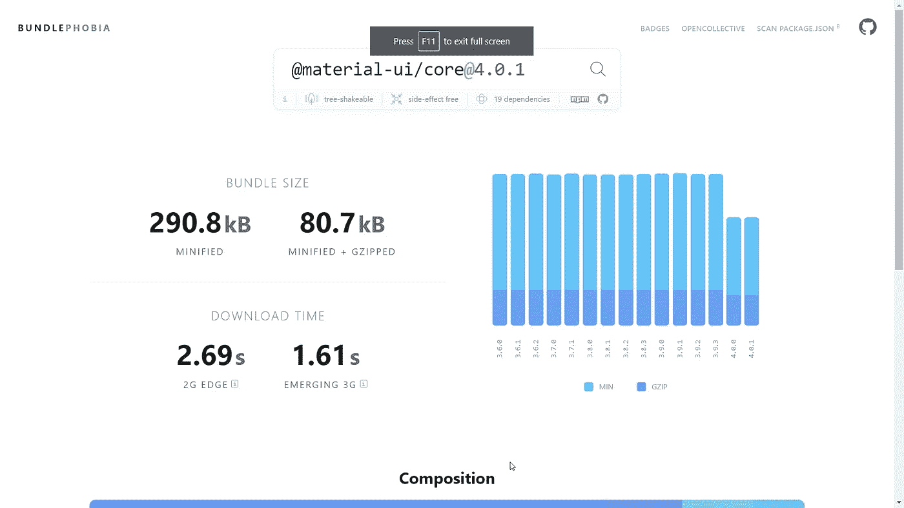

我个人非常喜欢材料设计。React 有一个最好的素材库，叫做 material-ui。唯一的问题？它很大。相当大。即使你可能只使用它的几个组件，它的 CSS-in-JS 框架总是被包含在内，大约减少了 30KB。

另类？我决定构建自己的组件，这些组件是我在构建应用程序时构建的，只是为了重温一下编写 CSS 的过程，因为我已经很久没有这样做了，但还有许多小得多的库，例如:

## spectre—9KB gzip

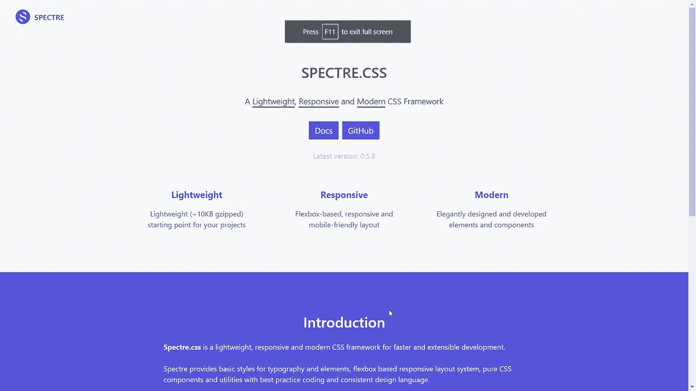

[https://picturepan2.github.io/spectre/index.html](https://picturepan2.github.io/spectre/index.html)

## 布尔玛—40KB gzip

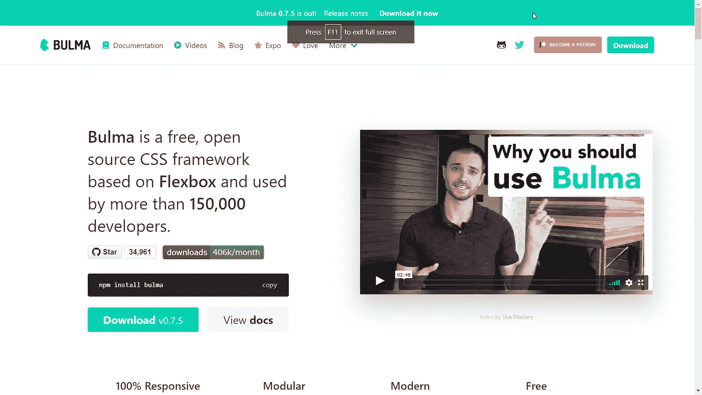

[https://bulma.io/](https://bulma.io/)

# 3.延迟加载页面

所以你有一个路由器，里面有很多你要导入的页面。当你只有 1-2 页的时候，这可能不是问题，但是你有越多的页面，最初的绘画时间就越长。以下是您的导入可能的样子:

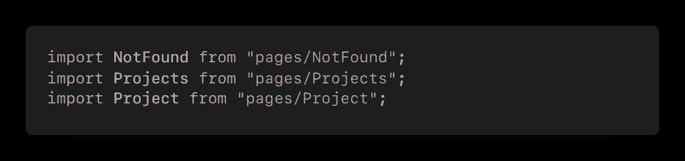

你会如何改善这一点？幸运的是，react 可以延迟加载它们，将其他组件分解成其他小块，只在需要的时候加载它们。

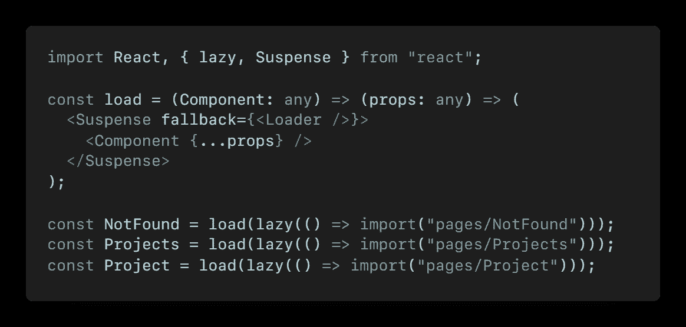

# 4.渐进式网络应用程序

渐进式 web 应用程序旁边的服务人员不仅允许用户将应用程序安装到他们的主屏幕上，还可以极大地改善缓存，并使应用程序在第一次后加载速度更快。

# 5.移除看起来很酷的膨胀器皿

在我最初的网站上，我添加了大量的挂载动画，当页面被加载时，这些动画会显示项目。嗯，它不仅减慢了网页的速度，而且看起来也慢了很多。当然，作为一名开发人员，我认为这让网站看起来很酷，直到我更加关注性能时，我才注意到这一点。我还有其他功能，如滚动到顶部的按钮或加载时一个接一个的动画项目，我认为这看起来很酷，但事实证明它在旧设备上真的很落后，我不知道这一点，因为我没有在笔记本电脑以外的设备上测试它。

我也有一个滑块组件，我只是从谷歌和 npm 那里得到的，甚至没有考虑它的成本。后来我发现滑块本身缩小了大约 30KB。用于幻灯片放映组件。我决定使用 react-spring 构建自己的一个，它最终缩小了 25KB，但已经包含了丰富的动画库和手势系统，可以在应用程序中重用。而且看起来好多了。

## NPM 套餐

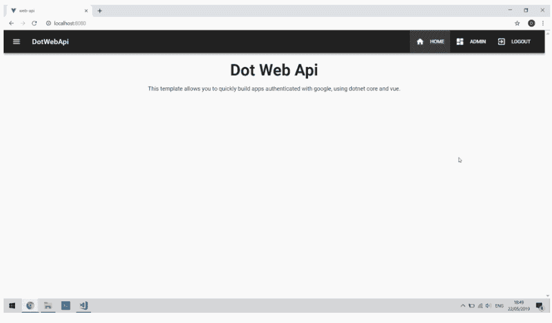

## 我的自定义幻灯片

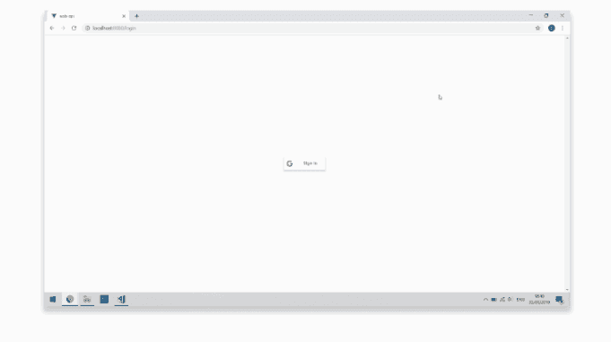

It’s a lot smoother IRL, I promise (.GIF framerate is bad)

你可以在[我的作品集](https://dominikt.now.sh/projects/DotWebApi)上找到幻灯片。

## 找出为什么你的包裹尺寸如此之大

如果你用的是 CRA，你很幸运。你需要做的就是运行`npm run build`，然后运行一个源地图浏览器`npx source-map-explorer "build/static/js/*.js"`。这将打开一个类似如下的 HTML 页面:

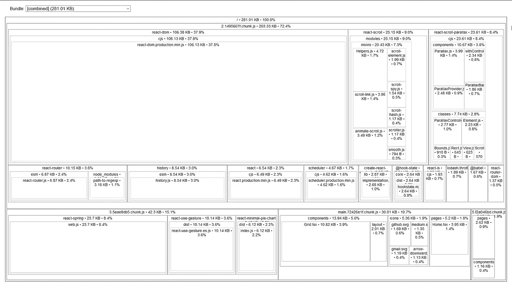

# 演示

虽然我做了一些小的视觉上的改变，两个网站都有非常相似的布局(实际上在改进的版本上有一个额外的字体，这确实增加了一点点加载时间，但仍然快得多)。

## 之前— [链接](https://domt.surge.sh/)

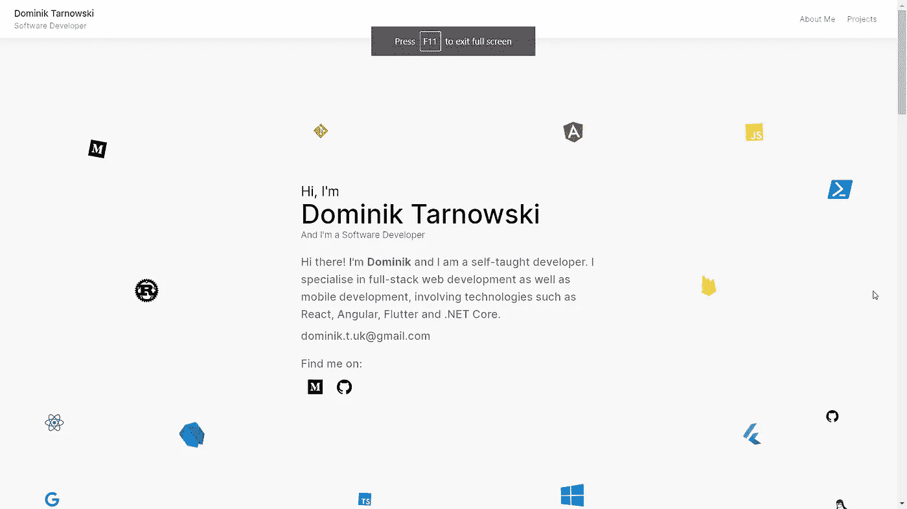

[https://domt.surge.sh](https://domt.surge.sh)

## ——[后**链接**后](https://dominikt.now.sh/)

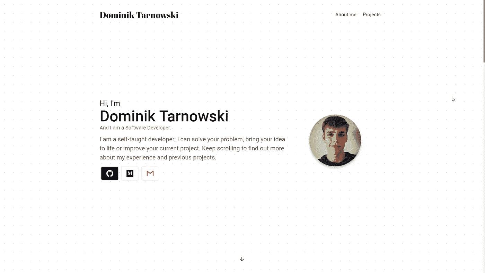

[https://dominikt.now.sh/](https://dominikt.now.sh/)

> 如果你想看到更多这类内容，给这篇文章一个、两个或 50 个掌声👏。我有很多 react 教程即将推出🎉。

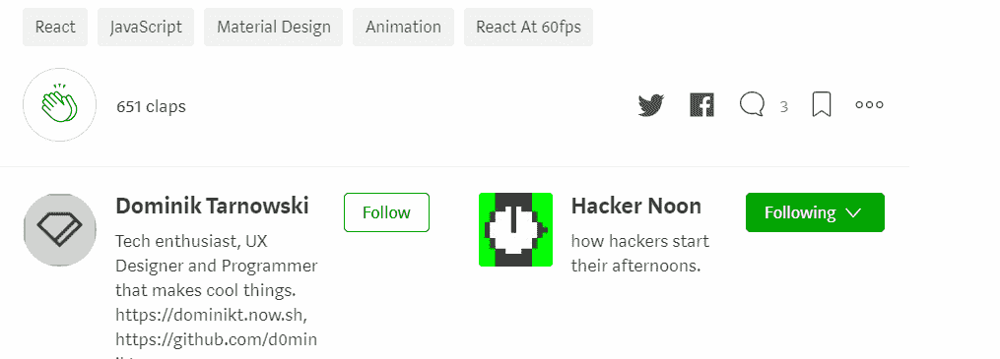