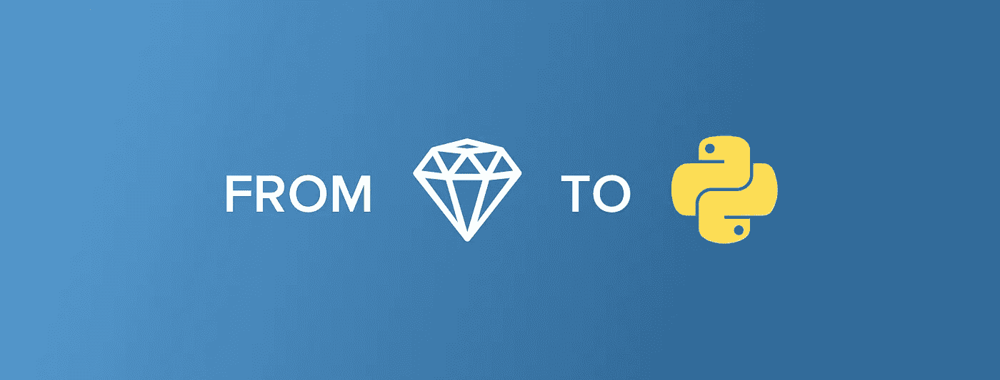

# 我为什么以及如何从 Ruby 转向 Python

> 原文：<https://medium.com/hackernoon/how-i-switched-from-ruby-to-python-ac7038015888>

> *本文是 Sqreen 的第一位从事 Ruby 代理和 Python 后端工作的工程师* [*Benoit*](https://twitter.com/zetaben) *分享的个人经历。*

回到 2008 年，当时我还在工程学院，我的两个朋友决定创办一家名为 [Feedbooks](http://www.feedbooks.com/) 的公司。他们的目标是让人们更容易找到、下载和分享高质量的电子书；一个数字图书馆，将公共领域的杰作、自行出版的作品和商业发行的作品组合在一起。

帮助他们实现这一目标的网站需要快速、高效且易于维护。当时，刚刚看完现在很有名的“[如何在 15 分钟内创建一个博客](https://www.youtube.com/watch?v=Gzj723LkRJY&feature=youtu.be)”Ruby on Rails 演示视频，创始人决定尝试一下，并开始编写代码。几个星期后，为了尽快开发他们的产品，他们需要额外的帮助，并问我。

和我这一代的许多工程师一样，我以前也涉足过 PHP 和 Mysql 网站，我甚至为一个小型开源 CMS 系统做出过贡献。我熟悉与网络相关的一切，但从未听说过 Ruby。所以，我看了视频&也被 Ruby on Rails 迷住了。在接下来的 10 年里，我迷上了 Ruby，而且还在继续。我们这群志趣相投的朋友帮助了图书馆网站，还使用该技术开发了不少其他网络应用程序。

# 但是为什么是 Ruby，它有什么了不起的？

Ruby 是一种非常有表现力的语言。该语言的主要设计者 Matz 在创建 Ruby 时有一个非常简单的目标:为了程序员的幸福而优化。对我来说，这显然已经实现。Ruby 是一种面向对象的脚本语言。Ruby 中的每一样东西都是一个“对象”。Ruby 虚拟机负责将看起来非常自然的语法翻译成实际的指令。这个 VM 在不断改进，每个新版本生成的代码都变得更快。Ruby 中的对象通过向自己发送包含方法名和参数列表的消息来进行协作。Ruby 也非常容易自省，因此很容易更改这些消息或创建专门的接口。

这些使得它成为编写领域特定语言(DSL)的非常好的语言。这正是大卫·海涅梅尔·汉森(又名 DHH)在创建 Rails 时所做的。Ruby on Rails 的核心是一组 DSL 和一个框架，可以轻松地生成模型驱动的 web 应用程序。时至今日，它特别适应并擅长创建应用程序，其中业务逻辑和模型化将发挥重要作用。

因此，6 年后当我作为第一个工程师加入 Sqreen 时，合乎逻辑的选择是使用 Ruby。然而，当我们开始 Sqreen 后端时，我们没有使用 Ruby，而是使用 Python。

# 你的意思是你喜欢 Ruby 但是选择 Python 作为你的后台？

这是为什么呢？

首先，Sqreen 后端实际上是向外界公开(或不公开)的多个服务。新客户看到的第一部分是我们的公司网站，这实际上是一个静态网站(尽管我们确实使用 Jekyll，一个基于 Ruby 的网站生成器来生成它)。接下来是我们的仪表板，相反，它是一个非常动态的应用程序，构建为单页应用程序，这是在首次涉足 Meteor 后编写的(这是另一天的博客帖子！)作为 React 应用程序。仪表板与专用的 API 通信，我们称之为“后端对前端”。这不是我们唯一的 API，我们还有一些其他的，但是最重要的是我们专用的“代理后端”。

我们很早就决定，我们不想用多种语言编写 API，这样我们就可以轻松地跨不同的 API 重用业务逻辑代码和模型。我们也很早就预见到，至少代理的后端应该能够很容易地扩展到大量并发客户端，因为我们的代理经常会 ping 后端。

不幸的是，Rails 非常慢，从来不是我们的首选。显然，Rails 并不是将 Ruby 用于应用程序和 API 的唯一方式，Ruby 中有许多可用的微框架，其中最著名的是 Sinatra。Sinatra 很棒，它有一个非常小且易于使用的 API，我们本可以选择它。

我们选择 Python 有两个原因。首先，两位联合创始人 JB & Pierre 更熟悉 Python，他们之前在苹果公司的一些内部工具中使用过 Python。第二，也是最重要的，我们一直认为数据分析对 Sqreen 来说是必不可少的。不幸的是，Ruby 在这方面并没有很大的帮助，而 Python 的科学生态系统却是一流的。选择很简单，让我们使用 Python &它非常著名的微框架解决方案；烧瓶。

# 从 Python 开始

在那个时候，我只接触过 Python 来编写小脚本，或者转换和整形一些数据，或者执行计算。我不得不加快速度用它来创建 API。幸运的是，如果您更改编程语言，web 及其基本组件不会改变。HTTP/HTML/JSON 还是基于文本的协议/语言；休息还是老样子。我在职业生涯中学到的东西仍然有效，只是输出的方式有点不同。在 Ruby 中，使用一个叫做 [Rack](https://www.rubydoc.info/github/rack/rack/file/SPEC) 的通用规范来使应用程序与 web 进行底层通信。这是一个非常简单的规范，主要规定 HTTP 请求&响应应该用“数组”来表示。事实证明，Ruby 的 Rack 实际上很大程度上受到了 Python 中一个叫做 [WSGI](https://www.python.org/dev/peps/pep-3333/) 的早期项目的启发。很好，一个巨大的潜在障碍被排除了。

但是语言呢？如前所述，Ruby 是一种面向对象的脚本语言，python 也是一种面向对象的脚本语言。然而，Python 在处理这个概念的方法上有点不太纯粹。它不是作为面向对象语言创建的，也支持其他范例(主要是函数式的)。但是，它们仍然是不同的语言，所以语法是完全不同的。让我们举几个例子。Ruby 使用关键字(begin/def end)描述块，Python 使用空格。这确实需要一点时间来适应(我个人仍然更喜欢 Ruby 的方式)。在 Ruby 中使用 begin/rescue/end 捕捉异常，在 Python 中使用 try/except。但对我来说，最大的变化是不能像 Ruby 那样传递给许多方法(比如‘find’、‘map’、‘inject `…)那样做任何内联块。在现代 Python 中，人们可以使用内联理解来经常做等价的操作，但是语法很快变得非常混乱。这实际上迫使开发人员更多地考虑正在使用的循环的数量，并最终导致更高效的代码。我还发现了一些新的非常有思想的概念。示例:Python 中的上下文管理器使您能够将清理行为应用到资源和实际语法中，这再次促使人们编写更高效的代码。

那么我个人是如何掌握 Python 语法的呢？首先通过练习使用非常好的 [Python Koans](https://github.com/gregmalcolm/python_koans) 。这个开源项目使人们能够通过修复一组越来越难的单元测试来学习 Python。他们浏览了该语言的不同特性，并提供了一个实际的、相当深入的教程。然后我阅读了 Python 文档。Ruby 文档可能很简洁，有时有点欠缺，但是 Python 文档非常完整。这种语言被分成几个模块，每个模块都有一个很长的解释，通常会详细说明模块存在的原因、它要解决的问题、如何解决问题以及何时不使用它。是的，很明显，它也包括例子。这是任何希望进入 Python 的人的必读之作。等等，这是不是意味着 Sqreen 不用 Ruby，我也不再用了？很高兴你问了，其实没有！我喜欢 Ruby，实际上我们在 Sqreen 做了相当多的工作。

首先，我们有一个 [Ruby 代理](https://rubygems.org/gems/sqreen)，帮助保护 Ruby 应用。开发并随后维护代理，这是我在过去 3 年里在&做的，实际上要复杂得多(阅读，有趣！)比我以前任何时候都要红。我们每个特工都做动态测试。换句话说，我们正在编写代码，这些代码将根据通过网络发送的描述(加密签名)来改变正在运行的软件的控制流。我们首先在 Ruby 中做了这个实验，但是现在我们在五分钟内(很快就是六分钟！)技术。这可不是小事，能和一群才华横溢、充满激情的人就这类话题一起工作是我的荣幸。

其次，当我们创建代理时，在将它发送给我们的第一批测试人员(现在是客户)之前，我们想在真实生活条件下彻底测试它。我们需要一个看起来真实的应用程序，在其上我们还可以测量代理的行为。忠于我们的工程文化，我们决定亲自动手，创建了一个小但非常有用的 Rails 管理界面。它每天在内部用于监控我们代理的行为并帮助我们的客户。

# 来自经历过的人的一点建议

你是一个考虑从 Python 开始的 Ruby 开发者吗？你应该去做！它和 Ruby 非常相似，你很快就会觉得很有效率。然而，它也足够不同，你会学到一些新的技巧，可以为你打开新的大门。做一个只会一招的小马无论如何都不是个好主意！一个好的交互式教程和文档是一个好的起点。但是你也应该尝试开发一个真正的应用程序。生态系统的许多特质在只做教程时不会出现(例如包管理、测试、剖析…)。想和已经改变的人一起试试吗？ [**在广场**](https://www.sqreen.io/company#jobs) 加入我们，很明显，我们在招募😉

*原载于 2019 年 1 月 30 日*[*blog.sqreen.com*](https://blog.sqreen.com/from-ruby-to-python/)*。*