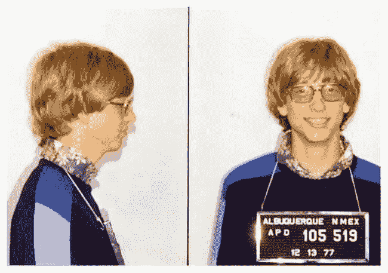

# 我是如何决定从大学退学的

> 原文：<https://medium.com/hackernoon/how-i-took-the-decision-to-dropout-of-college-9078e825be0>

The Perfect Image, eh?

嗨，

在过去的几个月里，我开始欣赏生活中“价值”的概念。其实对我来说就是一个[框架](https://hackernoon.com/tagged/framework)。

一年前，我决定从大学退学，但这种冲动已经存在了很长时间。事实上，它第一次出现是在我第一学期结束时，当时我在[挣着每月 90 美元的微薄收入。实习得来的 5000)。但是，这个问题一直留在我的脑海里，](https://hackernoon.com/tagged/making)

我能向我的父母/家人/朋友，最重要的是我自己证明这一点吗？

结果，我不能。我无法向上面列出的任何人证明这一点，因为事实证明我没有钱来实现我父母的梦想，我的梦想。哦，去他妈的梦想，我没有足够的钱养活自己。(但是，信任，Rs。5000 英镑对我来说是一大笔零花钱。)

快进到 18 个月后，我记得我在 Quant 考试中睡着了，因为我昨晚在做一个兼职项目。然后，一个老师找到我，问我是否需要一些水来保持清醒并完成考试。

但是，呃？我对报纸上的内容一无所知。我想我那次考试不及格。(甜，呃？)

从那以后，在从大学回家的路上，我开始重新评估自己之前的问题，

我能向我的父母/家人/朋友，最重要的是我自己证明这一点吗？

结果，答案是**是的，一百万次是**。

在那一刻，我意识到我可以从大学退学，我可以自由，我可以支持我的父母(这是让我最开心的部分)，我可以远程工作(我在 Y Combinator(S17)公司的 Prism Labs 工作)，也可以享受我的生活。

话虽如此，还有一件事，我想让你看看 Lux Capital 合伙人 Josh Wolfe 的这条推文。我几个月前才发现这条推文，但这是我最感兴趣的事情。

另外，如果你能订阅我的时事通讯，我将非常感激！

 [## Ankit Kumar 时事通讯

### 这是我开始每天写作的尝试:)

ankitkumar.substack.com](https://ankitkumar.substack.com) 

**在推特上关注我:**[twitter.com/ankitkr0](http://www.twitter.com/ankitkr0)