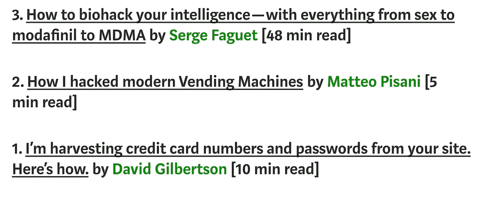

# 我如何利用我的编程技能节省了 8 个多小时的写作时间

> 原文：<https://medium.com/hackernoon/how-i-used-my-programming-skills-to-save-over-8-hours-of-writing-work-7aba154d4232>


Photo by [Kevin Ku](https://unsplash.com/photos/aiyBwbrWWlo?utm_source=unsplash&utm_medium=referral&utm_content=creditCopyText) on [Unsplash](https://unsplash.com/?utm_source=unsplash&utm_medium=referral&utm_content=creditCopyText)

最近在脸书[上，David Smooke](http://hackernoon.com/@davidsmooke)(hacker noon 的首席执行官)发布了一篇文章，他在文章中列出了 [2018 年的顶级科技故事](https://hackernoon.com/dear-hacker-2018s-top-tech-stories-d1d76108bbec)。他还提到，如果有人希望列出一个类似的清单，比如说关于 *JavaScript* 的清单，他会很乐意在 *Hackernoon* 的首页上展示。

在不断努力让更多人阅读我的作品的过程中，我不能错过这个机会，所以我立即开始计划如何列出这样一个清单。

因为这一年即将结束，我的时间有限，所以我决定不用手动搜索帖子，而是使用我的网络搜索技能。

我相信学习如何制作这样一个刮刀可以是一个有用的练习，并作为一个有趣的案例研究。

如果你读过我写的关于[我如何创建 instagram bot](https://hackernoon.com/how-to-create-an-instagram-bot-with-node-js-a289185a7d6f) 的文章，那么你就会知道用 *Node.js* 与网站互动的最佳方式是使用控制 *chromium* 实例的 [*木偶师*](https://github.com/GoogleChrome/puppeteer) 库。这样我们就可以做任何潜在用户在网站上可以做的事情。

这里是到存储库的[链接。](https://github.com/maciejcieslar/scraper-hackernoon)

# 创建刮刀

让我们用这个简单的助手创建一个*木偶师*的浏览器和页面:

```
const createBrowser = async () => {
 const browser = await puppeteer.launch({ headless: true })

 return async function getPage<T>(url: string, callback: (page: puppeteer.Page) => Promise<T>) {
   const page = await browser.newPage()

   try {
     await page.goto(url, { waitUntil: 'domcontentloaded' })

     page.on('console', (msg) => console.log(msg.text()))

     const result = await callback(page)

     await page.close()

     return result
   } catch (e) {
     await page.close()

     throw e
   }
 }
}
```

我们在回调中使用页面，这样可以避免一遍又一遍地重复相同的代码。多亏了这个助手，我们不需要担心去一个给定的 url，从`page.evaluate`内部监听 *console.logs* ，以及在一切完成后关闭页面。函数的结果将在一个承诺中返回，所以我们可以稍后再调用它，而不必在回调中使用结果。

# 来说说数据吧

有一个[网站](https://hackernoon.com/tagged/javascript)，在那里我们可以找到 *Hackernoon* 发布的所有带有 *JavaScript* 标签的文章。它们是按日期排序的，但有时会不知从哪里冒出一篇很早以前发表的文章，比如 2016 年，所以我们必须小心这一点。

我们可以单独从这个帖子预览中提取所有需要的信息——而不需要在新标签页中打开帖子，这使我们的工作更加容易。


在上面显示的框中，我们可以看到我们需要的所有数据:

1.  作者姓名及其个人资料的 url
2.  文章标题和 url
3.  鼓掌次数
4.  读出时间
5.  日期

下面是一篇文章的界面:

```
interface Article {
 articleUrl: string
 date: string
 claps: number
 articleTitle: string
 authorName: string
 authorUrl: string
 minRead: string
}
```

在*媒体*上有一个无限滚动，这意味着当我们向下滚动时，会加载更多的文章。如果我们要使用 *GET* 请求来获取静态 *HTML* 并使用诸如 *JSDOM* 之类的库来解析它，那么获取那些文章将是不可能的，因为我们不能对静态 *HTML* 使用 scroll。这就是为什么在任何与网站的互动中，*木偶师*都是救命恩人。

要获得我们可以使用的所有已加载的帖子:

```
Array.from(document.querySelectorAll('.postArticle'))
         .slice(offset)
         .map((post) => {})
```

现在我们可以将每篇文章作为选择器的上下文——我们现在要写`post.querySelector`而不是写`document.querySelector`。这样，我们可以将搜索限制在给定的 post 元素。

另外，请注意`.slice(offset)`片段——因为我们是向下滚动而不是打开新页面，所以已经解析过的文章仍然在那里。当然，我们可以再次解析它们，但这不会真正有效。偏移量从 0 开始，每次我们删除一些文章时，我们都会将集合的长度添加到偏移量中。

```
offset += scrapedArticles.length
```

# 抓取帖子的数据

在抓取数据时，最常见的错误是“无法读取 null 的属性‘text content’”。我们将创建一个简单的 helper 函数来防止我们试图获取一个不存在的元素的属性。

```
function safeGet<T extends Element, K>(
  element: T,
  callback: (element: T) => K,
  fallbackValue = null,
): K {
  if (!element) {
    return fallbackValue
  }

  return callback(element)
}
```

只有当`element`存在时`safeGet`才会执行回调。现在让我们用它来访问保存我们感兴趣的数据的元素的属性。

## 文章发表的日期

```
const dateElement = post.querySelector('time')
const date = safeGet(
  dateElement,
  (el) => new Date(el.dateTime).toUTCString(),
  '',
)
```

如果`dateElement`发生了什么事情而没有被发现，我们的`safeGet`将会防止错误。`<time>`元素有一个名为`dateTime`的属性，它保存文章发表日期的字符串表示。

```
const authorDataElement = post.querySelector<HTMLLinkElement>('.postMetaInline-authorLockup a[data-action="show-user-card"]',
)

const { authorUrl, authorName } = safeGet(
  authorDataElement,
  (el) => {
    return {
      authorUrl: removeQueryFromURL(el.href),
      authorName: el.textContent,
    }
  },
  {},
)
```

在这个`<a>`元素中，我们可以找到用户的个人资料 URL 和他/她的名字。

此外，这里我们使用`removeQueryFromURL`,因为作者的个人资料 URL 和帖子的 URL 在查询中都有这个奇怪的源参数，我们希望删除它:

[https://hacker noon . com/JavaScript-2018-top-20-hacker noon-年度文章-9975563216d1？**来源=——1——————**——](https://hackernoon.com/javascript-2018-top-20-hackernoon-articles-of-the-year-9975563216d1?source=---------1---------------------)

*？*URL 中的字符表示查询参数的开始，所以让我们简单地删除它后面的所有内容。

```
const removeQueryFromURL = (url: string) => url.split('?').shift()
```

我们在*拆分字符串？*并且只返回第一部分。

## 拍手

在上面的示例帖子中，我们看到“鼓掌”的次数是 204，这是准确的。然而，一旦数字超过 1000，它们就会显示为 1K、2K、2.5K。如果我们需要确切的拍手次数，这可能会是一个问题。在我们的用例中，这种舍入工作得很好。

```
const clapsElement = post.querySelector('span > button')

const claps = safeGet(
  clapsElement,
  (el) => {
    const clapsString = el.textContent

    if (clapsString.endsWith('K')) {
      return Number(clapsString.slice(0, -1)) * 1000
    }

    return Number(clapsString)
  },
  0,
)
```

如果掌声的字符串表示以 K 结尾，我们只需去掉 K 字母，然后乘以 1000——非常简单。

## 文章的 url 和标题

```
const articleTitleElement = post.querySelector('h3')
const articleTitle = safeGet(
  articleTitleElement,
  (el) => el.textContent
)const articleUrlElement = post.querySelector<HTMLLinkElement>(
  '.postArticle-readMore a',
)const articleUrl = safeGet(
  articleUrlElement,
  (el) => removeQueryFromURL(el.href)
)
```

同样，由于选择器是在`post`上下文中使用的，我们不需要过于具体地描述它们的结构。

## "最小读取"

```
const minReadElement = post.querySelector<HTMLSpanElement>('span[title]')
const minRead = safeGet(minReadElement, (el) => el.title)
```

这里我们使用一个稍微不同的选择器:我们寻找一个包含`data-title`属性的`<span>`。

注意:稍后我们将使用`.title`属性，因此区分它们是很重要的。

好了，我们已经抓取了页面上当前显示的所有文章，但是我们如何滚动来加载更多的文章呢？

# 滚动以加载更多文章

```
*// scroll to the bottom of the page*
await page.evaluate(() => {
  window.scrollTo(0, document.body.scrollHeight)
})

*// wait to fetch the new articles*
await page.waitFor(7500)
```

我们将页面滚动到底部，等待 7.5 秒。这是一个“安全”的时间——文章可以在 2 秒钟内加载，但我们更希望确保所有帖子都已加载，而不是错过一些。如果时间是一个重要的因素，我们可能会在请求时设置一些拦截器，它会获取帖子并在完成后继续前进。

# 何时结束刮擦

如果帖子按日期排序，我们可以在看到 2017 年的文章时停止抓取。然而，由于 2018 年的文章之间出现了一些奇怪的旧文章，我们不能这样做。我们能做的反而是把刮下来的文章筛选出 2018 年或以后发表的。如果得到的数组是空的，我们可以有把握地认为不再有我们感兴趣的文章了。在`matchingArticles`我们保留 2018 年或之后发布的文章，在`parsedArticles`我们只保留 2018 年发布的文章。

```
const matchingArticles = scrapedArticles.filter((article) => {
  return article && new Date(article.date).getFullYear() >= 2018
})

if (!matchingArticles.length) {
  return articles
}

const parsedArticles = matchingArticles.filter((article) => {
  return new Date(article.date).getFullYear() === 2018
})

articles = [...articles, ...parsedArticles]
```

如果`matchingArticles`是空的，我们返回所有物品，从而结束刮擦。

# 把所有的放在一起

下面是获取文章所需的全部代码:

```
const scrapArticles = async () => {
 const createPage = await createBrowser()

 return createPage<Article[]>('https:*//hackernoon.com/tagged/javascript', async (page) => {*
   let articles: Article[] = []
   let offset = 0

   while (true) {
     console.log({ offset })

     const scrapedArticles: Article[] = await page.evaluate((offset) => {
       function safeGet<T extends Element, K>(
         element: T,
         callback: (element: T) => K,
         fallbackValue = null,
       ): K {
         if (!element) {
           return fallbackValue
         }

         return callback(element)
       }

       const removeQueryFromURL = (url: string) => url.split('?').shift()

       return Array.from(document.querySelectorAll('.postArticle'))
         .slice(offset)
         .map((post) => {
           try {
             const dateElement = post.querySelector('time')
             const date = safeGet(dateElement, (el) => new Date(el.dateTime).toUTCString(), '')

             const authorDataElement = post.querySelector<HTMLLinkElement>(
               '.postMetaInline-authorLockup a[data-action="show-user-card"]',
             )

             const { authorUrl, authorName } = safeGet(
               authorDataElement,
               (el) => {
                 return {
                   authorUrl: removeQueryFromURL(el.href),
                   authorName: el.textContent,
                 }
               },
               {},
             )

             const clapsElement = post.querySelector('span > button')

             const claps = safeGet(
               clapsElement,
               (el) => {
                 const clapsString = el.textContent

                 if (clapsString.endsWith('K')) {
                   return Number(clapsString.slice(0, -1)) * 1000
                 }

                 return Number(clapsString)
               },
               0,
             )

             const articleTitleElement = post.querySelector('h3')
             const articleTitle = safeGet(articleTitleElement, (el) => el.textContent)

             const articleUrlElement = post.querySelector<HTMLLinkElement>(
               '.postArticle-readMore a',
             )
             const articleUrl = safeGet(articleUrlElement, (el) => removeQueryFromURL(el.href))

             const minReadElement = post.querySelector<HTMLSpanElement>('span[title]')
             const minRead = safeGet(minReadElement, (el) => el.title)

             return {
               claps,
               articleTitle,
               articleUrl,
               date,
               authorUrl,
               authorName,
               minRead,
             } as Article
           } catch (e) {
             console.log(e.message)
             return null
           }
         })
     }, offset)

     offset += scrapedArticles.length

     *// scroll to the bottom of the page*
     await page.evaluate(() => {
       window.scrollTo(0, document.body.scrollHeight)
     })

     *// wait to fetch the new articles*
     await page.waitFor(7500)

     const matchingArticles = scrapedArticles.filter((article) => {
       return article && new Date(article.date).getFullYear() >= 2018
     })

     if (!matchingArticles.length) {
       return articles
     }

     const parsedArticles = matchingArticles.filter((article) => {
       return new Date(article.date).getFullYear() === 2018
     })

     articles = [...articles, ...parsedArticles]

     console.log(articles[articles.length - 1])
   }
 })
}
```

在我们以适当的格式保存数据之前，让我们按掌声降序排列文章:

```
const sortArticlesByClaps = (articles: Article[]) => {
  return articles.sort(
    (fArticle, sArticle) => sArticle.claps - fArticle.claps
  )
}
```

现在让我们把文章输出到一个可读的格式，因为到目前为止它们只存在于我们计算机的内存中。

# 信息输出公式

## JSON

我们可以使用 *JSON* 格式将所有数据转储到一个文件中。以这种方式存储所有的文章可能在将来的某个时候会派上用场。

转换成 *JSON* 格式可以归结为键入:

```
const jsonRepresentation = JSON.stringify(articles)
```

我们现在可以停止使用文章的 JSON 表示，只是将我们认为属于那里的文章复制并粘贴到我们的列表中。但是，你可以想象，这也可以自动化。

## 超文本标记语言

HTML 格式肯定会比手动复制 JSON 格式的所有内容更容易从列表中复制和粘贴项目。

大卫在他的[文章](https://hackernoon.com/dear-hacker-2018s-top-tech-stories-d1d76108bbec)中以如下方式列出了文章:



David’s list format

我们希望我们的列表是这样的格式。同样，我们可以使用*木偶师*来创建和操作 *HTML* 元素，但是，由于我们使用的是 *HTML* ，我们可以将值嵌入到字符串中——浏览器无论如何都会解析它们。

```
const createHTMLRepresentation = async (articles: Article[]) => {
 const list = articles
   .map((article) => {
     return `
       <li>
         <a href="${article.articleUrl}">${article.articleTitle}</a> by
         <a href="${article.authorUrl}">${article.authorName}</a>
         [${article.minRead}] (${article.claps})
       </li>
     `
   })
   .join('')

 return `
   <!DOCTYPE html>
   <html lang="en">
     <head>
       <meta charset="UTF-8" />
       <meta name="viewport" content="width=device-width, initial-scale=1.0" />
       <meta http-equiv="X-UA-Compatible" content="ie=edge" />
       <title>Articles</title>
     </head>
     <body>
       <ol>
         ${list}
       </ol>
     </body>
   </html>
 `
}
```

正如你所看到的，我们只是对文章进行了`.map()`处理，并返回一个包含我们喜欢的格式的数据的字符串。我们现在有了一个包含`<li>`个元素的数组——每个元素代表一篇文章。现在我们只需要`.join()`它们来创建一个字符串，并将它嵌入到一个简单的 *HTML5* 模板中。

## 保存文件

剩下要做的最后一件事是将表示保存在单独的文件中。

```
const scrapedArticles = await scrapArticles()
const articles = sortArticlesByClaps(scrapedArticles)

console.log(`Scrapped ${articles.length} articles.`)

const jsonRepresentation = JSON.stringify(articles)
const htmlRepresentation = createHTMLRepresentation(articles)await Promise.all([
  fs.writeFileAsync(jsonFilepath, jsonRepresentation),
  fs.writeFileAsync(htmlFilepath, htmlRepresentation),
])
```

# 结果呢

根据 scraper 的数据，今年有 894 篇带有 *JavaScript* 标签的文章发表在 *Hackernoon* 上，平均每天 2.45 篇。

下面是 HTML 文件的样子:

```
<li>
  <a href="https://hackernoon.com/im-harvesting-credit-card-numbers-and-passwords-from-your-site-here-s-how-9a8cb347c5b5">I’m harvesting credit card numbers and passwords from your site. Here’s how.</a> by
  <a href="https://hackernoon.com/@david.gilbertson">David Gilbertson</a>
  [10 min read] (222000)
</li>

<li>
  <a href="https://hackernoon.com/part-2-how-to-stop-me-harvesting-credit-card-numbers-and-passwords-from-your-site-844f739659b9">Part 2: How to stop me harvesting credit card numbers and passwords from your site</a> by
  <a href="https://hackernoon.com/@david.gilbertson">David Gilbertson</a>
  [16 min read] (18300)
</li>

<li>
  <a href="https://hackernoon.com/javascript-2018-top-20-hackernoon-articles-of-the-year-9975563216d1">JAVASCRIPT 2018 — TOP 20 HACKERNOON ARTICLES OF THE YEAR</a> by
  <a href="https://hackernoon.com/@maciejcieslar">Maciej Cieślar</a>
  [2 min read] (332)
</li>
```

而现在的 *JSON* 文件:

```
[
    {
    "claps": 222000,
    "articleTitle": "I’m harvesting credit card numbers and passwords from your site. Here’s how.",
    "articleUrl": "https://hackernoon.com/im-harvesting-credit-card-numbers-and-passwords-from-your-site-here-s-how-9a8cb347c5b5",
    "date": "Sat, 06 Jan 2018 08:48:50 GMT",
    "authorUrl": "https://hackernoon.com/@david.gilbertson",
    "authorName": "David Gilbertson",
    "minRead": "10 min read"
  },
  {
    "claps": 18300,
    "articleTitle": "Part 2: How to stop me harvesting credit card numbers and passwords from your site",
    "articleUrl": "https://hackernoon.com/part-2-how-to-stop-me-harvesting-credit-card-numbers-and-passwords-from-your-site-844f739659b9",
    "date": "Sat, 27 Jan 2018 08:38:33 GMT",
    "authorUrl": "https://hackernoon.com/@david.gilbertson",
    "authorName": "David Gilbertson",
    "minRead": "16 min read"
  },
  {
    "claps": 218,
    "articleTitle": "JAVASCRIPT 2018 -- TOP 20 HACKERNOON ARTICLES OF THE YEAR",
    "articleUrl": "https://hackernoon.com/javascript-2018-top-20-hackernoon-articles-of-the-year-9975563216d1",
    "date": "Sat, 29 Dec 2018 16:26:36 GMT",
    "authorUrl": "https://hackernoon.com/@maciejcieslar",
    "authorName": "Maciej Cieślar",
    "minRead": "2 min read"
  }
]
```

我可能已经为自己节省了 7-8 个小时，因为我发明了一个刮刀，它替我完成了所有单调乏味、令人麻木的工作。一旦完成了，剩下要做的就是回顾最热门的文章，并选择在文章中放些什么。创建代码需要大约一个小时，而手工复制和粘贴所有数据(更不用说同时保存为 *HTML* 和 *JSON* 格式)很容易需要更多时间。

这里是第[篇](https://hackernoon.com/javascript-2018-top-20-hackernoon-articles-of-the-year-9975563216d1)，如果你有兴趣看看我选择放在列表中的内容。

*原载于 2019 年 1 月 7 日*[*【www.mcieslar.com】*](https://www.mcieslar.com/how-i-used-my-programming-skills-to-save-8-hours-of-work)*。*