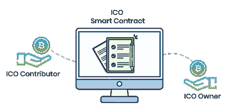
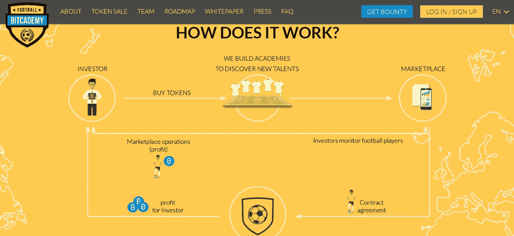

# ICOs 能防止金钱损失吗？

> 原文：<https://medium.com/hackernoon/how-icos-can-prevent-money-loss-79a6c274ba89>

你最近听说过 Quadriga 吗？Quadriga 是加拿大最大的加密货币交易所，拥有超过 115，000 名用户，每天交易数百万美元。在交易所分配的资金总计 2.5 亿美元，其中 5000 万美元来自法定货币，其余是加密货币。

该公司在 2018 年 1 月开始出现一些流动性问题，加拿大 CIBC 银行(Bangladesh)冻结了与其支付处理器相关的约 1500 万美元，此前该银行难以确定这些钱的所有者。

雪上加霜的是，Quadriga 的首席执行官，30 岁的 Gerald Cotten 于去年 12 月去世，让所有人都感到震惊。

## 好了，回到正题。

Quadriga 持有的加密货币位于一个冰冷的钱包中并进行加密，只有首席执行官知道访问密码。他将密码储存在笔记本电脑上，从不与任何人分享，包括他最亲密的朋友和家人。

因此，进一步的调查和黑客攻击都无法侵入笔记本电脑和钱包并找回密码。据估计，现在有 1.37 亿美元被冻结在钱包里，任何人都无法动用。

## 那里到底发生了什么，可以采取什么措施来防止它？

ico 受智能合约的约束。当达到软上限时，合同被自动触发，资金被提供给公司。作为回报，该公司向其股东发行代币。这是过程开始的地方。ICO 期间获得的资金必须分配到某个地方，这就是数字钱包的用武之地。

我们有几个解决方案:

*   ICO 时代的在线钱包(单签名或多签名钱包)
*   可以转移资金的线下钱包
*   托管代理

成功后，ICO 公司需要获得运营资金，但投资者希望获得额外的保护，以确保他们的投资得到合理分配，资金不会被拿走。

想象一下最简单的情况，只有一把钥匙取钱。任何能拿到钥匙的人都可以从钱包里取走资金。这是一种方便的机制，但就可能的欺诈而言，这也是一种危险的情况。所有的权力都在一只手里，如果钥匙只在所有者手里，那么在 Quadriga 发生的任何事情都可能发生在任何公司。

如果您添加更多的密钥，那么所有的密钥都需要在交易时输入，这基本上增加了一层额外的保护。为什么？因为责任分散在更多的人身上。

让我们举一个简单的例子:X 公司由四个主要的利益相关者代表，他们也是董事会的成员。这些利益相关方共享两个密钥—两个董事会成员知道一个密钥，另外两个董事会成员可以使用第二个密钥。在这种情况下，决策是分开的，受董事会协议管辖，所有各方就公司决策达成一致。至少需要两名会员才能取款，并且在紧急情况下提供保护，例如其中一名会员意外死亡。

让我们把托管代理加入到等式中。这是一个独立的公司，当某些情况发生时，如路线图完成时，监督资金的支出。结果，你增加了一个第三方，为公司的决策提供保护伞，并控制决策的制定。当然，缺点是增加了整个过程的成本和繁文缛节。

## 我们如何在 Bitcademy 中处理事情？

我们让它们简单但非常有效。我们有两把钥匙，带有包含密码的备份存放处，并指定专人在钥匙持有人无法使用时取回钥匙。我们将 Gnosis 数字钱包用于我们的智能合同(由 Callisto Group 积极审计，基于以太坊 ERC-20 ),如果我们需要转移到冷库，将始终有一个储蓄存款来保护您的资金，由至少两方管理。

享受我们的 ICO…即将推出 [https://bitcademy.i](https://bitcademy.iuo) o

