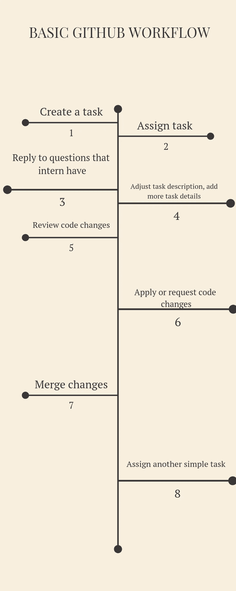

# 在 ReactJS 实习

> 原文：<https://medium.com/hackernoon/how-im-working-with-react-intern-real-example-9baafac8969f>

Image by [https://pixabay.com/users/wpoeschl-7767593/](https://pixabay.com/users/wpoeschl-7767593/?utm_source=link-attribution&amp;utm_medium=referral&amp;utm_campaign=image&amp;utm_content=3431397)

在我之前的故事中，我解释了我与实习有关的经历和观察。具体来说，我如何找到实习生，并把他们纳入我们的发展过程。

当我完成这个系列的前两篇文章时，我意识到一个问题。那篇文章只有“共同规则”。我只是在解释“正确的事情”。我想每个人都知道那种类型的建议:做好人，不要做坏人，开心点，等等。

我喜欢实用教程，所以在这篇文章中，我将给出一些真实的例子，说明在 ReactJS 环境中与实习生一起工作和培训实习生是什么感觉。我将展示我现在是如何和我们的一个实习生一起工作的。当关于这篇文章的想法产生时，我开始做笔记。我写下了我正在做的每一个动作，这样我就可以更详细地谈论一步一步的过程。

我希望有人能从中学到一些新的东西。或许也可以用在工作中。欢迎在评论区提问。这是本系列的第三篇文章。

为了理解这个故事的背景，你可能想先看看这些文章:

*   第一篇:[https://hacker noon . com/how-I-build-my-startup-team-with interns-9a 395d 265 cc 4](https://hackernoon.com/how-i-built-my-startup-team-with-interns-9a395d265cc4)
*   第二篇:[https://hacker noon . com/how-I-build-my-startup-team-with 实习生-part-2-fd88b7e2560f](https://hackernoon.com/how-i-built-my-startup-team-with-interns-part-2-fd88b7e2560f)

这些文章将帮助你更清楚地理解我的方法。

这个故事是关于我们的一个反应实习生。让我们称他为阿尔诸那(他是来自摩诃婆罗多的英雄)。阿诸那几个月前申请了我们的职位空缺。

阿尔诸那有基本的反应知识:JSX，组件生命周期，渲染道具，等等。作为经理，我的目标是慢慢地向他介绍我们的代码库。

Arjuna statue, from Wikipedia: [https://en.wikipedia.org/wiki/Arjuna](https://en.wikipedia.org/wiki/Arjuna)

## 1.首要任务

他开始和我们一起工作，为我们的组件创建测试。为什么？

1.  测试很好。现在我们的组件覆盖不好，所以这对我们有利。
2.  通过引入[测试驱动开发](https://technologyconversations.com/2013/12/20/test-driven-development-tdd-example-walkthrough/)或[行为驱动开发](https://docs.cucumber.io/guides/bdd-tutorial/)概念，创建测试是建立开发人员思维过程的好方法。(以他现在的技能水平，没有太大区别)

代码库的好处:当实习生在一个独立的模块上工作时，我们提高了组件代码的质量。这个模块只包含 7-10 个组件，所以当一个新的团队成员加入我们并看到这个小仓库时，他不会害怕开始编码。

首先，实习生应该完成 5-10 个简单的任务。这就像一次试驾。我们在 GitHub 建立了一个合作关系，让他能舒服地一起工作，并建立了一个很好的编码方式。它可能看起来像这样:

Our current GitHub workflow with Arjuna

虽然开发人员是新来的，以前没有经过实战考验→你需要帮助他，但不要干涉或催促太多。温柔点。根据我的经验，在拉式请求中要求代码变更会降低实习生的工作效率。

在实习生迈出第一步时，禁用 Travis CI/Circle CI 和 ESlint checkers 可能是个好主意。它们当然是重要的工具，但是警告会分散实习生的注意力，让他们感到害怕。如果您在同一个存储库上工作，您将需要解释关于合并、合并冲突、重定基础等的基础知识。最好不要在几周前的同一个存储库上编码。是的，知道如何使用 CI 和 ESLint 也很重要。但最好不要在最初几周把事情搞得过于复杂。

就等着吧。几个月后，一个实习生将学会这个默认的工作流程。不要过度复杂的编码，同样，不要提高单个贡献的标准。它将在开始时与代码质量相关，但这是一场马拉松，而不是短跑，所以…

> 与存储库访问相关的旁注。我从一开始就不允许访问主存储库。

实习生必须完成一个项目。在我看来，分叉逻辑和与主分支同步对他们来说很难。但是拥有一个独立的存储库是很重要的。一个实习生将有一个“玩”的地方，并在 GitHub 上了解关于拉请求的细节。我认为这是一个很好的方法。而不是在主分支(或特色分支)上有一个疯狂的提交列表

对于这种情况，我创建了几个小的存储库，在那里我为初学者保存了我的链接。这是我的收藏，仅与 Git+GitHub 相关:[https://github.com/ChickenKyiv/awesome-git-article](https://github.com/ChickenKyiv/awesome-git-article)

任务+一篇文章的链接，与 git 相关，将帮助阿尔诸那更快更好地学习基础知识。

他将学会:

*   基本分叉过程
*   基本 git 命令
*   git 流

让您的 fork 保持最新也很重要，这也是使用 Git CLI 的一个很好的实践练习。

测试 React 组件这是一个很大的话题。我也有一个存储库，里面有关于测试的信息(但是很乱):【https://github.com/ChickenKyiv/awesome-jest-articles

## 2.重复并记住

好了，阿尔诸那已经完成了这个储存库的大约 7-10 项首要任务。下一步将是在我们的其他存储库完成同样的任务。所以，没什么复杂的。只是重复。但是这个任务会帮助他建立一个伟大的“代码愿景”。

因此，在对不同的存储库进行了几次提交(贡献)之后，它降低了阿尔诸那的恐惧程度。
他总共需要完成大约 20-35 个简单的任务(在 3 个不同的仓库)。

在这一点之后，阿尔诸那会:

*   有知识
*   了解我们的编码工作流程
*   工作拉取请求、合并、代码冲突
*   对提问感到自在
*   如何处理 Github 问题，并且知道他可以从“问题”选项卡中选择任务
*   会明白他的代码对我们很重要。

**3。代码重写**
对于下一步，我计划分配一个任务，与代码重写有关。阿尔诸那需要看看他以前的代码，并加以改进。

如果我们谈论测试，他们可以有更多的层次，澄清，显示更详细的信息。通过这个任务，阿尔诸那将被迫去回顾他的代码(3 个储存库)。

我认为这是一个很好的实际任务。重做你自己的代码对掌握代码技能也有好处。

**4。在完成前 40-50 个任务后，我计划让阿尔诸那获得更多的访问权、权力和独立性**
，并在 npm 上发布模块。在这一点上，阿尔诸那将能够建立自己的版本(我将把他添加为 npm 组织的维护者),并且在没有我的帮助下发布新的版本。

**5。用 create-react-app**
连接我们的组件阿尔诸那将把我们分离和发布的组件安装到清洁 CRA(create-react-app)项目中，并实际观察事情是如何运作的。这是所有乐趣开始的地方。

将有大量的事情，小的变化，需要修复/改变，所以开发人员需要后退一步，在组件库调整代码→发布更改→并升级主要的 CRA 项目。

从测试开始的另一个好处是，了解当前的代码库是如何工作的，以及导入小块的代码。

不仅仅是**“嘿——让我们构建一些新的组件”**，而是通过回顾其他人的代码，阿尔诸那将学会如何“阅读代码”。这对于作为一个团队成员工作来说是至关重要的，而不是一个单独的程序员。

感谢阅读。祝你有愉快的一天。想鼓掌就鼓掌。

非常感谢 HackerNoon 编辑们的帮助。

如果你想让你的故事在 HackerNoon 上发表——提交表格:[http://contribute.hackernoon.com](http://contribute.hackernoon.com/)