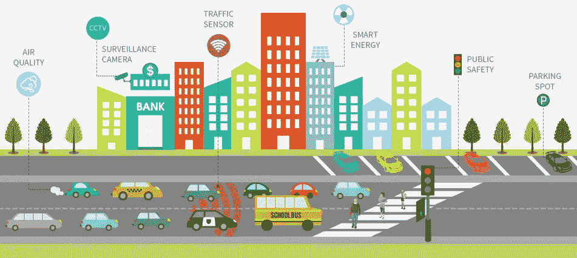
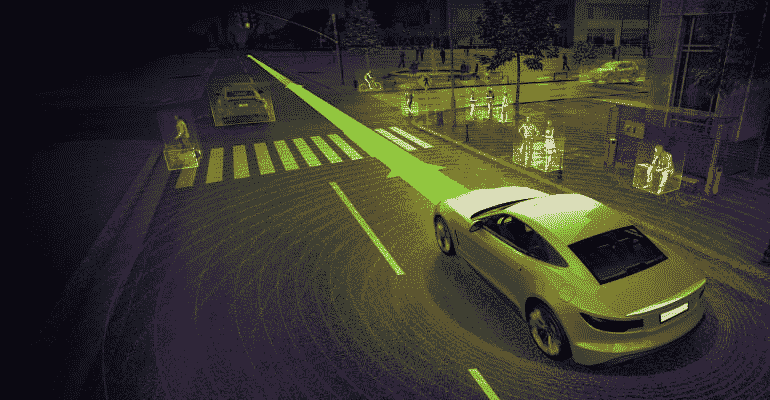

# 物联网如何解决城市交通拥堵

> 原文：<https://medium.com/hackernoon/how-iot-can-solve-traffic-congestion-in-cities-66c2aa132bcf>

物联网([物联网](https://en.wikipedia.org/wiki/Internet_of_things))最大的优点之一是它能够解决我们身边最常见的问题，其中之一就是交通。我想解释一下物联网在优化交通方面的能力，因为当今的世界人口和世界上存在的大量交通工具。当世界上大部分人口开始向大都市地区迁移时，这个问题甚至会出现。根据研究，到 2032 年，将近 61%的世界人口将居住在大都市地区。

无论你住在哪个地区，你总是会遇到全天候的交通困难。当城市人口和拥有的车辆增加时，这个问题变得更加严重。此外，每个国家的交通方式将变得更糟糕，而且如果没有更智能的技术支持，很难找到解决这个问题的方法。

物联网(IoT)等智能技术的使用正逐渐从提高生活质量的移动应用转向解决人们日常生活中遇到的问题。现在，让我们来了解一下物联网是如何解决当今世界人口最常见的难题——交通拥堵的。

# **人工智能和传感器时代**

让我们看看物联网是如何在我们的环境中快速增长的。常见的虚拟助手，如 Siri 和 Alexa，用于新闻和数据信息，城市正在转向智能设备，以收集不同选民所需的有用数据和见解，从而有效地满足平民的需求。这种低成本的传感器允许使用实时信息以高效的方式观察和控制交通。

机器学习方面的先进进步为城市官员提供了关于大都市人民所面临的问题的卓越见解，这些尖端技术生成的元数据为相关主管提供了更及时、更有组织的决策。

更聪明的城市正在尝试采用这些智能技术，并将其结合到车辆相互交互的交通系统中，使从 X 点到 Y 点的驾驶变得安全。云和边缘数据中心的新改进大大降低了数据存储的成本，同时使数据可以立即用于研究和学习。大数据革命正在改变城市的运行方式。

# **智慧交通背后的理念**

在这里，主要的想法是将“东西”连接在一起，这样城市的交通才能变得更好、更有效。例如，通过将车辆 GPS 与交通摄像头连接起来，城市的管理者可以对如何有效地控制和处理交通有一个有益的洞察和理解。此外，为了提高效率，可以向车主发送消息，通知他们要去的路线上的交通堵塞，并帮助他们选择不同的路线。其结果将是有益和高效的交通体验，交通堵塞的显著减少和安全的交通系统。

物联网(IoT)通过从各种渠道收集数据，如交通摄像头、车辆 GPS、传感器等，在这一场景中发挥了关键作用。这种数据可以用来分析和了解交通模式，最终，我们将找到创新的想法来简化最常用的道路和交通系统。不仅如此，连接的传感器和探测器可以识别严重的情况，然后立即发送援助以采取行动&还可以通过由一家网络开发公司运营的网站进行实时查看。汽车司机也将被告知这种情况，以避免并因此减少道路事故的数量，为其他乘客的良好安全。

优化交通问题并提高整个交通运输系统效率的解决方案包括:

# 1.组合不同来源的交通数据

通过组合从不同渠道(如红绿灯、摄像头、远程信息处理和其他来源)收集的交通数据，数据源被管理并发展成静态交通信息模型。

# **2。分析交通数据**

分析数据信息，提供关于交通问题、性能、状况等的可靠和实时的见解。将有助于优化和有序的交通堵塞。可以运行与旧数据的关联，以向城市主管提供关于交通状况的有用见解。这将有助于他们直接设置交通信号或推荐不同的路线，这实际上有助于减少交通堵塞。

# **3。监控交通运行**

通过一个集中管理仪表板监视交通运行，该仪表板从城市的各个地方收集信息，将有助于减少交通堵塞。这些信息可以在表示正常交通流量和繁忙交通区域的地理空间地图上看到，以支持官员和操作员控制交通，并进一步简化他们对不同情况的响应

# **4。支持数据存储和 GIS**

城市的交通系统必须有助于地理信息系统的存储和呈现，信息在控制系统中进行鲁棒和严格的图形显示，以查看诸如交通量、密度、速度、交通事故等情况。它可以显示城市中出现的设备的图标，如交通灯、摄像机和其他交通设备，以了解具体的数据

# **物联网控制交通拥堵的未来**

物联网(IoT)已经在以各种方式帮助我们并使我们的生活变得比我们要求的好得多。这才刚刚开始。物联网在确保安全驾驶方面的真正力量尚未显现，因为车辆正在走向完全自动化，并开始与事物进行通信，以自行做出选择。这可以打开新的可能性和机会，如提醒司机进入交通场所或避免碰撞。物联网创造新可能性的真正潜力还有其他不同的情况。然而，要实现这一目标，我们还有很长的路要走。