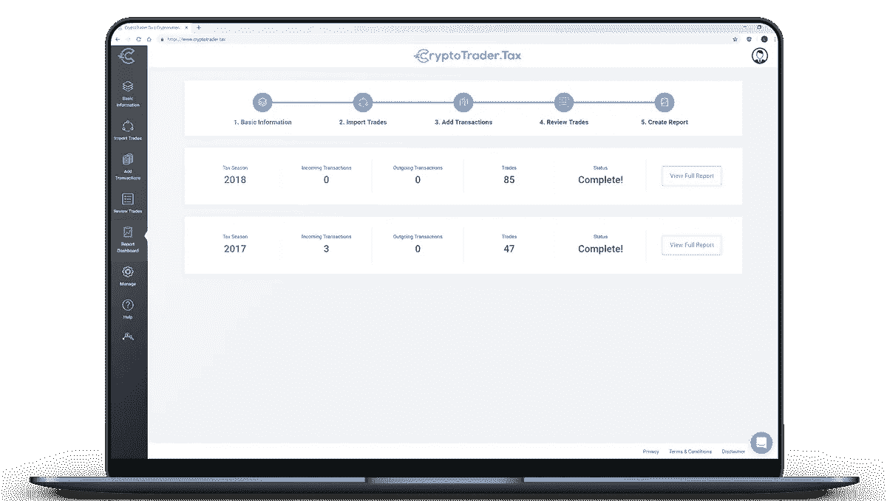

# 加密货币如何征税？

> 原文：<https://medium.com/hackernoon/how-is-cryptocurrency-taxed-7526ba1bc351>

过去五年来，比特币和以太坊等加密货币越来越受欢迎。这种增长引起了世界各国政府的关注，在美国，国税局最近宣布，加密货币的税收是其今年 [**五大优先事项**](https://www.irs.gov/businesses/irs-announces-the-identification-and-selection-of-five-large-business-and-international-compliance-campaigns) 之一。这让许多交易员和税务专业人士提出了一个问题——加密货币是如何征税的？

# 加密货币如何征税？

正如美国国税局在 2014 年发布的 [**官方指导**](https://www.irs.gov/pub/irs-drop/n-14-21.pdf) 中所述，出于税收目的，加密货币应被视为财产，而不是货币。

这意味着加密货币与股票、债券、房地产和黄金等其他形式的财产一样，受资本损益规则的制约。换句话说，你需要报告所有加密货币交易和投资的收益和损失。

# 一个例子

假设你在 2019 年 4 月用 3000 美元买了 0.5 个比特币。

如果你只是购买并持有这种加密货币，在你实现一个 [**应税事件**](https://www.cryptotrader.tax/blog/when-do-you-owe-taxes-on-your-bitcoin-and-cryptocurrency) (比如你的密码的销售或交易)之前，你不欠任何税。

现在假设三个月过去了，你把这个 0.5 的比特币卖了 5000 美元。

在这种情况下，你出售比特币获得了 2000 美元的资本收益。

这一销售触发了应税事件，您需要在纳税申报表 8949 中报告这一收益。

# 密码对密码的交易呢？

当你用一种加密货币交易另一种加密货币时，这也会触发一个**应税事件**，你需要报告你的税收。在这种情况下，资本利得/损失的计算并不容易，因为你的交易不是以美元或其他法定货币报价的。

让我们回顾一下资本损益等式:

公平市场价值—成本基础=资本收益/资本损失

# 什么是成本基础？

[**成本基础**](https://www.investopedia.com/terms/c/costbasis.asp) 是出于纳税目的的资产原值。在加密的世界里，你的成本基础本质上是你获得硬币的成本。

# 什么是公平市场价值？

从最简单的意义上来说，**公允市场价值就是一项资产在公开市场上的售价。同样，对于加密货币，公平市场价值是指在出售时硬币的美元价值。**

# **另一个例子**

**所以现在假设你用 0.5 个比特币换了 20 个以太，而不是卖掉换成美元。在这种情况下，您仍然触发了需要报告的应纳税事件；然而，计算你的公平市场价值有点困难，因为你没有以美元出售。**

**因此，在这种情况下，公平市场价值是 0.5 比特币或 20 ETH 在交易时的价值。**

**你的成本基础是 3000 美元，这是你最初为 0.5 比特币支付的费用。**

**你的公平市价是 5000 美元，相当于交易时 0.5 个比特币或 20 个以太币的价值。**

**你的资本收益是 2000 美元，你将按收益的一定比例缴税。**

**如果您有大量的加密货币交易，您会发现这些计算很难手工完成。谢天谢地，有 [**加密货币税务软件**](https://www.cryptotrader.tax/) 用于自动化整个加密税务申报流程。只需导入您的交易并生成您的 [**税务报告**](https://www.cryptotrader.tax/cryptocurrency-tax-reports) 。**

***(编者注:本文作者是 Crypto Trader Tax 的联合创始人)***

# **如果我在交易加密货币时赔钱了怎么办？**

**许多交易者在交易密码时会赔钱。这些损失仍然需要在 8949 表格上报告，它们实际上会减少你的应税收入，并为你的税单省钱。**

# **加密货币挖掘**

**出于税收目的，开采的加密货币在开采时被视为常规收入。您应该使用加密货币开采时的公平市场价值来确定收入金额。**

****

# **加密税务软件**

**如果你正在寻找一种快速的方法来生成你所需要的**加密税务报告**，你可以使用 **CryptoTrader。税收**。只需将您所有的历史数据导入应用程序，并创建您的报告！**

**你可以将这些报告交给你的税务师，或者直接插入流行的报税软件，如****或 [**TaxAct**](https://www.cryptotrader.tax/blog/how-to-file-your-bitcoin-and-crypto-taxes-with-taxact) 。******

*   *****本文仅供参考，不应被理解为税务或投资建议。请向您自己的税务专家、注册会计师或税务律师咨询如何对待数字货币的征税问题。*****