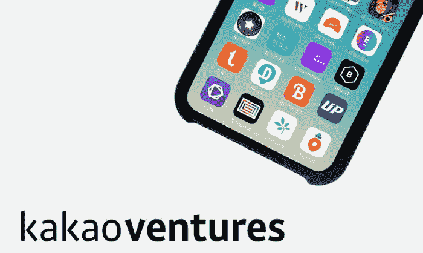
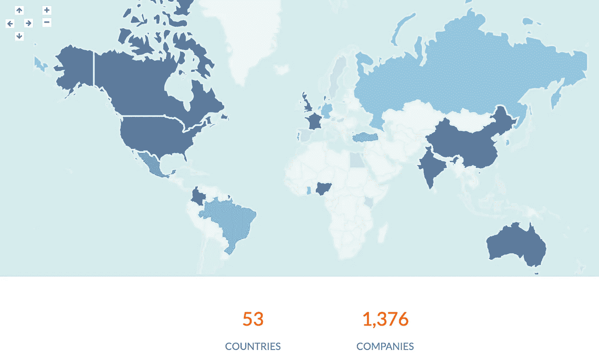
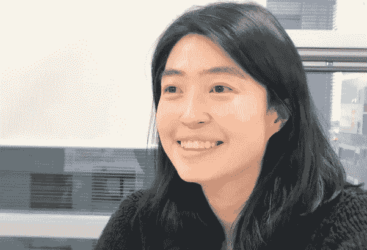
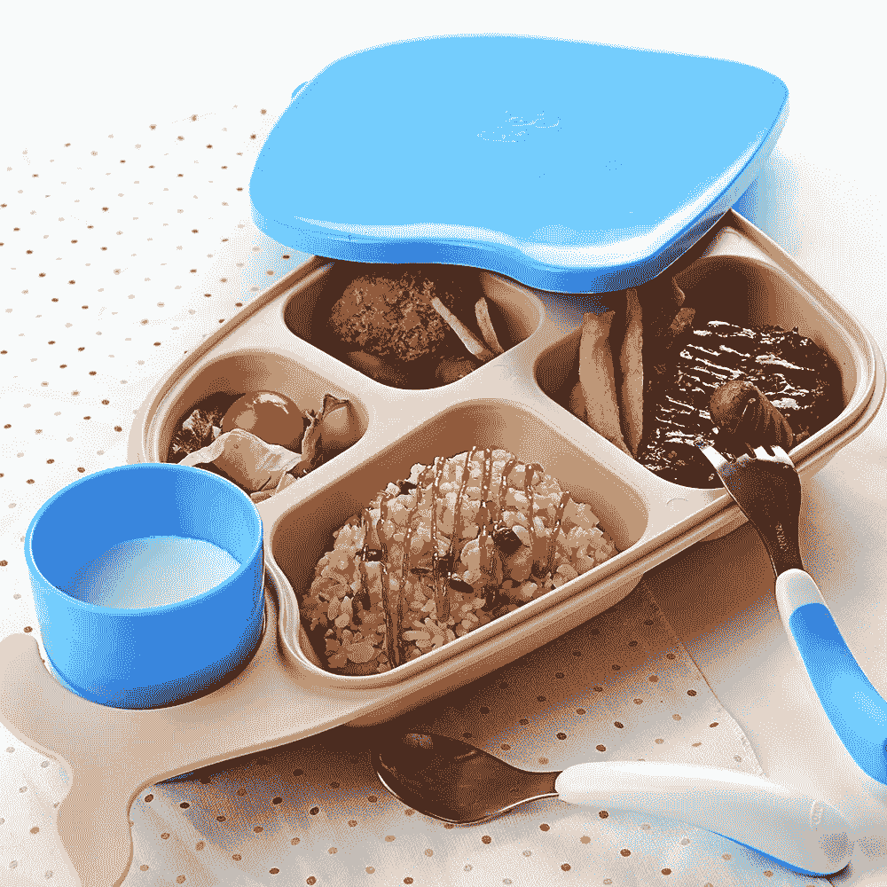
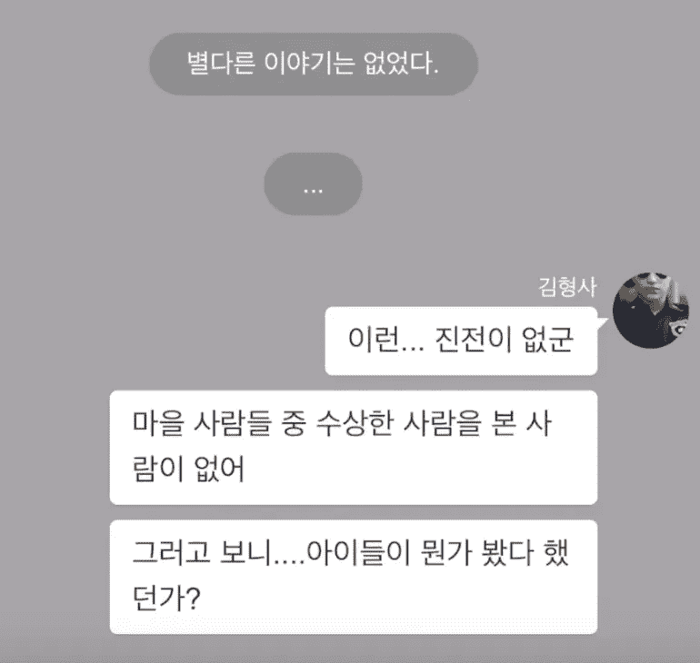

# 韩国早期风险投资 Kakaoventures 对 2019 年的未来有何设想？

> 原文：<https://medium.com/hackernoon/how-is-koreas-early-stage-vc-kakaoventures-envisioning-the-future-in-2019-9af5b44a0fdf>

去年三月参加 YC 演示日的一个大惊喜是看到了 YC 批次变得多么国际化。迄今为止，他们已经[资助了来自 53 个国家的创业公司](http://world.ycombinator.com/)，尽管 76.8%的公司来自美国。然而，这是未来的一个迹象——**我们将开始看到来自国际社会的独角兽的崛起**，而不是仅仅由美国和中国的少数几个人主导创业场景。

YC Alumni Map ([source](http://world.ycombinator.com/))

因此，自然会出现这样一个问题:**美国以外的国家发生了什么事情?**？在较小的国家，比如韩国,[目前拥有 9 只独角兽，它们资助了哪些创新？](https://www.cbinsights.com/research-unicorn-companies)

为了回答这个问题，我创作了如果 kakao ventures 2019 年的投资全部成功，典型的一天会是什么样子。Kakaoventures 被选中是因为它在 2018 年以 43 项新投资领先。

对于非韩国人来说，我希望这可以帮助他们了解韩国人为了创造一个更好的未来正在努力解决的问题。**文化差异导致对问题的不同解释，我相信这将有助于为所有人**而不是为世界人口的特定子集[(即 23andme 曾与有色人种的基因](https://www.google.com/amp/s/qz.com/765879/23andme-has-a-race-problem-when-it-comes-to-ancestry-reports-for-non-whites/amp/)斗争)。

对于韩国人来说，我希望这可以作为一种方式来看看 Kakaoventures 是否合适，kakao ventures 正在努力改变风投的工作方式，共同引领创始人的旅程，以加速技术的未来，并确保飞机上的每个人都享受这一旅程。

Shina, the CEO of Kakaoventures, is creating a new culture of how VCs work in Korea ([source](http://biz.chosun.com/site/data/html_dir/2019/01/06/2019010601631.html))

我想象着醒来时收到你的健身伙伴( [butfit](https://www.butfitseoul.com/) )发来的短信，说天气很好，我们将在户外进行，而不是在室内进行。所以你拉开窗帘，看到晴朗的天空，没有人戴口罩，仿佛污染从来不存在。

当你走出去的时候，你从你的健身伙伴那里收到一条短信，说一名新成员刚刚被诊断出患有癌症。为了让你的团队开心，你打电话[打开桌子](https://www.openthetable.com/)并背诵厨房医生的[食谱，为那些正在从癌症中康复的人点早餐。通过将发送时间设置为锻炼结束的时间，您可以给每个人一个惊喜！](https://doctorkitchen.co.kr/)

在与你的船员进行了一次扎实的锻炼后，你在回来的路上看到一个非常可爱的便当盒，所以你决定买一个并把你女儿的早餐放在那个盒子里([社交豆](https://thevc.kr/SocialBean))。一旦她看到它，她会在上面写下自己的名字，这样鲸鱼便当盒就永远属于她了:)

It’s an actual whale bento box! ([source](https://www.google.com/search?q=social+bean+whale&rlz=1C5CHFA_enUS710US710&source=lnms&tbm=isch&sa=X&ved=0ahUKEwjqjubxgqXjAhUVJqYKHTpNBC8Q_AUIECgB&biw=1002&bih=592#imgdii=lqMiS_dqeaA7IM:&imgrc=_k_jq1s-vHz7pM:))

吃完后，你告诉你女儿今天晚些时候会有一位新老师来。你把你从应用程序上收到的“匹配”信息转发给她，想知道她会从一个学习当代文学专业的牛津毕业生那里学到什么。知道你匹配的老师现在很受欢迎，你很高兴看到你的女儿将从一对一的会议中学到什么。

一旦你开始工作，你会遇到你的有影响力的同事，他们今天准备好向他们所有的粉丝广播，而不用打开一堆直播网站。他们以玩“N1 计划”开始他们的一天，该计划已经成为下一个堡垒之夜，并开始了一系列位居排行榜首位的韩国游戏。

随着时间的推移，由于 P.C. room partnership，你的一些有影响的人开始了新的游戏介绍会，这聚集了新的游戏人群，使你的公司在那天像病毒一样传播开来([鲁尼媒体](https://www.lunimedia.com/about/A-0101.html))。当你庆祝的时候，你收到你女儿的短信，说她在 Chatie 上为你写了一个新故事。

当她告诉你这是一个恐怖故事时，你吓坏了，因为这是一个你无法处理的类型。然而，因为这是你女儿的故事，你轻轻地屏住呼吸去洗手间，几乎要晕过去了，怀疑她是不是玛丽·雪莱的第二次降临。

Future stories may be written with a bunch of chat bubbles ([source](https://www.youtube.com/watch?v=0UOJPlE0SJs))

然后你的母亲给你发了一条短信，说她收到了来自她的汽车应用程序的通知，还附带了一条可爱的消息，“救命，我不知道该怎么办。”([马卡龙](https://macarong.net/))你温和地微笑着回她信息，你已经命令她的车去最近的修理厂，因为你上周安装了它的自动驾驶雷达([智能雷达系统](http://www.smartradarsystem.com/))。

在一天疯狂的工作之后，你去附近的一家餐馆，Kakaoventures 一家在那里等着你和其他创始人。当你和你的家庭成员(Kakaoventures 对其他接受投资的创始人的称呼)交流时，你了解到你的健身伙伴实际上是 140 名家庭成员之一，他散布了你的善行的谣言。

因此，晚宴最终变成了一场派对，你将获得一项“家庭奖”，被誉为“有爱心的灵魂”。然后，你发表演讲，讲述你在这些家庭日感受到的慷慨是如何激励你去做你所做的事情，并得到一块蛋糕来庆祝它([是的，这就是我们在朝鲜的庆祝方式](https://www.youtube.com/watch?v=MqMRkutVcw4))。

There goes the cake! ([source](https://www.youtube.com/watch?v=MqMRkutVcw4))

聚会结束后，你的团队向你表示祝贺，并告诉你休息一天，因为明天实际上是你的生日。你兴高采烈地告诉你的女儿通过 [Tripstore](https://m.tripstore.kr/) 找到她想去的地方，因为你从来没有时间计划你的旅行。你女儿选择香港是因为她喜欢这个名字的押韵方式(毕竟她是玛丽·雪莱的第二次降临)。

一旦你第二天到达香港，在机场迎接你的人不仅会以最低的费用(不到 1%)给你以最优惠的汇率兑换的现金，还会给你一张与你的手机相连的本地卡。然后你和你的女儿一起戴上你的智能眼镜，让韩国当地的导游带你游览香港，这样你就可以有一个最好的旅行了！([空间](https://spatial.is/))

从 Kakaoventures 今年投资的一个故事中，人们可以看到每个初创公司都在解决一个明确的需求，这将使我们的未来变得更好。尽管韩国的风险资本家数量有限，但创业者们仍在不懈努力，将他们的创意付诸实践。

我希望这能鼓励那些来自美国的人更多地关注国际创业公司，从而鼓励硅谷人寻求非传统的解决方案。这不仅会鼓励竞争，还会满足更多样化的需求，从而让更多的人能够做他们通过技术无法做到的事情，并且**希望让技术包容所有人。**