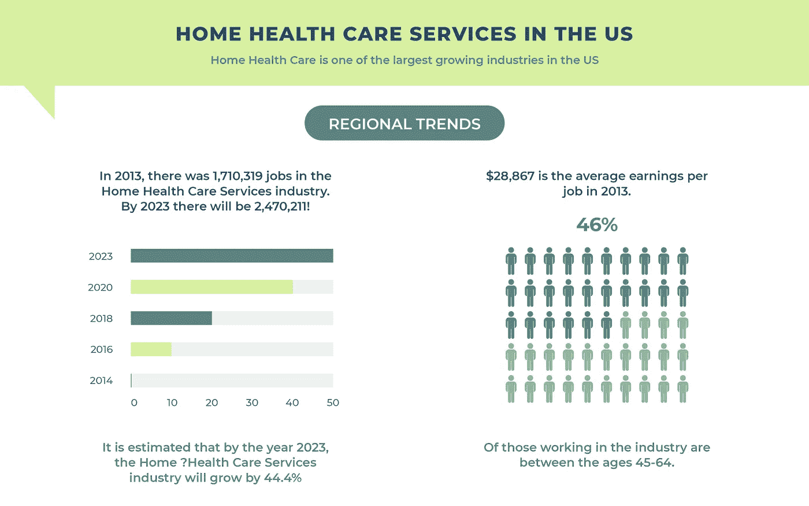
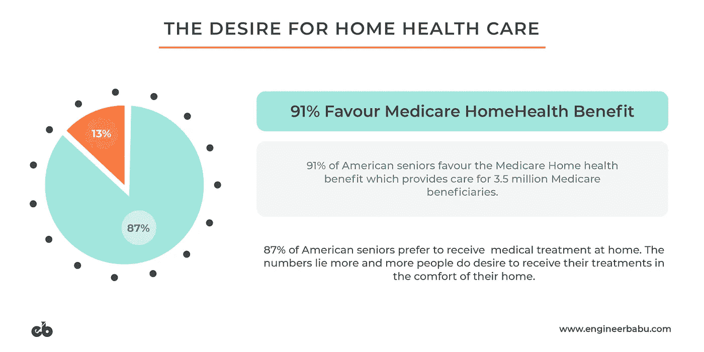
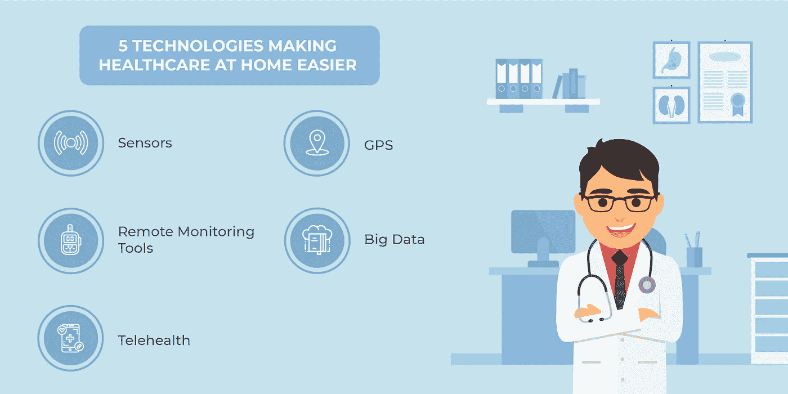
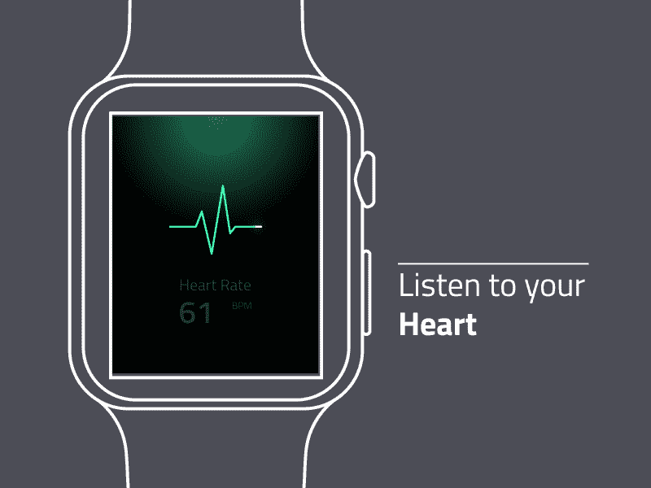
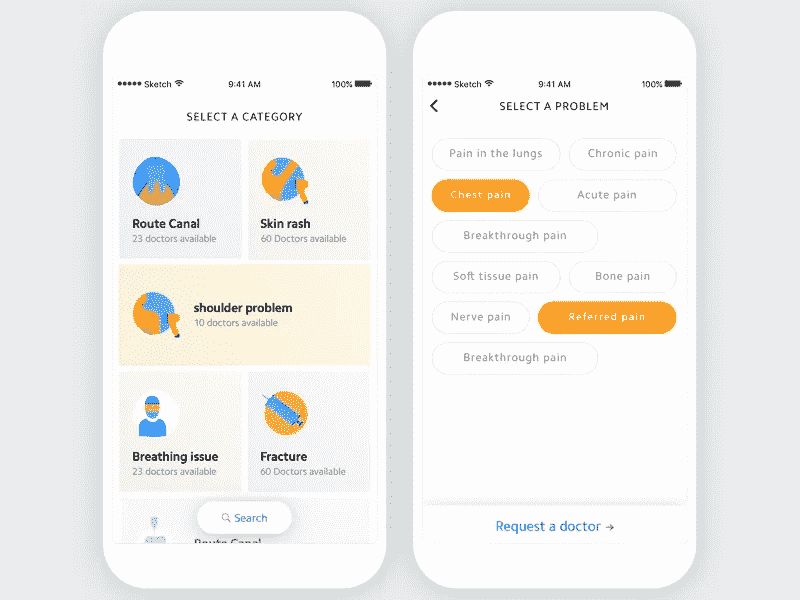
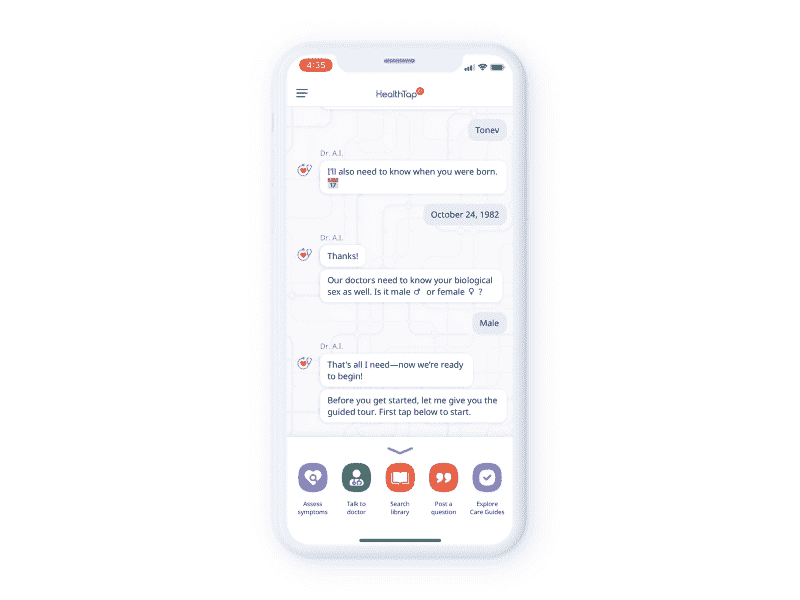
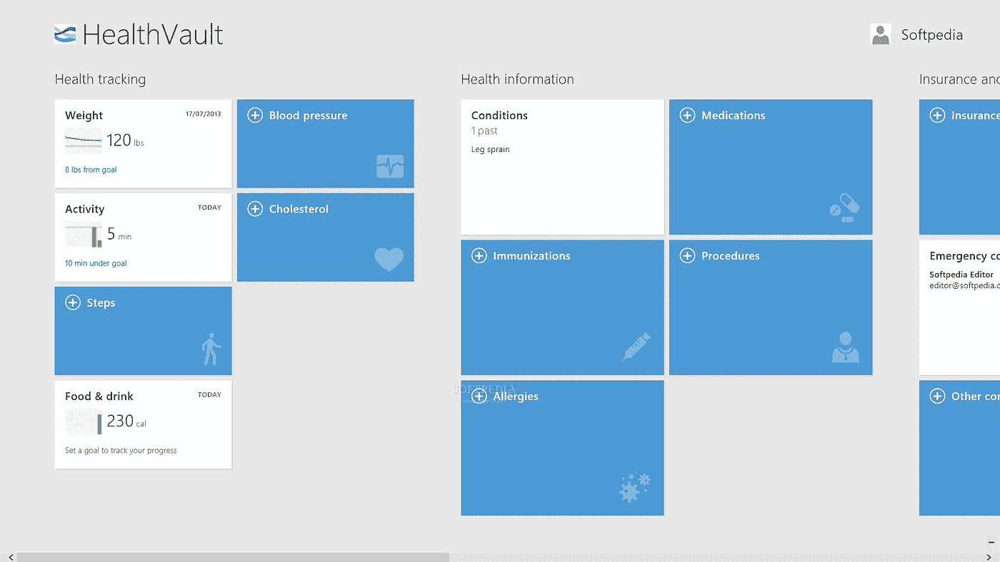

# 技术如何改变家庭医疗保健

> 原文：<https://medium.com/hackernoon/how-is-technology-transforming-healthcare-at-home-1ce827b355b9>

## 转变家庭医疗保健的潜力正在巨大增长

Video Courtesy: [youtube.com/ted](https://www.youtube.com/watch?v=zamvnyBB-SU)

**当今世界；**
正在经历人口年龄结构的巨大变化。以美国为例，预计到 2019 年，65 岁以上的人口将超过 5 岁以下的人口。随着预期寿命的增加，随着年龄的增长，患有各种慢性疾病和功能障碍(例如痴呆症、糖尿病和无法处理家务)的人数也在进一步增加。

属于“老年”群体的人更容易患慢性病，需要更多的照顾和关注。在这种时候，当务之急是发现和开发解决方案，确保人们的医疗保健期望、偏好以及他们的需求。这让我们想到了“家庭保健服务”的潜力，它可以让所有年龄段的人都能轻松独立地照顾自己的医疗状况。

随着技术的快速进步，改变家庭医疗保健的潜力也将大幅增长。医疗保健组织和机构将能够提供卓越水平的患者护理，同时享受到家的舒适。这将提高患者满意度，改善医疗服务的成本控制。*根据 M & M，预计到 2020 年，全球家庭医疗保健将从 2275 亿美元* *达到****3498 亿美元，预测期内 CAGR 为 9.0%。***

年老体弱的病人可能没有资源和精力时不时地去看医生，这导致他们选择在家接受医疗保健。由于这个原因，医疗保健公司总是在适应日益数字化的世界的竞赛中相互竞争。
特别是在美国，医疗保健组织非常清楚普遍存在的问题，例如需要增加对老龄人口家庭治疗的护理，这主要是由于流动性和预算问题。在这种情况下，唯一能提供帮助的救星是技术，只要它被正确实施。

*在与技术合作时，家庭医疗保健机构选择正确的选项以实现预期结果至关重要，例如提高效率，同时为患者提供最佳护理和经济实惠的解决方案。*

# 家庭医疗保健的范围是什么？

除了为老年人提供医疗保健服务之外，家庭医疗保健对于从医疗机构或医院回到家中后需要持续医疗护理和治疗的患者也很有用。家庭保健使人们能够在家中接受各种医疗服务。家庭保健对应对不同情况的人来说是有益的。无论患者是住院后正在康复的个人，还是残疾、年老或患有慢性疾病的人，在这种情况下，在家医疗保健都是正确的选择。

家庭医疗保健允许人们获得任何种类的治疗；无论是治疗还是护理，甚至是常规的医疗援助。 ***根据加拿大家庭护理协会的一项调查，在家庭保健服务的帮助下，急诊科就诊人数下降了约 72%***，这也导致了住院率的下降。

家庭保健由以下因素组成:

家庭援助家庭医疗保健的主要目的是让人们在家获得医疗支持，而不是花时间在医疗机构。家庭医疗保健让人们可以自由地呆在自己的住所，而不是选择在医院接受长期护理。在家庭协助下，医疗专业人员可以帮助无法进行日常活动的患者完成食物准备、基本家务管理和紧急措施等任务。可以这样做，直到患者能够自己完成所有这些任务。

家庭援助还允许医疗专业人员进行医疗和心理评估，同时允许个人了解*疼痛管理、疾病教育和物理治疗等*。

**家庭护理机构** 家庭护理机构专注于在患者家中以医疗专业人员的形式提供医疗专业知识。在这种情况下，医疗专业人员或医生被送到病人家中治疗他们的受伤或疾病。一旦病人的健康状况得到恢复，对医疗专业人员的需求就结束了，他们的服务也随之中断。

**家庭保健员** 除了专家医生，在某些情况下，其他医疗专业人员也参与家庭保健计划，如*护士、物理治疗师、营养师、职业治疗师等*。随着所有年龄组的人越来越意识到健康的生活方式，对这些专业人员的需求预计在未来十年将显著增加。

# 家庭医疗保健的好处

家庭保健有很多好处，包括但不限于以下原因。即使当病人不适合去医院时，家庭保健专业人员也能提供很大的帮助。他们经过专门培训，有资格在评估患者家中的安全性和风险的同时提供治疗。他们还可以为患者的健康提供简单的建议和纠正，如随时准备用于紧急情况的药物或立即提供救护车援助的建议等。

Numbers don’t lie, and looking at the above info-graphic gives a clearer picture as to what the future holds for Home Healthcare Services

1.  **日常生活活动**也得到家庭护理的支持。这些活动可以包括任何基本的必需品，如洗澡、药物提醒以及梳洗等。这种设施允许老年患者在满足其个人护理需求的同时获得定期帮助，同时保持他们的高质量生活。
2.  **居家专家护理**是居家医疗保健服务的重要优势之一。熟练的医疗专业人员可以在经过认证并掌握先进医疗设备知识的监督护士的帮助下，在家中执行特定的关键医疗程序。家庭医疗保健让您所爱的人在家门口就能获得所需的个性化护理。
3.  **饮食和营养支持**是家庭保健的一部分。患有某些疾病并在治疗后出院的患者，由于缺乏营养，通常会变得非常虚弱。他们的问题会随着衰老、疾病和受伤而恶化。家庭医疗保健可能包括饮食和营养咨询以及家常饭，可以防止你所爱的人缺乏营养。
4.  多个医疗处方可能会导致混乱。家庭保健专家可以帮助您的亲人在正确的时间服用正确的药物，以控制他们的医疗状况，并防止摄入错误的药物。
5.  据研究人员称，当向患有糖尿病或肺炎等慢性健康问题的患者提供家庭护理时，临床试验证明效果更好，并发症更少。家庭保健可以带来更好的健康结果。此外，家庭医疗保健允许患者以更好的方式获得治疗，因为它为个人提供一对一的支持。这种个性化和熟练的护理加强了医护人员和他们的客户之间的联系。

# 是什么推动了家庭医疗保健服务的这种变化？

专注于提供家庭医疗保健服务的公司非常依赖自动化，因为它可以确保过程中使用的技术保持不可见，并使他们能够为用户提供最佳护理。由于这一因素，越来越多的家庭医疗保健服务公司发现了自动化和优化的潜在价值，因为他们需要在该领域保持竞争力。

**自动化预约安排**是自动化流程提高效率的一个例子。像*人工智能*这样的领先技术可以帮助医疗保健企业提供更好的以病人为中心的服务。

Source: [isalushealthcare.com](http://isalushealthcare.com)

例如，患者所需的药物和设备可以通过技术实时确定。除此之外，AI 还可以实现**预测护理人员日程安排和预约**持续时间的功能，以及**预测紧急情况下的出行路线**。它还可以通过**预测取消**来改善客户服务，以避免失约。

家庭医疗保健自动化的整体目的是简化整体流程，如根据需要安排和提供服务，以及所有必要的设备，从而加快改善患者护理。通过这种方式，可以消除所有固定随机约会的麻烦，同时提高整个系统的生产率。

像 [**区块链**](https://www.engineerbabu.com/blog/blockchain-in-healthcare-opportunities-challenges-and-applications/) **和 AI** 这样的最新突破性技术的力量可以在医疗保健领域改变很多，因为它们可以解决当前的问题，并帮助患者在家庭医疗保健方面获得最佳体验。医疗保健组织开始意识到技术可以为他们带来的好处，例如完成基本任务和节省时间。

# 5 项技术改革家庭医疗保健

**1。传感器** 根据 Kalorama 信息，*2014 年* ***远程患者监护的销售额估计约为 297 亿美元*** ，其中很大一部分需求来自家庭医疗保健设施和服务。老年人护理提供者对家庭保健治疗产生了兴趣，而不是将人们转移到另一个治疗机构。

按照这种趋势，传感器技术可以放在家里，放在门、窗以及病人的器具和设备周围。这些传感器可以在任何异常活动的情况下向护理人员发出警报。

他们还可以跟踪并在患者错过进餐时发送通知。这对于患有阿尔茨海默氏症等疾病的患者尤为重要。这些患者可以留在家里，他们的活动可以通过移动医疗应用程序和传感器进行监控。

**2。GPS** 在紧急情况下，比如老年人长时间不在家时，GPS 跟踪可以帮助他们的家人、医护人员或执法机构快速找到他们。具有移动警报服务等功能的技术还允许这些设备遵循一种混合方法，使人们即使在车库停车场和室内等 GPS 可能不可用的地方也能找到老年人。它还可以在用户摔倒时自动呼叫帮助。

此外，在需要紧急医疗服务时，呼叫最近的急救队和快速调度可能是生死攸关的事情。GPS 跟踪成为紧急业务服务中急需的选项。

**3。远程监测工具** 对于老年患者来说，定期健康监测不是一种选择，而是一种必须。如今有许多设备可以连接到智能手机，以帮助降低成本，并减少在危险的健康状况下看医生所消耗的时间。

科技以健身带的形式实现了不同的选择，可以定期跟踪睡眠、饮食、步数等。除此之外，还有许多其他设备可用于跟踪和测量血糖和血压水平，以及心率监测和其他测量。这种工具允许患者的家庭成员以及护士和医生详细记录他们的日常保健需求，并且消除了一次又一次打电话给医生的需要。

**4。大数据**家庭医疗保健高度依赖来自多种资源的可用数据及其分析，以获得正确治疗的重要见解。一些家庭健康服务对大量数据进行分析，并利用其结果采取预防措施，甚至在医疗状况变成问题之前。

支持大数据的传感器可以检测睡眠模式等常规活动水平。并通知看管当局对任何异常立即采取行动。

**5。远程保健** 远程保健系统是医疗保健行业的福音，因为它们让人们能够使用电话和其他数字系统将患者与医生和专家联系起来。此外，这些系统中有希望的进步可以帮助残疾人或老年人往返于医疗机构之间。具有简单互联网连接的智能手机和 iPads 等设备可以使人们更容易实施远程医疗，并使结果更容易理解。它们允许医生从不同的地方监测病人，并实时分享结果。

# 3 项应用推动医疗保健创新

不断发展的移动技术使我们能够将新的和改进的想法变为现实。医疗保健移动应用程序是该行业的一场大革命，因为它们使我们的工作更容易访问，并提高了效率。
以下是一些医疗保健应用的列表，这些应用正在迅速改变医疗保健行业。

**1。随叫随到医生:** 随叫随到医生是一个移动应用程序，允许患者通过视频呼叫与他们的医生进行咨询。*该应用程序使用* ***远程医疗*** *的概念，在紧急护理的情况下为患者提供按需医生。*

Source: [dribbble.com/babuma](http://dribbble.com/babuma)

持证医生提供医疗保健和心理健康方面的紧急护理*、*慢性病、预防药物、医疗建议等服务。
该应用程序还可以在非紧急情况下发挥作用，如流感和感冒、呼吸系统问题、过敏、背痛和 UTI。

**2。健康水龙头:**

A live screen capture from HealthTap
Source: [dribbble.com/joshshiau](http://dribbble.com/joshshiau)

该应用程序允许患者与医生进行虚拟医疗预约，或者获得他们问题的答案。它为 **24*7** 通过视频、语音或文本咨询从真正的医生那里获得医疗保健提供了一种便捷的方式。该应用程序还拥有一个约 70 万个主题和文章的知识库，供人们自行阅读和学习医疗保健知识。
*它使用一个人工智能驱动的症状检查器来进行* ***一对一的推荐和指导*** *。*

**3。微软 HealthVault:** 微软 HealthVault 是一项数字服务，也是一款移动应用程序，为患者提供了保持医疗记录更新和安全的自由*。患者还可以在需要时与数字专业人员安全地共享这些记录。该系统特别适合慢性病患者，因为他们可以正确跟踪自己的常规健康指标。*

**

*HealthVault stores and maintains health and fitness information and addresses both individuals and healthcare professionals.*

> **它还允许患者* ***设定保健目标，跟踪进展，并发现健康趋势*。***

# *结论性观点*

*家庭医疗肯定有很大的潜力，但只有以有效的方式利用这些技术，它才能发挥杠杆作用。*

> **应妥善管理病历等关键数据，并在不影响其安全性的情况下研究这些数据，以获得洞察力和理解。**

*人们需要相信技术，以便在日常生活中适应和使用它们。区块链和人工智能等热门名称可以带来医疗保健行业的一场革命，出现新的用例，并正确理解如何以最佳方式为患者、医生以及整个医疗保健生态系统服务。*

*— — — — — — — — — — — — — — — — — — — — — — — — — —*

## *看我的其他相关文章*

***1。** [**区块链在医疗保健:机遇、挑战、应用**](https://www.engineerbabu.com/blog/blockchain-in-healthcare-opportunities-challenges-and-applications/) **，也论**[**hacker noon**](https://hackernoon.com/blockchain-in-healthcare-opportunities-challenges-and-applications-d6b286da6e1f)
**2。**[**2018 年医疗创新**](https://www.engineerbabu.com/blog/innovations-in-healthcare/) **，还上了**[**hacker noon**](https://hackernoon.com/healthcare-innovation-in-2018-a8c4c28e4b30) **3。** [**协同医疗—通讯工具的兴起&移动医疗**](https://www.engineerbabu.com/blog/coordinated-care-in-healthcare/) **4 .** [**【电子处方】——让病人的护理变得有效&高效**](https://www.engineerbabu.com/blog/e-prescriptions-reforming-healthcare/) **5 .**[**2019 年的 AI——有哪些科技公司在下大赌注？**](https://www.engineerbabu.com/blog/artificial-intelligence-in-2019/) **6。** [**美国十大医疗保健公司**](https://www.engineerbabu.com/blog/top-10-healthcare-companies-in-the-us/)*

> **我是 Mayank，*[*engineer Babu*](https://www.engineerbabu.com/)*的联合创始人。随时联系我*[*LinkedIn*](https://www.linkedin.com/in/mayankpratap/)*| mayank@engineerbabu.com(关于 EngineerBabu —* [*中*](https://hackernoon.com/how-mayank-pratap-built-engineerbabu-a-profitable-it-service-company-generating-more-than-50-000-per-month-bcd3006bdbb5) *)。**

*此外, [EngineerBabu](https://www.engineerbabu.com/) 通过构建高级 IT 解决方案，帮助初创公司、企业和所有者发展业务。他们开发的项目 95%都按时完成了。 [30+由风投](https://www.engineerbabu.com/casestudies)资助，获得最具创新总理设计奖，入选 Y-Combinator 2016 & 2017。*