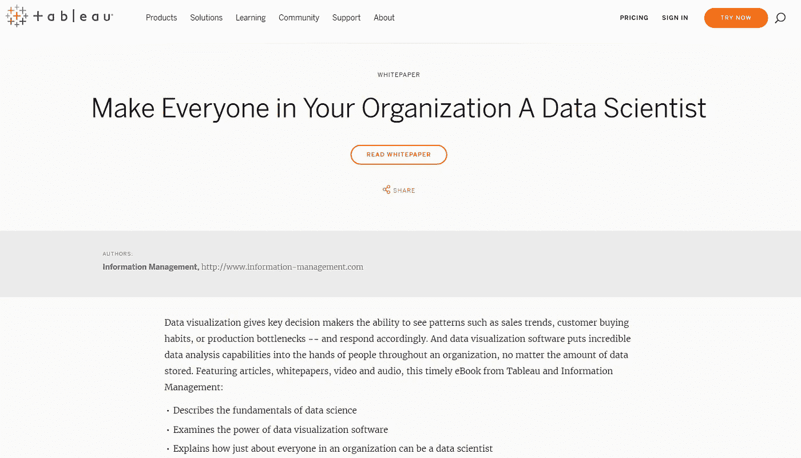
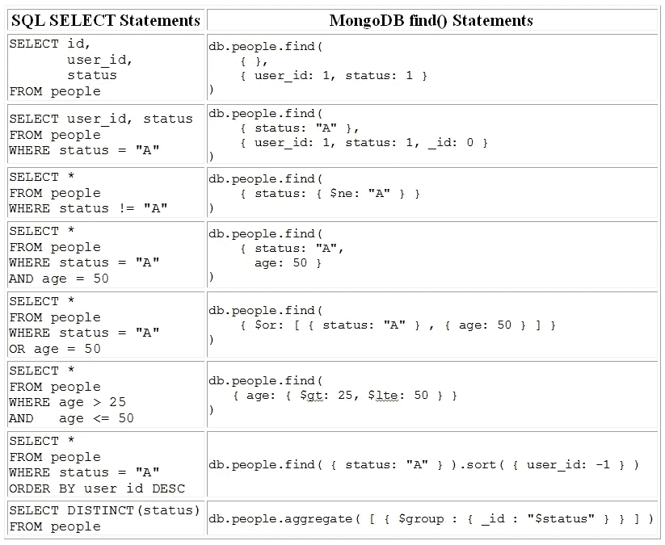
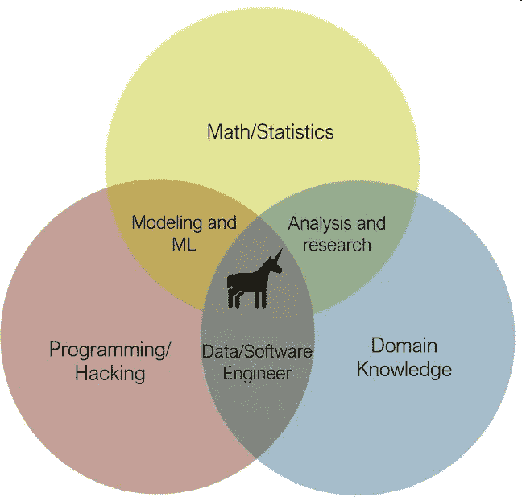
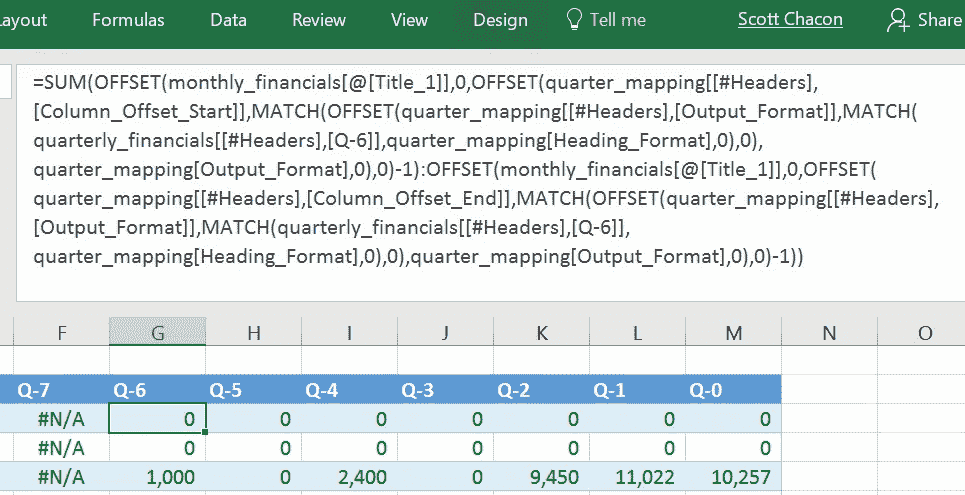
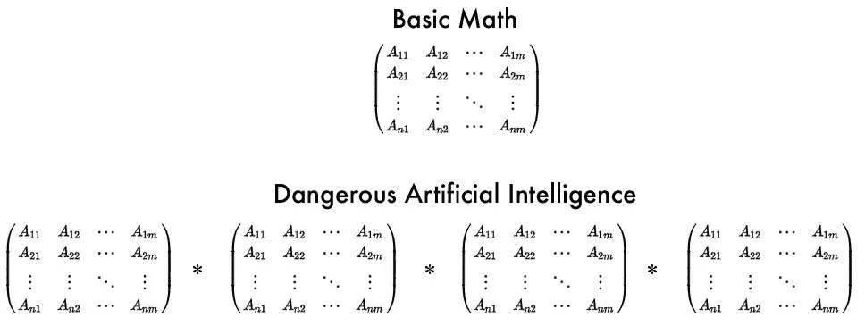

# 2019 年学数据科学的感受

> 原文：<https://medium.com/hackernoon/how-it-feels-to-learn-data-science-in-2019-50a7200f4129>

## 透过(决策树)看到(随机)森林

*以下受黑客午间文章*[*2016 年学习 JavaScript 的感受*](https://hackernoon.com/how-it-feels-to-learn-javascript-in-2016-d3a717dd577f) *启发，原载于* [*走向数据科学*](https://towardsdatascience.com/how-it-feels-to-learn-data-science-in-2019-6ee688498029) *。* ***不要把这篇文章看得太重。这是讽刺，所以不要把它当作实际的建议。像所有的建议一样，有些是好的，有些是糟糕的。这一块只是一个观点，很像人们对数据科学的定义。***

我听说你是要去的人。谢谢你见我，也谢谢你的咖啡。你懂数据科学吧？

嗯，我知道这件事。我去年去了[*PyData*](https://pydata.org/)*和* [*奥莱利地层*](https://conferences.oreilly.com/strata) *做了几个模型。*

是的，我听说你上周给我们公司做了一个很棒的关于机器学习的报告。我的同事说这真的很有用。

*哦，猫狗照片分类器？好的，谢谢。*

**无论如何，我已经决定不再忽视*数据科学*、*人工智能*和*机器学习*。多年来，我一直是一名分析师和顾问，在 Excel 工作簿中处理数字，制作数据透视表和图表。然而，我一直读到文章说人工智能会夺走工作，甚至像我这样的白领。**

This is all you need to become a confident data scientist (as of 2013). Totally achievable, right? ([SOURCE: Swami Chandrasekaran](http://nirvacana.com/thoughts/2013/07/08/becoming-a-data-scientist/))

我在谷歌上搜索了如何成为一名数据科学家，找到了这张“路线图”，并了解了什么是生存危机。让我问你这个问题:我真的必须掌握这个图表中的一切才能成为一名数据科学家吗？

简短的回答，没有。没有人再使用这个路线图了。是 2013 年的。它甚至没有张量流，你可以在这个图表中完全画出一些路径。我认为“数据科学”在那个时候也变得更加分散和专业化。采取不同的方法可能更好。

好吧，这让我感觉好一点了。那我该回学校吗？我在某处读到很多数据科学家至少有硕士学历。我应该获得数据科学硕士学位吗？

*天哪，你为什么要这么做？你必须警惕“数据科学”课程，它在很大程度上是一个更名的“商业分析”学位。此外，日常学术界往往落后于行业，可以教授过时的技术。为了跟上潮流，你最好去 Coursera 或 Khan Academy 自学。*

**哦。**

如果你真的上了大学，或许可以学习物理或运筹学？很难说。有趣的是，我遇到的许多优秀的数据科学家都来自这些领域。你也许能找到一个好的“数据科学”项目。我不知道， [*去和这个博士辍学生谈谈他的观点*](https://towardsdatascience.com/do-you-need-a-graduate-degree-for-data-science-8e3d0ef39253) *。*

那么我该如何开始自学呢？LinkedIn 上的一些人说，那些对数据科学感兴趣的人应该从学习 Linux 开始。然后我去 Twitter，有人坚持认为数据科学家应该学习 Scala，而不是 Python 或 r

LinkedIn 上的那个家伙还差几根薯条就能吃到快乐套餐了。关于 Scala 的家伙，请不要去 Scala 的兔子洞。相信我。现在是 2019 年。Scala 并没有出现在数据科学社区。如果是，[*py spark*](https://spark.apache.org/docs/0.9.0/python-programming-guide.html)*就不是个事儿了。而且绝对不要听语言潮人，就像那个* [*总在说 Kotlin*](https://youtu.be/J8GYPG6pt5w) *的家伙。*

还好吗？R 呢？人们似乎喜欢它。

*R 擅长数学建模仅此而已。使用 Python，您的学习投资将获得更多回报，并且可以完成更大范围的任务，如数据争论和设置 web 服务。*

**但是 R 在**[**Tiobe**](https://www.tiobe.com/tiobe-index/)**上的排名还是蛮高的，而且它有一吨的社区和资源。用了会疼吗？**

看，你可以用 r。如果你只是对数学感兴趣，它可能会更好，用**会更好。但是数据科学仍然不仅仅是数学和统计学。相信我，Python 会在 2019 年给你更多的里程。**

***好吧，那么……我想我正在学习 Python。***

**你不会后悔的。**

***Python 硬吗？当机器人接管时，我还能保持市场吗？***

*当然，Python 是一门非常简单的语言。你可以自动化很多任务，用它做一些很酷的事情。 ***但是你甚至不需要 Python。*** *数据科学不仅仅是脚本和机器学习。**

*什么意思？*

*嗯，这些都是工具。你使用 Python 从数据中获得洞察力。有时这涉及到机器学习，但大多数时候并不涉及。数据科学可以简单地创建图表。事实上，你甚至不需要学习 Python，使用 Tableau 就可以了。他们宣称，只要使用他们的产品 *，他们就可以* [*“让你组织中的每个人都成为数据科学家”。*](https://www.tableau.com/learn/whitepapers/make-everyone-your-organization-data-scientist)*

**

*Tableau is confident they can solve your data scientist staffing problem*

*等等，什么？所以我只需要买一个 Tableau 许可证，我现在就是一个数据科学家了？好吧，让我们对这个推销持保留态度。我可能一无所知，但我知道数据科学不仅仅是做漂亮的可视化。我可以用 Excel 做这个。*

*当然可以。你不得不承认这是一个巧妙的营销。绘制数据图表是一个有趣的阶段，它们省略了处理数据的痛苦和耗时的部分:清理、争论、转换和加载数据。*

*是的，这就是为什么我怀疑学习编码是有价值的。所以我们来谈谈 Python。*

**其实坚持住。也许你可以学习 Alteryx。**

***什么？***

**还有一个叫*[*Alteryx*](https://www.alteryx.com/)*的软件可以让你清理、争论、转换和加载数据。它很棒，因为它使用拖放界面来混合数据和…**

**

*Alteryx envisions a code-less “data science” experience with their product too*

*天啊，请停下来。不再有拖放工具。我想学 Python，不是 Alteryx 或者 Tableau。*

*好吧，对不起。我只是想通过避免代码让你的生活更简单。也许我也这么做了，因为我们公司买了我们应该使用的许可证。但无论如何，学习 Python 需要学习几个库，比如操作数据框的 Pandas 和制作图表的 matplotlib。其实，划掉 matplotlib。 [*用阴谋诡计。它用的是 d3.js，*](https://towardsdatascience.com/the-next-level-of-data-visualization-in-python-dd6e99039d5e) *好看多了。**

*我知道其中的一些单词。但是什么是数据框呢？*

**嗯，这是一种在包含行和列的表格结构中操作数据的功能。您可以在 Python 环境中使用数据框完成所有这些很酷的变换、透视和聚合。**

***等等，这与 Excel 有什么不同呢？我从大学毕业就开始做这些工作了。这是否意味着我已经是一名数据科学家了？***

*如果你愿意这样塑造自己，当然可以。当你去参加聚会和写简历时，我会给那个自称的头衔加个脚注。*

***那么 Python 和 Excel 有什么不同呢？***

**Python 与众不同，因为你可以在一个*[*Jupyter*](https://jupyter.org/)*笔记本内完成这一切。您可以逐步完成每个数据分析阶段，并让笔记本直观显示每个步骤。这几乎就像你在创造一个可以与他人分享的故事。毕竟，交流和讲故事是数据科学的重要组成部分。**

*那听起来像幻灯片。我也已经这么做了。我好迷茫。*

*哦，我的上帝，不。笔记本更加自动化和简化，它让你很容易追溯你分析的每一步。不过仔细想想， [*我刚想起来有些人甚至不喜欢笔记本，因为代码不太好用。*](https://www.youtube.com/watch?v=7jiPeIFXb6U) *在笔记本之外更容易模块化代码，以防你需要把它变成一个软件产品。**

*那么现在数据科学也是软件工程了？*

*有可能，但我们不要因此而分心。有更紧迫的事情要先学。做数据科学，显然需要数据。*

*当然可以。*

**一个很好的起点是抓取网页，就像一些维基百科的页面，然后把它们转储到我们的硬盘上。**

***等等，我们又在试图完成什么？***

*我们正在收集一些数据进行实践。用 [*美汤*](https://www.crummy.com/software/BeautifulSoup/) *抓取网页并解析，可以给我们很多非结构化的文本数据进行处理。**

***我糊涂了。我刚刚读完一本 130 页的关于 SQL 的书，我以为我会查询表格而不是浏览网页。SQL 不是访问数据的典型方式吗？***

*我们可以用非结构化文本数据做很多很酷的事情。我们可以用它来对社交媒体帖子上的情绪进行分类，或者进行自然语言处理。NoSQL 非常擅长存储这种类型的零散数据，因为我们可以存储大量的数据，而无需担心如何使其可用于分析。*

*我听说过 NoSQL 这个词。那是 SQL 吗？反 SQL？等等，我觉得跟大数据有关吧？*

**井首，* [*【大数据】如此 2016*](https://www.analyticsindiamag.com/big-data-buzz-is-on-decline-is-2017-the-year-of-demise-for-big-data/) *。大多数人已经不再使用这个词了，所以你这样说话就不酷了。像很多激动人心的技术一样，* [*它已经过了其 Gartner 炒作周期的巅峰*](https://www.analyticsindiamag.com/big-data-buzz-is-on-decline-is-2017-the-year-of-demise-for-big-data/) *，只在少数地方找到了自己的利基。但 NoSQL 基本上是“大数据”运动的产物，成长了像 MongoDB 这样的平台。**

*好吧，但是它为什么叫“NoSQL”呢？*

**NoSQL 代表“不仅仅是 SQL ”,支持关系表之外的数据结构。然而，NoSQL 数据库通常不使用 SQL，而是使用一种专有的查询语言。下面是 MongoDB 的语言与 SQL 的比较:**

**

*天哪，这太可怕了。你是说每个 NoSQL 平台都有自己的查询语言？SQL 怎么了？*

*我感觉到了。SQL 没有任何问题，除了它已经存在了几十年。非结构化数据热潮是一个机会，可以做一些不同的事情，并以以前不可能的方式进行大规模扩展。然而，我猜 [*更多的人认为将 SQL 保留在*](https://blog.timescale.com/why-sql-beating-nosql-what-this-means-for-future-of-data-time-series-database-348b777b847a/) *是有价值的。这使得分析变得更加容易。事实上，如此之多，以至于许多 NoSQL 和“大数据”技术都争相以某种形式添加 SQL 层。毕竟，SQL 是一种非常通用的语言，即使有些人觉得它很难学。**

*唉，好吧。因此，我在这里收集的信息是，作为一名数据科学家，NoSQL 不再需要学习，除非我的工作需要。听起来好像我只知道 SQL 就很安全。*

*我越想越觉得，是的，我想你是对的，除非你想成为一名数据工程师。*

***数据工程师？***

*是的，数据科学家可以分为两种职业。数据工程师与生产系统一起工作，并帮助使数据和模型可用，但较少做机器学习和数学建模工作，这些工作留给数据科学家。这可能是必要的，因为大多数人力资源和招聘人员看不到“数据科学家”这个头衔。仔细想想，如果你想成为一名数据工程师，我会优先考虑学习 [*阿帕奇卡夫卡*](https://kafka.apache.org/) *而不是 NoSQL。阿帕奇卡夫卡现在很火。**

*在这里，这个文氏图可以帮助你。要获得“数据科学家”的头衔，你应该在 ***数学/统计*** *圈子里的某个地方，最好与另一个学科重叠。**

**

*Data Science Venn Diagram*

***好吧，现在我还不知道我是想成为*数据科学家*还是*数据工程师*。我们继续吧。那么，我们为什么要抓取维基百科的页面呢？***

**很好地充当自然语言处理的数据输入，做类似创建* [*聊天机器人*](https://en.wikipedia.org/wiki/Chatbot) *的事情。**

***像** [**微软的 Tay**](https://en.wikipedia.org/wiki/Tay_(bot)) **？这个机器人是否足够聪明，能够预测销售额，并帮助我以适当的库存数量推出新产品？是否存在成为种族主义者的内在风险？***

*理论上，可能会。如果您摄取新闻文章，也许您可以创建一些模型来识别导致商业决策建议的趋势。但是这真的很难做到。仔细想想，这可能不是一个好的开始。*

*Move over Gordon Ramsay, this bot is pushing the boundaries of culinary art. It [even has a cookbook](http://aiweirdness.com/tagged/cookbook).*

***好吧，那么…自然语言处理、聊天机器人和非结构化文本数据可能不是我的强项？***

**可能不会，但请注意，现在有很多数据科学。谷歌和脸书等硅谷公司处理大量非结构化数据(如社交媒体帖子和新闻文章)，显然他们在定义“数据科学”方面有很大影响。然后，我们剩下的人使用关系数据库形式的业务操作数据，并使用不太令人兴奋的技术，如 SQL。**

*是的，听起来没错。我猜他们也将他们的非结构化数据天赋主要用于挖掘用户帖子、电子邮件和故事，用于广告和其他邪恶目的。*

**就是这样。但是您可能会发现朴素贝叶斯很有趣，而且有些用处。你可以获取正文并预测它的类别。从头开始实现也很容易:**

*Categorizing bodies of text with Naive Bayes*

*你说得对，朴素贝叶斯有点酷。但除此之外，我看不出非结构化数据有什么价值。*

*我们将继续前进。因此，您正在处理大量的表格数据:电子表格、表格和大量记录的数字。听起来好像你想做一些预测或统计分析。*

*是的，我们终于有所进展了！解决现实问题。这是神经网络和深度学习的用武之地吗？*

*哇，沉住气。我打算建议从一些具有均值和标准差的正态分布开始。也许用 z 分数和一两个线性回归计算一些概率。*

*但是，我可以在 Excel 中完成所有这些工作！我错过了什么？*

*嗯……是的，没错，你可以在 Excel 中做很多这样的事情。但是当你写脚本时，你会得到更多的灵活性。*

*喜欢 VBA 吗？Visual Basic？*

*好吧，我要重新开始，假装你没说过。Excel 确实有很好的统计运算符和不错的线性回归模型。但是，如果您需要对每一类项目进行单独的正态分布或回归，那么用 Python 编写脚本要比创建长度可能变成距离到月球度量的可怕公式容易得多。*

**

*When you become advanced at Excel, you inflict pain on everyone who works with you.*

**也可以使用百变库*[*scikit-learn*](https://scikit-learn.org/stable/index.html)*。对于不同的回归和机器学习模型，您可以获得更多强大的选项。**

*好吧，很公平。所以我想这就进入了数学建模领域。说到数学，我该从哪里开始呢？*

**传统观点认为线性代数是许多数据科学的基础，这是您应该开始的地方。矩阵相乘和相加(称为点积)是你会一直做的事情，还有其他重要的概念，如行列式和特征向量。* [*3Blue1Brown 几乎是你能找到线性代数*](https://www.youtube.com/watch?v=fNk_zzaMoSs&list=PLZHQObOWTQDPD3MizzM2xVFitgF8hE_ab) *直观解释的唯一地方。**

**

*所以…把一个数字网格和另一个数字网格相乘/相加是我会经常做的事情？这听起来真的没有意义，很无聊。能给我一个用例吗？*

**嗯……机器学习！当你* [*做一个线性回归*](https://towardsdatascience.com/linear-regression-using-gradient-descent-97a6c8700931) *或者建立自己的神经网络的时候，你会做大量的矩阵乘法和随机权重值的缩放。**

*好的，那么矩阵和数据帧有什么关系吗？它们听起来很相似。*

*实际上，等等……我正在重新考虑这个问题。让我来回顾一下这句话。 ***在实用性上，你将不需要做线性代数。****

**

*哦来吧！真的吗？我到底学不学线性代数？*

**在实用性上，* [*没有你大概不需要学习线性代数*](https://machinelearningmastery.com/why-learn-linear-algebra-for-machine-learning/) *。像*[*tensor flow*](https://www.tensorflow.org/)*和*[*scikit-learn*](https://scikit-learn.org/stable/index.html)*这样的库为你做这一切。很繁琐，反正也很无聊。最终，您可能希望对这些库的工作原理有一点了解。但是现在，只要开始使用机器学习库，完全忽略线性代数。**

*你的不确定性让我不安。我能信任你吗？*

*表示一些感激吧！我从另一个兔子洞里救了你。不客气*

*唉。*

*还有，在我忘记之前。不要实际使用 TensorFlow。使用[*Keras*](https://keras.io/)*因为它使张量流更容易使用。**

***说到机器学习，线性回归真的有资格成为机器学习吗？***

**是的，线性回归被归入“机器学习”工具包。**

*太棒了，我一直在 Excel 中这样做。那么我也可以称自己为机器学习从业者吗？*

***叹*技术上来说，是的。但是你可能想拓展一下你的广度。你看，机器学习(不考虑技术)通常是两个任务:回归或分类。从技术上讲，分类就是回归。决策树、神经网络、支持向量机、逻辑回归和线性回归都执行某种形式的曲线拟合。每种模式都有利弊，视情况而定。**

***等等，所以机器学习只是回归？它们都有效地将曲线拟合到点上？***

**差不多。像线性回归这样的一些模型解释起来非常清楚，而像神经网络这样的更高级的模型就定义而言是复杂的，难以解释。神经网络实际上只是一些非线性函数的多层回归。当你只有 2-3 个变量时，这看起来并不令人印象深刻，但是当你有成百上千个变量时，这就开始变得有趣了。**

*好吧，既然你这么说，当然可以。而图像识别也只是回归？*

*是的。每个图像像素基本上都变成了一个带有数值的输入变量。这倒提醒了我，你得提防**的维度诅咒。这基本上意味着你拥有的变量(维度)越多，你就需要越多的数据来防止它变得稀疏。这是机器学习如此不可靠和混乱的众多原因之一，并且可能需要大量你可能没有的标记数据。***

**我现在有很多问题。**

***(开始)***

****调度人员或运输等问题呢？或者解一个数独？机器学习也能解决所有这些问题吗？****

***当你研究这类问题时，有人会说这不是数据科学或机器学习。这就是“* [*运筹学*](https://en.wikipedia.org/wiki/Operations_research) *”。***

**对我来说，这些似乎是实际问题。所以运筹学和数据科学没有关系？**

**实际上，有相当多的重叠。运筹学已经给出了很多机器学习使用的优化算法。它还提供了许多像你提到的常见“人工智能”问题的解决方案。**

**那么我们用什么算法来解决这类问题呢？**

***嗯肯定不是机器学习算法，知道这个的人太少了。有更好的算法已经存在几十年了。* [*树搜索、元启发式、线性规划和其他运筹学方法论*](https://www.coursera.org/learn/discrete-optimization/home/welcome) *已经被使用了很长时间，并且在这些类别的问题上比机器学习算法做得好得多。***

** [## 数独和时间表

### 用树搜索解决调度问题

hackernoon.com](https://hackernoon.com/sudokus-and-schedules-4b4693b07c2b) 

那么，为什么每个人都在谈论机器学习，而不是这些算法呢？

**叹*因为那些优化问题已经圆满解决了相当一段时间，方法从此没有上头条。信不信由你，几十年前，第一个人工智能炒作周期集中在这些算法上。如今，人工智能的炒作被重新点燃，源于机器学习及其很好地解决的问题类型:图像识别、自然语言处理、图像生成等。*

那么，当人们提议使用机器学习来解决一个调度问题，或者像数独这样简单的事情时，他们这样做是错误的吗？

差不多吧，是的。机器学习、深度学习等等……无论今天被炒作的是什么，通常都不能解决离散优化问题，至少不能很好地解决。人们已经尝试过了，但是结果非常不理想。

 [## 又一个 AI 冬天来了吗？

### 而且，深度学习是否已经达到了极限？

hackernoon.com](https://hackernoon.com/is-another-ai-winter-coming-ac552669e58c) 

那么，如果机器学习只是回归，为什么每个人都对机器人和人工智能危害我们的工作和社会如此大惊小怪？我是说…拟合曲线真的有那么危险吗？一个“AI”在刚做回归的时候有多少自我意识？

*人们已经发现了回归的一些聪明的应用，比如在给定的回合中找到最佳的棋步(离散优化也可以做到)，或者自动驾驶汽车计算转向哪个方向。但是，是的，有相当多的炒作，回归只能有这么多的应用程序和一个任务。*

**我仍在协调这种脱节。我一直在看关于** [**DeepMind 在象棋游戏中复制类人智能**](https://news.yahoo.com/deepmind-apos-alphazero-now-showing-190000147.html) **的文章，现在** [**它在星际争霸**](https://towardsdatascience.com/what-follows-alphastar-for-academic-ai-researchers-befe0fc66d39) **中击败人类玩家！这些机器学习算法正在所有这些游戏中击败人类玩家！这是否意味着他们下一步会取代我的工作？**

有多少星际争霸玩家威胁要抢走你的工作？

**(困惑的沉默)**

你真的能说玩星际争霸和做你的工作有任何相似之处吗？

如果你没有受到人类星际玩家的威胁，你为什么要担心机器人星际玩家？他们被硬编码并训练来做好一件事:玩星际争霸。你也可以这样说一个人，他什么也没做，他们对你不再是威胁。

我不确定是该松一口气还是怀疑。首先是国际象棋，然后是星际争霸…也许接下来会是自动化分析和机器人做出战略性商业决策。但也许第三项是对前两项的一大飞跃。我再也不知道了。

*某家伙写了一篇关于* [*深度学习触及其局限性*](https://towardsdatascience.com/is-deep-learning-already-hitting-its-limitations-c81826082a) *的文章《走向数据科学》。你可能想读一下。*

 [## 又一个 AI 冬天来了吗？

### 而且，深度学习是否已经达到了极限？

hackernoon.com](https://hackernoon.com/is-another-ai-winter-coming-ac552669e58c) 

好吧，那么我们是如何从数据科学转向人工智能的呢？我越是试图定义“数据科学”，我就越是…我就…我无法描述它。整件事是如此的疯狂和模糊。

在这里，我得到了[同一作者的另一篇文章](https://towardsdatascience.com/data-science-has-become-too-vague-538899bab57)。不错的家伙。

 [## “数据科学”已经变得过于模糊

### 大家专精，散了吧！

towardsdatascience.com](https://towardsdatascience.com/data-science-has-become-too-vague-538899bab57) 

**谢谢。我需要出去走走，处理这些事情。如果我从中得到什么，我想我的 Excel 工作可以称为“数据科学”。不过，我不知道自己是否想拥有“数据科学家”的头衔。似乎它可以是任何东西。我可能会把时间投入到别的事情上。希望数据科学之后的“下一件大事”不会那么疯狂。**

也许你应该跟随 IBM 一段时间？

**为什么？**

[*听说过量子计算*](https://youtu.be/OWJCfOvochA) *吗？***