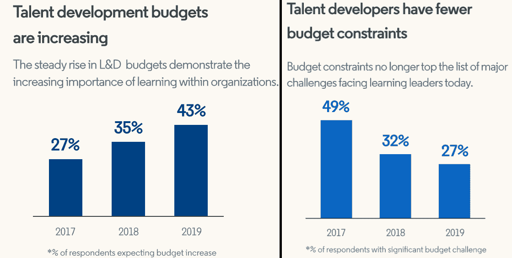
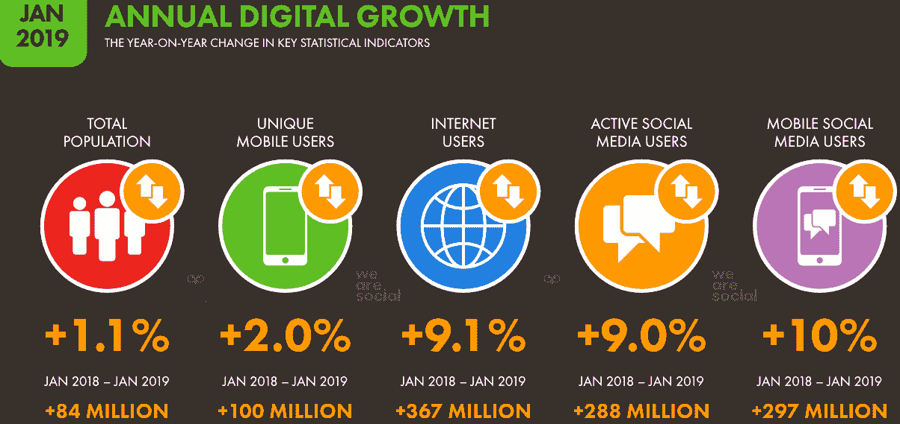
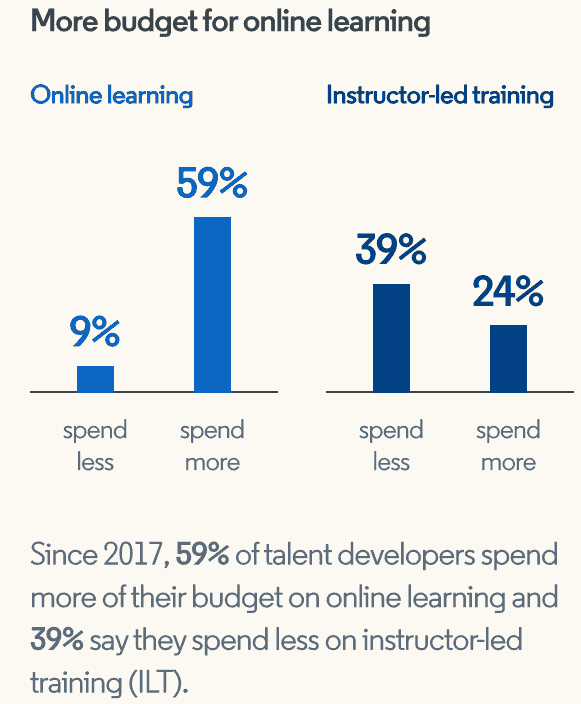

# 学习和发展如何变得更加敏捷

> 原文：<https://medium.com/hackernoon/how-learning-and-development-are-becoming-more-agile-97741a896072>

# 介绍

与最近几年相比，今天的学习和发展是什么样的？L & D 的新面貌是什么，它如何影响今天的学习？**敏捷学习和发展**是未来的新浪潮吗？

这些是今天的劳动力，教育工作者，培训师，人力资源部门，L&D 部门和行政人员正在问自己的一些问题。

世界各地的 L&D 部门在是否应该变得敏捷方面的选择越来越少。他们要么是被强迫进入 it，要么是因为我们共同生活的世界瞬息万变，他们自然而然地适应变得敏捷。

这个世界是由不断发展和改进的技术、行业、通信、市场、员工、劳动力、技能获取偏好等驱动的。在当今世界，企业和他们的 L&D 团队充分意识到，他们必须适应，变得更加敏捷，否则就会灭绝。

上述观点得到了以下事实的支持:研发预算[稳步上升，预算约束不再是当今学习型领导者面临的首要挑战](https://learning.linkedin.com/resources/workplace-learning-report)。此外，2019 年 LinkedIn 工作场所学习报告证实，82%的 L & D 专业人士表示，高管积极支持员工参与专业学习。

*图 1:* [*L & D 预算稳步增加*](https://learning.linkedin.com/resources/workplace-learning-report)

问题是，这些预算在 L&D 是如何使用的？答案是，变得更加敏捷。以下是 L&D 变得更加敏捷的不同方式。

# 1.移动学习

实际上，今天几乎每个工作的人都有一个移动设备。 [Hootsuite 的 Digital 2019 —全球数字概览报告](https://wearesocial.com/global-digital-report-2019)告诉我们，如今有 51.12 亿独立移动用户。这还不包括一些个人拥有的不同设备，包括一两台智能手机、平板电脑、笔记本电脑、智能电视、AR/VR 设备等等。重点是，员工将他们的设备带到办公室，而雇主通过采用 BYOD(自带设备)政策和策略来接受这种行为。

反过来，L&D 各部门正在利用 BYOD 现象，通过优化的平台为员工提供 24–7–365 全天候按需学习，以分发、评估和分析他们提供的学习内容。简而言之，L&D 正在适应当今移动用户的需求和行为。

# 2.社会学习/对等学习

随着全球独特移动用户的增加，活跃社交媒体用户和移动社交媒体用户的数量也在增加。

*图 2:* [*社交媒体用户的巨大增长*](https://wearesocial.com/global-digital-report-2019)

当然，并不是所有的社交媒体互动都是出于积极的原因。也就是说，越来越多的人，尤其是专业人士，开始相互寻求学习机会。2016 年，[哈佛商业评论](https://hbr.org/2016/10/how-learning-and-development-are-becoming-more-agile)称，在美国，700 亿美元明确用于点对点学习平台。这些平台用于实时通讯、视频聊天以及分享笔记和评论。

L&D 的各个部门没有在综合研讨会或教师指导的培训项目上花更多的钱，而是在敏捷的点对点学习平台上花更多的钱，以拥抱**敏捷学习文化**。

*图 3:* [*L & D 在面授培训上花费较少*](https://learning.linkedin.com/resources/workplace-learning-report)

今天的员工喜欢这种格式的 L&D，因为他们可以:

*   专注于他们想学的东西，更专注于完成任务，而不是围绕广泛主题的广泛研讨会
*   学习者可以选择最适合他们的格式，无论他们是在办公桌前还是在路上。例如，他们可以在旅途中选择播客或消息，在办公桌前选择演示或面对面通话。
*   如果他们愿意的话，可以一点一点地吸收信息
*   用这种方式学习对学习者和老师来说都便宜得多

# 3.人工智能和自动化系统

对于雇主和雇员来说，人工智能和自动化的增长和可及性无疑影响了**敏捷是如何影响学习的**。例如，学习和管理系统用于预测员工或学习者想要学习什么，以及他们想要学习的时间。这些见解不仅可以在一台设备上共享，还可以跨设备共享，这样学习者就可以放下一台设备，立即在另一台设备上找到他们离开的地方。例如，员工可以在办公室关闭电脑，然后在回家的路上继续在智能手机上学习。

此外，人工智能和自动化系统可以定制和个性化，使它们对学习者来说更加相关和灵活。

# 4.持续改进的需要

由于技术进步的不断发展，组织、培训者和学习者需要不断提高技能以保持相关性。因此，为了保持竞争力，需要最高效、最有效地提高技能。L&D 没有花费巨额预算雇佣熟练员工、广泛的培训项目和其他昂贵的资源，而是在敏捷培训上投入更多。这通常意味着内部持续学习计划或面向问题的学习。

# 包裹

组织，特别是 L&D 的部门和员工，比以往任何时候都更加拥护敏捷文化。改变的需要不仅仅是因为诸如成本、竞争、效率和有效性/生产率等实际原因，还因为诸如舒适性、便利性和灵活性等其他原因。因此，理解敏捷和其他可以提高生产力、个人成长和利润的方法在当今世界至关重要。如果你想学习更多关于 Scrum 和敏捷方法的知识，包括它们如何帮助你和你的组织，那么你当然应该考虑参加认证 ScrumMaster 培训。