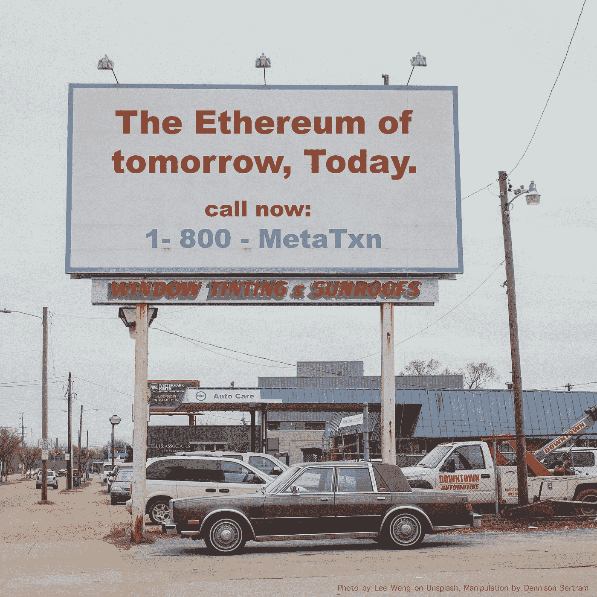
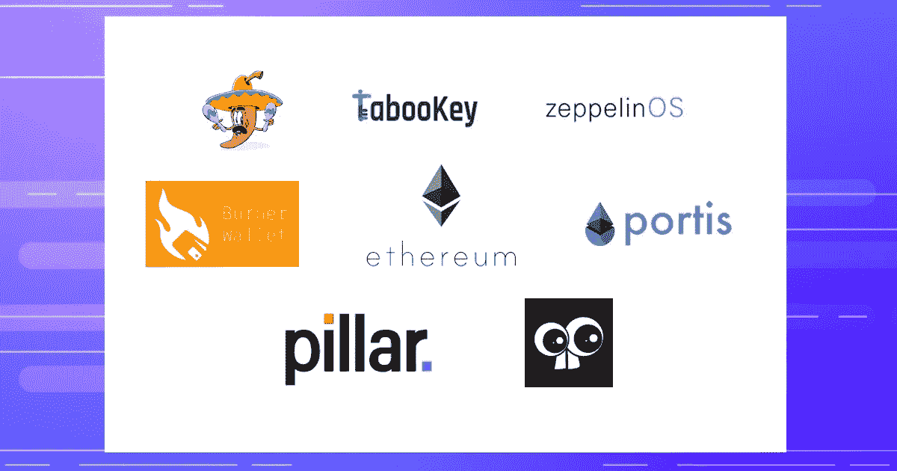
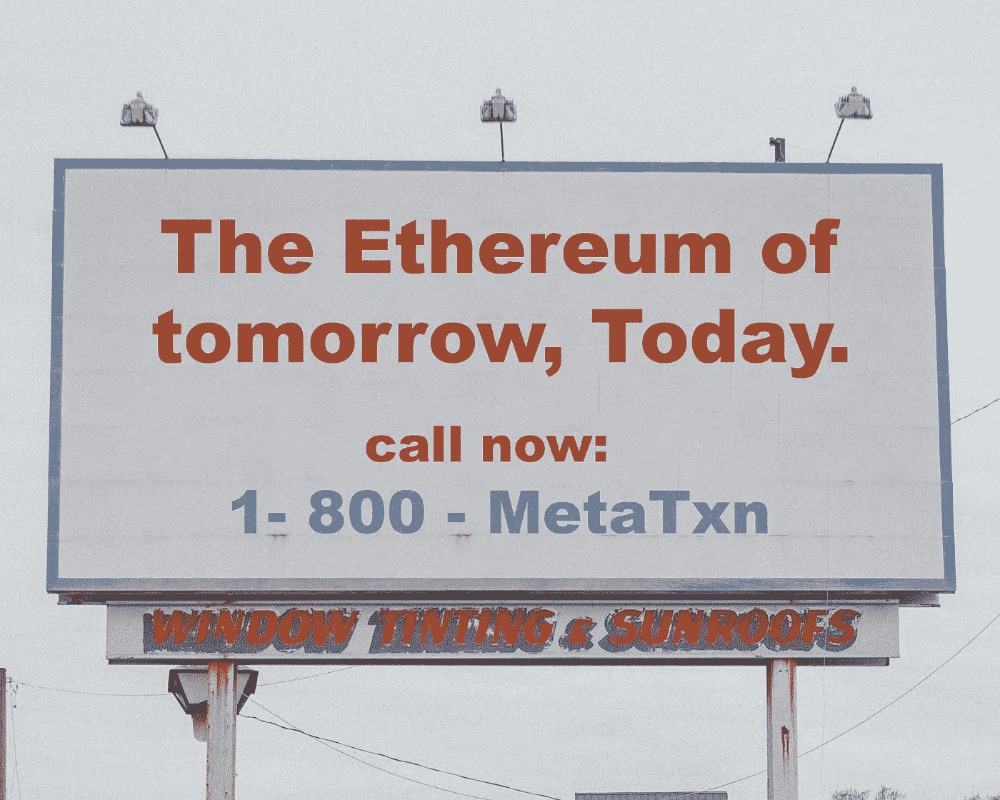

# 元交易将如何扩展以太坊。

> 原文：<https://medium.com/hackernoon/how-meta-transactions-will-scale-ethereum-e98c848f7719>

(或者，“明天的以太坊，今天的。”)

Photo by Lee Weng on Unsplash

至少可以说，当我第一次了解元交易时，我是持怀疑态度的。我正在了解以太坊是否真的可以扩展，是否真的可以升级到 2.0 版本，以及元交易是否看起来像是临时问题的临时解决方案。一个复杂的迂回方法来解决以太坊 1.0 架构中的一个基本缺陷:*气体。*确切地说，用户需要具备一些。

我承认，总体上我对以太坊持怀疑态度。等离子体的种类比他们需要的项目还要多。人们想把区块链建在区块链之上，这样用户就可以使用区块链了。看起来一团糟。在以太坊的活动中，我不是唯一一个持怀疑态度的人。正如一位开发人员在布拉格一个黑暗的地下酒吧喝酒时所说的那样:“甚至没有人能告诉我这是否行得通”。她有理由持批评态度:刚刚从风投那里为她在区块链的初创公司获得了一笔可观的投资——以太坊的未来看起来模糊得令人不安。

当然，我完全错了。

自从 DevCon 布拉格之后，我加入了 Zeppelin，开始了以太坊社区中最棒、最聪明、最实用的地方的旋风之旅。是 [Ramon Recuero](/@rrecuero) 把我带到了 [Austin Griffith 关于元交易的](/@austin_48503/ethereum-meta-transactions-90ccf0859e84)帖子上，但是是在 [ETHDenver](/gitcoin/burner-wallet-at-ethdenver-was-faa3851ea833) 上看到了[一次性钱包](https://twitter.com/austingriffith/status/1060926859116916737)以及它处理的几乎没有出现[停顿](/@austin_48503/demystifying-burner-wallet-hacks-ea7ed2c66ba4)的数千笔交易，让我走上了一条新的道路。这是以太坊 1.0 技术，结合了元交易和 xDai POA 网络。这个组合在 ETH2.0 之前的几年，在现实生活中，与真实的人(没有 ETH)实现了快速的免费资金转移。它并不完美。但它就在这里，我拿到了。

差不多了。

我真正需要的是阅读 Yoav Weiss 的媒介文章:[1–800-以太坊](/tabookey/1-800-ethereum-gas-stations-network-for-toll-free-transactions-4bbfc03a0a56)。

 [## 1–800-以太坊:免费交易的加油站网络

### "最伟大的胜利是不需要战斗的胜利."——孙子

medium.com](/tabookey/1-800-ethereum-gas-stations-network-for-toll-free-transactions-4bbfc03a0a56) 

Yoav 在文章的开头引用了孙子的一句话:*“最大的胜利是不需要战斗的胜利*”当我通读随后的[加油站网络 EIP](http://eips.ethereum.org/EIPS/eip-1613) 时，我开始明白他的意思。在 ETHCC 闭幕派对上，我和他喝了更多的酒，我看到了加油站网络真正简单的天才之处:如果我们可以证实有人要求我们做一些事情，并且他们可以让我们以一种无信任的方式去做，那么他们真的可以要求我们做任何事情。只要我们得到报酬，并且认为这是一笔好交易，我们就(可能)会去做。

在我看来，加油站网络的神奇之处在于，可以由 DApps 和开发者来决定他们信任哪些中继站来为他们做事。由于中继不能窃取资金，应用程序可以根据自己的要求，如费用、速度、可靠性等，自由选择它们

中继也可以是一种新的广义挖掘。元事务中继器足够轻，可以在 [Raspberry Pi Zero](https://www.raspberrypi.org/products/raspberry-pi-zero/) -一台 [$10 的计算机](https://www.adafruit.com/product/3400?gclid=Cj0KCQjw6IfoBRCiARIsAF6q06s-rlV8N2cW0vANY-smZNMDfW1ssFyK9ibSyLj_XK2W5eWCGm0GSK8aAmj_EALw_wcB)上高效运行，而不会耗尽计算资源。这意味着中继站有足够的计算(和可能的存储)空间来为用户完成其他任务。一般的元交易中继网络可以:

*   解决以太坊的登机问题
*   从 IPFS 钉和服务文件
*   [保护状态通道](https://hackernoon.com/sha-zam-b01cf9c7126a)并支持无限的链外扩展
*   支持 Vitalik Buterin 的以太坊“最小可行混合器”
*   同时在多个区块链上运行可以促进区块链之间的通信

事实上，如果中继器是用可插拔的架构构建的，那么人们对中继器的请求可能是没有限制的。他们的资金是安全的，在国家渠道的情况下，交易甚至可以无限速度地发生在链外。

这种解决方案的另一个优点是推理简单。我们用 web2.0(甚至 1.0！)解决区块链 2.0 及以上问题的技术。这项技术对于普通开发人员来说是容易理解的。它给你带来了 API 的便利和主网的安全性，以及构建任何你喜欢的东西的灵活性。Relayers 可以用任何编程语言实现，这使它成为几乎所有开发人员的一个方便的解决方案。

最棒的是这不是未来的蒸汽器皿。这是现在就存在的。三月份，我们宣布[与 TabooKey、MetaCartel、Austin Griffith、Portis、Pillar、thunderdog 等公司成立加油站网络联盟](https://blog.zeppelinos.org/gas-station-network-alliance/)。如果你在 xDai 上使用一次性钱包而不需要先持有 Eth:你一直在使用元交易。你可以从[标签 Github](https://github.com/tabookey/tabookey-gasless) 中的代码开始构建和测试。

 [## tabookey/tabookey-无气

### 在 GitHub 上创建一个帐户，为 tabookey/tabookey-gasless 开发做贡献。

github.com](https://github.com/tabookey/tabookey-gasless) 

就这样了。

我去寻找以太坊的未来，在我看来，我发现它已经在这里了。也许我们对华而不实的新技术、协议和共识机制过于兴奋，以至于忘记了我们已经拥有的技术是多么灵活。不要误解我，我会像任何人一样对 ETH 2.0 感到兴奋，但我不必等到它今天开始构建。也许没人知道。

我们今天已经拥有了明天扩展以太坊应用所需的技术。

—丹尼森

了解更多信息:

 [## 1–800-以太坊:免费交易的加油站网络

### "最伟大的胜利是不需要战斗的胜利."——孙子

medium.com](/tabookey/1-800-ethereum-gas-stations-network-for-toll-free-transactions-4bbfc03a0a56)  [## 加油站网络联盟:Zeppelin & TabooKey - ZeppelinOS 博客

### 加油站网络联盟:Zeppelin & TabooKey 年 3 月 4 日发布在过去的几年里，我们见证了如何…

blog.zeppelinos.org](https://blog.zeppelinos.org/gas-station-network-alliance/)  [## tabookey/tabookey-无气

### 在 GitHub 上创建一个帐户，为 tabookey/tabookey-gasless 开发做贡献。

github.com](https://github.com/tabookey/tabookey-gasless)  [## 齐柏林社区

### 一个供开发人员学习、讨论和探索围绕智能合约的设计模式和最佳实践的地方…

论坛.齐柏林.解决方案](https://forum.zeppelin.solutions) 

Photo by Lee Weng on Unsplash