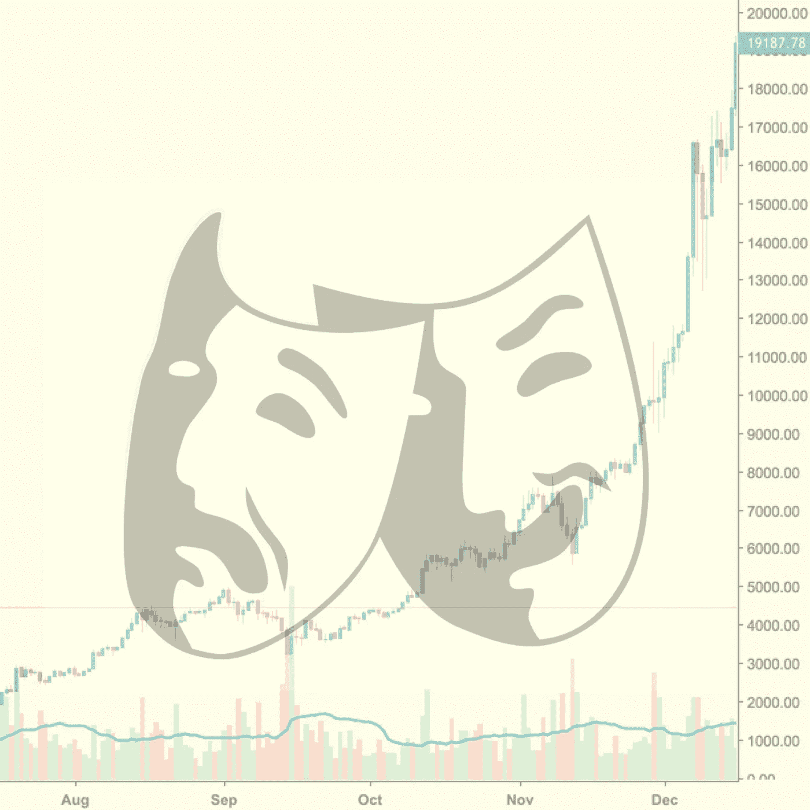

# 情绪如何影响你的交易

> 原文：<https://medium.com/hackernoon/how-mood-influences-your-trading-feb6ac556fcf>

马赛尔·普鲁斯特曾经说过:

> "天气的变化足以再造世界和我们自己."

但是如果普鲁斯特更进一步，他会说*心情*足以重建世界和我们自己。毕竟，我们的心情与外面的天气密切相关。

根据我们人类的经验，我们非常清楚情绪可以“再造世界和我们自己”，影响我们的思想、判断和感知。

例如，如果你心情不好，你的判断和决策就会更加悲观(Wright 和 Bower 1992)。

另一方面，如果你心情好，你会对自己的判断、选择以及对风险的感知更加乐观。例如，快乐的决策者对他们中彩票的概率更加乐观。

毕竟心情是根植于情绪的。

还有**情绪掩盖动机**。

从进化的角度来看，情绪和感觉是计算的高度理性的代理，它使我们更接近满足的目标，这可能有助于我们的生存。

像恐惧这样的情绪掩盖了一个隐藏的动机，去回避那些激发恐惧的事情；吸引力的感觉掩盖了为了把我们的基因传递给下一代而和另一半生育的动机。

在所有的非理性中，情感是一个理性、冷静、计算的过程。

情绪源于隐藏某些动机的情感和感觉。

如果你处于悲伤、焦虑或恐惧的情绪中，驱动你行为的动机会有所不同。

因为它们不同，所以它们都会以独特和隐蔽的方式影响你的交易。

有自知之明，知道情绪如何影响我们的交易决策，可以让我们看清一些最常见的交易错误的根源，以及我们可能在不知不觉中养成的任何坏的交易习惯。

如果我们能理解情绪如何影响我们的交易，我们就能更好地准备如何驾驭这些不同的情绪，而不会对我们的交易产生负面影响。

在这篇文章中，我们将探讨各种情绪，如悲伤、焦虑和恐惧，并讨论这些情绪如何影响我们的交易。

# 悲伤如何影响你的交易

认知科学家将悲伤定义为根植于奖励的丧失或缺失。

每当我们经历悲伤时，感觉就像“缺少了什么”

这通常是真的——例如，如果我们在某些事情上没有成功，如果我们经历了分手，或者我们失去了一件珍贵的东西，我们就会感到悲伤。

那么，悲伤的人倾向于如何减少他们的悲伤呢？

如果我们觉得“缺少了什么”，那么我们会积极地去填补空白。

也就是说，我们会积极地在其他地方寻找奖励。

一种表现方式是悲伤的人倾向于给自己买礼物(Mick & Demoss，1990)。

另一种方式是，悲伤的人倾向于帮助别人，因为我们在帮助别人时会体验到“感觉良好”的情绪(例如，Schaller & Cialdini，1990)。

换句话说，悲伤的人会寻找奖励来提升和修复他们的情绪。

悲伤的人只是在做决定时有不同的优先考虑。

换句话说，他们的动机仅仅是在情绪补偿中寻求即时满足，而不是通过做出在未来某个时间点带来长期切实利益的合理决策来延迟满足(利斯和鲍梅斯特，1996)。

这是如何转化为交易的，悲伤的交易者更有可能参与行为，并以修复情绪为唯一目的进行交易。

这可能是一条非常危险的道路。

悲伤的交易者更倾向于 FOMO 买入绿色蜡烛来获得快速回报。他们的投资决策更倾向于受媒体影响，相信耸人听闻的报道和炒作。

他们更有可能选择低概率交易设置，仅仅因为它们看起来更令人兴奋(即情感回报)。预期潜在的巨大收益本身就是一种愉快的体验，低概率交易最能提供这种体验。

低概率交易提供了巨大回报的虚幻承诺。随之而来的往往是更高的风险。人们倾向于接受巨大的风险，期望获得巨大的回报，所以悲伤的交易者更有可能寻找高风险的交易。

最后，悲伤的交易者在努力修复他们的情绪时，会因为品味潜在的收益而更倾向于推迟交易的解决。

能够打开你的加密投资组合跟踪应用程序，并看到你正在享受大量未实现的利润是有趣和有益的。这就是为什么人们往往倾向于通过不急于兑现这些利润来延长这种享受。

最终，根植于情绪补偿的交易行为会导致情绪决定。悲伤的交易者会偏向于选择高风险、高回报的交易，以及从事以回报为中心的交易行为，不管是好是坏(大多是坏)。

情绪交易是一个灾难的处方，这就是为什么理解你的情绪并质疑其背后的动机是重要的。

# 焦虑如何影响你的交易

焦虑怎么办？

如何理解焦虑，它如何影响你的交易？

认知科学家认为，焦虑源于(对具有潜在有害后果的事情的)高度不确定性(T2)和对局势缺乏控制(T5)的感知(T4)。

从根本上说，焦虑根源于不安全感。

焦虑的人应对这种情况的方式是希望变得更安全——他们的行为和选择会反映这种愿望。

因此，如果有人想减少焦虑，他们会通过减少不确定性和避免风险来实现。

这在交易中有哪些表现方式？

焦虑的交易者更有可能过早卖出，设置过紧的止损，选择利润潜力有限的非波动性选项，并由于强烈的风险厌恶而错过盈利机会。

研究发现，如果人们经历焦虑，他们倾向于选择低风险、低回报的选项。

他们想要低风险、高确定性的选择，而不是低风险、高回报。

焦虑的人根本不像悲伤的人那样看重高兴奋、高回报的交易。

事实上，兴奋和回报不是焦虑的交易者的主要关注点。焦虑的交易者主要关注的是更多的确定性和更少的风险。

毕竟伤心的人是想修复心情的；焦虑的人想通过减少刺激焦虑的事情来摆脱焦虑。

# 恐惧如何影响你的交易

研究表明，如果人们感到恐惧，他们会做出更悲观的风险评估，从而做出更多规避风险的选择(Lerner and Keltner，2000)。

这很容易转化为交易员和投资者的情绪。

你越恐惧，你的价格预测就越悲观，它们就越不现实，因为它们根植于情感。

你对价格的预测越情绪化，它们就越偏离实际价格。

这解释了**熊市狂热**——一种交易员和投资者对市场价格过度看跌的现象。也就是说，他们过分夸大了价格实际下降的程度。

过度恐惧的交易者会等待价格下跌，鉴于他们不切实际的悲观价格预期，他们经常会错过趋势反转，这将比他们预期的更快发生。

# 结论

你所需要做的只是改变你的情绪，来影响你如何看待风险，你做决定的动机是什么，以及你如何评估你的交易。

无论你是焦虑、恐惧、快乐还是悲伤，所有这些情绪都会对你的决策过程产生独特的影响。

换句话说，情绪会使决策偏向某些偏好。

悲伤的交易者会偏向于寻找高风险、高回报的交易来修复他们的情绪。

焦虑的交易者会偏向于低风险、低回报的交易，以尽量减少不确定性和对决策缺乏控制的感觉。

恐惧的交易者会夸大现实，在评估中变得更加悲观。

如果我们理解了情绪对我们交易的影响，我们可以发展更好的自我意识，这将帮助我们以一种有益于我们交易的方式驾驭这些不同的情绪。

附:如果你有兴趣了解更多关于加密货币市场和心理学的知识，请随时注册我的电子邮件简讯[**【rektcapital.co】**](https://rektcapital.co/)，并在 [**Twitter**](https://twitter.com/rektcapital) 上关注我。