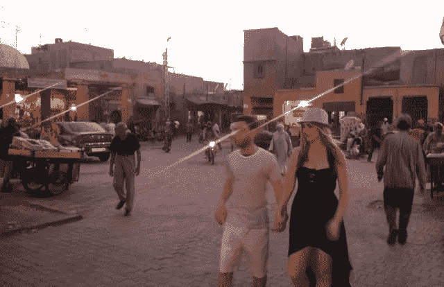
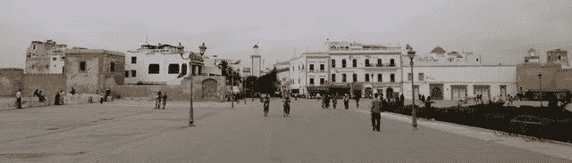
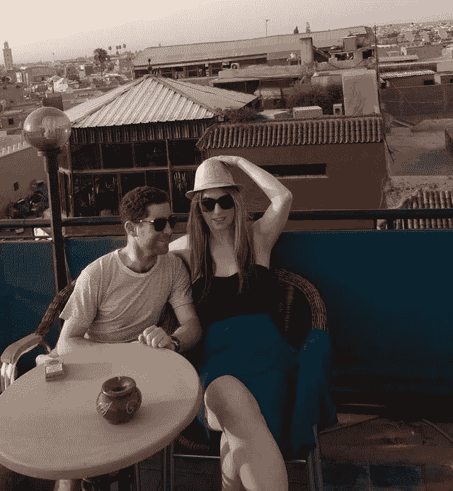
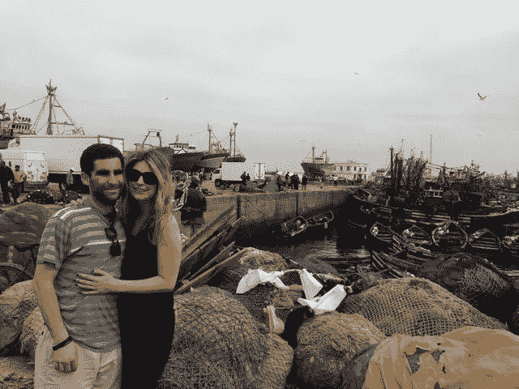
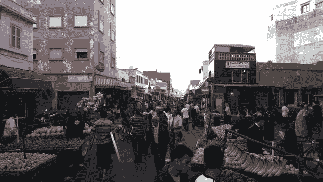
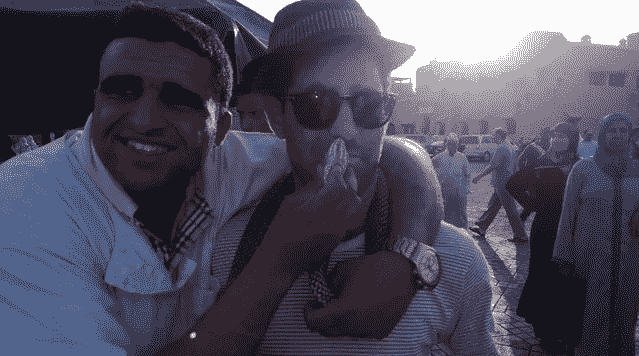

# 摩洛哥一只鸡多少比特币？

> 原文：<https://medium.com/hackernoon/how-much-bitcoin-for-a-chicken-in-morocco-5d7f2eda39e5>

骨瘦如柴的老人拖着脚步绕过大楼的拐角，走进了露天咖啡馆。他用两条像棍子一样的胳膊抱着一个浅的塑料洗衣盆。在房间的后面，柜台上有一个电子秤，电源线软绵绵地挂着，没有插上。他绕过桌子，砰的一声把篮子放在上面。

他熟练地抓住，拉出一只惊慌失措的小鸡。它骨瘦如柴，肮脏不堪，永远也不会在弗兰克·濮培德取得成功。鸟儿凄厉、痛苦的叫声烧灼着我们湿漉漉的大脑。我们疲惫不堪，宿醉未醒，在三个不同的城市参加了一个又一个疯狂的派对，通常都被打得屁滚尿流。

伦敦。马拉喀什。索维拉。

“那不是午饭吧？”我能听出我妻子声音中的厌恶。考特尼有着电影明星般的金发，一双让人沉醉的眼睛。她穿着一顶草帽和一件无袖衬衫。她尖叫着游客。

由于我的叙利亚血统，我很容易被认为是中东人。肤色黝黑。淡褐色的眼睛。不管我刮得多勤，我总是留着永久的胡茬。

"至少我们知道鸡肉是新鲜的。"

“我们不能吃那个。我们会生病的。”

“我们已经病了。”

我们四个人挤在一张摇摇晃晃的桌子周围，离马路只有几步远。我，考特尼，我们两个最亲密的朋友。那是七月。尽管大西洋吹来了凛冽的寒风，但我们咖啡馆的空气中弥漫着摩洛哥特有的死鱼、海鸥粪便、体味、汽车尾气，当然还有二手大麻的味道。是的，那味道令人作呕。但那天早上，在逛了几个小时的露天市场后，我们很高兴可以休息一下。

这个老人又小又弯，比我矮，鼻子像镰刀一样弯着。他的皮肤布满皱纹，让我想起了在阳光下变脆的烟叶。他戴着一顶短而圆的便帽。它因出汗而呈灰色，沾满了烹饪用的油脂，或许还有鸡内脏的后溅。

我们绕道去索维拉算是度假。它在马拉喀什以西两小时多一点的地方。距离西撒哈拉内战北部两小时路程。

俄罗斯媒体频道 rt 主持凯泽报道的马克斯凯泽带我们去了索霍区的格鲁乔俱乐部。那是你发现名流的地方。凯拉·莱特莉，克里斯汀·斯图尔特，选一个明星。喝着酒，马克斯告诉我们，在摩洛哥山羊会爬树。如果不是我们勇敢地驱车从马拉喀什前往海岸——沿途都是武装检查站——亲眼目睹，我永远也不会相信他。有时，一棵树有八个。

索维拉以一种脆弱的、第三世界的方式显得古雅。晚上，成群的渔民用他们的蓝色小船和沙丁鱼拖网渔船堵塞了港口。他们晚上出海，第二天早上回来交易他们的捕获物。对大多数游客来说，这个有围墙的城镇是主要的吸引人之处。对我来说不是。我去了嬉皮士之路，追随吉米·亨德里克斯和凯特·斯蒂文斯的脚步。

神圣的土地。

半岛电视台(Al Jazeera)轻快地穿过我们的咖啡馆，来到大街上，主播们描述着埃及阿拉伯之春的第二次革命。我是我们组里唯一会说阿拉伯语的人。但是我们都理解电视画面。2013 年 7 月 7 日，解放广场上有数千人，也许是数十万人，都在欢呼军方罢黜总统穆罕默德·穆尔西。

老人也停下来观看。他回头瞥了一眼后墙。他很满意，转身朝我们这边走去。一手拿着鸡。另一只手拿着屠刀。肮脏的刀刃上结满了血痂，大约有他前臂那么长。

我看着考特尼。她脸色苍白，双臂交叉得紧紧的，眼睛像盘子一样。老人低下头，拿起羽毛和脚之间裸露的地方，把鸟倒扣在手中。"迪克·杰耶达？"

他的话的意思是，“好鸡？”发音是 JA-YE-DAH。他请求允许为我们的午餐做这只鸟。

"穆姆塔兹"非常好。我点点头，笑着答应了。

他也笑了，因为会说阿拉伯语而松了一口气。多年的贫困损害了他的牙齿。

我突然想到了什么。我想到了这个好主意——一方面是为了让老人做得更好，另一方面是为了避免用当地货币迪拉姆支付的麻烦。

摩洛哥的 ATM 机排队让人痛苦。你永远站在酷热的沙漠中。然后机器没钱了。即使你耐心等待，找到一台轮到你时还有钱的机器，你也不能取出超过 4000 迪拉姆。大约是 440 美元。

信用卡也不是一个可靠的选择。在索维拉，商户收不收信用卡都是碰运气的事，因为 2.5%到 4%的手续费——支付给美国运通、Visa，通常的嫌疑人——对小经营者来说太贵了。

“你有手机吗？”

我知道答案。也许摩洛哥缺少像样的厕所，但每个人都有一部手机，每 100 个人就有 116 部手机。在美国，我们有 93 个。远远落后于巴拿马的 203 人、立陶宛的 167 人和伊朗的 130 人。发展中国家可能很穷。但它们是有联系的。

随着鸡的手，老人伸手抓住了他的刀。得意洋洋地用另一只手掏出一部廉价手机。

“英特斯·贝达克比特币？”我问。要不要比特币？

他迷惑地看着我。我的朋友们一句话也没说。他们被卡在鸟和屠刀上。我拿出我最先进的手机，感激它仍然存在。几天前，在马拉喀什的主要广场 Jemaa el-Fnaa，一个扒手试图偷走它，当时我正在和耍蛇人跳江南 style。那将是一场灾难。但我一拳打在他脸上，抢了回来。

我用食指导航到一段描述比特币的阿拉伯语视频。它是什么。去哪里买。为什么比特币是一种电子货币，也是一种支付方式，既省时又省钱。YouTube 为这位老人提供了解释。他仔细听着，对那只扭动着的鸡漠不关心。

视频结束时，他若有所思地看着我。他斟酌了一下措辞，他的沉默让我们很不舒服。他最后说:“恶。”

不是 yuk 里的 eww。“恶”是阿拉伯语中好的意思。他同意拿走我的比特币。

这是全球货币革命的又一次胜利，这位老人又一次皈依了我们的事业。比特币正在打破国家之间的边界。给中间商收取的费用带来压力。让普通人质疑银行的未来。

我想挥舞拳头，像解放广场的人们一样欢呼。将我所有的比特币朋友传送到这个地方，这个时刻，这个更好的做事方式的小胜利。我想给老人一个大大的拥抱。但是，当一个摩洛哥厨师拿着一把又长又吓人的刀时，那就不太明智了。相反，我问:“你的电话号码是多少？”

他一口气说完了。我当场给他发了比特币短信，加了一笔丰厚的小费，祈祷我们不要食物中毒。

平。

付款立即出现在他的液晶显示屏上。没有延误。没有政府强加的货币管制。没有中间人抽走我们的钱。用比特币支付餐费似乎是一件无关紧要的事情。但对我来说，这就是一切:两个家伙自由合作，点对点。摩洛哥城市里的一个穆斯林和一个犹太人为彼此的生活质量做出贡献。

事情会这么简单吗？

老人很高兴。我和我的朋友很开心。这只鸡是唯一的输家。但这是我吃过的最好的烤肉店。

