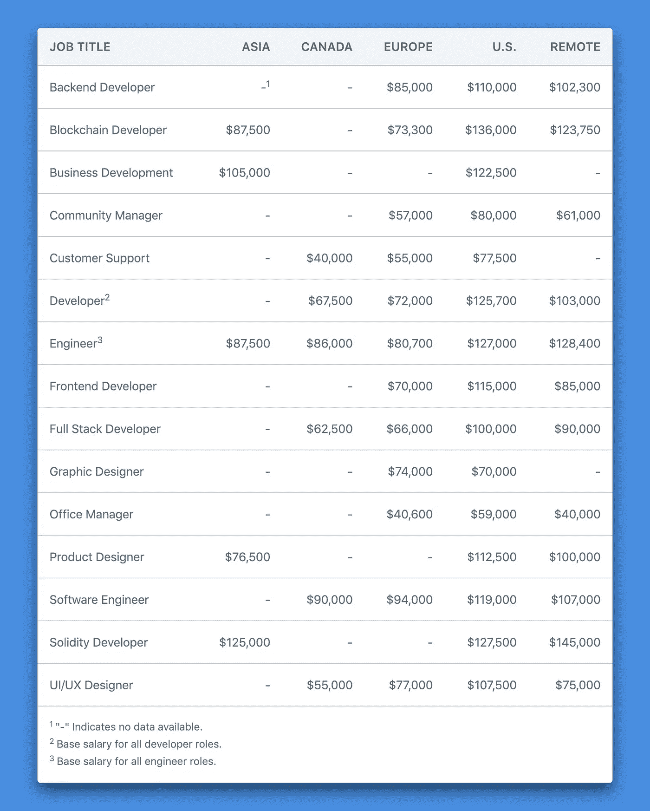

# 区块链工作工资多少？

> 原文：<https://medium.com/hackernoon/how-much-do-blockchain-jobs-pay-b03d3fe0e1ae>

## 区块链薪酬已经升至科技行业最高水平。

Photo by [Thought Catalog](https://unsplash.com/@thoughtcatalog) on [Unsplash](https://unsplash.com/)

对区块链人才的需求依然强劲。尽管经历了熊市和最近的行业裁员，但区块链的招聘数量一直在上升，对比特币、以太坊、区块链和加密货币等角色的搜索也在增加。

初创公司提供了最高的薪酬待遇，特别是对区块链的开发者来说，因为他们在一个供应有限的行业中争夺人才。对区块链人才的需求也在增长，因为亚马逊、脸书和 IBM 等老牌公司成立了新的团队来研究区块链技术，并探索区块链的用例。

区块链薪酬已经升至科技行业最高水平。

# 主要发现

我们查看了在[加密货币职位](https://cryptocurrencyjobs.co/)上列出的所有区块链职位，以估算区块链行业中横跨[亚洲](https://cryptocurrencyjobs.co/asia/)、[加拿大](https://cryptocurrencyjobs.co/canada/)、[欧洲](https://cryptocurrencyjobs.co/europe/)和[美国](https://cryptocurrencyjobs.co/us/)的技术和非技术职位的平均基本工资。我们为[远程](https://cryptocurrencyjobs.co/remote/)区块链工作创建了一个单独的类别。

我们排除了远低于或高于预期的工资数据点。所有平均基本工资均以美元列出。这些估计没有考虑可变薪酬，如股权、签约奖金或公司可能提供的任何额外津贴。

*Average base salaries for 15 different blockchain job titles by region*

数据还显示，纽约和旧金山的薪资最高。这也是大多数区块链工作岗位的所在地。

# 大图:区块链开发者工资

## 一个区块链开发商能挣多少钱？

*   在亚洲，区块链开发人员的平均底薪为每年 87，500 美元，低底薪为 6 万美元，高底薪为 12 万美元。
*   欧洲一个区块链开发者的平均底薪是**$ 73300**年薪，低底薪 55000 美金，高底薪 91000 美金。
*   美国区块链开发人员的平均底薪为每年 136，000 美元，低底薪 7 万美元，高底薪 20 万美元。
*   远程区块链开发人员的平均底薪为每年**123，750 美元**，底薪低的 7 万美元，高的 20 万美元。

点击[这里](https://cryptocurrencyjobs.co/salaries/)，你可以探索本文列出的所有职位的薪资范围。

# 区块链行业的透明度

我们提供了这些薪资估算，以帮助您了解自己的价值，从而做出更明智的职业决策。但这也是一项将透明度引入区块链行业的举措，有助于在工作场所实现薪酬平等。

用于估算平均基本工资的数据集是有限的，但这是对话的开始。如果你愿意贡献，你可以通过填写这张[表格](https://cryptocurrencyjobs.co/salaries/share-your-salary/)匿名分享你的薪水。

随着数据集的增长，将会添加更多的工作角色。薪资估算也将定期更新。

*这些薪金估计值是估计值，并以此形式呈现。由于数据集有限，请仅出于信息目的使用这些估计值。我们不保证这些估计的准确性。*