# 我的朋友是如何在仅做了 8 个月的编码后就在特斯拉获得实习机会的

> 原文：<https://medium.com/hackernoon/how-my-friend-got-an-internship-at-tesla-after-only-8-months-of-coding-6578c32f3e77>

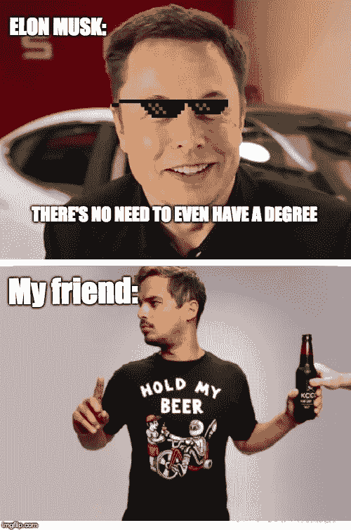

“嘿，你现在是埃隆最好的朋友了，嗯？”我问我的朋友，她已经在特斯拉实习了 3 个月。

“你没有想法。有几个小时，我的办公桌离埃隆的办公桌只有 5 米远。”

“他妈的不可能”我喊道。

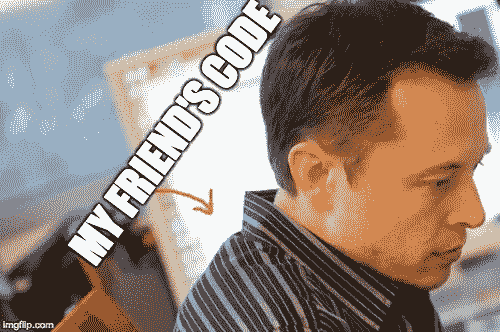

“这是真的。第一天，他们说‘这是你的桌子’。我真的吓坏了。我想如果埃隆愿意，他可以读我的代码。不过，我很快就设法换了桌子。”

“伙计，这太疯狂了。你还剩几个月？你大概是 9 月份开始的，对吗？”

“是啊，我大概还有 3 个月。”

“但你是如何在美国获得工作许可的呢？不是从旅游签证开始的吗？”

“说来话长。我试过了……”

请告诉我。我想知道这一切。

"[笑]真的吗？一切？”

然后他继续解释整个故事。

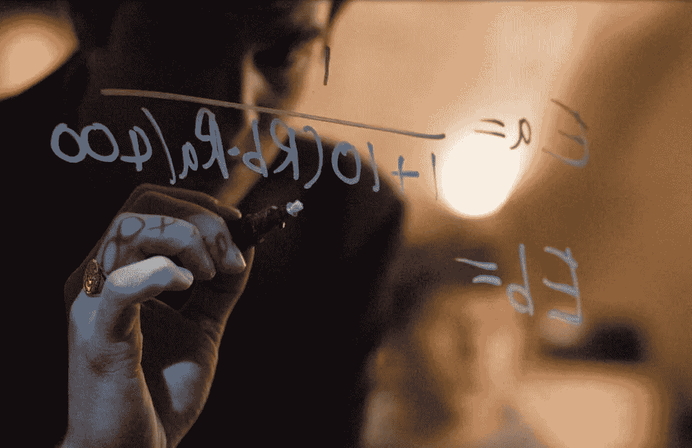

Eduardo Saverin writing the Elo rating system in “The Social Network”. Credits: Columbia pictures

# 星际舰队计划

“于是，2018 年 1 月，我乘坐这架飞机去了硅谷 42 号。我爸爸只能给我最少的钱来付房租(一个 Airbnb)。头几个月，我所有的钱都投入了这家 Airbnb。我几乎没剩下什么可吃的了。我一天会吃半个玉米卷，有时会吃意大利面。就是这样。”

“这是一些疯狂的狗屎，男人。事实上，这与[Airbnb 联合创始人](/@austincoleschafer/a-short-story-about-how-airbnb-funded-their-startup-with-cereal-boxes-ac6e62cf4c4c)甚至没有足够的钱支付租金的故事并不遥远。”我说。

“是啊，艰难时期。我太饿了**我不再给他妈的**。我会要求见星际舰队项目的负责人，问他‘我能加入你的项目吗’，但他每次都会拒绝。我只有 6 个月的旅游签证，但是星际舰队项目是一年的。在某个时候，他厌倦了说不，最终接受了。

“你是个十足的疯子。你从不放弃伙计。你他妈的疯了。”

当你身无分文、饥肠辘辘时，想要什么并不困难。我大老远从法国回来。我*需要*才能进入这个星际舰队项目。我渴望全天候的编码和一份硅谷的工作。”

“有道理。”

“然后，在我被这个星际舰队项目录取几个月后，我的一个非常了解管理团队的朋友问我是否可以有一间宿舍。他们很快看了我的项目，然后才接受。我想他们很快就明白了我是一个严肃的人。从这一点开始，我有更多的钱花在食物上，我可以把所有的时间都投入到编码上。”

The work environment at 42\. [Source](https://www.usnews.com/news/articles/2016-09-22/new-computer-coding-program-boasts-no-courses-or-professors)

“在这一点上，我们有大量的工作要做。我记得我不得不同时做`corewar`【一个通常需要一个月完成的 VM 项目】、`42sh`【最难的 shell 项目之一】和`PHP piscine`【两周紧张的 PHP 挑战】**。我们熬夜完成我们的项目。我们的传统之一是一个人会在早上 5 点为每个人买食物。这太疯狂了。”**

**“你不知道我有多嫉妒”我说。**

**“是啊，很艰难，但同时也很有趣。反正某个时候工作量*不堪*。就像，我们同时有 6 个项目。我记得我们必须编写`ft_p`[一个客户端和一个服务器通过 TCP/IP 网络传输文件]，`Hypertube`[一个视频流的 web 应用程序，通常需要 2 个月才能实现]，`Walking Marvin`[一个 AI 项目]和`Zappy`[一个服务器，一个图形界面，以及一个通过 TCP/IP 网络进行多人游戏的 AI 客户端]。这是 UNIX 分支的最后几个项目之一]。”**

**“那就像*客观上*不可能，对吧？”我真诚地问道。**

**“不是不可能，但确实很艰难。我找到的解决方案是只关注 Zappy 项目。主要问题是，从最初的小组成员开始，剩下的人只有我和一个波兰朋友。”**

**“我想，我也会这么做的。但是 Zappy 好像在 UNIX 项目图的末尾，对吗？没有做过所有以前的项目，一定很艰难。”**

**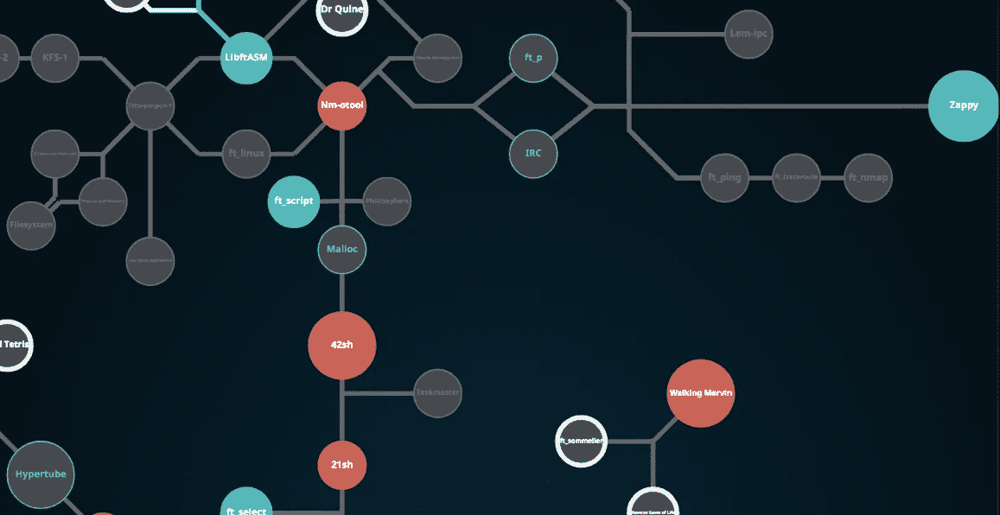**

**Screenshot of his “[holy [project] graph](https://www.42.us.org/program/the-42-program/)”. From left to right: **Hypertube** (end of web branch), **21sh** (shell/Unix), **ft_p/IRC**(Unix/DevOps), **Walking Marvin**(AI)**,** and on the far right the **Zappy** project (that he eventually validated!)**

**“算是吧。对于 Zappy，我们必须编写一个图形界面、一个服务器和一个客户端。最糟糕的部分是离开硅谷的最初团队成员的“死代码”。值得一提的是，在那一刻，我们只剩下两周半的时间来交付这个项目。于是，我对自己说:'**操，就这么干吧**'。我去和星际舰队项目的其他人交谈，问他们是否有空和我们一起工作。”**

**“这么多*你*。你告诉人们*你想要什么*和*你如何*想要它。你让每个人都相信你的项目，并最终管理了整个团队。”我微笑着告诉他。**

**“[笑]我想。于是，我去见了这个正在编写`Bomberman``C++`中的一个视频游戏项目】的家伙，问他是否想加入我们做图形界面。他就像‘哦，不，我不想让我的炸弹人伙伴失望’**我坚持**。我告诉他，在 Zappy 有很多很酷的新东西要学，而在硅谷 42 号没有人完成过这些。我们会是第一个。他说他需要时间，所以我告诉他我一天后会回来，看看他是否改变了主意。两小时后我回来了。他加入了这个团体。"**

**“操。你真是个爱出风头的男人。你真的不能把不当成答案！”**

**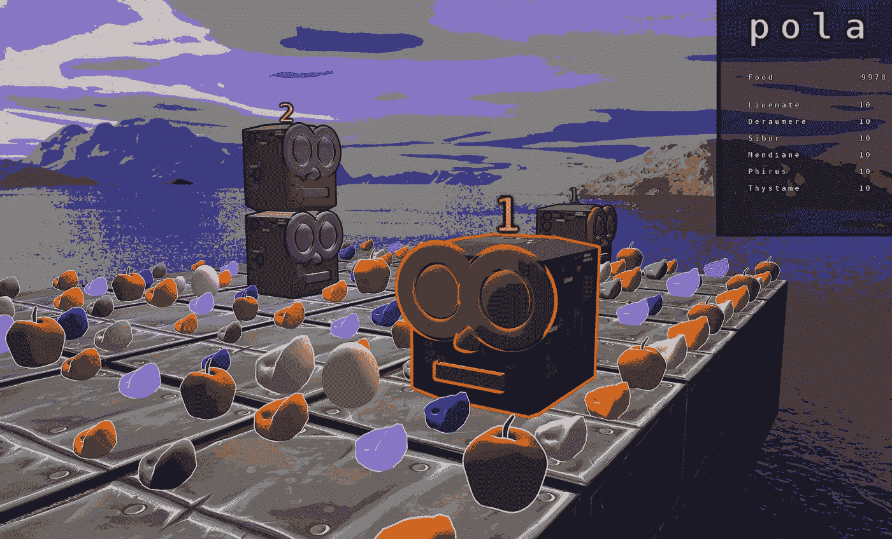**

**the final graphic interface, implemented by the Bomberman guy**

**“[笑]也许吧。总结一下情况，在截止日期前两周，我们有了一些图形界面的代码，一个做了一半的服务器，和一个工作客户端。我的波兰朋友试图连接不同的“死代码”部分，使服务器(最困难的组件)工作。就在那时，她开始对整件事感到有点沮丧，并决定休假一周。当她离开网络时，我试着调试她的代码，但是代码没有注释，含糊不清，不连贯。**

**“狗屎。发生这种事太可怕了。重写比从头开始要花更多的时间。”**

**“是啊，很艰难。当她度假回来时，我们进行了长时间的讨论。我说我要花很长时间才能破译她的密码。她很不安。当我睡觉的时候，我已经放弃了 Zappy。但是第二天早上，**神奇的事情发生了**:我的波兰朋友推送了一个漂亮的代码，实现了所有必要的功能，并考虑了我之前的所有反馈。**

**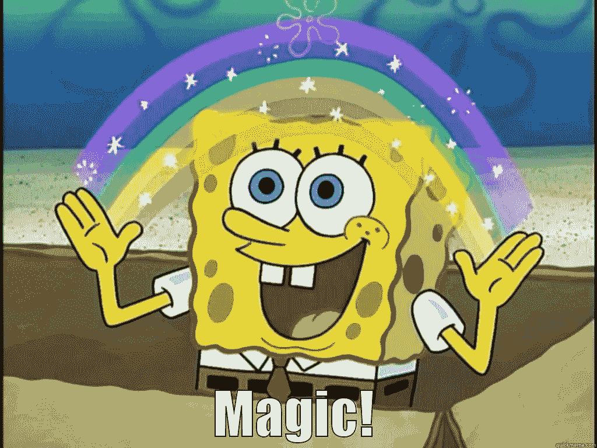**

**“我不相信你。”**

**“这太疯狂了，对吧？”他说“所以我们三个人连续几天熬夜，最终完成了这个不可能的项目。现在还挺好用的！”**

**“真是牛逼的男人。我希望我有这么神奇的故事可以讲。”我说。“但是整个特斯拉的事情呢？你最终是怎么得到面试机会的？”**

# **获得特斯拉的采访机会**

**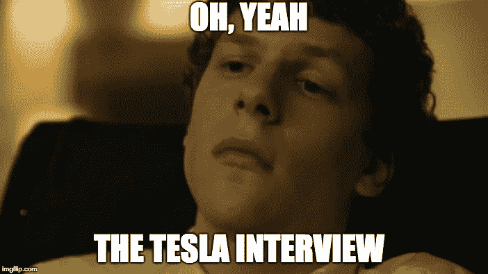**

**此时，我们已经谈论了大约一个小时他 42 岁时的那些令人敬畏的项目。现在，他终于要谈谈他是如何设法获得特斯拉的面试机会，以及他是如何获得实习机会的。**

**“整个 Zappy 的事情在 7 月份结束了，有了`C++ piscine`【面向对象程序设计的介绍；两周左右的小`C++`项目】。周日，是世界杯决赛，法国在打【我和我朋友都是法国人】。因为我住在免费宿舍，我有一些额外的钱。去巴黎的双程机票相当便宜，我真的很想家，所以我决定坐飞机回法国。**

**“不他妈的方式”我慢慢地说，哄堂大笑。**

**“[笑]我真的很想回家。我周六到的，看了决赛，然后植物人状态呆了大概一周。但是，我再也不能放松了。我*已经* 去码了。”**

**"所以你真的只在法国呆了一周？"我说。**

**“大概就是这样，是啊。当我从法国世界杯回来的时候，学校的主任找到了我。他打开笔记本电脑，告诉我:‘我有个朋友在特斯拉工作。我给他发了一封电子邮件，推荐你去实习。"**

**“你真幸运！”**

**“也许吧。我当时想‘是啊，你知道，除了‘鱼’(`C++`是实习计划的一部分，你会在下面看到)，我没做什么`C++`，所以我不确定现在是不是发送申请的最佳时机。“我们为什么不等几个月呢，”。但是主任已经打了他的电子邮件。他告诉我:‘哦，你在`C++`没怎么写过代码，是吧？你会学到的！，**然后按下“回车”，发送邮件，就在他的句子的末尾。他妈的 Kwame[导演的名字]！"****

**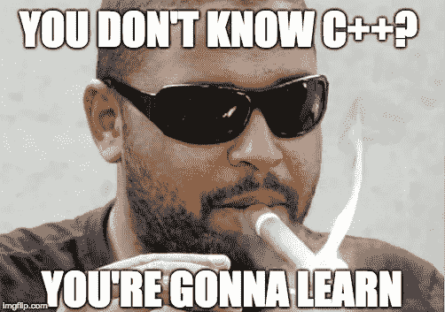**

**42 SV (past) director’s [twitter pic](https://twitter.com/kwame42)**

**“没门！然后你做了什么？”我困惑地说。**

**“我别无选择，只能再发一封邮件，附上我的简历和一封求职信。然后我说，如果他们想采访我，我随时都可以。”**

**“等等，你说知道自己需要几个月才能真正掌握`C++`？!"**

**“没错。我认为这是个错误。特斯拉的那个家伙只用了 20 秒钟就回答说:“当然，我们下周周三见”。那天是星期天。我不可能在四天内准备好。所以我向他解释说我需要更多的时间**来完成一个我还没有开始的项目。我们约定两周后进行采访。”****

**“那是*狂*狂**。那意味着你有足够的时间准备面试，是吗？虽然真的很难。我认为即使在两周内也不可能学到任何实质性的东西。”****

**“这就是为什么我更愿意专注于一个我可以展示给他们看的有趣项目，而不是学习。另外，主管告诉我，他们经常查看我们的项目，检查我们的代码。”**

**“有道理。那么，这最后一个项目是关于什么的？”**

# **最终项目**

****

**After having finished coding FaceMash, in “The Social Network”**

**“我想做一些与特斯拉相关的事情，”他回忆道，“所以我尝试了几十种不同的想法，但没有一个真正被说服。每天，我都会带着一个新问题去主任办公室。他会看着我的眼睛，告诉我:‘你的想法很糟糕，是吧？[成为你](https://28oa9i1t08037ue3m1l0i861-wpengine.netdna-ssl.com/wp-content/uploads/2018/04/shore-2.jpg)一定很糟糕在某个时候，我发现了一个让我信服的项目:**自动驾驶汽车交通模拟器**。"**

**“哼，是啊。我记得你跟我说过这个项目。”**

**“哦，对了，我们可能已经讨论过了。本质上，我不得不阅读大量的数学论文。我并不真的关心这些方程式，我只是想要一种方法来实现一个很酷的演示。我招募了炸弹人和我的两个好朋友(包括我的波兰朋友)，然后我们开始编码。我们非常努力地工作。我们只有大概一周的时间来编写整个程序。如果我没记错的话，我的一个最好的朋友是全职工作，所以我必须说服他下班后来 42(笑)。”**

**" Ace，这次你管理的是一个真正的项目团队！"**

**“算是吧。你知道，我压力太大了。但是，是的，当我回头看时，我真的为我们所取得的成就感到骄傲。”**

**“当然可以。那面试怎么样？”我好奇的问。**

# **面试**

**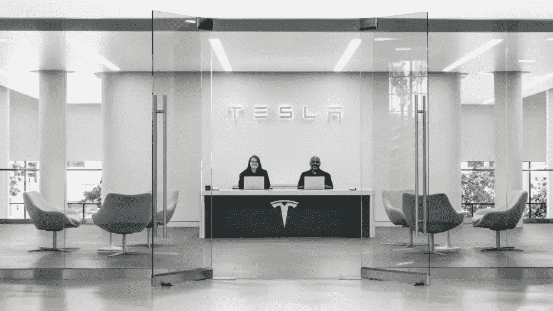**

**Courtesy of Tesla. [source](https://www.fastcompany.com/40521409/tesla-recruiter-shares-six-strategies-to-land-a-job-at-the-company)**

**“首先，我对那个人进行了一次电话采访。他告诉我电话会在上午 11 点。在上午 11 点至 11 点 45 分之间，我焦虑地看着我的手机，直到手机最终响起。这个人真的很好，他问了一些关于我个人生活的问题，我过去做过什么，我的项目等等。”**

**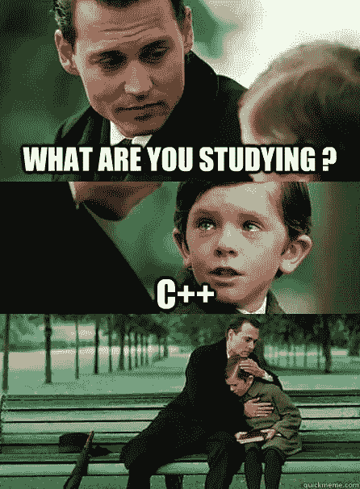**

**“然后，我亲自采访了和我通电话的那个人。我们中午见面，他请我吃午饭。吃午饭的时候，除了他下午要问我的问题，我什么都想不出来。我只有一周时间准备面试。我一直在做的就是完成那个自动驾驶汽车交通模拟器。连基本的 CS 二叉树题都没准备。我可能偷看了一本`C++`书，仅此而已。”**

**“那相当冒险。但是，我想，考虑到你的时间限制，你不可能准备得更多了，不是吗？”**

**“我想是的。吃完饭后，他把我介绍给了他团队中的一个人:“你说你喜欢数学，对吗？”这是我一个工程师。他拥有数学博士学位。你们两个应该好好相处，”然后我跟踪了这个博士。我们去了一个房间，那里的人正在结束他们的午餐。我们不能使用白板，所以博士开始马上问问题。"**

**“狗屎。那是你最害怕的，对吗？”**

**“肯定的。特别是因为在 42 岁时他们教你`C++98`标准，所以我完全没有准备。第一个问题是，比如，“你能定义什么是智能指针吗？”，这是一个现代的`C++`问题。"**

****

**“那你说什么？”**

**“我尽力回答这个问题，谈论编译是如何工作的，等等。对于我所有的回答，我总是以“**我不知道这个问题的答案是什么，但我会这样对待它**”我想他喜欢这样。"**

**“这表明你很谦虚，知道自己的极限，这很好。”**

**“也许吧。说着说着，他开始询问`undefined behavior`的例子。我不知道该回答什么。我，喜欢， *segfaulted* 【笑】。突然，我想起了我过去项目中的一个例子:“多线程时，如果你声明一个没有`volatile`关键字的变量，编译器可能会删除那个变量(我猜是出于优化的原因)，导致未定义的行为。”面试官回答:“好吧。”。你没有更简单的例子吗？。我最后举了一个**更低级**的例子，比如*无序执行*。"**

**”[笑]这也是*非常你*给这么复杂的答案。我猜这表明你有`C++`编程的经验，而不仅仅是背诵一本手册。接下来发生了什么？”**

**“是的，我想我有过一些*`C++`的经历。问完这些问题后，吃午饭的人都问完了。他开始使用白板，写了一个二叉查找树问题。这要容易得多，因为我们在大学时就已经做好了所有数学问题的口头准备，记得吗？”***

***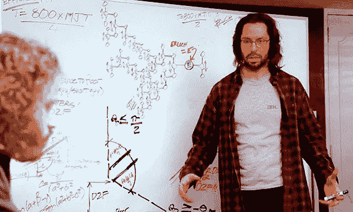***

***Image Credit: [Coding Interview University](https://github.com/jwasham/coding-interview-university) and [Silicon Valley](http://www.hbo.com/silicon-valley)***

***“最后，在我完成练习的那一刻，一些家伙让我们离开房间。我的面试官说的唯一一句话是“这似乎行得通”。所以我想我抓住了这个部分。整个面试加白板的过程大概花了一个小时。后来，工程经理回来了，他又采访了我一个小时。他问的都是很低级的关于编译的问题，因为他以前和负责`clang`什么的优化团队合作过。***

***“妈的，真厉害。”***

***“不管怎样，那就是我在那里所做的一切。之后，我再也没有回到特斯拉。嗯，在我实习之前没有。”***

***“有道理。但你不是也做了一些与黑客马拉松相关的事情吗？”***

***“哦，对了，*这个*黑客马拉松。简而言之，在我的特斯拉面试几周后，我和我 42 年的朋友们参加了一次漫长的黑客马拉松。我们赢得了这场比赛，所以我有机会与组织者之一交谈，他认识特斯拉的人，我甚至向他展示了我的自动驾驶汽车交通模拟器。”***

***“那很酷。”***

***“谢谢。最酷的部分是，显然，当他和特斯拉团队交谈时，他们就像是在说，“哦，是的，我们认识这个人，我们几周前见过他。”所以我想在这一刻我知道我的实习是安全的。"***

******

***“这太棒了，”我说，现在完全敬畏的家伙。“自从你来到硅谷，你所取得的一切都给我留下了深刻的印象。你给了我很大的鼓舞。所有这些对话让我想现在就去巴黎 42 号(当时是凌晨 2 点)，开始编码(笑)！”***

***“[笑]明白了。和你谈话也很愉快。我猜你真的不需要这个故事来保持动力，对吗？你自己已经在做一些疯狂的事情了，是不是？”***

***“对。但能和你说话还是一个巨大的推动。你介意我写一篇博客总结我们的谈话吗？”***

***“没问题。”***