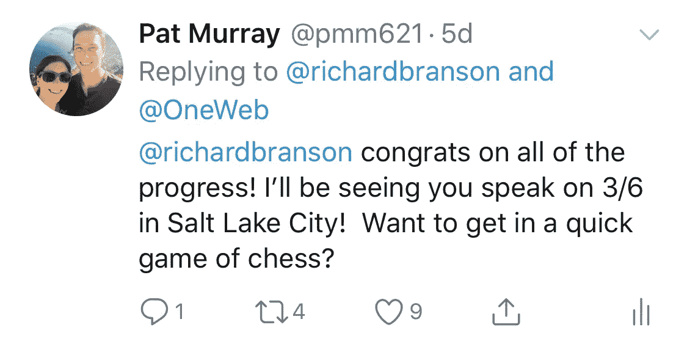
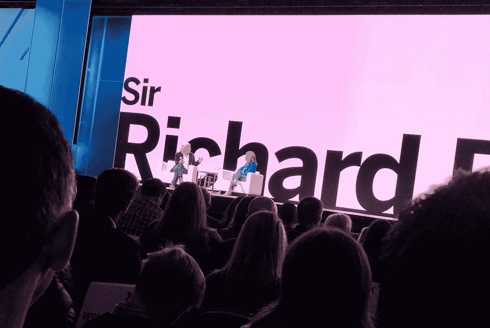
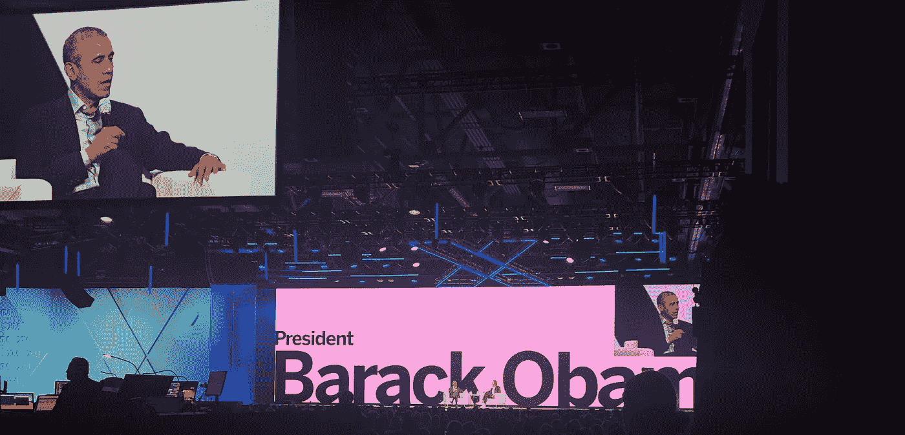

# 我是如何溜到后台去见巴拉克·奥巴马总统、理查德·布兰森爵士、奥普拉和阿什顿·库彻的——但是没有自拍

> 原文：<https://medium.com/hackernoon/how-my-life-changed-when-i-snuck-backstage-to-where-president-barack-obama-sir-richard-branson-8cec732bff7c>

## **我在 Qualtrics X4 会议上偷偷学到了什么**

上周，我偷偷溜到后台，去我的英雄们:巴拉克·奥巴马总统、理查德·布兰森和阿什顿·库彻都在 Qualtrics X4 闲逛的地方，学到了很多东西。

当我女儿在 2018 年 8 月出生时，我的生活发生了变化。从那些每天忙碌 12 个小时的企业家之一，我的优先事项很快从商业和我自己的目标转移到陪在我女儿身边，给她爱。

突然之间，陪产假和面对面的交流变得无比珍贵，成为一个亲力亲为的父亲——我相信——永远改变了我的神经结构，让我对这个世界有了更多的爱。

当我回去工作时，我注意到自己的个人产量略有下降，我认为这已经影响到了我们公司。我可能发挥了正常水平的 70%,我们公司的数据也显示了这一点。

但奇怪的是，我对此出乎意料地接受——我仍然想在数字上努力，让它们比去年增加至少 100%,但我生活中最重要的事情现在是我的妻子和女儿。当他们需要的时候，我想给他们全心全意的关注。

# **爸爸的大脑**

你可以说父亲的身份对你产生了影响，或者更准确地说，改变了你。

几周前，当我和妻子进行睡眠训练时，我的生活“再次”永远地改变了，我女儿开始整夜睡觉。

当我打这封信的时候，我可以想象世界上所有的父亲都松了一口气，

“理智来了！”

(我向兴高采烈地走在街上、被我拥抱或指指点点的陌生人道歉——那很可能是我的爸爸接管了我的大脑。再次打起瞌睡的感觉真好！)

因此，有了新发现的睡眠，我的生活教练给了我新的灵感，让我开始在工作和个人生活中寻找新的创造。我爱我的生活教练。我们每月都见面(当我在网上的时候),他通过问一些非常好的问题和倾听，确切地知道我的生活中缺少什么。谢谢[丹尼尔晴](https://apaththatfits.com/daniel-fine/)！

# **质量 X4**

作为一个成年人，我对见到许多名人，或看到乐队演奏和“与乐队见面”并不感到兴奋。

但是，在我的生活中有一些我认为真正“明白”的全明星球员。这些人对我的影响如此之大，如此深刻，以至于我只想感谢他们，与他们交流，可能的话，在这个星球上分享几分钟，让我们的灵魂交流一分钟。

理查德·布兰森、[巴拉克·奥巴马](https://twitter.com/BarackObama)、[阿什顿·库彻](https://twitter.com/aplusk)和[奥普拉](https://twitter.com/Oprah)都是我名单上的全明星人物。

他们身上的某些东西让人感觉如此真实——无论是他们做生意的方式、他们的生活，还是仅仅是他们思考的方式，但最令人印象深刻的是他们都是如何回馈社会的。

理查德·布兰森名列榜首。理查德成为我最大的榜样是因为他能够抚养两个令人钦佩的孩子，他们现在正在抚养他们自己的孩子，我相信这些孩子是令人钦佩的，并准备好让世界变得更好。

他的两个孩子，山姆和荷莉，是如此的朴实无华和谦逊，就像他们的父亲和祖母一样，只想做对世界有益的事情。山姆开始了为期三个月的狗拉雪橇远征北极，以提高对气候变化的认识，而霍利爬上了勃朗峰，发起了大变革。他们都致力于[奋斗挑战](https://www.strivechallenge.org/)，虽然霍莉在[维珍联合](https://www.virgin.com/unite/)中扮演积极的角色，但山姆是 [Sundog Pictures](http://sundogpictures.co.uk/) 的创始人，我相信，他们正在讲述相关的和急需的故事。

如果你回顾过去，你还会注意到理查德非凡的父母和他 95 岁高龄的母亲伊芙 T20。

Eve 通过 Eve Branson 基金会丰富摩洛哥人民的生活，向年轻妇女提供技能培训和教育。这是怎么发生的？在理查德开始他的热气球之旅之前，她正在访问摩洛哥，并爱上了那里的文化和人民，现在她回报了这个地区。看到一个趋势？

那么，为什么这使理查德在我的名单上排名第一呢？我没有不尊重其他人的意思——我肯定他们都把家庭放在第一位，但是当我读了许多企业家传奇人物的创业书籍时，他们似乎总是在他们的人生道路上忘记了他们的孩子。

顺便说一句，我自己来自一个大家庭，知道父母能带来什么礼物，我决定不结婚也不要孩子。我会省去他们的麻烦，直接开始做生意。

但是当我读理查德的[自传](https://www.amazon.com/Losing-My-Virginity-Survived-Business/dp/0307720748)(他最近写了一个[第二个](https://www.amazon.com/Finding-My-Virginity-New-Autobiography/dp/0735219427)！)，我非常欣慰地得知有人通过创业改变了世界，同时向他的孩子播撒了爱、同情和动力(当然是在他妻子的帮助下)。

所以当我听说这四位全明星今年都要在 Qualtrics X4 演讲时，我不得不去。再次快速补充一下:[Qualtrics](https://www.qualtrics.com/)的创始人瑞安·史密斯是合法的，真实的。我目睹了他是如何关心和与他的员工一起工作的，我想这不是偶然的，一个如此有道德、有社会意识的全明星小组在那一刻都在场。

瑞安，如果你读到这封信，你可以恨我，或者起诉我，或者两者兼而有之..)

所以，在我妻子在家进行睡眠训练的时候，我只能花一天的时间参加这个会议，因为在我们刚刚开始睡眠训练的时候，离开她两个晚上，我会感到很内疚。

幸运的是，4 个演讲者中有 3 个在同一天发言(奥普拉被安排在第二天发言)。我的目标不仅是重新获得灵感，成为一名新的企业家，还能见到理查德·布兰森，享受一些上述的心灵时光。

但是，怎样才能见到理查德呢？我妻子的朋友的儿子的最好的朋友的爸爸是理查德布兰森最好的朋友！*是*！

但是，向所有这些人寻求帮助，感觉太卑鄙了。

所以我等着理查德发微博，然后在盐湖城向他挑战下棋。当其他方法都不管用的时候，听听戴尔·卡内基的建议——发起挑战吧！

Richard Branson Meet- Fail #1

在这之后，我推广了这条推文，试图获得一些爱，并给我的榜样施加一些社会压力(我知道，这是一个获得一些心灵触摸时间的好策略——别担心，情况会变得更糟)。这条推文获得了一些喜爱，但没有得到回应，可能是因为我绝望的消息与其他布兰森粉丝相比没有那么令人信服。

我深深地陷入其中，努力祈祷和冥想，想出解决这个问题的最好方法。接下来我想到的是，我只需要至少出现，尽我所能坚持下去。

成交。我会作为第一个排队的人出现，布兰森会看到我很投入，我不知道，这会成功的。我知道，多么愚蠢。所以我在早上 7 点准时到达会场，令我惊讶的是，很多人也是如此。

说到排队，这个东西已经排到走廊尽头了，大概有 500 人左右已经在排队了。我和站在队伍前面的人交谈，两个教授来自犹他大学，或者我后来发现的，应该叫做犹他大学。他们去年去参加会议，发现门实际上在早上 5:30 到 6:00 左右是开着的，所以他们在外面等着。Qualtrics 的首席执行官瑞安·史密斯(Ryan Smith)让他们进去，他们立即排起了队。

我去拿了一些咖啡因，头脑风暴如何才能作为第一批 100 名与会者中的至少一员进入会场。

我无法切断这条线，但也许有一条不同的路可以进入房间？

我发现离入口更远的地方有一扇门，为了不冒险让它开着，让我早点进去，我会试着在大约 10 个人进去后打开它。

在等待上午 8 点的时候，我和许多其他营销人员成了朋友，发现人群中充满了真正的骗子，人们只是渴望了解和看到这些演讲者。队伍终于开始了，现在像一条 3000 人的毛毛虫一样缠绕着整个会议中心，我走向门口！

失败。

它是锁着的，旁边的那个也是。现在，我可能不是 500 名，而是 3500 名。所以我在门边等了一段时间，直到有人可能会离开，给自己 30 分钟的限制，否则我就排队，早上第二次被打败。

还有 5 分钟，门开了！我向它走去，它很快又关上了。我走近了，到了时限，门又开了！我礼貌地为离开房间的两位女士拿着它，走了进去！我可能是大厅里的第 700 名——一个失败者——但是我会尽我所能。

我走到前面，注意到舞台周围有整整 5 排座位被预订了。什么！所以现在，除非我能坐在这些座位中的一个，否则我至少得坐在第 6 排，这对我和 r .布兰森来说太远了，无法增进感情。

当我在保留区蹑手蹑脚地寻找我的“U”教授们太久了，我注意到另一个我在茶座旁结识的家伙，詹姆斯。我问他最想见到谁。他回答奥巴马。

我告诉他我的故事，让他知道我愿意花 200 美元坐在理查德·布兰森的座位上。他说他感觉不好，但我坚持。他说他愿意出 100 美元。所以我给了他我所有的 60 美元现金，并承诺当天晚些时候从自动取款机里取出剩下的钱。

# 理查德·布兰森爵士

Getting Closer to Sir Richard

因此，当时间到了，我离开了我的座位后面的一根柱子，走上前去，坐在一排。詹姆斯看了我一眼，做了个眼神交流，然后离开了座位，临走时给了我一拳。我的人！

然后它发生了，突然，我一生的榜样从舞台后面走出来，跳着一个愚蠢的小舞。在多次采访中，我听到理查德提到他不太喜欢公开演讲，更愿意以采访的方式说话，这正是他的感受。你可以看出他有一点紧张，但是在他的第一个故事之后，他完全放松了，并且准备好去找点乐子了！也许他会看着我，我想！

理查德进入了他在世界各地的多个项目，涵盖了他最喜欢的一些，长老，维珍联合，维珍银河以及他的其他空间和轨道公司。

我希望您会发现一些有用的注释:

在维珍，理查德说他们让所有员工画一个圈。这个圈是给他们的。他们应该始终确保自己照顾好自己、自己的健康和幸福。维珍公司身体力行，给公司大多数员工提供无限带薪假期。画完这个圆圈后，他们可以为家人画一个。然后是他们的朋友，其他家人，邻居。从这里，他们的社区，等等。

我觉得这很感人。我经常发现自己在看着我的女儿或和我的妻子说话，甚至思考世界上的大问题，但我一天都没有吃午饭，也没有在早上冥想或锻炼。

我完全同意维珍航空公司的做法，首先要确保我们照顾好自己，这样我们满满的一杯酒才能传递给别人。我也喜欢他慢慢摊开的样子。我发现在社区项目之前先照顾好我的家庭是非常重要的。一旦我能做到这一点，那么我将更有能力帮助社区项目(我正在努力这样做，见 [firebusters.tech](http://firebusters.tech) )。

当理查德被问及是什么造就了像他和他妻子琼那样持久的关系时，他回答道:

> “记住你的伴侣永远是对的，但也要记得获得一些独处的时间。我发现情侣们会变得太粘人，给自己放一两周假也不错。”

当被问及他的团队时，Richard 提到他试图将一切都交给他的团队，并鼓励所有维珍品牌都这样做。“如果有人正在建造一艘火箭飞船，他们需要一顿犹太午餐，我们需要确保给他们一顿犹太午餐。”

他也喜欢内部提拔，给第二次机会。不仅仅是他的员工犯了错，还有重罪犯。维珍和布兰森致力于雇佣前重罪犯，并发现一旦有机会，他们不会再犯。

> 布兰森还提到，营销或致力于客户体验的最佳方式很简单，“建立一个人们想谈论的品牌。”

当一些视频播放时，我试图引起理查德的注意。当他离开时，我和其他人一起拍手，慢慢地发现自己回到了一根柱子后面的座位上。现在做什么才能看到我的榜样？

# **阿什顿·库彻**

在我想太多之前，阿什顿·库彻出来了，看起来很兴奋。

后来当我在后台的时候，我发现他正在和奥巴马夫妇说话(是的，米歇尔也在城里！)我认为他们真的激发了他的某些东西。我还了解到这不是阿什顿计划的演讲。

所以 AK 出来了，慢慢呼吸，你可以看出他已经完全准备好了。他想进行一些“真正的谈话”。每个人都站起来，他说。

他继续告诉我们，他现在是完整的自己，是的，他是福布斯最鼓舞人心的人之一，但他年轻时也因三级盗窃入狱。是的，他不仅仅是一个模特或好莱坞演员，他正在打击性交易，并为虐待儿童的幸存者辩护。

他一遍又一遍地说:“醒醒吧，认清你自己。”。让我们真实地面对过去的自己，原谅彼此，在这里做完整的自己。

我不得不称赞阿什顿是当今最真实的演讲者。他没有留下任何东西，绝对是真实的。

阿什顿接着谈到了他糟糕的成长经历，以及他对我们的现状和未来有多么恐惧。

> “90%的财富掌握在 10%的人手中，”他提到，“而且情况没有好转。”

他接着说，他认为这种差距只会扩大，因为超级富豪能够利用人工智能和生物黑客技术来改善自己和他们的公司，从而带来更多的鸿沟。

他眼中含着泪水，提到了他对穷孩子的担忧，这些孩子将无法跟上那些能够利用生物黑客和人工智能来获得优势的“富家子弟”。

我个人是和 6 个兄弟姐妹一起长大的，我爸爸朝九晚五地在公司工作，而我妈妈看着我们。有一段时间，我们的假期是开一个小时的车，挤在一家假日酒店里。所以我有这种恐惧，也很感激阿什顿如此热情地要求我们所有人“醒来”，并敦促我们采取行动解决这些问题。

虽然我对我们的未来没有同样的恐惧。我认为生物黑客、人工智能和其他技术对社会的未来有着巨大的影响，但我也知道总会有像理查德·布兰森、阿什顿·库彻和巴拉克·奥巴马这样的超级富豪在问题出现时出来解决问题。我还知道，还有其他一些企业家会在问题出现时积极帮助解决问题。

我将通过说他自己并不 100%确定他已经在生活中有了完全的突破来结束阿什顿的笔记，但是他知道它们何时到来。

> “当某件事让你如此渴望，以至于你感觉到它在你的胃里，你突然需要采取行动时，突破就发生了。”

他提到，当你思考并试图解决实际问题时，这种情况就会出现。

# **巴拉克·欧巴马**

No Drama Obama Dropping Truth

毫无疑问，当美国第 44 任总统宣布的时候，大多数出席者都在现场观看。

巴拉克·奥巴马镇定自若地走出来，向人群挥手致意。仍然是前总统，但现在更加放松、冷静和自信。

巴拉克直接进入了知识、笑话和参与的金块。当被问及他是如何处理如此艰难的决定时，他给出了一些很好的见解。

他提到，作为一名总统，面对艰难的决定，大多数时候并没有对错之分。有时候是 51%对，有时候是 55%。他说，你需要考虑所有真实的事实和可能性，并在此基础上做出决定。他还提到让你周围的人不仅仅是和你意见一致的人。他还多次提到，要和比你聪明的人在一起。

他在多篇报道中进一步探讨了“雇佣专家”这一主题，但最突出的一篇是在英国石油公司石油危机发生时。

随着危机的展开，他感到很糟糕，他们无法解决问题，更糟糕的是，他的女儿们说，“爸爸，你不能解决这个问题吗？鹈鹕正在死去……”这让他感觉更糟。

他说这是你的专家发光的时刻。

他的能源部长朱棣文是一位诺贝尔奖得主和物理专家。几天后，朱博士拿着一个看起来像餐巾的东西走进奥巴马的办公室，并提到这个帽子类型的物体很可能会阻止泄漏，最终它做到了。

奥巴马谦逊而真诚地提到，他非常感激在他的总统任期内聘请了这么多专家来帮忙。并继续给出了更多的例子。

他还将自己优秀的团队归功于他早期使用的一个主题。他会向每一个甚至加入他的参议员竞选的人提到，他们需要为了共同的使命而存在，这不是关于他或他们——这是关于使命。他发现，他和他的团队以此作为他们的北极星，让他们能够剔除自私的自我推销者类型。

当被问及他认为什么时候治理国家最好时，他还提到，在他的第二个任期内，他的自负消失了。他提到不必担心支持率排名，只需担心出现的问题，并真正做正确的事情。他说，他对自己也更有信心，并意识到如果他犯了错误，他和他的团队可以很快修复它。

这使我深受感动。

如果我反思得足够多，我可以发现我在业务中做的很多事情可能更多地是出于我个人的自负，而不是为了公司的利益，或者是我之前设定的一些奇怪的目标。

只有当我抑制住自我时，我才能创造出最好的解决方案。

作为一名企业家，我一直是自由党和低税收的支持者。

当我在机场工作时，我对我们的政府感到非常沮丧，因为他们跑得太慢，害怕把每个人都搞得一团糟。当奥巴马提到白宫西翼的工作效率时，他让我感觉好多了。

此外，关于税收，他做了一个深刻的声明:

> “税收为文明国家买单。”

我再说一遍，“税收为文明国家买单。”

他继续详细解释说，每个人都需要一个饮水池，狮子，长颈鹿，斑马。自由意志论者会推测，人们因为不用交那么多税而省下的钱可以捐给对他们来说意义重大的慈善事业。

从奥巴马保持“文明国家”的声明来看，一切都水到渠成了。

作为一名新父亲，我可以用一些政府资金休带薪陪产假，这些资金是我作为加州雇员支付的。想象一下，我们州有多少新爸爸也利用这一套餐与他们的新生儿共度有偿时光？

他们也很可能非常感激能够和他们的孩子在一起的亲密接触和肌肤相亲的时间。这导致单亲家庭的减少，进而导致青少年犯罪的减少。

我们中有多少人真的有远见投资带薪陪产假？不是我，但有了这些统计数据，在成为一名父亲后，我真正看到了这是如何帮助保持一个“文明的国家”。

有多少其他政府资助的项目也在做同样的事情？我会争论很多。我还认为，政府的立场有助于填补水坑。

奥巴马还提到了他在总统任期内是如何保持过滤器的，以及他今天是如何保持过滤器的。他不看社交媒体上的评论，不看有线电视，也从不听媒体。

如果他得到了好的报道，这可能是一种虚假的安全感，会冲昏他的头脑。

如果是负面新闻，会让他感觉不好。

相反，他从周围的人那里寻求反馈，并从他们那里获得他需要的事实。在我看来，这是一种明智的方式，可以抓住真正重要的东西，而不会被片面的报道分散注意力。我认为我们的现任总统可以从中吸取教训。

问奥巴马的最后一个问题是，他希望我们记住他的什么。整个谈话过程中，奥巴马谦虚地提到他去过这个国家的很多地方，见过很多人。他想让我们带走的不是他想被记住的东西，而是别的东西，更需要的东西。

> “对于我们国家面临的所有问题和分歧，我们的共同点更多，”他说。

这就是他想让我们带走的东西。

让我重复一遍，“尽管我们的国家面临着所有的问题和分歧，但我们的共同点更多。”

# 我的生活如何再次改变

我们都是人。

在表面之下，我们其实都互相关心。

令人难过的是，人们往往需要经历创伤性事件才能真正走到一起，但事情发生后，人们会变得多么美丽。

在卡特里娜飓风、9/11、[美好的袭击](https://www.facebook.com/notes/pat-murray/what-is-terror/10111213252429134/)之后，我和我的妻子幸存了下来，还有许多其他的灾难，人们是多么的美丽。*“我们的共同点更多”。*

从所有的演讲中深受启发，我仍然强烈地感到有必要见见我的榜样理查德·布兰森。

## 我在想，总有后门。

刚刚到场观看演出的 8000 多人现在像羊群一样被赶去吃午饭。我匆匆吃了一顿午饭，然后向后面的出口走去，那里就在舞台出口的旁边。当我离开时，我看到一个看起来像是后台的守卫入口。

我平静地吃着素食，看着警察和特勤局特工从后门上车离开。我没看见理查德离开。

吃完饭后，我自信地打开了大家离开的后门，走进去。WOAH！我成功了！

我保持冷静，戴着耳机，表现得忙碌而重要，并低着头。那里有漂亮的白色沙发，一张漂亮的饮料桌，气氛就像是拉斯维加斯时尚酒吧的 VIP 区。

后面有看起来像拖车的房间，那一定是扬声器去的地方。我走过一家又一家，然后我看到一家有背包，我走得更远，看到门上写着，“理查德·布兰森爵士”。*是的！！！*我终于成功了，看到了理查德·布兰森的背包！！！我是不是应该给他写封情书，偷偷放在房间里！？不，我必须保持冷静。

我回到一个没人坐的沙发上，试图表现得像后台的其他人一样。我拿出笔记本电脑，看上去很忙，忙着工作，等待我的同事理查德回来。

但是我开始感觉不好。这个人是我的榜样，无论他去哪里都可能收到请求。

我对他说的话对他真的很重要吗，或者这只是我获得一些社会证据的一种愚蠢的方法？

我的目标是见见他，拍张照片，挂在办公室里，提醒自己成为一个更好、更全面的人。

但是，我也只是想真诚地感谢他帮助我认识到我可以成为一名企业家和一个好父亲，我想祝贺他有两个了不起的孩子，事实上他现在是一个“纨绔子弟”，我敢肯定一些了不起的孙子！

这真的是把我的榜样的最大利益放在心上，还是我打扰了他(他不知道——但肯定是——一种非常混蛋的偷偷溜进后台的方式)？

当我呆在后台的时候，我对首席执行官瑞安·史密斯有了更好的感觉，他正在组织这次活动。他与员工、发言人、他的助手交谈，看起来真的很关心他正在做的事情。他真的似乎想给所有出席他的活动的人带来价值。我最初对他的直觉似乎是正确的，因为他选择了所有的演讲者。

带着内心的罪恶感和对自己行为的一丝愧疚，我决定等到下午 3 点(午饭后 2 小时 15 分钟)。如果理查德到这个时候还没有回来，我会认为这是命中注定的信号，然后继续我的路——离开我们的会面日，去未来的某个日期。

在我等待的时候，我听到了一些上面提到的关于理查德、阿什顿(听起来好像米拉·库妮丝也在后台)、巴拉克和米歇尔的故事。能量仍然存在。

当我进一步思考时，我真的想知道为什么我会在那里？

所有这些人千里迢迢来到盐湖城传授一些知识，试图在他们的演讲中分享他们自己的一部分，而在这里，我试图满足他们。

当我回到那里的时候，我一直在想上面提到的故事，以及这些全明星球员们所传达的一些深刻而明智的言论。

我觉得自己变得越来越有灵感，我意识到这就是我所需要的。

在内容如此容易获取的今天，我们所有人(至少我们中有好 WiFi 的人)都非常幸运地听到奥普拉向人群发表演讲，或者阅读一些伟人如马丁·路德·金过去的演讲，或者关注 Twitter 上提到的一些全明星，并与他们的信息联系起来。

这是会议的目的。

下午 3 点来了，我沮丧地走到理查德的房间。我看到了内在的运动。背包被提起来了。当我走近一看，我看到一个女性的手抓住袋子，穿上她的夹克，另一个人也穿上了他的夹克。

这些是刚刚上台的演讲者。

理查德早就走了。但是他的信息，以及其他人的信息，现在已经灌输到了我的心里。

# 现在怎么办？

1.  经过昨天的事，我深受鼓舞，要全力以赴照顾我的家人。
2.  去面对我自己和我的家庭中对我们无益的东西，并继续在我的女儿和妻子身上播下爱的种子。
3.  我深受鼓舞，决定全力以赴做我的停车生意。
4.  我们现在可能没有解决一个重大的世界问题，但是我可以让每一个使用我们平台的旅行者高兴。
5.  我可以确保我们的团队非常乐意在我们公司工作。
6.  我可以确保我们的合作伙伴和投资者也得到他们想要的。
7.  此外，我可以意识到，未来的我将能够在其他问题上使用同样的才能和同样的哲学。
8.  我可以像现在一样通过公司和自己回馈社会。