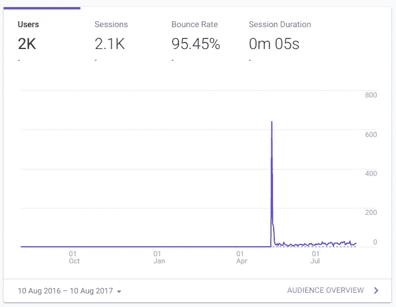
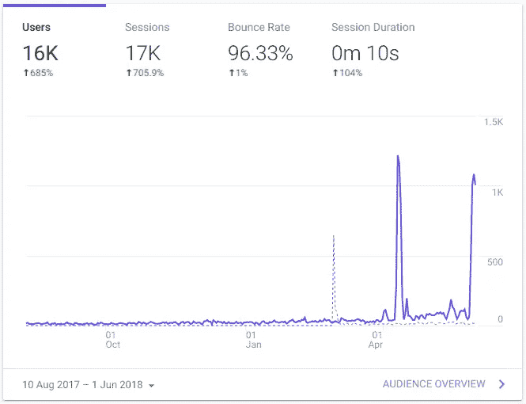
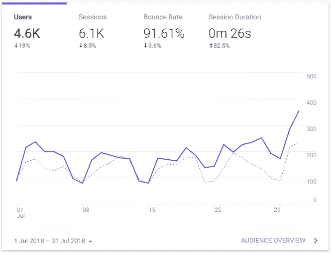
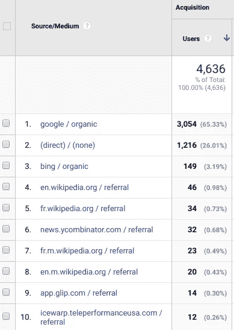
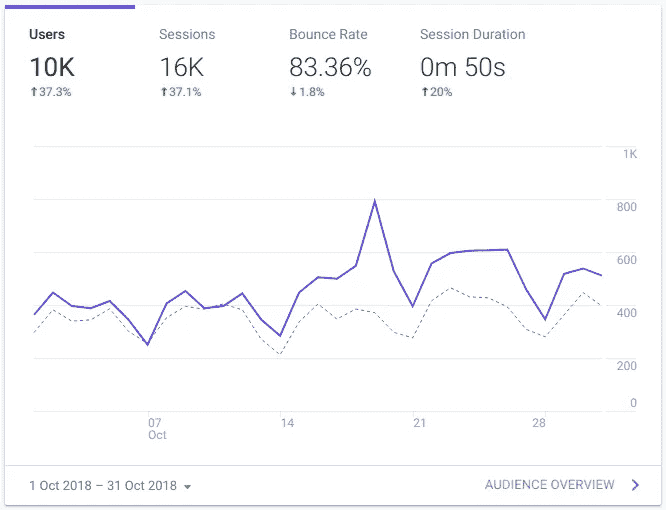

# 我的简单记事本应用程序如何从零增长到每月一万用户

> 原文：<https://medium.com/hackernoon/how-my-simple-notepad-app-went-from-zero-to-10k-users-monthly-e2dfb5cf15be>

这是一个关于我的看起来简单(但功能强大)的记事本应用程序如何在没有任何营销和广告的情况下从零用户增长到每月近万用户的故事。我将提到有助于这个应用程序增长的各个方面，以及这之间的一些其他事情。

2016 年，[进步网络应用](https://developers.google.com/web/progressive-web-apps/)在网络开发界引起了许多人的关注。因此，为了深入 PWA 世界，我已经开始开发这个非常简单的[记事本应用](https://hackernoon.com/tagged/notepad-app)。我想学习 PWA 背后的概念，我不想在设置应用程序时有任何复杂性。这就是我选择这么简单的想法甚至更简单的实现的主要原因。我很快用 HTML、一点 JavaScript、jQuery，当然还有 [ServiceWorker](https://developers.google.com/web/fundamentals/primers/service-workers/) 创建了一个简单的记事本。我已经为它创建了一个存储库，并完成了我的第一次提交，你可以在这里[看到](https://github.com/amitmerchant1990/notepad/commit/0ee864d78f6a7be76120a6267592f586c265d82e)，并把它放在 GitHub 页面[这里](https://www.amitmerchant.com/notepad/)。我也把它贴在了黑客新闻的“展示 HN”版块，显然没有得到热烈的回应。

老实说，这只是一个业余爱好项目，我没有计划将其推向市场，但我一直在努力，并试图改善它的功能和外观，同时尽可能保持它的最小化。我还研究了这个应用程序的一个方面(我不知道几年后它会非常有用)。我保持了应用程序的响应，放置了所有的[元标签](https://github.com/amitmerchant1990/notepad/blob/master/index.html)，这有助于增加 [SEO](https://hackernoon.com/tagged/seo) 排名。一年后，我从[js.org](https://js.org/)的好心人那里拿到了名为[notepad.js.org](https://notepad.js.org/)的域名。这给了这个小项目一个搜索引擎友好的网址，人们可以记住。这也通过启用`https`来保证网站的安全，这是让任何网站在搜索排名中上升的一个重要方面。

正如你从上面的[谷歌分析](https://analytics.google.com/analytics/web/)中看到的图片，webapp 在 2017 年的用户非常少。即 2016 年 8 月至 2017 年 8 月期间，因为它刚刚推出，网站的搜索排名相当低。但是有一天奇迹发生了。

你看到那个钉子了吗？大约在 2018 年 4 月 11 日。我仍然不确定是什么让我的网站(突然)有了这么多流量，但这是巨大的，但我想这一切都是因为我之前做的 SEO 优化。它在一天之内吸引了大约 1200 万用户。这极大地提高了该应用在搜索引擎中的排名。从这一点开始，webapp 每天都有大量的流量。

上面的截图是 2018 年 7 月的分析。正如你所看到的，流量已经从每天 80-100 个用户增加到接近月底的每天 350 个用户。这都要归功于几年来一直在优化的 SEO，而且都是有机的。

正如我从谷歌分析中观察到的，人们最终会通过搜索关键字如`Notepad`、`offline notepad`、`notepad pwa`等来访问我的网站。我从分析中注意到的另一个有趣的事情是，菲律宾地区的用户比世界其他地区的用户使用该应用程序的次数更多。我不确定为什么。

上面的截图是 2018 年 10 月的，正如你所见，该网站的月用户数已达到 1 万。耶！

# 结论

简而言之，它只不过是搜索引擎优化的游戏，功能上的一些有用的改进和耐心，这些年来帮助这个小应用程序获得了如此多的用户，我希望它在未来也会继续得到这样的爱。我希望你从这篇文章中学到了一些东西，如果你想知道更多的见解，请在下面的评论中告诉我。

> 本文最初发表于[https://www . Amit merchant . com/How-My-Simple-Notepad-App-go-From-Zero-To-10k-Users-Monthly/](https://www.amitmerchant.com/How-My-Simple-Notepad-App-Went-From-Zero-To-10k-Users-Monthly/)