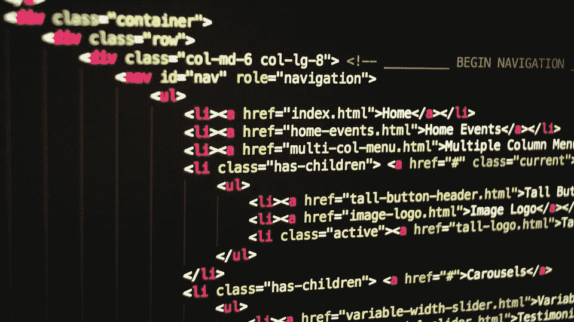

# 在线编码学校如何帮助重塑成人教育的科技形象

> 原文：<https://medium.com/hackernoon/how-online-coding-schools-are-helping-to-reimagine-adult-education-in-tech-dbff12fd521a>

当迈克尔·凯泽-尼曼在 2012 年创办编码学校 Epicodus 时，他只是在解决一个问题——他很难为自己创办的软件公司找到具有计算机编程技能的人。

“这是荒谬的。为什么我在招聘程序员方面有这么多困难？为什么人们不教人们如何编码？凯泽-尼曼说:“一旦我让软件公司站稳了脚跟，我就转向了教育问题。

他的答案是 Epicodus，该公司培训技术和非技术背景的成年人从事网络开发。

Epicodus 带学生在 27 周内从 0 到软件开发者。培训包括 800 小时的现场学习、80 小时的工作准备和 150 小时的实习在职学习。学校有两个地点，波特兰和西雅图。

[53.4%的 Epicodus 学生在毕业后六个月内获得了全职工作。网站开发人员和初级软件工程师是最常见的头衔。雇主从 Living Social 和 Nike 这样的大公司到小型创业公司都有。](https://static.spacecrafted.com/b13328575ece40d8853472b9e0cf2047/r/e514c62bb7ff443387980e33235acd25/1/Epicodus%20(Portland%20H2).pdf)

五年后仍然屹立不倒，Epicodus 可以被认为是一个实体的成功故事。然而，其他面对面的编码学校表现不佳。

编码学校 [Dev Bootcamp](https://www.insidehighered.com/news/2017/07/14/dev-bootcamp-which-kaplan-bought-three-years-ago-closing) 和 [The Iron Yard](https://www.edsurge.com/news/2017-07-20-another-major-coding-bootcamp-iron-yard-announces-closure) 就是两个这样的设施，它们在 2017 年关闭，无法维持盈利的商业模式。

随着尘埃落定，面对面编程项目面临的一些挑战逐渐浮出水面，另一种模式出现了，该模式也旨在培养学生成为网络开发人员、软件工程师和数据科学家，从而进入科技行业。

这种模式不走 t 台，但仍然赢得了它的面子。这个模型就是在线编码训练营，它正在帮助重新想象技术领域的成人教育。

以下是面对面和在线项目的优势和挑战，在线项目如何利用技术实现社会学习，以及为什么在线编码项目是技术培训和就业的可行途径。

# **实体编程和在线编程的优势和挑战**

面对面的支持是实体编码项目的好处之一。教师可以实时帮助学生，同学们可以互相合作，培养团队合作等软技能。

“编码是抽象的。能够理解代码发生了什么需要精神体操。无论你如何学习都很有挑战性，而面对面的学习有助于这一点。凯泽-尼曼说:“你和其他人一起工作，不同的学生也在挣扎。

事实上，过去的研究强调了设计在线课程时有目的地包括学生-教师互动的重要性，因为与面对面相比，社交互动的缺乏在在线环境中会更加明显。

这项研究已经在肯特州立大学的一项研究中提到，并在《互联网和高等教育 杂志上发表了一篇文章。

旧金山编码学校 Hack Reactor 的联合创始人肖恩·德罗斯特说，面对面的编码项目可能会带来额外的社会效益，但也会带来额外的成本，即物理空间的成本。Hack Reactor 提供面对面和在线训练营项目。

拥有面对面设施的挑战包括预计学生人数、所需空间和租赁空间。

“对任何小企业来说，这些都是难题，”凯泽-尼曼说。

在线编码项目面临着学生接受非传统学习模式的挑战。总部位于布鲁克林的在线编码训练营 Thinkful 的联合创始人兼首席执行官达雷尔·西尔弗说:“这需要开放的思想。

西尔弗在 2012 年成立了主要在线的 Thinkful，为成年人提供向科技职业过渡的培训。课程面向软件工程和数据科学领域的职业。

尽管这个在线项目与传统的课堂环境大相径庭，但它仍然提供了灵活性，特别是对于那些希望以低风险方式过渡到新职业的在职成年人。Thinkful、Flatiron School 和 Hack Reactor 等在线课程也可能提供兼职选项，允许个人根据自己的空闲时间进行培训。

“如果你不能放弃工作，或者不想承担不知道自己是否会成功的额外风险，以灵活的方式学习是最好的选择，”西尔弗说。

# **在线学习的人为因素**

许多在线编码项目使用技术将学生与同龄人、教师和导师联系起来，提供面对面学习体验有机产生的社交元素。

熨斗学校的在线训练营就是这样一个项目，于 2015 年推出，作为对他们实体训练营的补充。

“当我们着手构建在线教育时，我们不想只是记录和模仿我们的亲身体验。熨斗学校在线项目总经理丽贝卡·罗姆邦说:“让教育产生影响力的是围绕内容将人们联系起来。

Flatiron School 通过实时聊天、合作空间 WeWork 的会员资格以及教育教练来促进这种联系，以便让学生跟上全职、兼职或自定进度的编程。

Thinkful 通过面对面的聚会补充了其仅在线的训练营，允许学生进入他们当地的社区，与技术专业人员和招聘合作伙伴见面。Thinkful 与当地技术组织合作，在亚特兰大、洛杉矶、达拉斯、休斯顿、费城、凤凰城、圣地亚哥、波特兰和华盛顿特区举办见面会

西尔弗说:我们把在线学习和聚会结合成一个连贯的项目。你得到了你所需要的培训，以及你开始新事业所需要的关系网。

Hack Reactor 的在线训练营还通过与讲师的现场问答会议强调社交互动，并通过视频聊天进行配对编程练习，在视频聊天中，学生们就指定的项目一起工作。

这些例子说明了在线编码程序如何设计出将社交元素与特定于在线平台的课程内容相结合的程序。

# **数据，以及它讲述的科技故事**

根据美国人口普查局 2016 年的数据，对于那些收入徘徊在美国[中位数 31，334 美元](https://factfinder.census.gov/faces/tableservices/jsf/pages/productview.xhtml?pid=ACS_16_5YR_S2001&prodType=table)的人来说，在线编码项目可能会创造一个获得高薪技术工作的可行途径。

根据 Thinkful 的数据库，全日制毕业生的薪水增加了超过 19，000 美元。该校在线项目的就业率为 85.7%，年基本工资中位数为 7 万美元。而 Hack Reactor 和 Flatiron School 的在线课程的成绩与他们的现场课程成绩不相上下。

Hack Reactor 的创始人肖恩·德罗斯特说:“我个人并没有过多解读这个事实。“我从中获得了很多意义，那就是我们刚刚把相同的程序设计放到了网上，而且它确实有效。”

例如，在奥斯丁的黑客反应堆[远程](https://static.spacecrafted.com/b13328575ece40d8853472b9e0cf2047/r/a71e6cb9c46e420fa19b0eed408cfefd/1/Hack%20Reactor%20(Remote%20H2).pdf)在线项目和[现场](https://static.spacecrafted.com/b13328575ece40d8853472b9e0cf2047/r/cba1ee07e29046438dc4f0dda21f4d05/1/Hack%20Reactor%20(Austin%20H2).pdf)项目有相似的工作安置率，接近 73%。这两个项目也共享相同的课程，包括计算机科学基础，全栈 JavaScript 和应用程序设计和开发；针对每种形式，与同行和导师进行互动；以及同样的职业服务。

此外，熨斗学校在线软件工程和实体软件工程项目的课程内容相似，就业率分别为[94%](https://go.flatironschool.com/hubfs/2016%20Online%20Outcomes%20Report.pdf)和[97%](https://cdn2.hubspot.net/hubfs/69751/2018%20Immersive%20Outcomes%20Report.pdf)。

一个在线项目也可以提供一个激励，使支付学费更加可行。例如，熨斗学校为其在线和面对面的职业改变项目提供退款保证，如果学生遵循职业服务承诺，并且在毕业后六个月内没有找到工作。职业服务承诺是熨斗学校制定的一套指导方针，旨在帮助学生寻找工作。

Thinkful 为其全日制项目提供了同样的保证，同时还为全日制学生提供了收入分成协议的选项。

在这份协议中，学生只有在获得至少 40，000 美元的工资后才需要支付学费。毕业生将在就业的前三年支付他们收入的 15%。

根据 bootcamp 目录课程报告的研究，在线编程通常比实体编程花费更少。然而差异仍然存在。例如，Hack Reactor 的在线和实体项目的学费大约是 Epicodus 面对面项目的两倍。Hack Reactor 的全职[在线](https://www.hackreactor.com/remote-immersive)和[真人](https://www.hackreactor.com/onsite-immersive)节目每个费用 17980 美元，Epicodus 的全职 bootcamp 费用[8500 美元](https://www.epicodus.com/tuition/)。

这些项目，无论是在线的还是实体的，都有能力为那些传统上在技术领域代表性不足的人——女性和少数族裔——提供职业转型的渠道。Hack Reactor 向所有参加现场或远程项目的学生提供奖学金，另外还提供专门针对女性、代表性不足的少数族裔和 LGBTQ 学生的奖学金。

此外，Thinkful 还与一些公司合作，希望增加来自技术领域代表性不足群体的熟练员工数量。“我们为市场营销提供奖学金，并降低公司试图接触的学生的学费。西尔弗说:“学生们还能保证获得面试或实习机会，以便找到更多样化的候选人。

许多在线项目都提供职业服务来帮助毕业生找工作。熨斗学校为 Cognizant 和 BlackRock 等雇主合作伙伴提供职业指导和机会。这些合作伙伴从学校的在线和实体项目中招募人才。善于思考的学生也可以接触到一对一的导师，他们可以回答问题，调整学生的课程以适应职业目标。

在线编码学校填补了编码训练营行业的空白，同时也建立了自己的标准。在线计划为那些可能无法参加面对面计划的人提供培训，也可以为那些有全职工作的人提供灵活性，这些人希望在不放弃收入的情况下进行职业转型，以便在较长时间内参加训练营。

对于那些生活中反映这些场景的人来说，在线编码程序可能是通向科技职业生涯的另一条途径。

“公司对伟大的软件工程师如何学习他们的技术并不特别感兴趣。很简单，‘这个人能胜任这项工作吗？这个人能给团队增加价值吗？“这个人能学得很快吗，能在我们迭代的时候学会新的语言和框架吗？”如果答案是肯定的，我们发现公司一直都很乐意雇佣这个人，”龙邦说。