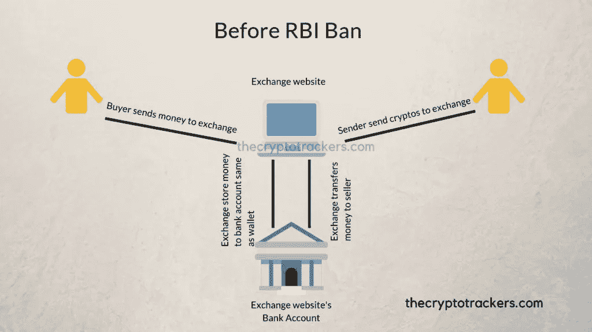
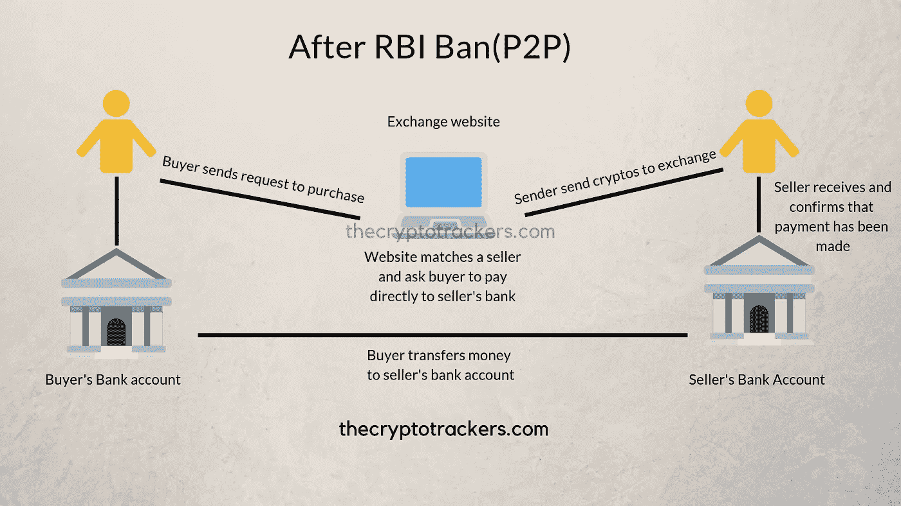

# P2P 如何工作以及印度最好的加密货币交易所

> 原文：<https://medium.com/hackernoon/how-p2p-works-and-india-s-best-cryptocurrency-exchanges-e5920e1a2c88>

我会让你知道我在印度央行切断银行处理加密货币后，在印度加密世界中艰难学到的东西。会讲到 P2P，最后会讲到如何在印度进行加密货币交易。

2018 年 2 月早些时候，印度储备银行(RBI)宣布加密货币不是法定货币。他们切断了处理任何加密货币交易的银行账户。人们开始从 cryptos 中取出他们所有的钱，假设印度的加密结束了。我也这么做了。

但我知道，会发生什么。交易所会找到办法的，因为他们知道人们会沉迷于此。沉迷于即时利润。

根据 2018 年 1 月 19 日发布的《今日印度》文章

> 它的调查显示，该国有 60 万活跃的加密货币交易商(非官方数字是这个数字的数倍)在 9 个加密货币交易所。这些交易所的交易额高达 17，800 亿卢比。引用该调查的报道称，一名 25 岁的年轻人投资了 250 万卢比的比特币，他持有的比特币价值已经飙升至 76 亿卢比。

1780 亿卢比。有趣吧，这绝对不是一个小数目。

# 那么，在印度储备银行宣布它不是法定货币后，发生了什么变化？

此前，像 Koinex、Bitbns、WazirX 这样的加密货币交易网站直接与银行交易。因此银行知道这些钱是用来购买加密货币的。

**买家**——他们向交易网站付款。交易网站把它带到银行，一旦买家购买了硬币，他们就把钱转到卖家的账户上。
**卖家**——为了出售他们的硬币，他们将硬币转移到交换网站。当卖家出售硬币时，钱由交易所自己记入卖家的账户。

下图描述了之前的交易是如何完成的:

From: thecryptotrackers.com

所以，以前，所有的钱都通过交易所网站的银行账户。RBI 禁令后，银行所做的是，停止所有涉及加密货币的银行账户交易。

# P2P(点对点)解释道:

P2P 或 P2P 是一种买方直接向卖方的银行账户付款的方式。由于这些交易金额很小，银行无法查明这笔交易的目的。因此，这是一个双赢的局面。

这张图表将展示现在如何使用 P2P 进行交易:

From: thecryptotrackers.com

**卖家** —卖家将其所有密码发送到他/她想要出售的交易所。现在，卖家将要求出售他/她的加密货币。任何感兴趣的人将直接把钱转到卖方的银行账户。一旦买卖双方确认已经付款。交易所会将加密货币发送到买家的钱包。

# 在印度可以购买加密货币的交易所:

[**WazirX**](https://wazirx.com/invite/e4hd5)—P2P 最佳平台。一切都是很好的自动化和容易使它非常可靠。支持团队很好。

费用 0.25%

[**Koinex(使用此链接第一次交易获得 50 卢比)**](https://koinex.in/register?ref=63477b) —早鸟，伟大的功能，P2P 服务与 LocalBitcoin 相同。但是你仍然可以使用 Koinex 在没有 P2P 的情况下交易。这是最伟大的事情。支持团队很好。

费用 0.15%。

[**local bit coin**](https://localbitcoins.com/?ch=qqsr)——全球范围内令人瞠目结舌的牛逼平台。发送/接收付款有几种选择。你甚至可以亲自用现金购买/出售密码。仍然不是自动化的，你必须请求购买和销售，你必须与聊天的人打交道。耗时且有时令人恼火。在这个列表中提到它需要做的事情。对初学者来说很难。

免费交易，创建广告的本地比特币用户每完成一笔交易就要支付 1%的费用。

[**位 bns**](https://ref.bitbns.com/65475)

这还没有结束。如果你想交易更多的硬币，你应该注册其他交易所，如**。**

**我使用了所有这些交易所，填满了 KYC，用它们交易，几次自杀，因此找到了最好的。我更喜欢 WazirX，Koinex，然后是 LocalBitcoin。而币安没有对手。**

**参考资料:**

** [## 可能是税收来源？IT 部门评估印度加密货币市场的整体规模

### 1 月 5 日至 12 日期间，比特币的估值暴跌近 20%，原因是有消息称，韩国正计划进行一项交易…

www.indiatoday.in](https://www.indiatoday.in/magazine/up-front/story/20180129-bitcoin-cryptocurrency-india-coinone-bithumb-1149368-2018-01-19)  [## 什么是 P2P，P2P 加密货币交易所是如何工作的？-科技骗子

### P2P 的完整形式是点对点。P2P 或点对点是两个用户之间直接交互的一种方式

techcrook.com](https://techcrook.com/cryptocurrency/what-is-p2p-and-how-p2p-cryptocurrency-exchange-works/)**