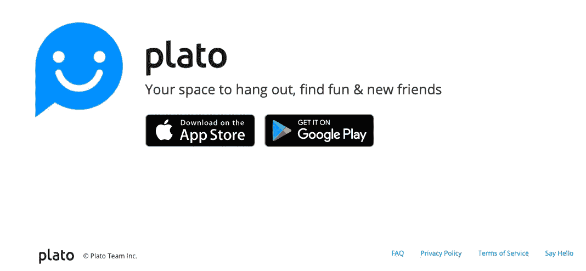
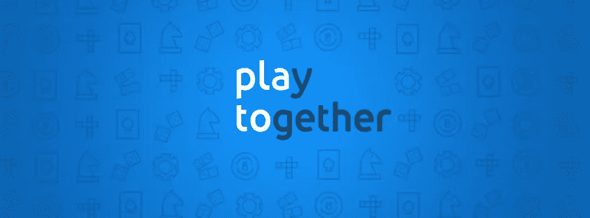

# Plato 如何使用 Headless CMS 交付移动新闻订阅内容

> 原文：<https://medium.com/hackernoon/how-plato-delivers-mobile-news-feed-content-using-a-headless-cms-9065305e3014>

柏拉图的使命是通过有意义的社交游戏将人们聚集在一起。作为第一款完全支持多人游戏的 messenger，Plato 无缝结合了聊天&游戏。团队成员包括雅虎！游戏老手，加上来自 T2 WhatsApp T3 的支持，Plato 现在可以在 iOS Android 上运行。

柏拉图有一个自制的 CMS，在运营成本和维护它的工程人员工资之间，花费太多了。该团队决定用 [Cosmic JS](https://cosmicjs.com) 替换他们的内部系统，以允许他们的开发人员在需要时构建新的内容模型，同时授权编辑管理内容，而不会成为开发团队的瓶颈。

Plato 的新技术栈是基于 Golang 的，托管在 AWS 上。Plato 用 Swift 和 Kotlin 编写的移动客户端访问他们的新闻提要内容，这是 ATOM 联合格式。该应用程序使用 [Cosmic JS REST API](https://cosmicjs.github.io/rest-api-docs/) 来提取文章，并将它们打包到一个 ATOM 兼容的提要中。

> *“使用 API 优先的 CMS 令人耳目一新，而不是试图与复杂的整体系统集成，并使其适应我们的特定用例。”
> —首席技术官杰西·麦克尼斯*

# 结论

阅读更多[案例研究](https://cosmicjs.com/case-studies)跨职能团队构建应用并更轻松高效地管理内容。

如果您对使用 Cosmic JS 构建应用程序有任何意见或问题，[在 Twitter 上联系我们](https://twitter.com/cosmic_js)和[加入 Slack 上的对话](https://cosmicjs.com/community)。