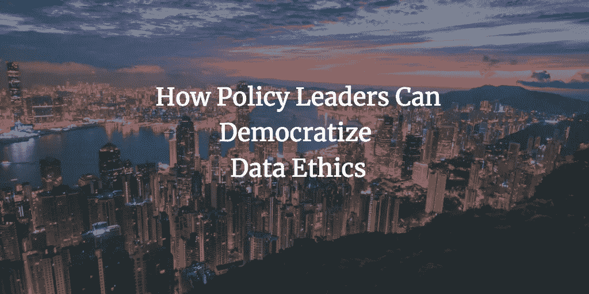
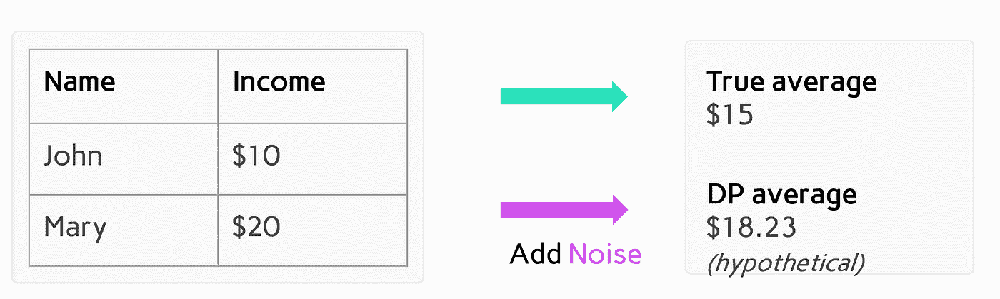

# 政策领导者如何使数据伦理民主化

> 原文：<https://medium.com/hackernoon/how-policy-leaders-can-democratize-data-ethics-d5f61e5f0061>

## 现在，甚至脸书的马克·扎克伯格也在呼吁 GDPR 式的国家数据法规。

他的目标值得称赞。他想给消费者更多的权利来控制和保护他们的信息。然而，他的评论并没有充分考虑到 T2 数据法规世界中一个经常被忽视的群体。这些都是中小型企业(SME)，比如初创企业。没有大批的律师可以雇佣，他们[很难遵循复杂的法律。有的甚至把](https://techcrunch.com/2019/03/21/how-to-save-the-third-wave-of-technology-from-itself-regtech/)[关了](https://hbr.org/2018/10/why-privacy-regulations-dont-always-do-what-theyre-meant-to)。扼杀中小企业的州失去了创新、就业和包容性增长。

我敦促立法者不要忘记这个群体。数据领导者应该从世界各地的对话中学习，而不仅仅是欧盟。

例如，看看亚洲太平洋经济合作组织(“亚太经合组织”)。几个周末前，我参加了其商业咨询委员会的数据专家圆桌会议，会议表明了对中小企业的严重关切。一位讨论者问道，“我们如何不仅帮助大银行，还帮助金融科技公司？”

在那里，我听到了中小企业是如何挣扎的——就像我通过 [Immuta](https://www.immuta.com/) 合作的公司一样，在那里我帮助扩展合规、道德的数据分析。(“伦理”是个拗口的词。我认为，有道德的公司即使在客户看不到的时候，也会关注他们的最佳利益——通过将数据保护原则融入到他们的基础设施和业务战略中。

三个外卖脱颖而出。虽然我从圆桌会议中吸取了这些经验教训，但它们也适用于任何实施新数据法规的努力:

1.  扩大现有努力，降低合规、道德数据治理的成本；
2.  推广数据共享标准；和
3.  拥抱隐私增强技术。

**(1)加大努力降低道德数据治理的成本**

正如我在 TechCrunch 上讨论的那样，现在，拥有最大合规团队的公司——而不是中小企业——正准备赢得[。例如，据报道，花旗集团在 2014 年雇佣了](https://techcrunch.com/2019/03/21/how-to-save-the-third-wave-of-technology-from-itself-regtech/) [3 万](https://blogs.marketwatch.com/thetell/2014/07/14/citi-will-have-almost-30000-employees-in-compliance-by-year-end/)名律师、审计师和合规官。

新技术帮助公司浏览嵌入文本的规则。缓解法规遵从性的技术是“regtech”，而帮助处理合同和诉讼的技术是“legaltech”这些将最佳实践嵌入到他们的设计中，不再依赖静态的文字处理工具。例如，类似涡轮税的表格或下拉菜单可以帮助中小企业制定良好的公司政策或合同决策。自然语言处理可以快速突出有风险的条款。

亚太经合组织有一个惊人的机会来增强自己后院的领导人。例如，新加坡宣布了一个全国性的“法律技术愿景路线图”。甚至该国首席大法官也呼吁律师进一步拥抱科技。由于这样的努力，专家们已经[任命](https://www.raconteur.net/risk-management/legal-tech-global-hubs)新加坡和香港为太空中的领导者。

[论坛](https://www.forbes.com/sites/markcohen1/2018/10/15/singapore-what-happens-when-a-nation-state-endorses-legal-innovation/)、[生态系统投资](https://ssir.org/articles/entry/why_cultivating_your_innovation_ecosystem_is_worth_the_work)、 [techsprints](https://www.fca.org.uk/events/techsprints/model-driven-machine-executable-regulatory-reporting-techsprint) 、[沙箱](https://www.mckinsey.com/industries/public-sector/our-insights/how-governments-in-emerging-economies-can-help-boost-and-sustain-growth)和[试点](https://www.govtech.com/biz/UrbanLeap-Wants-to-Shake-Up-City-Tech-Testing-and-Some-Big-Names-Are-Helping.html)分享和测试最佳实践是 APEC 扩大现有成果的几种方式。这是一种监管创新，既提振了最小的参与者，又保护了其公民。

**(2)推动采用数据共享标准**

正如与会者所强调的那样，中小企业在模棱两可中挣扎。他们渴望细节，通常是因为他们缺乏律师的指导。然而，过于具体的风险政策变得无关紧要或被滥用。

相反，亚太经合组织可以通过与行业专业人士合作制定标准来发挥领导作用。这种政策模式被称为“合作生产”或“[合作监管](https://www.oecd.org/gov/regulatory-policy/42245468.pdf)”

在需要大笔资金的高科技领域，这种模型可能是必要的。例如，美国环境保护署(EPA)在 20 世纪 70 年代末就使用了这种模式。环保局无法满足有毒物质的严格的[测试要求](https://tobinproject.org/sites/tobinproject.org/files/assets/New_Perspectives_Ch6_Balleisen_Eisner.pdf)。此外，国会未能界定“不合理的”有毒风险，使环境保护局陷入瘫痪。为了保护消费者，环境保护局不得不依靠企业自愿主义，这也许很危险。

相反，政府可以发挥领导作用。借鉴美国医疗数据互操作性核心数据(" [USCDI](https://www.acc.org/tools-and-practice-support/practice-solutions/coding-and-reimbursement/icd-10/monthly-tips/icd10%2520tips/december-heart-failure-differences-between-icd-10-and-icd-9-cm-terminology) ")，APEC 可以投资讨论“核心数据”标准。它可以确定要共享的数据、关键元数据和保护措施，例如数据泄露的截止日期。这些标准随着技术和新风险的发展而发展。为了促进采纳，亚太经合组织可以为符合标准的中小企业提供有限的避风港。医疗保健数据专家提倡美国商业数据基础设施协会也这样做。

这些是对一个非常复杂的主题的粗略描述。但在 APEC 的领导下，中小企业可以开始获得他们正在寻找的指导——并安全地更好地服务他们的客户。

**(3) Vet 隐私增强技术(“PETs”)**

正如与会者所讨论的，保护数据的最佳做法不应该是二元选择，要么加密数据，要么根本不加密。事实上，像这样的隐私做法对缺乏数据的中小企业伤害最大。为了跟上形势，中小企业希望共享、收集或使用大量数据。但是二元工具诱使中小企业取消保护。而泄露未受保护的敏感生物识别数据的中小企业可能很快就会破产。

相反，中小企业也可以通过使用像差分隐私这样的宠物来获取更多的数据。差异隐私限制了用户对数据摘要(如平均值)的访问。然后，它将噪声注入这些摘要中，以创建可证明的隐私保证。有道德的中小企业可以使用差别隐私安全地[汇集和共享数据](https://georgianpartners.com/wp-content/uploads/2018/04/CEOs-Guide-to-Differential-Privacy-April-2018.pdf)，帮助他们克服数据稀缺。然而，他们也可以防止恶意方[逆向工程](http://news.cornell.edu/stories/2018/08/artificial-intelligence-may-put-private-data-risk)敏感数据的情况。出于这些原因，它是苹果[工具包中的一个主要部分。](https://www.apple.com/privacy/docs/Differential_Privacy_Overview.pdf)

亚太经合组织可以考虑奖励宠物，也许作为其标准的一部分。如果一家公司的所有数据在默认情况下都是有差别的隐私，那么被窃取的数据对消费者的伤害就会小一些。嘈杂的数据汇总很难(如果不是不可能的话)联系到具体的个人。

一旦 APEC 审查了这些工具，创新者将会投入更多资金将这些宠物付诸实践。随着宠物的使用变得越来越普遍，更多的中小企业将会明白如何使用它们——并最终摆脱损害创新和隐私的“第 22 条军规”。

数据领导者引领潮流的机会

APEC 可以确保中小企业在新兴的数据生态系统中茁壮成长，而不是被扼杀。

因此，扩大现有的努力。推动数据标准。兽医宠物。

亚太经合组织有一个令人兴奋的机会在迅速变化的环境中脱颖而出。

它必须保护其公民，并促进其最小的、往往被遗忘的参与者——帮助其经济繁荣的参与者。

*☞同意还是不同意？欢迎随时关注我或在您的 Linkedin 邀请中给我发送备注* [*此处*](http://li) *。*

*☞要在这个快速变化的数据环境中保持领先，请看一下我的白皮书“*[*”GDPR 只是一个开始:保持领先的 7 条原则。*](http://the%20business%20advisory%20council%20of%20the/) *“我不仅比较了欧盟的法规，还比较了加州、中国和印度的法规，以勾勒出趋势数据保护原则。*