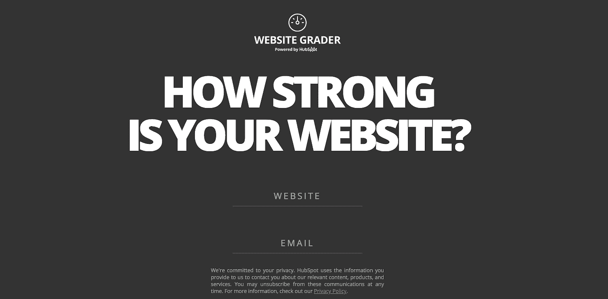
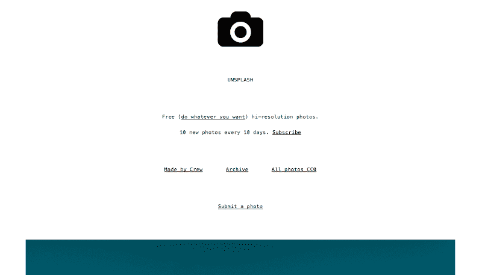
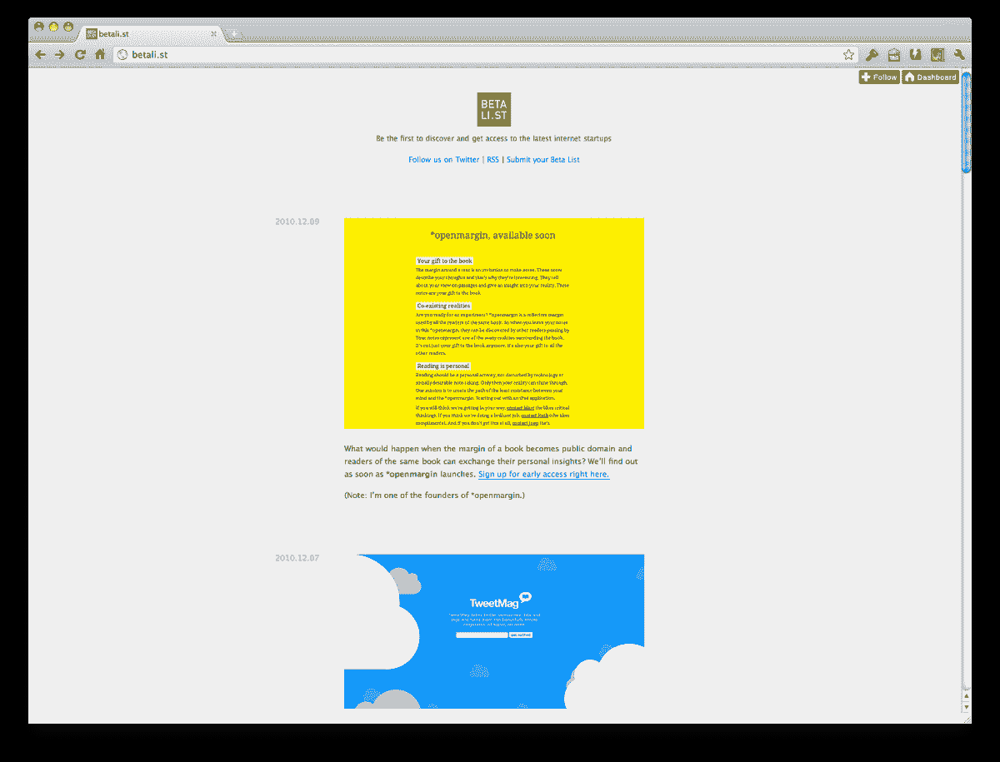
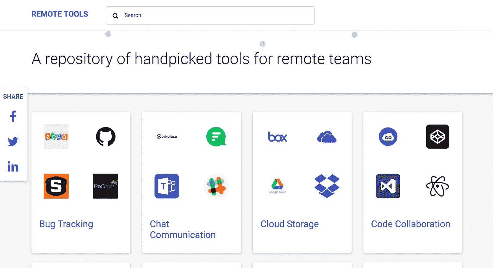
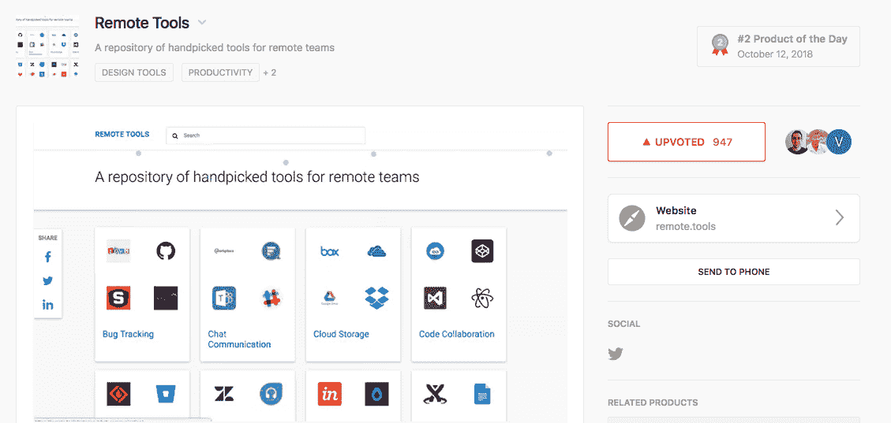
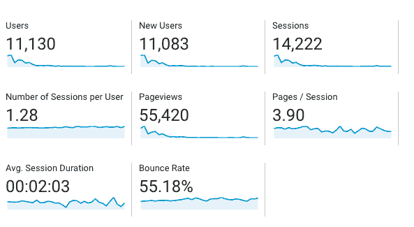

# 副业如何成为营销部门

> 原文：<https://medium.com/hackernoon/how-side-projects-can-become-marketing-departments-7eb26b2278e0>

## …甚至是他们自己的公司

让我们描述一下大多数早期创业公司的状态。银行存款很少。不只是需要客户，还需要他们快。当然，内容营销很棒，但也需要耐心一段时间才能看到质量回报。

这是很多创业者耳熟能详的故事。在 [Flexiple](https://flexiple.com) ，我们也在寻找一些灵感来增加我们网站的相关流量。这时，我们遇到了三个有趣的案例:Hubspot 的[网站评分员](https://website.grader.com/)，Crew.co 的 [Unsplash](https://unsplash.com/) 和 Openmargin 的 [BetaList](https://betalist.com/) 。

# **什么概念？**

这个概念很简单:向你的潜在客户提供一些额外的东西，并通过它巧妙地推销你的创业公司。听起来很简单，但上述每家公司在执行过程中都做出了一些非常明智的选择，很少有偶然为他们工作的，这导致了他们的计划的成功。让我们深入这些案例，更详细地理解它们。

# **根据 Hubspot 进行网站分级**

Source: [https://website.grader.com/](https://website.grader.com/)

*1。什么是网站评分员？*

它根据各种参数评估网站的在线营销绩效。

*2。这背后有什么故事？*

过去，当 Hubspot 还是个小公司的时候，它的联合创始人布莱恩·哈利根(Brian Halligan)经常让他的联合创始人达梅什·沙阿(Dharmesh Shah)评估一些网站的集客营销潜力。后者将不得不手动检查每一个的源代码。

发现这很麻烦，他创造了一个漂亮的工具来自动化这个过程。意识到这对其他人也很有用，他推出了[网站分类器](https://website.grader.com/)，作为一个免费工具。

*3。影响是什么？*

当然，很多潜在客户的爱。此外，有超过 300 万个网站使用过它，它继续为 Hubspot 每月带来 50，000+条线索。

*4。学习内容*

*   制作一个简单的产品，易于构建
*   考虑你的目标受众会发现什么有用

# **Crew.co 的 Unsplash**

Unsplash’s website on $19 Tumblr theme; Source: [https://medium.com/who-what-why/how-side-projects-saved-our-startup-a83a80f3b3ae](/who-what-why/how-side-projects-saved-our-startup-a83a80f3b3ae)

*1。什么是 Unsplash？*

一个可以轻松获取高质量库存照片的网站。

*2。这背后有什么故事？*

在创建他们网站的主页时，他们找不到一个价格合理的高质量的股票图片。所以，他们雇了一个摄影师拍了几张照片。因为他们只需要一个，其余的很可能不会被使用。

认识到其他人也必须面临同样的问题，他们创建了一个简单的网站(使用 19 美元的 tumblr 主题)并上传了 10 张照片，承诺“每 10 天 10 张新照片”。

*3。影响是什么？*

它开始每月为[带来 1100 万独立访客](/who-what-why/how-side-projects-saved-our-startup-a83a80f3b3ae)，并成为剧组的主要推荐来源。往前拨几年， [Crew 被卖给了运球](https://betakit.com/crew-sold-to-dribbble-as-co-founders-turn-focus-to-unsplash/)，因为创始人决定完全专注于 Unsplash！

*4。学习内容*

*   构建新产品时利用现有资源
*   廉价而快速地建造

# **open margin 测试列表**

Betalist’s website when it was first launched; Source: [https://stories.betalist.com/how-i-tricked-techcrunch-into-writing-about-my-startup-248083eb0c34](https://stories.betalist.com/how-i-tricked-techcrunch-into-writing-about-my-startup-248083eb0c34)

*1。什么是 BetaList？*

一个发现即将到来的创业公司并对其进行测试的地方。

*2。这背后有什么故事？*

创始人马克·科尔布鲁日发现很难让测试版用户测试他的产品 Openmargin。他认为在 TechCrunch 上发表文章会给他带来这些用户——显然，说起来容易做起来难。

然而，为了实现这一点，他创建了一个基本原型(也是基于 Tumblr 主题)，其中包含一些测试版初创公司(包括 Openmargin)。卖点:“成为第一个发现和接触最新互联网创业公司的人”。

*3。影响是什么？*

不过，这个案子的关键是发给 TechCrunch 的[邮件。马克的赌注成功了，TechCrunch 发表了一篇关于 BetaList 的文章。甚至福布斯也继续写了一篇关于 BetaList 的文章。](https://stories.betalist.com/how-i-tricked-techcrunch-into-writing-about-my-startup-248083eb0c34)

当然，Openmargin 获得了它所需要的 beta 用户。有趣的是，这位创始人又一次开始通过 BetaList 追求他的创业激情，因为该产品获得了非常积极的回应。

*4。学习*

*   再说一遍，便宜快速地建造
*   事先做好推销你的副业的计划

# 我们如何利用这些知识？

> 我们建造了**。**

***1。这是什么？***

**[Remote.tools](https://remote.tools) ，是一个为远程团队管理的工具库。**

****

***2。我们为什么要建这个？***

**我们决定应用我们的知识。简而言之，它们是:**

*   **选择与你的目标受众相关的东西**
*   **利用你已经拥有的资源(有形的甚至是基本的知识)**
*   **构建一个不需要维护的简单产品**
*   **预先策划侧项目的营销**
*   **共同之处:巧妙地推销你的核心产品**

**a.目标受众:**

**在 Flexiple，我们为科技公司提供精心挑选的自由开发者和设计师。当我们的人才在公司工作时，他们通常位于遥远的地方。因此，我们的客户通常是远程公司，或者至少是那些喜欢远程工作的公司。**

**b.资源:**

**我们有一个完全远程的技术团队，并经历远程团队特有的挑战。为了解决每个棘手问题，我们曾经研究过一个可以帮助我们的工具。这相当耗时，而且我们惊讶的是没有一个可供远程团队利用的工具库。**

**鉴于我们已经完成了必要的工作，我们决定只需组织数据供其他团队利用。**

**c.简单产品:**

**我们最初试图创建一个具有用户参与功能的产品，比如向上投票、评论等。然而，我们决定产品的第一个版本应该是一个简单的工具库，提供全面的信息。只有当我们看到大量用户感兴趣时，我们才会进一步开发。**

**d.营销:**

**在产品准备好之前，我们做了以下工作:**

*   **准备一份脸书&斯莱克小组的名单，他们会发现[远程工具](https://remote.tools/)很有用**
*   **起草要发送到技术博客的邮件**
*   **联系社交媒体上热门技术论坛的版主**
*   **创建我们的产品搜索页面**

**e.Flexiple 的巧妙营销:**

**Flexiple 的商标放在每一页的页脚。在各种论坛上宣传时，我们解释了它背后的故事，这也使 Flexiple 脱颖而出。最后，我们还将其归入了“聘用远程人才”类别。**

***3。有什么影响？***

**在推出 remote.tools 后，我们立即对[产品搜索](https://www.producthunt.com/posts/remote-tools)产生了浓厚的兴趣，并开始关注它。几天之内，我们收到了大约 500 张赞成票和许多正面评价。**

****

**这为我们的产品带来了 10，000 多名访客。即使调整跳出率，大约 5000 名用户在上面花费了大量的时间(大约 2 分钟)。**

****

> **最佳统计数据:我们能够完成 4 笔客户交易，其中客户称销售线索来源为 [remote.tools](https://remote.tools/) 。我们已经赚了 10 倍于我们在这个产品上投入的钱！**

**现在，对我们来说，开发新功能并吸引用户的确是有意义的。**

# ****结束语****

**并非所有这些举措都会成功。反正没有上面分享的三个例子成功。然而，由于资源有限，我们需要尝试营销产品的替代方法。建立一个副业项目肯定会很快带来巨大的回报！**