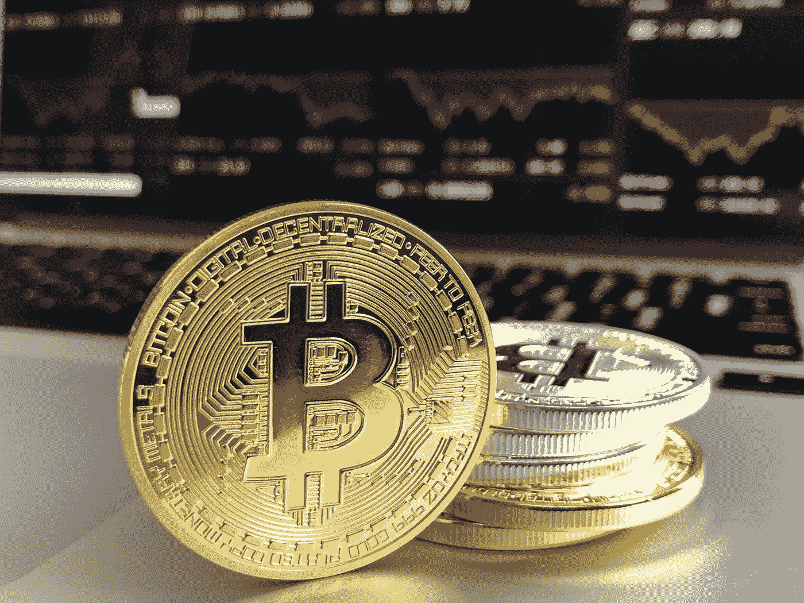
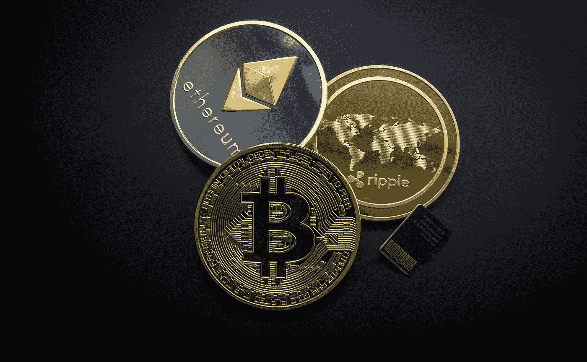
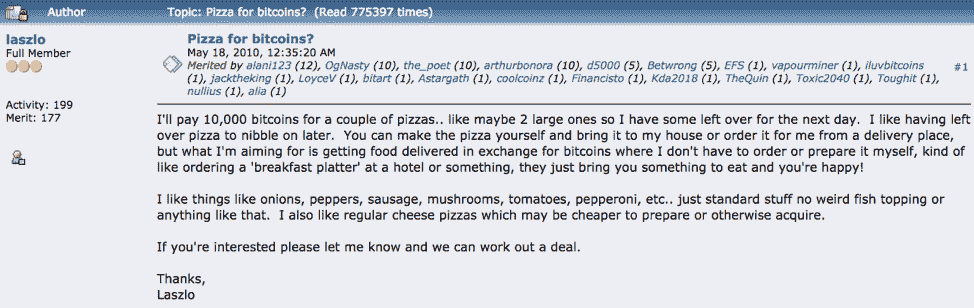
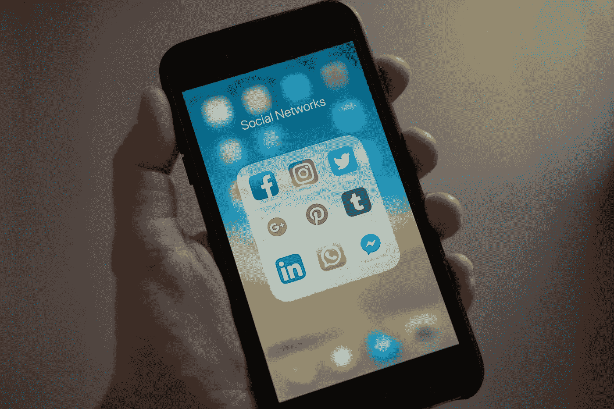

# 社交媒体如何帮助加密货币流行起来？

> 原文：<https://medium.com/hackernoon/how-social-media-helped-cryptocurrencies-rise-in-popularity-cf6ef2ef685a>

在过去的几年里，加密货币受到了很多关注。即使你是一个对数字世界了解不多但碰巧有互联网连接的普通人，你也有可能熟悉加密货币。数字货币日益流行和成功背后的一个主要原因是社交媒体。

当比特币刚开始的时候，它的价值在 0.08 美元左右。现在，一个比特币价值近 3900 美元。随着社交媒体上许多人谈论加密货币和区块链，需求有所增加。需求的增加导致价值的增加。

那么，有什么大惊小怪的？加密货币是如何一夜之间成为热门话题的？社交媒体如何帮助加密货币流行起来？但在此之前，让我们了解一些基本知识。

# 到底什么是加密货币？

加密货币是一种数字或虚拟货币，旨在作为交换媒介。它使用加密技术来保证安全。这是一种基于区块链技术的分散货币。区块链，顾名思义，就是由一组交易组成的区块链。

这些事务将形成一个 Merkle 根，并使用它生成一个散列。区块链中的每个块都通过其哈希值连接到前一个块。这使得区块链非常安全，很难伪造。

要改变块中的任何值，黑客需要改变与之相连的所有块。需要非常大的计算能力来实现这一点，这实际上是不可能的。由于加密货币是基于区块链的，要破解它们非常困难。

简而言之，加密货币是由拥有它的人控制的数字货币，而不是由银行控制的。

# 崛起

上世纪 90 年代曾有过几次创造数字货币的尝试，但都没有成功。直到 2008 年，中本聪发表了一篇论文，阐述了比特币如何成为第一种成功的虚拟货币。

为了进行推广，中本聪建立了一个拥有 2000 多名订户的电子邮件列表，并积极参加了许多向人们宣传比特币的论坛。第一笔交易发生在 2010 年，通过[比特币对话](https://bitcointalk.org/)，一名用户花了 10，000 比特币买了两个披萨。一万个比特币现在价值 3800 万美元。

# 社交媒体扮演着重要角色

社交媒体解决了加密货币面临的最大挑战之一:庞大的用户群。一种加密货币永远不可能成功，除非有大量的人在使用它。脸书、WhatsApp、Facebook Messenger 等社交媒体平台每月活跃用户超过 10 亿。

其他平台像 Twitter、Telegram、Line 每个都有超过 2 亿的月活跃用户。因此，满足了加密货币的主要要求。

加密货币正在积极利用社交媒体平台来教育买家。区块链和这些加密货币的概念并不容易理解。因此，有必要向潜在买家传授这方面的知识。

例如， [Ripple](https://ripple.com/) 是全球接受支付的区块链。Twitter 上有超过 100 万的追随者，他们通过网络研讨会、播客和分享教育内容来教育人们。他们甚至推出了他们的电视节目。

# 更多加密货币社区

人们对加密货币充满热情。为了确保成功，这些新的加密货币正在创建在线讨论论坛、不和谐与松弛频道、子编辑等。致力于讨论这些货币。

他们定期发布帖子来教育他们的受众，并让他们了解最新情况。好消息是人们积极参与这些论坛和渠道。像 cryptocurrencytalk.com、、[、](https://mastersofcrypto.com/forum/)这样的论坛才是值得期待的。

# 密码对话的新平台

加密货币成功的另一个主要原因是新平台的引入。以在线出版平台 Medium.com 为例。你可以在这里发表你的作品，如果用户喜欢你的内容，你会得到报酬。

这取决于你得到的掌声次数。你得到的掌声越多，你挣得就越多。关于区块链和加密货币的文章表现非常好。密码公司正在利用这一点。像 steem.it 和 mamby.com 这样的网站会为你发布的内容付费。

出于这个原因，许多用户正在加入这些平台，使加密货币比以往任何时候都更受欢迎。此外，加密公司在他们的其他社交媒体上交叉推广他们的文章，以吸引更多的客户。

因此，可以准确地说，社交媒体平台在推动加密货币达到目前的地位方面发挥了巨大作用。