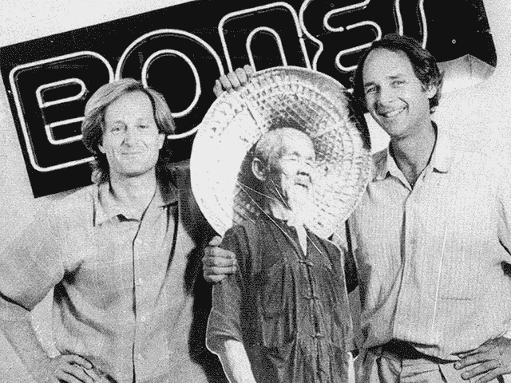

# 斯泰西·佩拉塔、托尼·霍克和骨头旅如何打破规则并赢得比赛

> 原文：<https://medium.com/hackernoon/how-stacy-peralta-tony-hawk-and-the-bones-brigade-broke-the-rules-owned-the-competition-2e60a76b79d9>

> 这篇文章的一个版本曾出现在《福布斯》杂志上。

Stacy Peralta (left), Animal Chin & George Powell (Courtesy: George Powell)

在我与乔治·鲍威尔的对话的第二部分，乔治·鲍威尔是 [Skate One](http://www.skateone.com/) 的创始人兼总裁，他描述了托尼·霍克和骨头旅的其他成员如何在滑板运动于 20 世纪 80 年代末几近消亡后，改革滑板运动并使其再次变得酷。他还分享了他对自己与斯泰西·佩拉塔长期关系的坦率想法。

Skate One 现在是全球最大的滑板公司，旗下有[*Powell peraltaskeadsboards*](http://powell-peralta.com/)*BONES**轮子和 Mini Logo**滑板*等畅销品牌。

你可以在这里阅读我们讨论的第一部分[，它涵盖了许多有见地的话题，包括 Skate One 的起源和乔治与斯泰西·佩拉塔数十年的合作关系。](http://johngreathouse.com/george-powell-doing-well-by-having-fun/)

20 世纪 70 年代末，乔治与斯泰西·佩拉塔搭档，后者当时是 20 岁的世界滑板冠军。他们一起创建了骨头旅滑板队，这不仅开启了托尼·霍克的职业生涯，也开启了许多滑板明星的职业生涯，包括:艾伦·盖尔范德、迈克·麦吉尔、史蒂夫·卡巴列罗、罗德尼·马伦、兰斯·芒廷、汤米·格雷罗和凯文·哈里斯。

**John Greathouse:** 白骨大队是怎么走到一起的？

**乔治·鲍威尔:** ***这完全是斯泰西(Peralta)的错！他精心挑选了所有的滑冰选手，决定谁将是年轻的、刚刚崭露头角的业余选手中的佼佼者，并把他们团结在一起组成了一个团队，我们称之为骨头队。对他来说，关键是不要从其他公司偷走知名选手，而是与一群不知名的选手一起重新开始，让比赛变得新鲜和鼓舞人心。在他独特的广告中使用不知名的溜冰者使他们更加有趣。***

你和史黛西在 20 世纪 90 年代初分道扬镳，近 20 年后又重归于好。是什么导致了这种中断？

到了 20 世纪 90 年代初，我们成功的伙伴关系被用来对付我们。我们很成功，也很大，是小公司所说的五大公司之一(PP，Tracker，NHS，付令超，Vision)。他们觉得我们太大了，太成功了，他们无法与我们竞争，所以一个名叫史蒂夫·罗科的溜冰者，成立了一个溜冰者联盟，开始他们自己的公司或加入他的公司，从我们为他们自己建立的产业中夺取过来。

***这恰好与从垂直滑冰到街头滑冰的转变相吻合，这是我们自己策划的一个转变，旨在扩大行业，那些顶尖的滑冰运动员，如托尼·霍克、兰斯·芒廷、汤米·格雷罗、迈克·麦吉尔、迈克·瓦利和罗德尼·马伦，都看到了离开我们团队的机会，并创立了自己的品牌，以保持相关性，并经营自己的公司，他们做到了。***

史黛西和我在如何处理这件事上意见不一。他希望我们为每个人创造一个品牌，让他们自己去做，只是为他们制造甲板和轮子。我不认为 Stacy 希望我们使用的经济模式会起作用，我们会用尽我们所有的资源为这些人每个人推出一个品牌，并失去支付营销的利润以保持我们的领先地位。我支持努力保持我们的领导地位，尽可能保持我们团队的完整。

史黛西心碎了，因为他爱他的团队，希望他们拥有他所取得的成就。我拒绝这样做导致他完全放弃了我们的伙伴关系和这个行业。他开始了他的滑板电影制作生涯，并把它带到了好莱坞。这让我们疏远了十几年。

随着时间的推移，我想我们都认识到忽视对方是愚蠢的，我向史黛西伸出援手，希望至少能重新建立沟通，并试图化解我们双方受到的伤害。在几年的时间里，我们又在一起度过了越来越多的时间，他对滑板行业的兴趣和我们的传统合作伙伴关系(此时已经发展成为传奇地位)开始将我们再次吸引到一起。他的电影《狗城》&《白骨之旅:一部纪录片》既重塑了行业内的关系，也部分弥合了《时代》澄清的我和白骨之旅团队之间的旧分歧。

做 BB doc 对我们所有人来说都是一次真正的破冰，我认为这是我们重新合作推广滑板运动的真正开始。今天，Stacy 在他的商业项目中与我们合作，创作展示我们的运动员、品牌和滑板的电影。随着时间的推移，我认为我们一起工作时可能比单独工作时更好的印象将使我们继续一起做有趣的项目。

你和史黛西再次合作真是太酷了。你们的历史对你们在 Skate One 的相对角色有什么影响？

鲍威尔: **此时，我拥有一批优秀的员工，他们在处理公司的日常事务方面比我强，这让我可以专注于产品开发和图形，这是我的强项。**

当我们最初一起工作时，我不得不放弃我的 R & D roll，为了经营我们疯狂增长的公司。史黛西或多或少有时间专注于市场营销和团队推广，但这种双重角色占用了他很多时间，使他无法专注于拍摄和市场营销。现在，我们都更有经验了，有了 Skate One 的一大群朋友来支持我们的努力，我们可以更自由地做我们最擅长的事情。我希望这种更加成熟的关注和分离能够使我们的新伙伴关系比 30 年前更有力地向前发展。

你在托尼·霍克 14 岁的时候开始和他合作。很明显，在那么年轻的时候，他会成为这项运动最知名的代言人吗？如果是，是什么让他脱颖而出？

鲍威尔:*当他第一次加入这个团队时，他非常出色，非常有动力，所以我们认为他会成功，但我们都没有想到他和罗德尼会成为他们都成为的魔术创造者和创新者。他们都很有创造力，有动力，也很敏感。和他们一起工作很愉快，尽管他们在成长为滑冰明星的过程中都经历了一些艰难的时期。在 BB 纪录片中，这些问题得到了更深入的研究，并提供了对青春期压力的迷人见解，以及在一个将他们的技能和难以置信的创造力视为幼稚愚蠢和浪费时间的世界中，作为敏感、有动力的年轻明星运动员的成长。*

你真的曾经给托尼开了一张 0.85 美分的版税支票吗？

是的，在 1980-1983 年的黑暗时代，事情就是这样变得糟糕，那时我们就像一只猫用爪子抓着栏杆不放一样。

Greathouse: 这些“孩子”赚了这么多钱，这让你的高管们感到紧张。你是如何处理这件事并使公司朝着同一个方向前进的？

鲍威尔: ***我们很难看到一个 12 岁的孩子加入这个团队，几年后，在我们给了他们大量的装备、衣服、爱、旅行费用和指导后，他们突然比当时支持他们的任何人都赚得多，没有他们，他们不可能达到现在的水平。***

尽管如此，从职业运动员或电影明星的收入来看，这是公平、必要和恰当的，但这公平吗？谁说得准。我确实很难与我们的管理团队合理化，当然这是一个艰难的销售，但我们做到了。谁来说什么是公平的。为什么西海岸的工会码头工人比警察或教师的收入多一倍？

伟大的豪斯:兰斯·芒廷的态度似乎是我的学生可以学习的——他总是随时准备做任何需要做的事情。尽管他可能不是最有天赋的运动员，但他使自己成为队中有价值的一员。

**鲍威尔:** ***我认为那一点最好由兰斯在斯泰西的 BB doc 中自己说的话来涵盖。他做了别人不想做的事，看起来像个呆子，而不总是展示他自己在做伟大的魔术。他提供了喜剧救济，作为回报，他得到了额外的宣传，使他受到数百万年轻溜冰者的喜爱，他们受到鼓舞，像兰斯在电影中那样四处玩耍，并对自己感觉良好。他是至高无上的推动者。回想起来，他比托尼带来了更多的顾客。托尼印象深刻，但兰斯为其他人提供了一个进入滑板的跳板。这是史黛西天才的一个例子。***

如果让你重新开始你的创业生涯，你希望避免的一个或多个错误是什么？

**鲍威尔:** ***什么！谁会犯错？<停顿>我来数一下方式。***

***1。不要听信你的竞争对手对你或你的公司的评价。创造你的愿景，并坚持你的计划去实现它。要明白，在当今的全球商业环境中，那些想拥有你被认为拥有的东西的人会撒谎、欺骗、从你那里偷走他们能得到的任何东西，并将其合理化为正当的交易。当我大学毕业时，我父亲常说，商业是丛林之子，我嘲笑他，自鸣得意地知道他过于戏剧化和过时了……可悲的是，我错了。人性一点也没有改变，现在甚至有更多的方法让别人从你这里窃取和/或暗杀你的角色或公司。***

**2*。不要让自己处于守势，或者为了解决一个感知到的侮辱、谎言或问题而改变计划。就像伊斯兰国恐怖分子试图通过做一些令人发指的事情来激怒我们，我们被操纵着对他们做出反应，而不是按照我们自己的时间表和方式制定我们的长期计划来击败他们。你获胜的方法是首先到达终点，和/或拥有最好的产品和营销。如果你让自己分心，你就会落后。***

***3。保持警惕，防止微小的成功带来的天生的傲慢、自负和绝对正确。时刻保持谨慎，警惕你的自我。***

***4。永远不要假设明天会像今天或昨天一样。当事情进展得非常顺利，你正在取得超出最初预期的成功时，很容易认为这将永远持续下去，你的增长曲线是不可阻挡的。当心！生活不是一条不断上升或下降的曲线，而是循环往复。寻找它们，像小山或波浪一样使用它们。***

***5。基于上述弱点，如果可以的话，要非常小心不要过度追求财务。考虑“如果…会怎样”的情景，以说明肯定会影响你未来的正常商业和经济周期。***

***⑥。尽你所能遵循彼得·泰尔的《零比一》中的建议。我发现这本书在一本小书里包含了我在过去 50 年里学到的很多东西。这是聪明的战略和战术的精华。***

***7。坚持！有循环，有上有下。当经济、你的公司或你的行业出现问题时，不要放弃，去寻找更好的出路。这就是你对你所做的事情的热爱和对其完整性的信念回报你的地方，因为只有你对你所做的事情的热爱才会激励你继续前进，忍受这些时候会发生的痛苦和损失。所以，只要把你的头低下，如果你不得不进入生存模式，那么你将在那里，坚持你热爱和相信的事情，当潮流改变，又是你的时候了。你将会就位，准备好出发，有一个领先的开始。我想当电脑文字处理器出现时，我应该把这个建议修改为不要相信打字机，但我相信你明白我的意思，不会把头埋在沙子里变成鸵鸟。***

**Greathouse:** 对于那些希望将自己的激情与创业生涯结合起来的学生，你有什么建议？

**鲍威尔:** ***照做！不要在你不感兴趣的领域规划职业生涯。不要只想着赚钱。考虑制造非常棒的产品、服务或者任何你感兴趣的东西。永远不要满足于成为“我也是”的公司。努力成为领导者、创新者和最佳者。跟随你的心。生活过得很快(在我这个年龄是 9.0)，所以不要满足于在你所做的事情上做到最好。词。***

你认为滑冰的未来会和过去十年有什么不同？

**鲍威尔:** ***滑板运动经历了多个周期；长达十年的经济周期、社会学周期、文化周期和成熟周期。虽然这不是一个关于滑板的本质及其演变的长期条约的地方，但我相信我们正在开始一个全新的周期，这是我们自 1975 年以来从未见过的。四十年的周期。***

滑冰的每一个主要周期都有新一代人进入这个领域，以便体验它并为自己重新创造它，此前上一代人已经把它带到了他们的视野所允许的程度，并停滞不前。我们正处于 40 年来我所见过的最戏剧性的“重置”阶段！这让我非常兴奋，因为我们在短短几年内就从单一焦点活动转变为多焦点文化，这种文化包含了年龄、风格和强度的多样性。它现在非常健康，这给了我们一个机会，用新的非常棒的产品来解决这些新的兴趣和活动中心！

我知道你热衷于产品开发。你能给我们一点提示，告诉我们你目前在做什么吗？

鲍威尔:*哈！嗯，你可能知道，我是史蒂夫·乔布斯的超级粉丝，他比我更早地学到了我向你提到的教训，但我已经学会了。不过，我会给你一些大概的信息。*

***我们未来的产品将采用当今滑板中没有的新材料，并将为滑板文化和地形的各个方面而设计。我们将重新开发每一个滑板组件，以优化它的每一个预期用途。滑板是一种非常有效的交通工具，认识到这一点，我们将使它更容易骑，携带和使用更有趣。我们的研发预算是我们所能做到的最大限度。我们所做的一切都是为了新产品。我们是聚氨酯车轮和优质轴承领域的领导者，我们的目标是成为卡车和甲板领域的佼佼者。随着这项运动的自我重塑，我们对这个重塑自我的机会感到非常兴奋。***

你可以在这里阅读我采访鲍威尔先生的第一部分。

*在这里关注约翰面向初创企业的 Twitter feed:*[***@ johngreathouse***](https://twitter.com/#!/johngreathouse)*。*