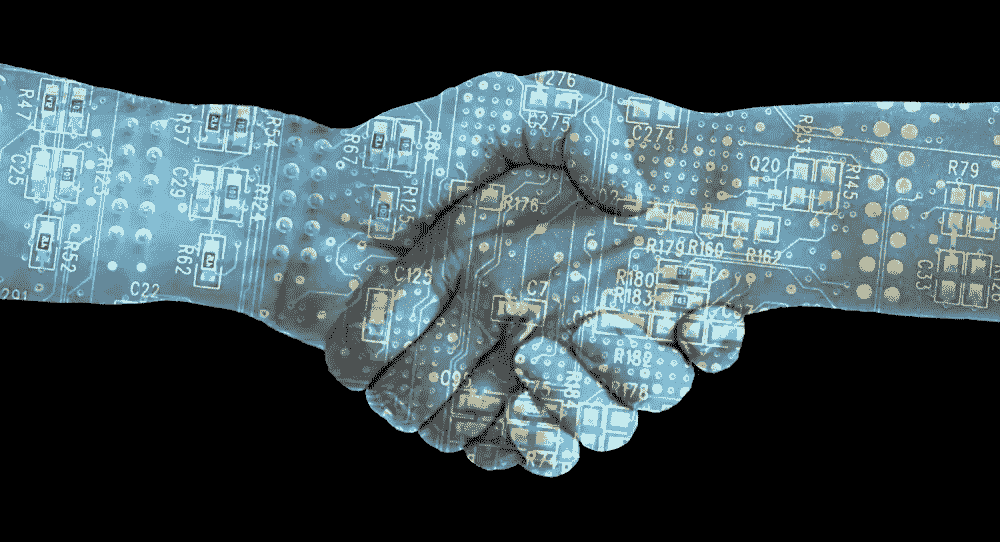
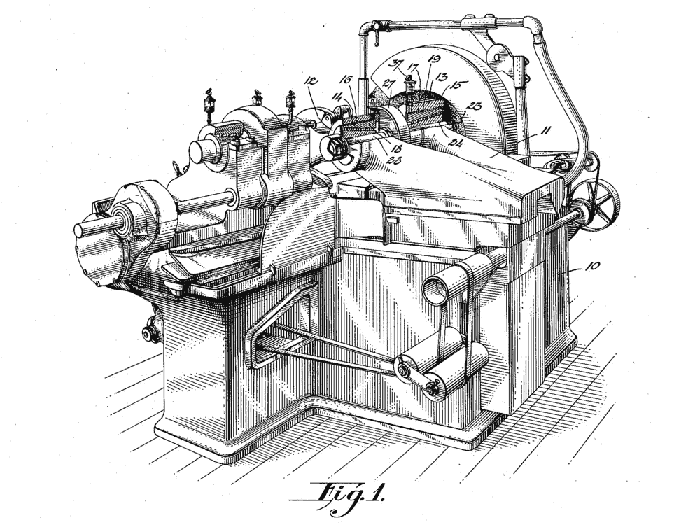

# 标准化区块链协议将如何改变知识产权管理

> 原文：<https://medium.com/hackernoon/how-standardizing-blockchain-protocols-will-transform-intellectual-property-management-116a4f5b86bd>

[https://digitalswitzerland.com/2017/04/19/fintech-landscape-switzerland/blockchain-consensus/](https://digitalswitzerland.com/2017/04/19/fintech-landscape-switzerland/blockchain-consensus/)

如今，管理知识产权(IP)是一个缓慢而繁琐的过程，这使得注册、结算和协调的责任首先落在了知识产权所有者身上。对于内容创作者来说，这为他们行使内容货币化的权利制造了障碍。对于授权出版商和分销商来说，缺乏知识产权可访问性和监管造成了一个灰色区域，第三方可以利用这一区域并从中获利。

> **区块链技术有望提供一种更有效的方式来创建和维护知识产权的共享记录，使创作者、出版商和分销商受益。**

为了理解在哪里以及如何实现成本效益，我们必须首先理解当前建立知识产权的过程。目前，创建知识产权必须遵循不同的程序，这些程序因地理位置、管辖范围和知识产权类型而异。在美国， [*版权保护*](https://www.copyright.gov/help/faq/faq-general.html#what) 从原创作品被 ***“以直接或借助机器或设备可感知的有形形式创作并固定下来”的那一刻开始确立***

虽然版权在创作时就已确立，但 [*版权登记*](https://www.copyright.gov/registration/) 的负担仍由版权所有者在美国版权局完成。注册对于声明可行使的所有权至关重要，因为作者的数字作品很容易在网上复制或伪造。没有登记，对结算和和解的要求可能会被拒绝或打折扣。

# 区块链通过设计保护知识产权

这是区块链理工证明有价值的一个领域。区块链可以防止数字伪造，包括作者作品、艺术作品和证书，通过使用[三重记账](https://www.quora.com/What-is-Triple-Ledger-Accounting)来跟踪它们。就像比特币通过分散不可变的共享公共账本消除了数字货币的双重支出问题(T21 ),区块链可以在知识产权方面实现同样的结果，并通过设计消除重复索赔的产生。

有许多崭露头角的区块链初创公司专注于解决知识产权管理的特定方面——从版权注册到追踪出处，以及通过智能合同执行知识产权纠纷。然而，让专利办事员、知识产权律师和他们合作的可信中介网络遵守准确代表知识产权主张的区块链标准是一项艰巨的任务。诀窍是就如何最好地分散知识产权监管达成共识，以便所有数字和人为因素都得到考虑并达成一致。

[https://www.bernstein.io/](https://www.bernstein.io/)

虽然有许多竞争的区块链知识产权创业公司(如 [Po.et](https://www.po.et/) 、 [Lexit](https://www.lexit.com/) 、 [Bernstein](https://www.bernstein.io/) 等)。)和标准联盟(例如 [COALA IP](https://www.coalaip.org/) 、[分散身份基金会](https://identity.foundation/)和 [W3C](https://www.w3.org/) )试图创建新的协议和标准，团队之间的通信经常是分散的。

**解决这个** [**最后一英里问题**](https://en.wikipedia.org/wiki/Last_mile) **需要的是一个可扩展的开源标准，它可以适应现存的声明和未来的需求，同时补充当今可信中介的尽职监督。为了实现这一目标，区块链技术的老守卫者和新使用者之间需要进行更好的沟通。法律联盟、商业财团和可信的证书社区可以帮助引领潮流。**

# 标准化分散式 IP 管理

在她的基础白皮书[“向心标准化:自上而下和自下而上的价值创造矢量”](/learning-machine-blog/centripetal-standardization-cc33e23a1acb) [中，Natalie Smolenski](https://www.linkedin.com/in/nataliesmolenski) 概述了标识符和验证者社区如何通过贡献来自光谱两端的专业知识来建立标准化共识。

例如，作者、艺术家和发明家确定他们的数字作品应该考虑的相关属性。

基于他们的专业经验，这个 ***【标识符社区】*** 集体地为他们领域内的属性赋值。然后， ***“验证者社区”*** 拥有知识产权验证方面的专业知识，评估被赋值的属性，以便设计一个用于管理知识产权的公共的、分散的标准。

在标准化过程中，两个团体协商用例，这些用例随着时间的推移而发展，以说明新的和不断发展的边缘用例。

今天，我们看到新的、分散的知识产权标准正在政府联盟、商业联盟和非营利标准机构中形成，如 [W3C 证书社区组织](https://www.w3.org/community/credentials/)。

一个特别令人兴奋的例子发生在[数字商会的](https://digitalchamber.org/) [区块链知识产权委员会(BIPC)](https://digitalchamber.org/initiatives/blockchain-intellectual-property-council/) ，该委员会 ***“通过教育、宣传以及与政策制定者、监管机构和区块链行业密切合作，促进数字资产和基于区块链的技术的接受和使用”* (** [**来源**](https://digitalchamber.org/wp-content/uploads/2018/03/Blockchain-Intellectual-Property-Council-White-Paper-Electronic-FINAL.pdf) **)。**

[https://www.banklesstimes.com/2017/03/06/dc-blockchain-summit-begins-mar-15/digitalchamber/](https://www.banklesstimes.com/2017/03/06/dc-blockchain-summit-begins-mar-15/digitalchamber/)

与 70 多家公司一起工作，包括行业领导者，如[埃森哲](https://www.accenture.com/us-en)、 [Blockstream](https://blockstream.com/) 、 [BNY 梅隆](https://www.bnymellon.com)、 [Chain](https://chain.com/) 、[思域](https://www.civic.com/)、[德勤](https://www2.deloitte.com/us/en/)、[数字货币集团](https://dcg.co/)、 [Discover](https://www.discover.com/) 、 [Hyperledger](https://www.hyperledger.org) 、 [Linux 基金会](https://www.linuxfoundation.org/)、[微软](https://www.microsoft.com/en-us/)、

这种类型的组织的直接好处是，符合新标准要求的共享公共分类账可以被法律专家和知识产权创造者公开引用。在解决和解争议的情况下，由于区块链记录的时间戳和不可改变的性质，追踪知识产权来源变得微不足道。**这种效率将使知识产权创造者安心受益，并帮助诉讼律师加快处理每年提交法院的** [**数千起专利案件。**](https://www.pwc.com/us/en/forensic-services/publications/assets/2014-patent-litigation-study.pdf)

在如此多的领先公司中达成区块链知识产权最佳实践的广泛共识，也将有助于加速特定行业用例的开发，如 [Blockcert 的学术认证服务](https://www.blockcerts.org/)和 [Artory 的区块链艺术注册中心](https://cointelegraph.com/news/blockchain-art-registry-acquires-database-with-info-from-4k-auction-houses)。在未来的几年里，标准支持的区块链将帮助把索赔登记和管理的负担从个人转移到区块链、知识产权专业人员和监管机构的分散网络。通过这种方式，区块链将有助于重新分配信任，并使所有相关方更容易获得和更有效地管理知识产权。