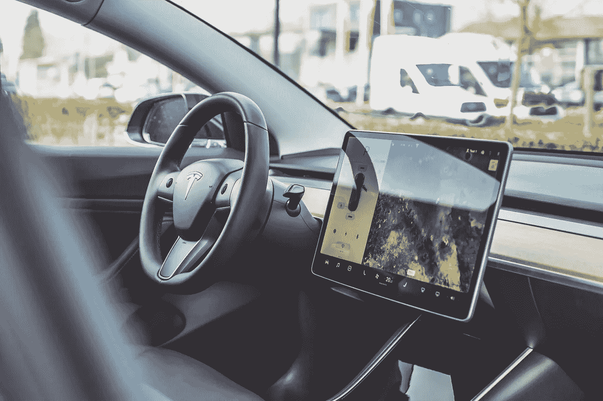
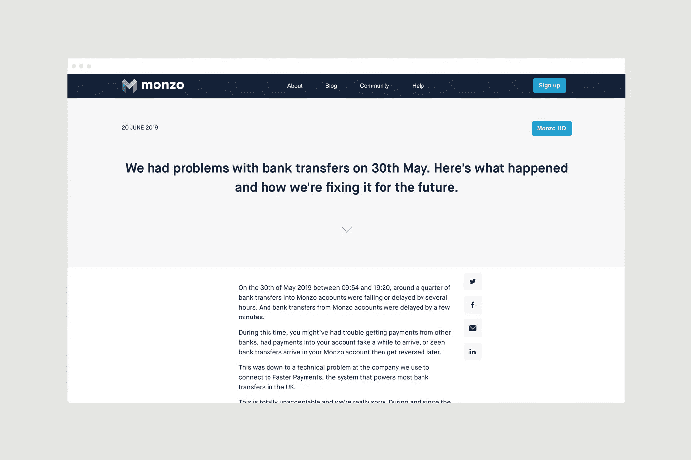

# 技术升级如何建立信任以增加转化率

> 原文：<https://medium.com/hackernoon/how-tech-scaleups-can-build-trust-to-increase-conversions-4bd157553ce7>

对于任何决心为目标受众扩大和发展技术产品的人来说，信任是一个巨大的考虑因素。

这是许多人与技术升级者交谈的话题，也是一个永远不会消失的话题。理应如此。

知道如何设计能建立信心和信任的产品是从一开始就给人们想要的东西的重要一步。

它需要最高的可靠性和适用性，尤其是在新用户关注的范围内。如果你能证明你能快速有效地解决他们面临的问题，你就离获得你产品的忠实用户——甚至是超级用户——更近了一步。显然，这对参与度和口碑增长的好处是无价的。

如果你在问自己如何打造一款能让目标受众产生信任的产品，那你来对地方了。以下是你的科技公司如何吸引人们的需求，培养积极参与的受众，并最终推动更多的转化:

# 留下正确的第一印象

在你的科技产品背后的 UX 的设计阶段，始终牢记一件事是至关重要的:你想与你的客户建立的关系。

你只有一次机会留下第一印象，因此[设计与客户获取](https://www.simonmccade.com/blog/the-business-benefits-of-great-ux-at-your-tech-startup)和保留密不可分。很简单，如果顾客对你的产品的第一印象是无法满足他们的需求，你就不会留住他们，因此，你也不会赚钱。

他们会去别的地方——他们经常去；[Adjust](https://www.adjust.com/blog/unmasking-uninstalls/)对全球应用卸载的分析显示，人们在最后一次使用应用后仅仅六天就将其从手机中删除，这有时可能是他们使用应用的唯一时间。此外，数据显示，特定业务应用平均只能持续 7 天。

Build trust via live product demos

> *你只有一次机会留下第一印象，因此设计与获得和留住客户密不可分*

这意味着，如果他们没有将免费试用转化为积极参与的客户，那么很大一部分营销预算都被浪费了。

作为设计师，我们必须记住，如今人们带着新的愤世嫉俗的态度来看待新的应用、产品和体验，因此赢得信任的风险比以往任何时候都高。

# 优化您的入职流程

从用户开始使用一个产品的那一刻起，就用一百万个问题来轰炸他们不是一个好办法。最终，泄露个人信息需要建立一定程度的信任，即使这是在你[入职过程](https://www.simonmccade.com/blog/4-ways-your-tech-startup-can-optimise-onboarding-for-new-users)的几秒钟内。

Design a great product experience that’s almost self-explanatory

在要求某人注册或更重要的是升级之前，教育你的产品的真正好处是必不可少的。如果你的产品没有将这一点融入到它的入职流程中，它只会滋生困惑、怀疑和不信任。

如果产品的体验是令人愉快的，不太专横，也不太苛刻，用户分享自己信息的开放程度会随着时间的推移而增加。

让他们习惯这种体验，如果他们愿意，让他们四处看看，让他们看到你产品的价值，然后再向他们询问你需要的有价值的信息。这些循序渐进的步骤，一次一个任务，确实有助于缓慢但稳定地建立用户的信任。

# 避免压倒性用户

科技产品本质上是复杂的，这是无法回避的事实。通常在很短的时间和很小的屏幕空间内要呈现大量的信息，所以这是设计人员和开发人员经常头疼的问题。

Don’t give your customers too much to think about. Tesla model 3’s approach to their cabin design.

因此，重要的是要记住，简单是关键。已经有很多尝试过的方法来鼓励用户在你的产品中做你想让他们做的事情，所以尝试重新发明轮子是徒劳的。通过给人们他们想看的东西来提供价值，不要让体验过于复杂。

> *在合适的时间提供适量的内容，以免吓跑你的客户*

向你的第一次用户展示小而易操作的步骤，这样他们就可以习惯这个产品及其 [UX 和 UI](https://www.simonmccade.com/services) 。用户测试总是一个很好的方式来了解你的潜在客户什么时候会愿意透露他们的个人信息，所以一定要利用这些机会来设计一个更好的产品。

# 诚实透明

我们生活在一个精明的用户和严格的数据政策的世界，因此在涉及客户信息时尽可能公开和诚实是非常重要的。

坦诚、透明地介绍你的公司、你的产品的特点以及你想要别人的个人信息的原因是值得的。留出空间告诉他们他们的数据将如何被使用，不要在这一点上偷工减料——从长远来看，你的受众对你的产品的信任可以得到提高(只要看看 [Monzo 和诚实显然是他们的最佳政策](https://monzo.com/blog/2019/06/20/why-bank-transfers-failed-on-30th-may-2019))。

Monzo — Honesty is its best policy

如果额外的数据有助于改善体验，比如在[顶空应用](https://www.simonmccade.com/blog/headspaceapp)中，告诉他们事实如此，这就是你需要它的原因——毕竟，每个人都希望数字体验尽可能对用户友好，所以你有机会从一开始就通过向人们提供更多与他们相关的信息来建立信任。

# 用高质量的视觉设计取悦用户

不管我们喜不喜欢，当谈到科技产品时，我们都有以貌取人的罪过。如果某样东西很漂亮，它通常会被认为比看起来不舒服的东西更容易使用，而且整体体验更好。如果某样东西设计得很差，它通常被认为是不太有用的产品，不能满足需求。

Make life easier for people and they will love your product

数字体验的每个方面都对其可用性有影响——设计、调色板、文案中的语调。为了赢得客户的尊重和信任，你需要尽早传达出你是专业的、可靠的。

当然，说起来容易做起来难，尤其是当涉及到 CSS 框架之类的东西时，所有的东西和人看起来都一样了。这种方法没有竞争优势。

新用户总是想知道他们在哪里，以及他们的需求是否会得到满足。如果你的产品使这很难实现，他们会变得沮丧，可能会取消他们的订阅。

一定要通过清晰的导航、良好的沟通和视觉上吸引人的 UI 设计来提升可信度和信任度，给自己最大的成功机会。

> *新用户总是想知道他们在哪里，他们的需求是否会得到满足*

# 将信任放在首位

无论你发现自己处于生产的哪个阶段，信任必须总是在你的设计的最前沿。如果你利用增加的参与度来理解他们的行为，并不断调整和改进你的产品，这种优势可以持续你的产品的整个生命周期。

只要你知道任何这样的改变都是互利的，你就能很好地吸引未来的科技用户。

Build trust into your product for long-term customer relationships

# 面向未来的技术产品

信任贯穿于首次用户的每一次数字体验。你在哪个部门并不重要；你不能让它成为事后的想法。在金融科技领域尤其如此。

这不是一件容易的事情，但是在你的产品设计中建立信任可能意味着用户从试用转为完全订阅和用户永远离开之间的区别。

你需要帮助你为用户建立信任和信心吗？[立即联系](https://www.simonmccade.com/contact)安排一次咨询，我们将看看如何共同努力，让您的技术产品经得起未来考验。

需要其他建议吗？请求我的免费备忘单，其中包括“47 个[可起诉的 UX 黑客来修复你的应用](https://www.simonmccade.com/ux-hacks-to-fix-your-app)”。

感谢您花时间阅读这篇文章。如果你觉得它有帮助，请让我知道。👏👏👏

如果你想了解更多，请查看我的[博客](http://www.simonmccade.com/blog)的定期更新。

*原载于*[*https://www.simonmccade.com*](https://www.simonmccade.com/blog/how-tech-scaleups-can-build-trust-to-increase-conversions)*。*