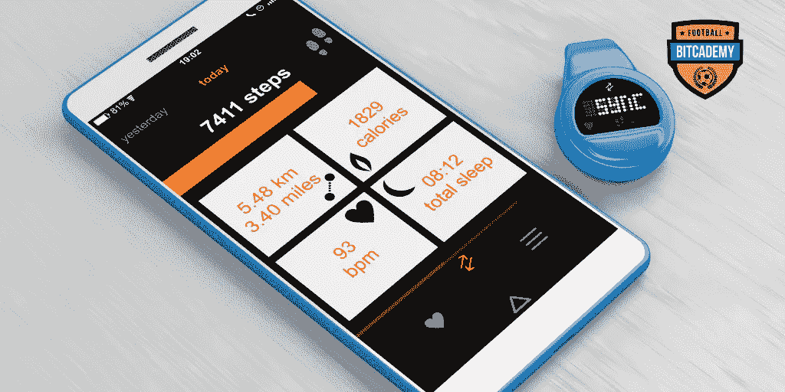
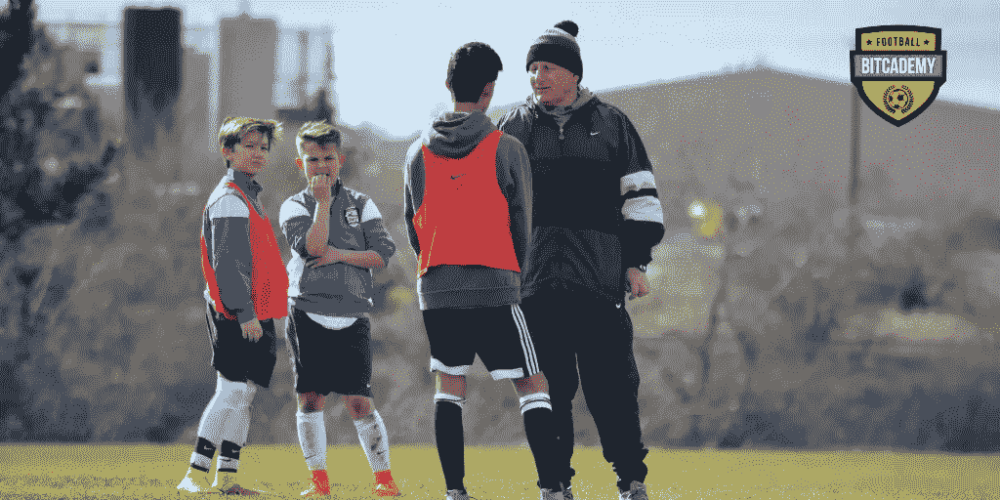

# 技术如何跟踪体育进步…

> 原文：<https://medium.com/hackernoon/how-technology-can-track-progress-in-sports-c3bd5f161837>

追踪器。GPS 追踪器。它已经成为现代跟踪技术的基础。它启动了监测和测量人体和运动员表现的复杂过程。它提供了关于两个主要指标的重要信息:距离和时间。

时间是一切的基础。可能就这么简单:如果你的时间更快，你的健康状况有所改善，你的实际表现就更好。每个教练都知道时间是至关重要的，围绕时间建立你的训练策略是一个非常有效的工具。它简单而有效，但不幸的是，它有局限性。

职业运动中时间的问题在于，你一直在改进它，直到你碰壁，在那里你不再进步，你不能做得更好。你必须尝试找到其他方法来改善你的训练，寻求进步，而不仅仅是简单地依靠多长时间，而是如何。你开始改变你的实践，你不仅开始测量时间，还开始测量时间和两点间距离的组合。以一种自然的方式，你必须开始使用统计数据，让你了解你的进展——速度，距离，短跑和一些加速和减速，等等。

然后，你尝试扩展核心统计数据，并达到更多。计算可以扩展到距离和时间范围内的下一组指标，即代谢指标。这里发生的是在移动、训练和跑步过程中能量消耗的计算。我们可以监测功率、代谢负荷或能量统计，以检查训练或比赛的强度以及训练恢复的进展情况。

所有这一切都来自一个设备——可以放在鞋子里，放在后面的背心里，或者放在足球袜里——追踪器(或 pod)。

当我们添加更多设备时，我们的选择也会增加。想象一下，你有一块手表可以监测你的脉搏。这为监测每分钟心跳次数、运动区域、压力负荷和其他许多项目提供了另一种可能性。

此外，我们可以在球场周围设置一组摄像机，以便进行更多的深入统计。想象一下，你非常密切地观察玩家行为，并将这些数据映射到你软件中的 AI 组件，在那里，机器将随着时间的推移进行学习，以在玩家之间进行比较，指出他们的弱点，并应用解决方案以进一步改进和发展。所有的东西放在一起会给你一个完整的播放器监控设置。

像任何统计数据一样，如果没有适当的分析，它将变得毫无价值，现代足球中最有权力的人来了——体育科学家。

运动科学家负责数据分析和运动员提高的 4 个主要支柱:健康、健康、工作负荷和表现。

健康负责整体准备。我们对其进行分析，以跟踪训练和非训练期间的睡眠模式、压力模式、疲劳和情绪。正确的分析可以大大增加受伤预防的机会。

Health 可以跟踪球员受伤情况，并管理理疗师提供的所有医疗数据。想象一下，它可以存储在区块链上，因此它的可靠性增加。

当我们监测运动员是否过度训练或过载时，工作量就开始了。所有进行高强度训练的运动员都在受伤和最佳表现之间的细线上保持平衡。工作量在训练中保持平衡，确保你不会因为令人失望的表现甚至受伤而训练过度。很少有指标可以监控这一点，它们都基于实际的正确训练负荷。

另一方面,“进步与表现”可以记录你的结果，并在将来进行比较。我们的人工智能解决方案从您过去的表现和您现在的训练中学习，并为您提供如何训练的指示，以便在未来获得更好的结果。这有助于规划未来的训练周期，激励运动员更加努力。

总的来说，一切都是为了运动员的发展。硬件做出正确的测量，但数据分析才是最重要的。统计数据和未来预测为体育科学家制定适合体育发展的最佳计划提供了最佳途径。