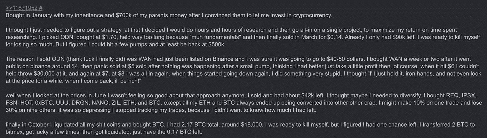
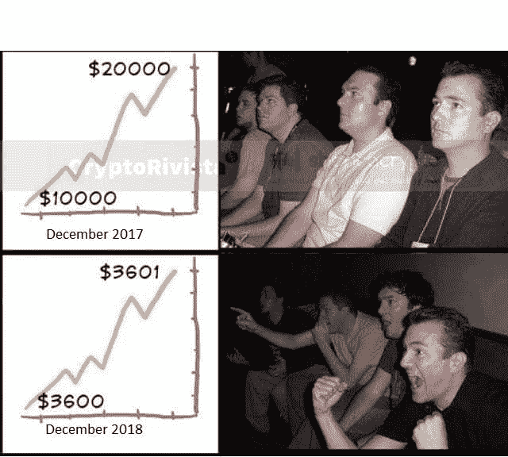
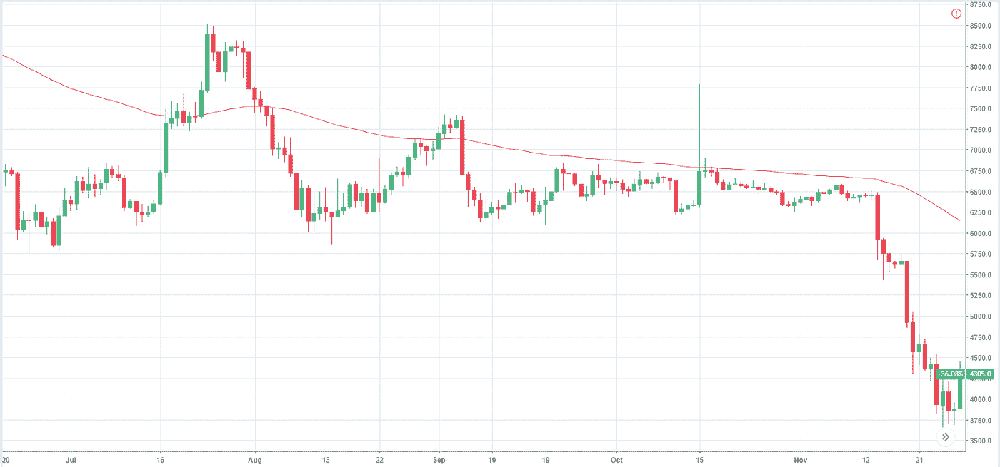

# 一年来密码市场如何变化:在当今市场保持盈利

> 原文：<https://medium.com/hackernoon/how-the-crypto-market-changed-over-the-year-staying-profitable-in-todays-market-e5b3b9dad5a2>

# 介绍

熊市开始已经快一年了，自去年 12 月以来发生了很多变化。特别是价格，因为围绕加密货币的大多数焦点本质上仍然是投机性的，我们将讨论这如何影响交易，以及过去有效的一些东西如何不再有效。

# 投资与交易

加密货币投机者要么是投资者，要么是交易者。投资方法之间的区别主要与时间有关。投资者是那些愿意长期持有更多密码的人，而交易者可以在一天内多次交换大量密码。

去年，当价格每周都达到历史高点时，成为加密货币投资者很容易——你只需买入并持有。如今，如果你全年持有比特币，作为投资者，你会看到 1 月份 171441 美元的高点下跌了 80%，跌至目前的 3368 美元。

像我这样积极交易的人现在无法交易，因为价格不断下跌，所以没有任何赚钱的机会，每次购买加密货币都是为了在熊市中翻转它，而不是冒险

从去年 9 月到 11 月底，我使用的第一个策略是刷单。我过去常常做订单簿，大批量进货，小批量盈利。在市场不断下跌的情况下，这将是一个非常冒险的策略，所以当比特币价格下跌时，用所有的资本冒险，这将是一个愚蠢的举动。

此外，去年当价格呈指数增长时，增加你的比特币持有量的一种方法是通过交易替代比特币对。你只需在 ICO 期间或在交易所上市时找到一个便宜又新鲜的替代比特币，然后等一个月左右，然后爆炸，瞧，你就赚了 300%多的比特币。

在某种程度上，替代比特币被用作杠杆，以增加比特币价格本身升值带来的利润。现在，如果你要购买 altcoin，你只会在不利的情况下使用杠杆，并看到你的投资组合价值下降得更快。

# ICOs

去年，大多数投资都是在 ICO 上，因为市场信心很强，围绕区块链技术的炒作达到了狂热阶段，以前甚至没有任何 cryptos 的人都跳上了 ICO 的马车。

对于那些之前没有投资比特币的人来说，ICO 是一个很好的入口，他们有机会在短时间内看到一些巨额利润，并赶上比特币的收益。

但现在，由于许多 ICO 未能兑现开发团队去年做出的并写入路线图的承诺，许多替代硬币将变为 0，许多 ICO 已被证明是一个彻底的骗局或彻底的失败

Earnst&Young 最近发布了去年 12 月 141 家顶级 ICO 评论的更新，其中 87%的资本流入了当月投资 ICO 的总资本。结果描绘了一幅严峻的画面:

关于创意的发展，在总共 141 个 ICO 项目中，只有 29%的项目制作了原型产品，并为此筹集了资金。

至于投资回报，86%的项目目前低于其购买价格，30%的项目价值损失相当大，如果投资者持有这些 ICO 的投资组合，从 2018 年 1 月 1 日起的平均损失约为 66%。

这加剧了当前市场悲观情绪的混乱，市场信心日益减弱。

# 当前市场

当前的市场状况可以用一个词来概括——看跌。自 1 月份以来，价格一直在下跌，偶尔会出现小幅反弹，但大多是在横向运动和低波动的时期。

这使得我们很难采用过去行之有效的策略。那些未能适应当前市场条件的人付出了巨大的代价——毫不夸张地说。

此外，我注意到，每一次小幅回调或小幅上涨都会被誉为下一轮“牛市”。这是出于痛苦

作为交易者，你不应该为价格上涨欢呼。不管市场情况如何，你都应该能够赚钱。这就是为什么应该应用新策略的原因。

# 在熊市和低波动时期赚钱

考虑到目前的市场条件是熊市，在低波动时期，赚钱的唯一可能的解决方案是通过卖空加密。

这是通过提供被称为保证金交易的服务的加密交易所或使用具有加密对 CFD 的外汇经纪人来完成的。对于那些不熟悉卖空的人来说，卖空是一个过程，首先以较高的价格(假设价格正在下降)出售密码，然后以较低的价格购买，从交易的差价中赚钱。

卖空只能通过保证金账户进行，因为借贷过程是进行卖空所必需的，因为你首先借入资产，然后立即将其出售给市场。

相对于借入资金的数量，你的投资额被称为杠杆，它有助于提高你的盈利能力，因此，当你能够做空市场时，你也能够最大化你的利润。

这在低波动性时特别有用，因为价格波动不大，所以高杠杆被用来在较小的百分比波动中赚钱。

在上面的图表中，你可以看到比特币的价格从 9 月 8 日持续到 11 月 14 日的 6596 美元的中间价上下波动了 5%。

这就是为什么 Prime XBT 将在 12 月底推出新的交易平台，当市场下跌时，你可以通过卖空来获利。这不仅可以获利，还可以对冲你的潜在损失。

此外，当市场横向运行时，您必须输入您预先确定的仓位进入和退出水平，这就是为什么 Prime XBT 允许用户设置他们的止损和获利水平，当然还有您的杠杆和仓位大小。

虽然我们谈到了杠杆，但许多现有的提供保证金交易服务的交易所只提供高达 1:3 的杠杆，这对于上面日线图上看到的 5%的涨幅来说并不算多。Prime XBT 将为其客户提供高达 1:100 的杠杆比率！

这意味着，在上述低波动性的例子中，当比特币价格为 6504 美元，仅上涨至 6773 美元，涨幅为 4.13%，以 1:100 的倍数计算，你将获得 431%的利润。是的，没错。

# 结论

在熊市中仍然有机会赚到一些钱。区分好交易者和坏交易者的首要因素是适应能力。那些做不到这一点的人会被击垮，失去一切，但那些适应并重新调整的人会得到回报。

如果你想在熊市中获利，你必须卖空并跟随趋势。试图等待和抓住底部也可能是危险的，正如一句谚语所说——不要试图抓住一把落下的刀(它可能会切掉你的手指)。