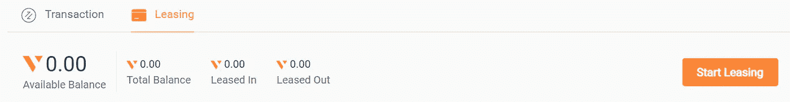
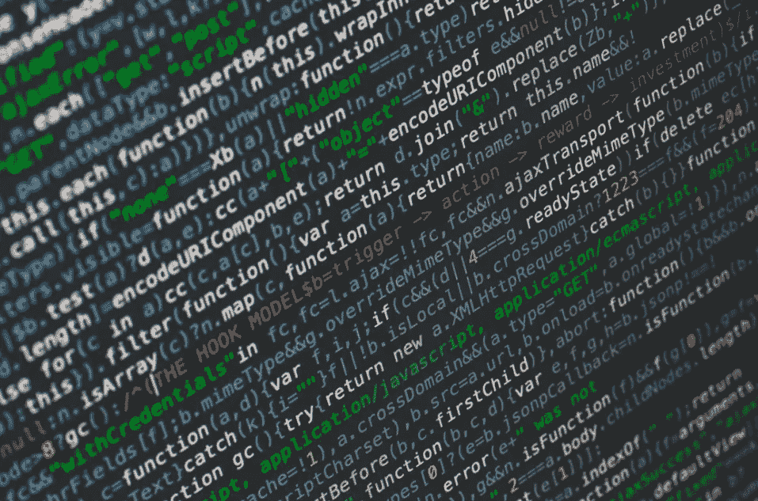

# 超级节点的发明如何提升区块链的 PoS 共识

> 原文：<https://medium.com/hackernoon/how-the-invention-of-supernodes-upgrades-blockchains-pos-consensus-989f458dba8b>

## 赌注奖励现在飙升得更高

It’s a bird! It’s a plane! It’s Supernode!

在某些圈子里，区块链开发商 Sunny King 是彻头彻尾的传奇人物。他在 2012 年的发明——利益相关共识证明——成为了一个流行的治理模型，目前在加密社区中被广泛采用。

Sunny 的新项目——[**V 系统**](https://www.v.systems/index.html)——正在创建一个分散的、基于云的区块链数据库，同时改进 PoS 的原始概念。

与比特币的资源密集型工作证明共识机制形成鲜明对比的是，PoS 利益相关者只需要将他们的密码存储在正确的钱包中。

股权证明意味着不需要昂贵或复杂的设备，并且环境足迹最小。

Sunny 的 PoS 项目最初的例子包括 Peercoin 和 Primecoin，这两个项目都促使其他 altcoins 效仿。

要找到一个将 Sunny 的 PoS 发明放在心上的创业公司的例子，只需看看 2014 年的 [**斗篷币**](https://www.cloakcoin.com/en) 。这个注重隐私的项目每年以网络原生硬币的形式奖励代币持有者 6%。

令牌持有者如何在不需要耗电的采矿钻机的情况下获得回报？预采，就是这样。

你看，不像比特币的矿工大军在争夺锻造砖块的权利时不断寻找奖励，斗篷币的所有供应都已经在流通。

没有硬币可以开采，因为它们都已经被‘发现’了。因此，霍德勒把硬币放在合适的钱包里——实质上成为网络封锁验证者——享受被动奖励。

这就是桑尼发明的美妙之处。有了正确的 PoS 模型，无需干预的加密奖励就像在您的 PC 或 Mac 上运行程序一样简单。

然而，SPoS——*super node*利害关系证明——改变了这一切。如果你习惯于操作专门的采矿硬件，SPoS *会升级*所有这些。

现在，在我们深入之前，你应该知道…

***免责声明*** *:这不是投资或理财建议。无论如何我都不是金融专家。本文中的信息主要是推测性的观点。在参与任何项目之前，无论是在神秘领域内还是在神秘领域外，都要进行自己的研究。*

我可能会也可能不会收到创建此内容的令牌分配。也就是说，我尽最大努力保持公正和公平。我尽量避免所有的 FOMO 和 FUD，不希望在我的同伴中引发这些情绪。你走到这一步了吗？恭喜你。你是前 1%的人，应该得到一枚奖牌。

既然我们已经弄清楚了，那就让我们开始吧。

# 抛物线发射

即使在这漫长的熊市中，一些项目也表现出色。

随着备受期待的代币销售上线，crypto exchange 币安的 Launchpad(包括 Tron 的 BitTorrent)最近推出的几款产品取得了巨大成功。在某些情况下，几分钟之内就卖出了数十亿代币，筹集了数百万美元。

类似地，中国的 ZB.com 发射台计划为 VSYS 项目带来了近乎瞬间的成功。总的来说，三次单独的交易花费了 60 秒多一点的时间——****&[**【ZBG**](https://www.zbg.com/#)——卖出了 4500 万美元的 VSYS 代币。****

****那么，VSYS token 大获成功背后的深层原因是什么呢？****

****首先，这个项目已经在 MainNet 上运行了。自去年 11 月以来，区块链 V 系统公司已经稳定地每四秒钟生产一次砌块。****

****但一个稳定的生态系统本身不会推动一个项目的代币销售进入售罄状态。虽然 VSYS 已经超出了概念验证阶段，但该项目对未来有着雄心勃勃的技术计划。****

****你看，ZB 平台*预测*VSYS 将成为以太坊的继任者。此次发布是该项目以及 IEO——初始交易所发行——提供代币的交易所的协调营销努力。****

****巧合的是，早在 2016 年，ZB 是第一个提供 ETH 交易对的中国交易所。这取决于你来解释这种相关性。****

********

****To earn VSYS coin block rewards, just get in line****

# ****人人平等****

****那么，V SYSTEMS 是怎么把超级放在 SPoS 里的呢？答案很棒:平等的铸币权。****

****与比特币的 PoW 机制以及最初的 PoS 不同，SPoS 不是随机的。****

> ****SPoS 块奖励不是来自玩和希望赢得加密乐透游戏。****

****取而代之的是，整块铸造仅仅通过成为下一个被奖励。截至发稿时——你可以在这里亲眼看到**——只有 15 个 VSYS 超级节点(铸币商)获得了“效率”评级。******

******这些采矿实体中的每一个都占据一个硬币铸造“槽”，该槽被定义为在网络上铸造新区块的权利的相等份额。简而言之，每个超级节点都具有相同的权重。******

******如果其中一个失败，另一个仅落后四秒钟，准备好并等待验证事务。******

******超级节点总共有 60 个时隙，每个时隙对应于一分钟内的一个特定秒。用秒除以当前超级节点得到数字 4。因此，每隔 4 秒钟，15 名矿工中的一名就会在链条上放一个新的滑轮。******

******然后，它返回到该行的末尾，等待所有其他超级节点轮到自己。又过了 60 秒，我们原来的节点又回到了最前面，再次铸造。******

******当前的 VSYS 超级节点不是等待几天、几周甚至几个月，而是每天的每一分钟都有回报。******

******更有趣的是:超级节点有资格通过租赁从其他利益相关者那里获得硬币。虽然他们既不能消费也不能交易租赁的硬币，但铸币商被鼓励支付有竞争力的租赁价格。******

******目前租赁硬币的支出达到了两位数。******

> ******运行在今天的 PoS 模型上的 CloakCoin，每年支付 6%——这通常被认为是不劳而获的好回报。另一方面，根据 SPoS 共识运营的 VSYS 的最高份额为 22% —超过 3 倍！******

******所以，如果你对运行高端采矿硬件感到舒适，你仍然有机会 [**申请自己操作一个 MainNet 超级节点**](https://docs.google.com/forms/d/e/1FAIpQLSf8ufbx3fl-nl7XZZVBNrkqN0Ssgv1hr0PFHOaEl-W2JCpWiQ/viewform) 。默认情况下，超级节点运营商的收入高于他们支付给贷方的高租赁利率。******

****但是，如果专业设备超出了你的能力范围，你仍然可以将 VSYS 硬币租赁给 Supernodes，以获得不干涉的被动收入。创建 VSYS 钱包后，您可以直观地从内部租赁:****

********

****然而，除了迅速推出和发明新的赌注机制，也许最有希望的是 V 系统公司如何帮助加快区块链的发展步伐。****

********

# ****云中的区块链****

****建设区块链可能是一个漫长而艰巨的过程。如果你是一个企业主，需要一个分散的、可扩展的数据库，区块链理工学院可能会让你望而生畏。****

****现在，V 系统公司提供解决方案的方法将有助于推动区块链工业向前发展。原因如下:****

## ****一个新的世界第一开发语言****

****该团队最近发布了他们自己的智能合同和令牌发布功能。智能合同方面来自 VSYS 自己的开发人员的工作。****

****开发友好型系统建立在一种 ***面向数据的*智能契约语言之上，允许即时创建区块链**——目前没有其他加密项目使用这种语言。****

## ****云开发平台****

****VSYS 正在创建分散的、功能齐全的数据库，用于存储面向对象的数据。他们的开发语言旨在简化区块链的构建过程。****

****开发人员获得了基于云的、模块化的、易于扩展的工具，这些工具可以轻松地将链放在一起。此外，这些模块支持多种共识算法。****

****用他们自己的话说:****

> ****“该项目将提供世界上第一个面向对象的通用分散数据库，以承载复杂的分散应用程序。”****

****提高 DApp 的增殖率使开发人员能够进行实验。这就是伟大诞生的地方。Gmail 本身——世界上大多数人都在使用的一个程序——起源于提供给谷歌员工的一个简单的创意渠道。****

****重点是，当开发人员可以快速构建链时，他们的链构建技能会越来越好。创新不可避免地随之而来。****

## ****定制、分散的云平台****

****数据泄露变得越来越普遍，大公司也越来越关注去中心化。数据黑客代价高昂——无论是金钱还是公司形象。****

****VSYS 为公司提供定制的交钥匙区块链迁移。云数据库降低了网络攻击的风险，保护公司免受入侵是一个快速增长的利基市场。****

# ****包扎****

****赌注回报的概念是我最初喜欢加密货币的驱动力之一。****

****Proof of Stake consensus drew me into the realm of crypto****

****谁不喜欢“白花钱？”赌注相当于在睡梦中赚钱，正如比尔·盖茨和沃伦·巴菲特所定义的，这是通往财富的唯一有效途径。****

****我承认在研究这篇文章之前，我不知道谁是 Sunny King。但是现在我很感激他给了这个神秘世界创新的发明。****

****就像比特币和以太坊一样，突破性创新在其生命周期中不断变化。而区块链发展的生命以极快的速度运转着。****

****除了在云中创建一个模块化的 DLT 游乐场，VSYS 还有一个新的区块链发明，为参与者带来超高的回报。****

****SPoS consensus 为当今的 PoS 机制提供了一个两全其美的升级。超级节点运营商充当矿池，利用收藏赚取更多的 VSYS 币。****

****面临技术挑战的钱包运营商可以轻松地将硬币出租给超级节点。就像我们已经对我们心爱的 PoS 硬币所做的那样，但速度要快得多。****

****VSYS 的总体主题是通用可扩展区块链。数以百万计。他们的目标是通过降低每个人的门槛来吸引开发者使用他们的平台。****

****我不知道你怎么想，但我觉得现在那些不创造硬币的人正在错过机会。随着 Tezos 和其他赌注硬币在比特币基地专业版上变得可用，机构投资者开始看到被动赌注奖励的价值。****

****一旦世界意识到 PoS 和现在的 SPoS 加密货币提供的回报，人们开始涌向这些类型的项目只是时间问题。****

****虽然任何硬币都可以选择在主节点或超节点下运行，但区别在于底层技术。更简单、建造更快的区块链是这个行业受欢迎的新成员。****

****请记住，我只是一个区块链爱好者。只是一个固执己见的网络作家。也就是说，鉴于我评估区块链初创公司的历史，VSYS 是我一直关注的一个项目。****

## ****顺便说一下…****

****如果你喜欢你刚刚读到的内容，并且想帮助你把你的加密信息传播给大众，我很想听听你的项目。****

****即使你只想聊聊加密或你最喜欢的区块链创新，你也可以在这里找到我:Gmail 的 blockchainauthor****

****并且，你可以随时联系 [**加密推特**](https://twitter.com/CryptoBlastoff)****