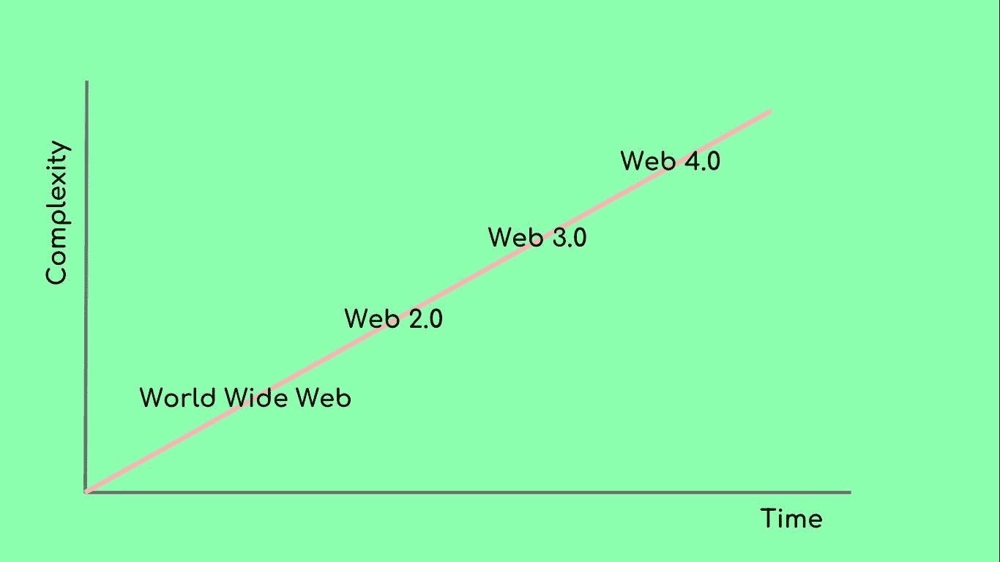
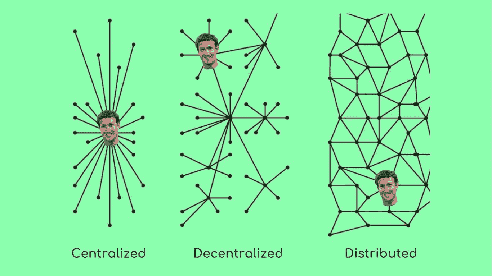
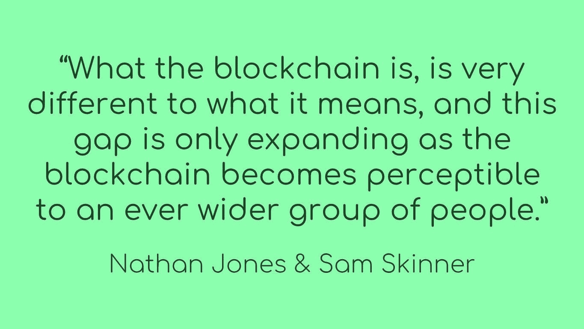
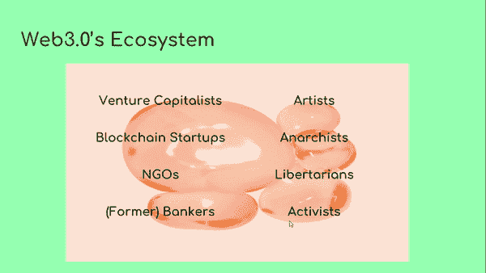
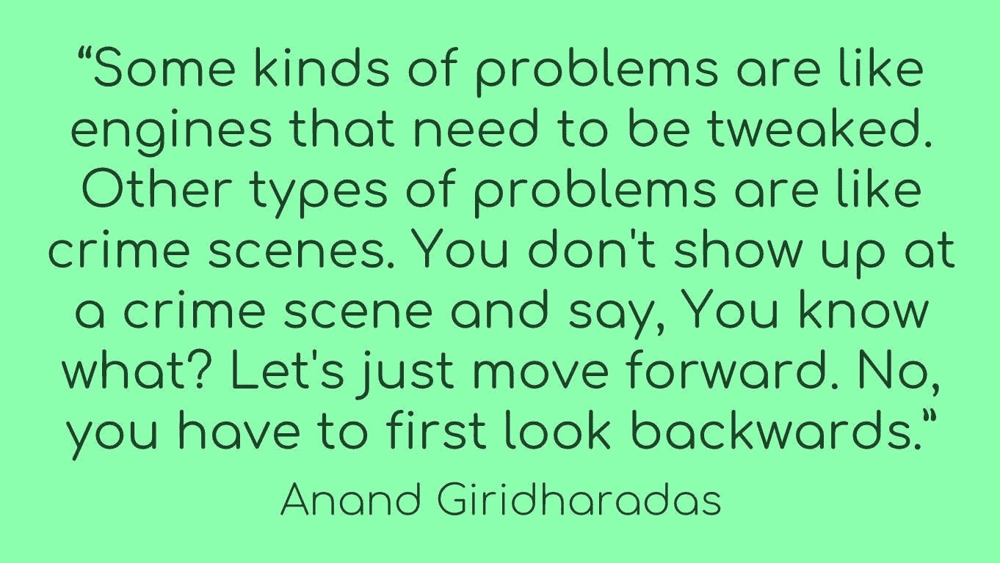

# Web 3.0 的乌托邦式愿景如何与现实发生冲突

> 原文：<https://medium.com/hackernoon/how-the-utopian-vision-of-web-3-0-clashes-with-reality-60a8dfb2fb3b>

我们所知的互联网已经崩溃了。谷歌和脸书创造了数据孤岛，我们在其中失去了对信息的控制。这个故事你已经听过十几次了。但是据从事 Web 3.0 工作的人说，他们能够解决所有这些问题。

Web 3.0 被[提议](https://www.nytimes.com/2006/11/12/business/12web.html)为互联网可能进入的下一个进化阶段。90 年代初，第一个互联网浏览器标志着万维网的开始。当时，人们只能访问没有任何互动内容的静态网站——从今天的角度来看，相当无聊。然而，人们通常会自己托管他们正在共享的数据，因此对他们与谁共享什么有更多的控制。不利的一面是，这使得在互联网上发布内容只有那些拥有适当技能的人才能访问。

*Some people believe in progressive evolution. Web1.0, Web2.0, Web3.0, Web4.0 anyone?*

随着更多的光纤，互联网变得更快，用户能够分享音乐、视频和图片。这也是 Flickr、脸书和 YouTube 等新平台的出现，它们在一定程度上使内容发布民主化。这是 Web 2.0 的开端，今天的问题在这里开始具体化:信息在围墙花园中结束，或者在用户对其没有太多控制的情况下被货币化。

Web 3.0 旨在将 web 2.0 的易用性与用户在互联网早期享受的控制和隐私结合起来。数据属于创造它的人，但用户不需要建立自己的网站，祈祷有一天有人会偶然发现它们。这是通过服务的互操作性来实现的。也就是说，你可以通过电报向朋友发送 WhatsApp 信息。或者把你的 facebook 数据放在一个不归 facebook 所有和控制的服务器上。这个想法绝不是新的，像 [XMPP](https://xmpp.org/) 这样的协议在 90 年代就是这样做的。同样，这也是我们一直以来交换电子邮件的方式。

## **社会分散网络**

在像脸书这样的集中式社交网络中，马克·扎克伯格正处于中间位置。他可以检查你的数据，然后卖给广告商。在分散式或分布式网络中，Mark 仍然存在，但并不控制所有流经网络的数据。这是通过协议层的去中心化实现的:这意味着您在一个地方共享的数据可以与另一个服务互操作。Web 3.0 运动不仅仅局限于信息传递，还希望数字身份和支付变得分散化。这可以通过区块链来实现。

那么什么是区块链呢？这句话很好地总结了这一点:

当你听到区块链，你可能会想到比特币和投机。这很公平，因为这正是区块链成为头条新闻的原因。基本上，区块链只不过是一个分散的数据库。想想上面的分散式网络，网络的每个节点都存储着相同的数据。并且持续保持同步。([下面是](https://blog.goodaudience.com/how-a-miner-adds-transactions-to-the-blockchain-in-seven-steps-856053271476)这是如何工作的细节)。分散数据增加了额外的安全性和透明度。它还使存储的数据不可变，这意味着它不能被更改或删除。这对财务电子表格来说非常好。但派对照片和私人文件就没这么多了。

## **谁在研究这个？Web 3.0 生态系统**

如果我们看一看 web 3.0 生态系统和构建它的不同人，我们会发现区块链福音传道者和活动家之间有一种古怪的混合。有老派的秘密无政府主义者，也有投资者、银行家、自由主义者、创始人、艺术家、非政府组织和活动家。

特别是，观察投资者为创造“更好”的互联网投入资金是很有趣的。以一家大型硅谷风险投资公司 A16Z 为例，该公司此前投资了脸书、Instagram 和 Airbnb。但他们同样投资了几家 web 3.0 初创公司，这些公司承诺的互联网与之前的投资所代表的完全相反。例如 [Keybase](https://keybase.io/) ，这是一个隐私友好的信息服务，在 2015 年的首轮融资中获得了 1000 万美元。

我最喜欢的例子是:爱德华·斯诺登。这位被困在俄罗斯的美国国家安全局告密者，现在是一位启用 skype 的主题演讲人，去年在柏林的 Blockstack 会议上做了一次演讲。Blockstack 在 2017 年的首次硬币发行中筹集了超过 5000 万美元，并有一些非常知名的投资者。其中有[联合广场风险投资](https://www.usv.com/portfolio)、[文克莱沃斯资本](https://winklevosscapital.com/portfolio/)和 [Y 组合投资](https://www.ycombinator.com/topcompanies/)。Blockstack 对由硅谷投资者赞助的自由开放互联网的愿景，在我看来与爱德华·斯诺登的价值观略有冲突。

活动家和投资者的这种奇怪组合显示了一种有趣的趋势:Web 3.0 的开发者们正在重演活动家们很久以前就已经拥有的梦想。不同的是区块链的追随者来自一个完全不同的地方。他们是由风险资本资助的自由主义者，不介意在这个过程中发财。而激进分子传统上用很少的(政府)资金来建立他们的反监视工具。

当谈到 Web 3.0 和区块链社区提出的解决方案时，也有很多令人困惑的地方。这个领域的许多初创公司，尤其是那些以区块链命名的公司，出售准代金券来筹集资金。像这样，他们可以绕过证券监管，在几秒钟内筹集数百万美元。想象一下，一家航空公司出售飞行常客里程来为其机队的扩展融资。投资超过几千欧元有点可笑，因为世界上没有人会飞那么多。但通过让这些代金券(即代币和硬币)在网上交易所交易，赌博开始了。价格膨胀，因为每个人都相信他们投资了下一件大事，扼杀了许多项目的最初目的。

现在，一到两年后，很多公司还没有交付他们承诺的产品。或者更糟:他们有，但没人用。Web3.0 是完美互联网的乌托邦，这就是为什么它可能也吸引了包括我在内的许多不同群体。艺术家也是如此。

例如，有所谓的加密狂欢现象。一年前，英国连线杂志刊登了两位策展人汉斯·乌尔里希·奥布里斯特和本·维克斯关于柏林新现象的报道。区块链上的狂欢。不管那是什么？基本上，Vickers 和 Obrist 是在艺术和密码领域。就像初创公司提出的许多产品一样，这些加密狂欢从未存在过。

一年后的今天，加密狂欢真的开始了，不是由风投资助，而是由欧盟资助。集体 [RaveEnabler](https://thennn.eu/events/cryptorave/) 组织全欧洲的加密狂欢。为了参加，你需要让你的电脑运行 12 个小时，以挖掘一种名为 Monero 的加密货币，然后让你进入狂欢。这有点令人难过，因为它打破了乌托邦式的神话——就像用塑料做的[耶稣像。Ou-topos 在希腊语中的意思是无处可去。有趣的是，第一次真正的加密狂欢发生在雅典。然而，归根结底，这只是一个普通的聚会。无论是否启用了区块链。整个空间都是如此。](https://books.google.de/books?id=9Z9biHaoLZIC&pg=PA4&lpg=PA4&dq=But+what+becomes+of+the+divinity+when+it+reveals+itself+in+icons,+when+it+is+multiplied+in+simulacra?&source=bl&ots=3NU9iZavoW&sig=ACfU3U1BPSjZImpTpuNQKIzi9hyPahI5hA&hl=en&sa=X&ved=2ahUKEwjs5P79x-PhAhUPzaQKHb-UAMwQ6AEwAHoECAoQAQ#v=onepage&q=But%20what%20becomes%20of%20the%20divinity%20when%20it%20reveals%20itself%20in%20icons%2C%20when%20it%20is%20multiplied%20in%20simulacra%3F&f=false)

## 我们都将成为亿万富翁

最终，这些项目中的许多很快放弃了让世界变得更美好的计划。有人曾在区块链的一次活动中对我说，“我们都将成为亿万富翁。”也许这就是安迪·沃霍尔的“在未来，每个人都很出名”到“在未来，每个人都将成为亿万富翁”的演变问题是，去中心化并不意味着“去财富化”或“去权力化”，而仅仅是去基础设施化。不多也不少。

Anand Giridharadas 建议，我们应该先问一下[发生了什么事情](https://www.jwz.org/blog/2018/10/engine-problems-versus-crime-scene-problems/)才走到这一步，而不是构建更多的解决方案来解决问题:

我们很可能不会通过创建一个新的、去中心化的脸书来修复互联网，这个新的、去中心化的是由已经支持了最初的脸书的同一个硅谷风投支持的。

*喜欢这个故事吗？然后留下一个巴掌。有反馈吗？我很想听听。*