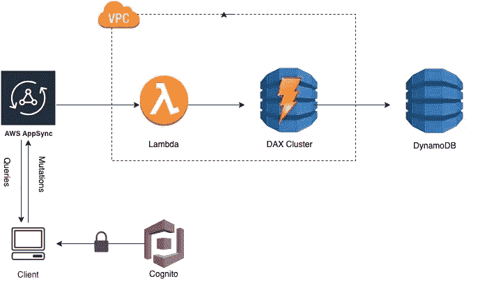

# 如何向无服务器 GraphQL AppSync API 添加缓存层

> 原文：<https://medium.com/hackernoon/how-to-add-a-cache-layer-to-appsync-dynamodb-resolver-be924842916b>


在这篇文章中，我展示了一个基于**无服务器**框架的简单应用程序的例子。应用使用亚马逊 Appsync，Lambda，DynamoDB，**亚马逊 DynamoDB 加速器(DAX)** ，演示如何在 AWS Appsync 解析器前使用亚马逊 DAX 作为缓存层。

> Amazon DynamoDB Accelerator (DAX)是一个完全受管的、高度可用的、用于 [DynamoDB](https://aws.amazon.com/dynamodb/) 的内存中[缓存](https://aws.amazon.com/caching/)，它提供了高达 10 倍的性能提升——从毫秒到微秒——甚至每秒数百万个请求。

## 一个简单的无服务器 CMS

本文中的示例应用程序是一个简单的 CMS。我使用无服务器框架模板来简化 Appsync 的设置。模板中创建 Appsync、Dynamodb、Cognito 身份池和用户池、DAX 集群、角色、安全组和子网组的部分，您可以使用它们进行自动和可重复的部署。

下图说明了应用程序解决方案:



## 无服务器框架入门

首先，您需要安装无服务器框架:

```
**$** npm install -g serverless
```

现在，让我们创建一个新的无服务器项目:

```
**$** sls create --template aws-nodejs --path simpleCMS
**$** cd simpleCMS
**$** npm init
```

创建的目录包括两个文件——handler . js 是 Lambda 函数。serverless.yml 文件包含后端的配置。

## 添加插件

你需要添加两个无服务器框架的插件: [**无服务器-appsync-plugin**](https://github.com/sid88in/serverless-appsync-plugin) 和 [**无服务器-伪参数**](https://github.com/svdgraaf/serverless-pseudo-parameters) :

```
**$** npm install serverless-pseudo-parameters
**$** npm install serverless-appsync-plugin
```

编辑 serverless.yml 文件并将插件添加到**插件**部分:

```
**plugins**:
  - serverless-appsync-plugin
  - serverless-pseudo-parameters
```

## 定义 AWS AppSync 模式

让我们来看看模式。模式文件是文本文件，通常命名为`schema.graphql`，示例模式应该如下所示:

## 创建映射模板

现在我们已经定义了模式，我们需要为它添加解析器，映射模板文件应该位于与 serverless.yml 文件相关的名为 mapping-templates 的目录中。

## **管道**解析器**解析器**


AppSync 团队去年发布了**管道**解析器，管道解析器提供了对数据源串行执行操作的能力。

在这个例子中，有两个函数附加了查询和突变 API，管道解析器运行以下逻辑:

*   连接到 Lambda 数据源，从 DAX 获取项目或将项目放入 DAX。
*   如果 Lambda 函数引发错误，则连接到 DynamoDb 数据源，直接从 DynamoDb 获取项目或将项目放入 dynamo db。

让我们在一个名为`mapping-templates/Mutation-addPost-request.vtl`的文件中创建添加后突变的请求模板，注意它是一个**管道**解析器。它会将参数保存到上下文 stash 并调用附加的管道函数。

```
$util.qr($context.stash.put("id", $util.autoId()))
$util.qr($context.stash.put("title", $ctx.args.post.title))
$util.qr($context.stash.put("createdAt", $util.time.nowISO8601()))
$util.qr($context.stash.put("content", $ctx.args.post.content))
{}
```

然后为第一个管道函数`mapping-templates/Function-addPostViaDax-request.vtl`创建模板，该函数将调用 lambda 函数将 post 插入到 **DAX** 。

```
{
    "version": "2017-02-28",
    "operation": "Invoke",
    "payload": {
        "field": "addPostViaDax",
        "arguments": $utils.toJson($context.stash)
    }
}
```

接下来让我们创建第二个管道函数模板`mapping-templates/Function-addPostToDB-request.vtl`，如果前面的 lambda 函数执行失败，它将直接向 DynamoDB 插入 post。

```
#**if**($ctx.prev.result.errorMessage)
{
    "version" : "2017-02-28",
    "operation" : "PutItem",
    "key": {
       "id" : $util.dynamodb.toDynamoDBJson($context.stash.id)
    },
    "attributeValues" : {
        "title" : $util.dynamodb.toDynamoDBJson($context.stash.title) ,
        "content" : $util.dynamodb.toDynamoDBJson($context.stash.content),
       "createdAt":  $util.dynamodb.toDynamoDBJson($context.stash.createdAt)
    },
}
#**else**
  #return($ctx.prev.result)
#**end**
```

## 定义依赖服务

现在，我需要一个 DynamoDB 表、Appsync、Amazon Cognito 用户池和身份池、Vpc 中的 DAX、安全组和一些 IAM 角色来将它们连接在一起。这些被放在 serverless.yml 的**资源**部分。

## 定义 AppSync GrpahQL API

让我们定义 AWS AppSync 资源，将以下示例配置添加到`serverless.yml`的**自定义**部分

如您所见，每个查询和变异在映射模板中都有一个条目。

## 定义 DynamoDB 表

该代码示例的下一部分创建一个 DynamoDB 表。

```
 **PostsTable**:
    **Type**: AWS::DynamoDB::Table
    **Properties**:
      **TableName**: ${self:custom.postsTable}
      **AttributeDefinitions**:
        - AttributeName: id
          AttributeType: S
      **KeySchema**:
        - AttributeName: id
          KeyType: HASH
      **ProvisionedThroughput**:
        ReadCapacityUnits: 5
        WriteCapacityUnits: 1
      **StreamSpecification**:
        StreamViewType: NEW_IMAGE
```

该表只有一个哈希键。**ProvisionedThroughput****ReadCapacityUnits**保持低电平，因为 DAX 服务于大部分读取流量。仅当 DAX 没有缓存该项时，才调用 DynamoDB。

## 定义 DAX 集群

现在让我们创建 DAX 群集，该模板设置了以下服务:

*   具有一个 t2.small 节点的 DAX 群集。
*   具有允许 Lambda 在 TCP 端口 8111 上向 DAX 发送流量的规则的安全组。
*   IAM 角色允许 DAX 访问 DynamoDB。
*   VPC 指的是这个安全组。
*   安全组控制允许网络流量在 VPC 中流动的方式。

## **定义 VPC 为λ**

为了正确地将 AWS Lambda 连接到 DAX，我需要将您的 Lambda 函数部署到 DAX 的同一个 VPC 中，在`serverless.yml`文件中配置 **provider** 部分:

```
**provider**:
  **vpc**:
    **securityGroupIds**:
      - Fn::GetAtt: [DaxVpcSecurityGroup, GroupId]
    **subnetIds**:
      - Ref: daxSubnet1
      - Ref: daxSubnet2
```

AWS 配置的其他部分，如身份验证、模式和数据源等。你可以在我的 [**GitHub 回购**](https://github.com/yai333/AppsyncDax) 中找到它们。

## 代码

lambda 函数代码在 **handler.js** 中。Lambda 处理程序使用环境变量进行配置: **POSTS_TABLE_NAME** 是包含 post 数据的表的名称， **DAX_ENDPOINT** 是 DAX 集群端点。这些变量在`serverless.yml`中自动配置。

当有突变或查询请求时，Appsync 将调用 lambda 函数数据源来插入或获取 DAX 中的数据，如果 Lambda 函数引发错误，管道解析器将转到下一个管道函数并连接到 DynamoDb 数据源，从/向 DynamoDb 获取/放置项目。

## 部署您的 API

要部署您的 API，请运行以下命令:

```
$ serverless deploy -v
```

## 结论

在这篇文章中，我展示了如何使用无服务器框架来创建 Appsync lambda 数据源，该数据源使用 DAX 和 DynamoDB 来实现简单的查询和变异。我希望这篇文章对你有用，完整的代码示例可以在我的 [**GitHub repo**](https://github.com/yai333/AppsyncDax) **上找到。**