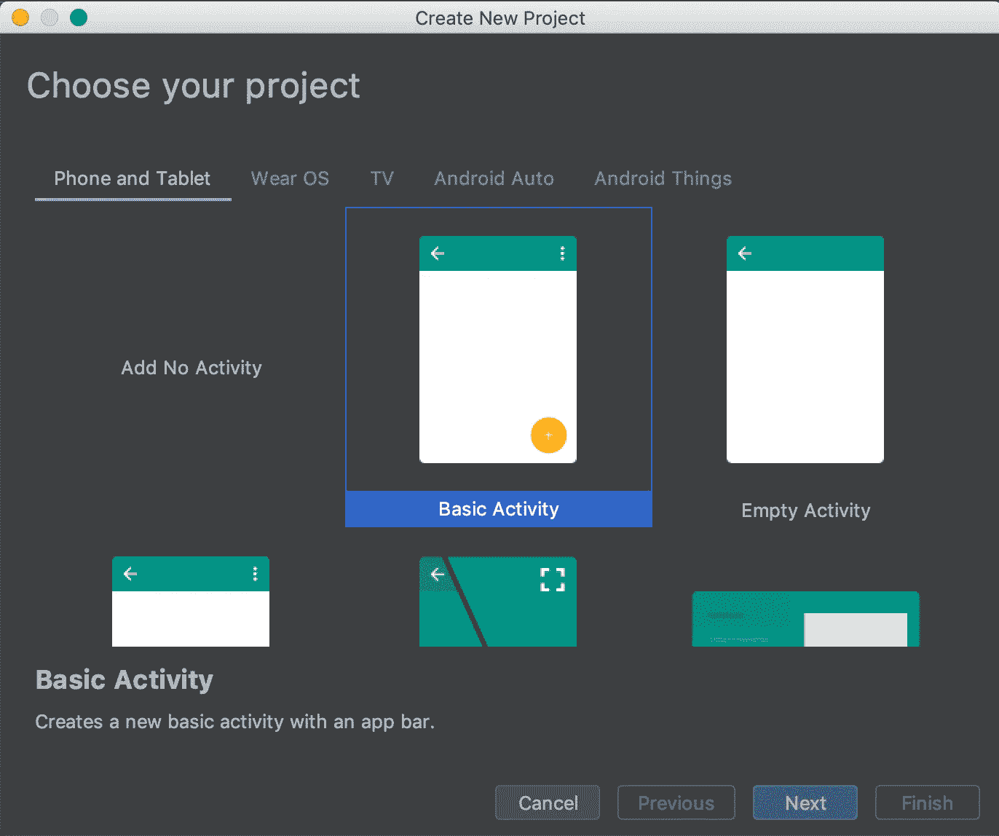
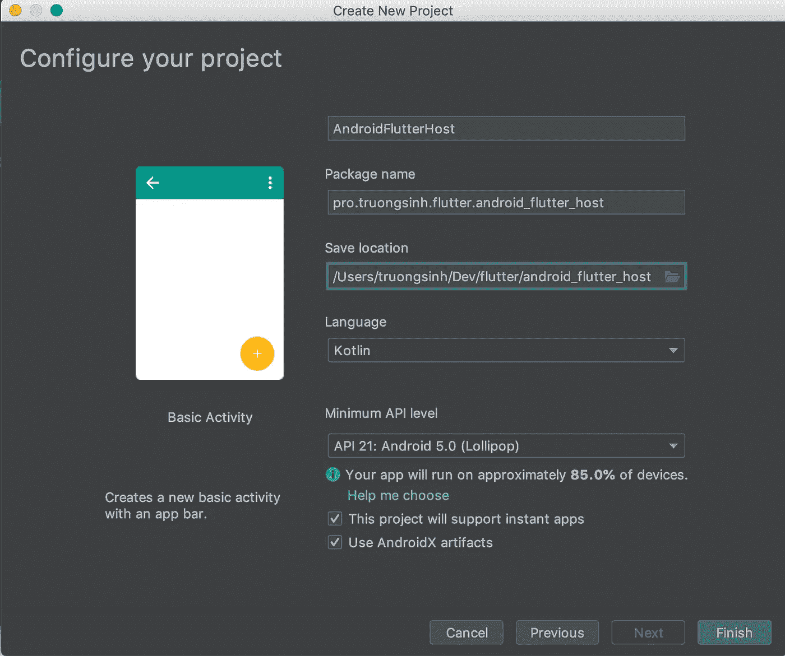
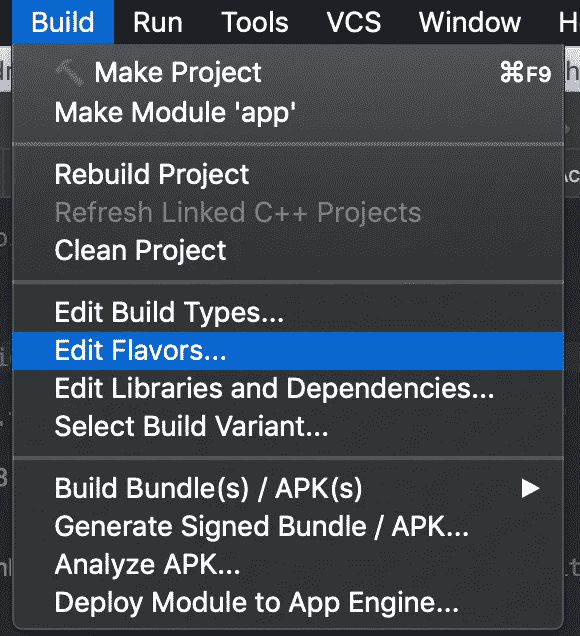
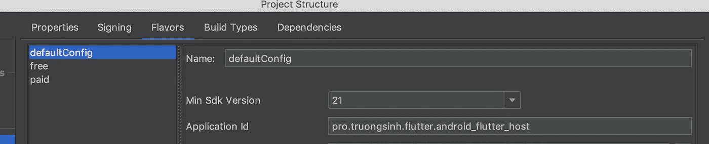
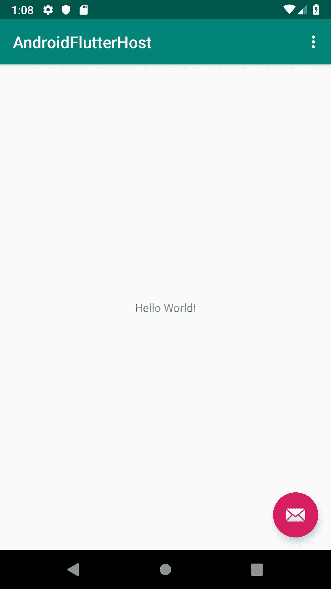
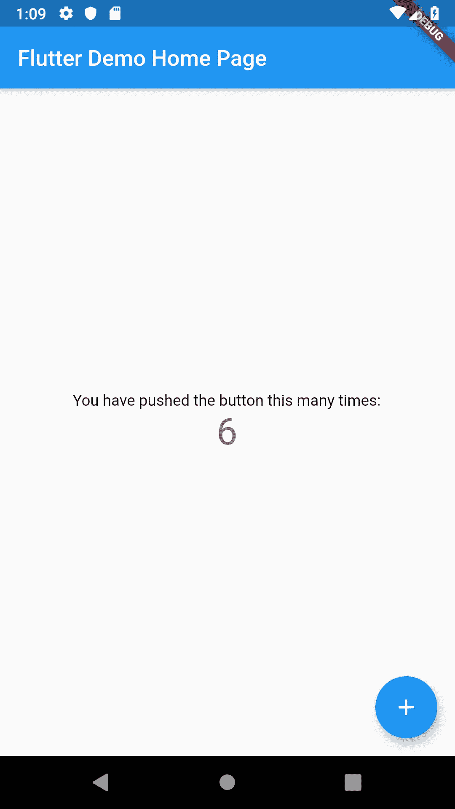

# 将 Flutter 添加到您的生产 Android 应用程序中

> 原文：<https://medium.com/hackernoon/how-to-add-flutter-to-your-production-android-app-4b5150de9e44>

有几个关于如何将 Flutter 添加到您现有的 Andriod 应用程序的说明，包括官方维基，但没有一个是在真正的生产应用程序上完成的，因此当我们这样做时，有比我们预期的更多的挑战，例如子模块的代码组织(以便我们可以在以后重用 iOS 应用程序)，对 AndroidX 和产品风格的支持，类似于使用`intent#putExtra`和`startActivityForResult`来回传递数据，支持该模块所依赖的`plugins`，在缓存时支持不同的路线。我们已经将我们的经验提取到带有代码示例的分步指导中。


# 0.准备旋舞和主机应用程序

本教程是在颤振版本`1.5.2`上完成的。此时，`1.5.x`已经在`dev` [频道](https://flutter.dev/docs/development/tools/sdk/releases)(不需要使用`master`频道)。由于 Flutter 每月发布`beta`，预计`1.5.x`将于五月初在`beta`上发布。

更新:当你读到这里的时候，`1.5.4-hotfix-2` [已经被命名为](https://developers.googleblog.com/2019/05/Flutter-io19.html) `[stable](https://developers.googleblog.com/2019/05/Flutter-io19.html)`。

这是你目前生产的安卓应用。出于本文的目的，创建一个新的应用程序来模拟您的生产应用程序，但实际上，它应该是您真正的应用程序。



请注意，我们选择“使用 AndroidX 工件”，这反映了我们在这样做时遇到的一些真正的挑战，但你不需要担心，因为默认情况下，Flutter 的“AddToApp”与`AppCompat`配合得很好。

此外，为了使这个示例应用程序更接近生产应用程序，请确保您有构建风格



在我的 [Github](https://github.com/truongsinh/android_flutter_host/tree/step/00) 上可以找到这一步的示例主机应用程序代码。

# 1.创建“颤振模块”

在本地系统的任何地方(包括主机应用程序内部)，运行命令

```
flutter create -t module -i swift -a kotlin --org [your org prefix] flutter_embedding
```

*   需要`-t module`以便该包是一个颤动`module`(而不是与`app`、`pakcage`或`plugin`)。
*   `-i swift`是可选的，但目前似乎没有生效。只是对于这个特定的模块，任何 iOS 相关的代码将在 Swift 中(这是我的偏好，如果你忽略这个选项，iOS 相关的代码，截至目前，将在 Objective C 中)。对于 Android 和 Kotlin 的`-a kotlin`也是如此(只针对这个特定的`module`，与你的主机应用是 Java、Kotlin 还是两者的混合无关)。
*   `--org [your org prefix]`可选，但推荐使用，如果您有 Android 和/或 iOS 应用程序开发背景，应该直接使用。
*   `flutter_embedded`是必需的，它是包名中`[your org prefix]`之后的名字，也是这个模板代码上生成的文件夹。

在 git repo 上提交和推送代码(比如您公司的私有自托管 git repo，或 Github)，并记住要在下面的步骤中使用的 git URL。尽管也可以直接在你的主机应用程序代码下提交这个目录，但建议把它作为一个`git submodule`来提交，这样我们以后也可以和一个 iOS 应用程序共享这个 flutter 模块。

然后，为了支持`AndroidX`，您需要做出如下变通:将大多数文件包含在目录`.android`下，并将 Java 文件迁移到 AndroidX

这一步嵌入模块代码在我的 [Github](https://github.com/truongsinh/flutter_embedding/tree/step/01) 上有。

# 2.让这个“颤动模块”成为你的主机应用程序的一个“git 子模块”

在您的主机应用程序中，运行命令将`flutter module`添加为`git submodule`:

```
git submodule add [your git URL of flutter embedding module in step 1] flutter_embedding
```

`flutter_embedding`是这个子模块的目录名的推荐名称，以避免与`flutter`本身的名称空间冲突，同时也足够简单明了。请注意，如果此时您正在使用 iOS，您将不得不部分重新生成模块，因为`.ios`目录被忽略。

如果你在`flutter_embedded`下检查你的目录，你会看到一些文件，但是在`git diff`下，你只会看到子模块的 git URL，以及这个子模块指向的当前 hash commit。

主机 app 这一步的代码在我的 [Github](https://github.com/truongsinh/android_flutter_host/tree/step/02) 上有。

# 3.从本机应用程序活动调用 FlutterEmbeddingActivity

为了能够从本地应用活动中调用`FlutterEmbeddingActivity`，您需要向主机应用梯度脚本注册`flutter module`

在存储所有活动的目录中，创建一个新的活动`FlutterEmbeddingActivity`。

这个活动有一个静态方法`init`来初始化和创建一个缓存的 flutter 引擎以获得更好的性能，并在以后用于`flutter plugin`注册。注意，这个活动必须扩展`io.flutter.embedding.android.FlutterActivity`，而不是`io.flutter.app.FlutterActivity`，否则，我们无法覆盖`IntentBuilder`。当我们注册`flutter plugin`时，该注释对于后面的步骤也很重要。

现在我们有了新的活动，我们可以在 AndroidManifest.xml 中注册它，并从其他活动中调用它

是否/在哪里调用`FlutterEmbeddingActivity.init(this)`，是一个权衡的决定。你有三个选择

*   在你进入活动的`onCreate`中调用它。优点:从本机活动过渡到 Flutter 嵌入活动时性能更好(第一次)，缺点:应用启动时性能更差。
*   在`onCreate`中调用它的活动会立即导致嵌入活动的颤动。优点:从本机活动转换到 Flutter 嵌入活动时性能更好(第一次)，缺点:从一个本机应用程序活动转换到另一个调用`init`的本机应用程序活动时性能更差(第一次)。
*   根本不要调用`FlutterEmbeddingActivity.init(this)`。优点:在应用程序启动时或在本地应用程序活动中有更好的性能，缺点:从本地活动过渡到 Flutter 嵌入活动时性能更差(第一次)

但是，您不能在另一个线程中调用`FlutterEmbeddingActivity.init(this)`,因为它会崩溃

```
java.lang.IllegalStateException: startInitialization must be called on the main thread
```

如果您现在开始调试，您将看到应用程序在启动后立即崩溃，并显示以下日志

```
E/flutter: [ERROR:flutter/runtime/dart_vm_data.cc(19)] VM snapshot invalid and could not be inferred from settings.
    [ERROR:flutter/runtime/dart_vm.cc(237)] Could not setup VM data to bootstrap the VM from.
    [ERROR:flutter/runtime/dart_vm_lifecycle.cc(81)] Could not create Dart VM instance.
A/flutter: [FATAL:flutter/shell/common/shell.cc(218)] Check failed: vm. Must be able to initialize the VM.
A/libc: Fatal signal 6 (SIGABRT), code -6 in tid 12928 (utter_host.free)
```

这是一个[已知错误](https://github.com/flutter/flutter/issues/30916)，解决方法是在`app/build.gradle`中添加以下几行

上述解决方法将修复所有产品风格和构建类型(如`Debug`、`Profile`、`Release`)的问题。现在再次开始调试你的应用程序，点击 fab 按钮，你应该在日志中看到这些行(表明我们确实在使用缓存的 Flutter 引擎)

```
D/FlutterFragment: Deferring to attached Activity to provide a FlutterEngine.
D/FlutterView: Initializing FlutterView
    Internally creating a FlutterSurfaceView.
```

应用第一次从原生活动过渡到 Flutter 嵌入活动时，你会看到一个小的滞后，但后续的过渡要平滑得多。



此外，Flutter 嵌入活动的内部状态是持久的，这意味着您点击“后退按钮”以返回到本机应用程序活动，然后点击 FabButton，您将看到计数器编号保持不变(并且不会重置为 0)。

此时，您还可以将 Android Studio 附加到 Flutter 活动，以调试您的 Dart 代码，进行热重装和热重启。

主机 app 这一步的代码在我的 [Github](https://github.com/truongsinh/android_flutter_host/tree/step/03) 上有。

# 4.打开不同的颤动屏幕

当您的应用程序在 Flutter 端增长时，您将需要嵌入活动来显示多个屏幕/路径，在本例中，我们将有“counter”屏幕和另一个“hello world”屏幕。

根据目前的官方维基，你可以用`createBuilder().initialRoute`和`createBuilder().dartEntrypoint`中的一个/两个来实现这个。然而，我们发现，一旦我们使用缓存的颤振引擎，这些方法不再工作。我们现在要做的就是把最顶层的小部件(`MyApp`)转换成有状态的小部件，监听平台通道(事件通道)并据此构建小部件。

在`flutter_embedding/lib/main.dart`中，将最顶层的小部件转换成有状态的小部件，监听事件通道并相应地设置状态。注意，在第 32 行，我们还确定路线是否是`init`，我们将立即返回到原生 Android 活动。这样做只是为了缓存。

在`FlutterEmbeddingActivity`中，每当这个活动是`onCreate`时，我们需要通过平台通道向 Dart 方发送消息。

同样出于缓存的目的，如果不是从`FlutterEmbeddingActivity`调用`init`，我们将呈现 Flutter 视图(无论如何都会从 Dart 端立即`pop`调用)

最后，在任何其他活动中，用`initialRoute`创建一个颤振`Intent`，并开始该活动。

你会看到，点击不同的按钮会导致你不同的颤振屏幕。此外，“计数器”的状态将被保留，如果你只是来回到那个颤动的屏幕，但被重置(到 0)，如果你访问另一个屏幕，并回到“计数器”屏幕。

这一步的代码可以在我的 [Github](https://github.com/truongsinh/android_flutter_host/tree/android_step/04) 上找到。

# 5.意图和返回意图附加内容

有 Android 开发背景，毫无疑问，你至少曾经使用过`intent#putExtra`向下一个活动传递数据，使用`startActivityForResult`和`returnIntent#putExtra`向上一个活动传递数据。借助于平台通道(这次是事件通道和方法通道)，也可以用 Flutter activity/screen 来实现。在这样做的时候，你应该知道什么样的数据结构有资格通过 Dart 和 Android 之间的桥梁。

在 Dart 端，我们从同一个事件中获得额外的数据

在`FlutterEmbeddingActivity.kt`中，我们将从 Dart 端接收的数据转换为`Intent`的额外数据，并使用`setResult`和`finish`将数据传递回之前的活动

在调用活动中，我们用`startActivityForResult`替换`startActivity`，用`onActivityResult`听结果

主机 app 这一步的代码在我的 [Github](https://github.com/truongsinh/android_flutter_host/tree/android_step/05) 上有。

# 6.使用颤振插件

发展您的生产应用程序，毫无疑问，在某些时候，您将需要您的 Flutter 活动来访问平台的特定数据，如相机、音频或传感器。你可以自己实现所有的平台通道来处理这些数据，或者你可以直接使用 https://pub.dartlang.org/flutter 上可用的 Flutter 插件。当然，我们建议您选择后一种方法，这样以后当 Flutter activity 超过本机应用程序并成为应用程序本身时，您就不需要维护 Kotlin/Java 代码库了。

让我们以 [path_provider](https://pub.dartlang.org/packages/path_provider) 包为例，假设我们想要`getApplicationDocumentsDirectory`，并使用前面步骤中实现的`ReturnIntent extras`将数据传回。我们在`pubspec.yml`中定义依赖关系，并调用方法获取数据(字符串格式)

但是，如果您现在运行并测试该应用程序，您将会得到以下错误

```
E/flutter: [ERROR:flutter/lib/ui/ui_dart_state.cc(148)] Unhandled Exception: MissingPluginException(No implementation found for method getApplicationDocumentsDirectory on channel plugins.flutter.io/path_provider)
```

是因为我们没有在 Android 这边注册`path_provider`插件的平台通道。这样做，通常在活动的`onCreate`我们称之为`GeneratedPluginRegistrant.registerWith(this)`。然而，我们痛苦地发现，我们不能在当前的`FlutterEmbeddingActivity`中使用该策略。原因是我们的活动从`io.flutter.embedding.android.FlutterActivity`延伸，而不是`io.flutter.app.FlutterActivity`。进一步研究`GeneratedPluginRegistrant`，看起来这段代码只需要 2 样东西，对当前活动的引用，以及`messenger`，在我们的例子中是`cachedFlutterEngine.dartExecutor`。了解到这一点后，我们可以有一个解决方法，尽管有点冗长。

这一次，测试你的应用程序，我们可以看到它的工作预期

```
D/Flutter example: requestCode: 42, resultCode: 24, data {returnArg1=/data/user/0/pro.truongsinh.flutter.android_flutter_host.free/app_flutter, returnArg2=2}
```

主机 app 这一步的代码在我的 [Github](https://github.com/truongsinh/android_flutter_host/tree/android_step/06) 上有。

# 结论

尽管 Flutter 的 [Add2App](https://github.com/flutter/flutter/wiki/Add-Flutter-to-existing-apps) 还处于预览阶段，但它已经可以用在生产应用上了，只需稍微调整一下就可以支持一些常见的用例，比如

*   安卓克斯
*   产品风味
*   使用缓存颤振引擎时的不同路线
*   像使用`intent#putExtra`和`startActivityForResult`一样来回传递数据
*   该模块所依赖的颤振的`plugins`

本文中的`FlutterEmbeddingActivity`代码样本的设计使得它的一些代码最终会出现在 Flutter 引擎的代码中，从而减少了样板代码。同时，如果你想入门 Flutter 和你的制作 app，建议将 Flutter 嵌入到你当前的 app 中，而不是重新构建整个 Flutter app，减少风险和反馈回路。

这篇文章是免费的，你的拍手也是免费的👏。你知道你可以按拍手键吗👏按钮 50 次？