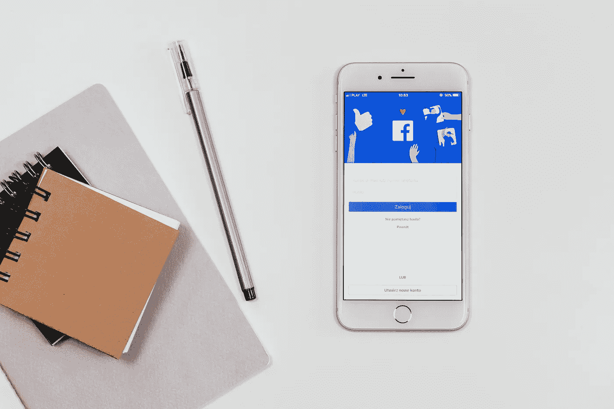
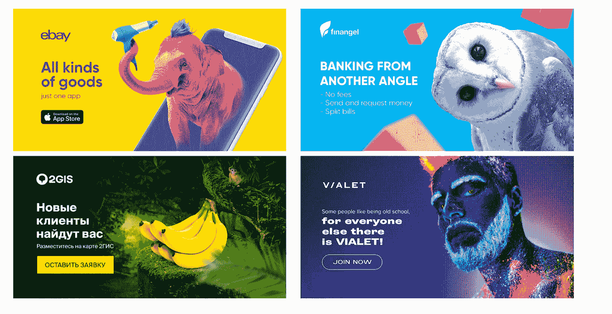
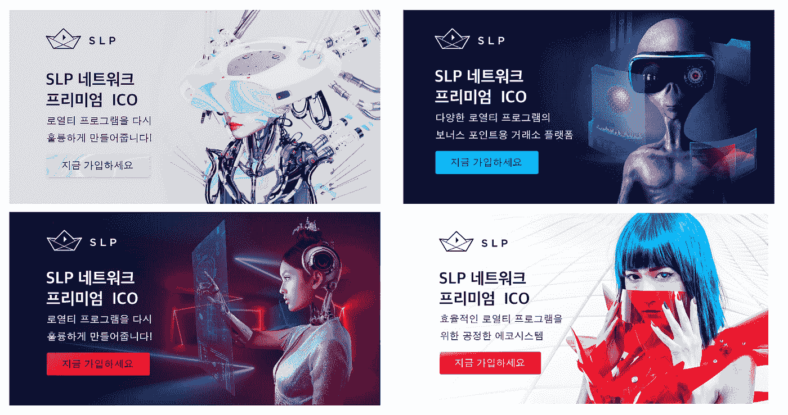
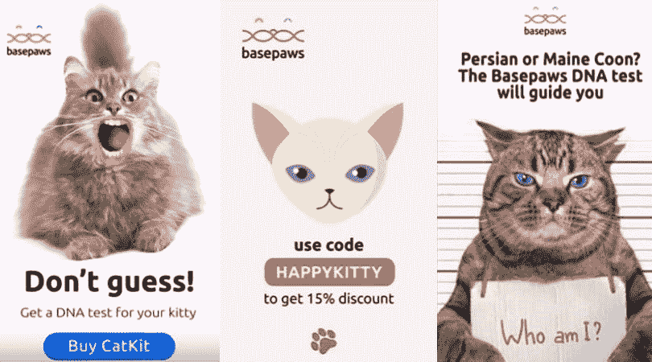

# 如何通过在脸书做广告来扩大你的业务

> 原文：<https://medium.com/hackernoon/how-to-amplify-your-business-by-advertising-on-facebook-8d82ef85d582>

脸书是一个万能工具，几乎可以提升任何企业。该平台已经获得了每个用户的大量信息，从他们的兴趣到对 Facebook Messenger 和 WhatsApp 中消息的分析。建立在机器学习原则基础上的强大的活动优化算法甚至可以在一个压缩的时间段内带来令人印象深刻的结果。

Photo by [freestocks.org](https://www.pexels.com/@freestocks) on [Pexels](https://www.pexels.com)

我们提出了 6 条建议，实施这些建议将有助于您提升广告活动和业务。

# 脸书广告客户培训

脸书是根据某种算法运行的，你应该知道这种算法的特性，并以正确的方式使用它。在发布之初，每个活动都要经历一段时间的学习，这可能需要几天时间。在此学习阶段，您最好不要对活动进行更改，因为这可能会对其效果产生负面影响。

首先，每个广告组的每日预算不应超过 10 美元。这个数额，算法将购买最优质的用户匹配你的广告活动目标。在每个广告组中设置不超过两个创意，以确保他们进行适当的 A/B 测试，并确定最优质的受众创意链接。

# 酷似的人

找到一个相似的观众是最有效的定位方法。基于广告商上传到广告账户的源用户基础来创建相似的受众。如果你是一个大用户群的快乐拥有者，那么重要的一步是仔细地将它细分为一个更有效的相似者。上传片段的质量越高，你的广告活动就越有效。在这种情况下，质量比大小更重要。

两个保护:

*   为源段选择具有高 LTV **(** 生命周期值)的用户。他们是在其生命周期中带来最多金钱的顾客；
*   为你的来源收集电话号码而不是电子邮件地址，因为它们被广告账户验证的几率平均要高 40%。

**实践中的例子**:为了在一个著名的投资会议上获得最低净值为 200 万美元的个人的线索，我们使用了 1%的相似观众，这是基于 1000 名用户的狭窄但高质量的来源细分。就这一位观众帮助我们收集了所需数量的线索。CPL(每销售线索成本)不到 200 美元。

# 超级地球

一种有效的工具，能够在预设点周围的预设半径内有效瞄准。非常适合推广小型本地企业，如理发店或美容院。首先，你需要彻底考虑广告横幅中使用的产品，确定并指出其相对于(地理上)最接近的竞争对手的主要优势。做好准备，这种形式的成本相当高。

# 分段再销售

脸书的广告账户有一个 pixel(一段代码)，用来收集用户访问产品或公司页面的数据。它为您提供了一个机会来留住达到某个漏斗阶段的用户，例如那些将产品添加到篮子中的用户，或者那些开始完成订单但停止的用户。应该收集和细分这些客户的信息，以便为他们提供独特的服务，推动他们进入下一步。

此外，用户可以根据他们的访问时间进行细分:几天前访问过你的网站的用户是“热情”的观众，超过 14 天就“冷淡”了；需要重新提醒他们产品的优势。

**实践中的例子**:为了推广属于高级银行类别的产品，使用社会证明是很重要的。在每一个漏斗步骤中，我们都设置了细分内容再营销，由忠实用户提供文章和评论。结果，销售线索的数量增长了两倍多。

***横幅***

创意人员。为了突破用户对横幅广告的盲目，制作明亮的创意，使用不同的颜色组合，并记住——用户在他或她的脸书订阅源中看到的所有内容大多是照片和文本，所以不要害怕尝试动画和插图。插图横幅广告的点击率平均比普通照片高 1.5-2 倍。

以下是插图横幅的一个示例:

# 故事

故事是最便宜的广告形式，每 1000 次展示的平均成本比传统横幅广告低 1.5 倍。此类广告最常出现在移动设备上，因此确保网站适应移动版本非常重要，在第一个屏幕上显示行动号召。

**来自实践的例子:**习惯上认为移动流量质量和创收能力较低，但事实并非如此。我们通过一个 P2P 贷款服务的故事开展了一场广告活动，该服务的客户是中型企业的所有者。客户数量在半年内增长了 6 倍，CPL 不到 30 美元。

# 聊天机器人

聊天机器人还能让观众热身。messenger 中带有机器人的对话框可以替代登录页面。对于大多数用户来说，对话窗口比第三方登录页面更容易理解，这通常会提高 30%的转化率。

ManyChat 和 Chatfuel 等服务提供了一种可能性，可以创建一个小型内容链，以自动模式告诉用户产品的主要特征，并将用户输入 Facebook Messenger 上的邮件列表。要做到这一点，你只需要按下对话框中的一个按钮。

**实践中的例子:**通过聊天机器人的对话框，我们向用户讲述了精英地产的优势，同时每周发送一次简讯，以保持用户群的参与。结果:4 个月内卖出了 8 批。

# 小抄

1.训练你的广告客户。从两个创意和 10 美元的预算开始，教算法专门找到你的客户。

2.建立相似的观众群。使用小而高质量的客户群，最好有电话号码。

3.通过 Supergeo 向居住或工作在附近的人或只是来旅游的人宣传当地企业。

4.发起分段再营销，追上即将离开的顾客，说服他下单。

5.不要低估广告故事。产生良好效果的是廉价广告。

6.使用聊天机器人。他们让观众活跃起来，在 Facebook Messenger 上发东西。