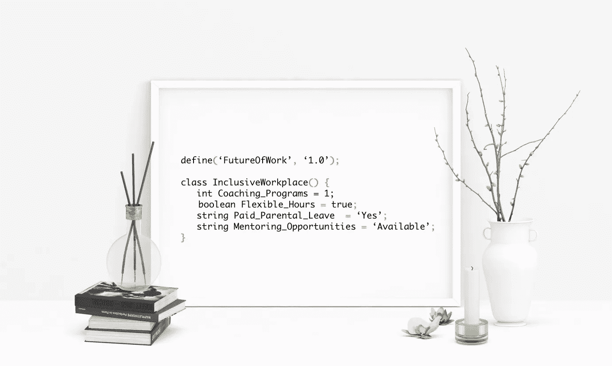

# 如何在你的软件开发生涯中应用敏捷宣言

> 原文：<https://medium.com/hackernoon/how-to-apply-agile-manifesto-in-your-software-development-career-9348884855d6>

Get art print from [https://womenintechnology.threadless.com](https://womenintechnology.threadless.com/designs/future-of-work-and-inclusive-workplace/home/framed-fine-art-print)

如果你在软件开发行业工作，我毫不怀疑你已经听说过[敏捷宣言](https://agilemanifesto.org/)。与传统的软件开发方式(也称为瀑布方法)不同，敏捷宣言有四个核心价值来鼓励更好的软件开发方式。

> 个人和互动超过…