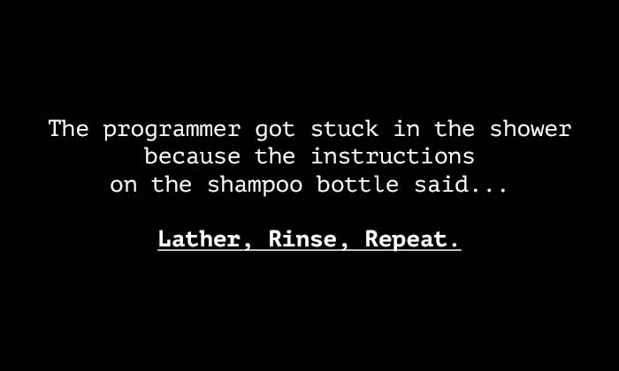
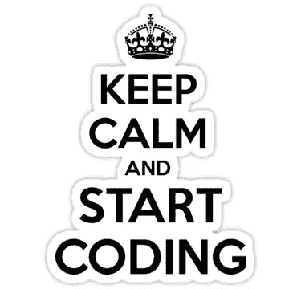
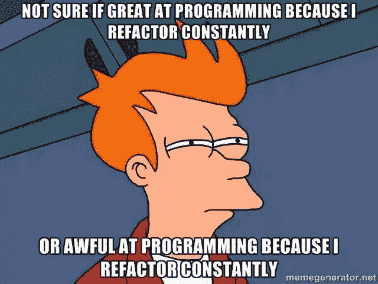

# 如何解决任何编码问题？

> 原文：<https://medium.com/hackernoon/how-to-approach-any-coding-problem-9230f3ad6f9>

“First, solve the problem. Then, write the code.” — John Johnson

> 每当出现编码问题时，出于本能，大多数人都会遵循一些预先定义的步骤，这些步骤允许他们有效地解决问题。有意或无意地，当你被无意识地给予任何问题时，你可能会遵循其中的一些步骤，但读完这篇文章后，你会尝试与这些惊人的步骤相关联，你将能够更有效地解决问题。因此，在这篇文章中，我将讨论解决任何编码问题的 5 个步骤，✨

# 世界需要 devs，我为什么要花时间在竞技编程上？

作为一名开发人员，我发现大多数开发人员(包括许多“非常”熟练的开发人员)在数据结构、算法和一般问题解决方面都不是很好。令人难过的是，如今许多人只是死记硬背一些基本步骤来开发一个应用程序，或者一个简单的软件，并自称为“程序员”。

Relatable? (source: [https://www.picomico.com/tag/Algorithm](https://www.picomico.com/tag/Algorithm))

随着每个人都追求发展，深入学习数据结构和算法已经成为学生们的第二选择，尽管这是每个学生的基本领域，

尽管我是一名开发人员，对竞争性的[编程](https://hackernoon.com/tagged/programming)并不太感兴趣，但我仍然试图花更多的时间来学习数据结构和算法，以及如何编写高效的代码，我鼓励并建议每个人都应该关注这一点。

这里有一些例子，数据结构、算法和竞争性编程(一般来说)帮助了学生—

1.  大学实习
2.  编写高质量的代码
3.  高效编码(时间和空间复杂度)
4.  最佳利用资源
5.  逻辑推理
6.  曝光率(有一个庞大的做 CP 的学生群体)
7.  机会(大量的 CP 竞赛)
8.  在这个过程中你会得到很多乐趣

> **“代码教你如何面对真正的大问题**”
> 
> —杰克·多西

现在转入正题，

# 每当我遇到任何编码问题时，我都会遵循的 5 个步骤

几天前，在做一个[编码](https://hackernoon.com/tagged/coding)问题时，我发现无论我解决什么问题，我都有一个模式。我做了更多的问题，并在我解决任何问题之前和之后，不断写下我脑海中的所有想法。令我惊讶的是，有一个共同的模式，不知不觉中我做了这 5 件事，现在我知道了这 5 个步骤，我能够更有效地解决问题。

同样，正如我在介绍中所说的，很有可能你也在无意识地使用这些步骤，但是当你发现你会开始有意识地应用这些步骤，然后注意到不同之处😁

## 1.理解并分析问题

阅读问题，开始思考它，如果可能的话，在一张纸上写下给出的东西和你需要找出的东西。

**扪心自问，**

—你能完全理解这个问题吗？
——你能向一个外行人解释这个问题吗？
—需要什么和多少输入？
—这些输入的输出会是什么
—你能从问题中分离出一些模块或部分吗？你有足够的信息吗？如果没有，请再次尝试理解这个问题。

See that you don’t get stuck xD (source: [https://rocketjones.com/nerd-jokes-love/](https://rocketjones.com/nerd-jokes-love/))

## 2.彻底检查样本输入和示例

浏览一些样本输入并给出更多的例子肯定会帮助您很好地理解问题，此外，它还为您提供了一个清晰的方法，让您知道您的代码应该处理多少种情况，以及可能的输出或输出范围。

**这是我的建议，**

—举非常简单的例子并找到输出
—拿更复杂和更大的输入来看输出是什么，我们想要多少用例

**然后，“处理边缘案件的时间”**

—尝试没有输入的问题，现在应该是什么输出
—尝试输入无效的问题，现在应该是什么输出

Too Many Indeed! (source: [Google Images](https://www.google.com/url?sa=i&source=images&cd=&cad=rja&uact=8&ved=2ahUKEwjQt6jLnP7fAhWGqo8KHQPxBd8QjRx6BAgBEAU&url=https%3A%2F%2Fmedium.com%2Fthe-time-of-the-product%2Fthe-edge-case-trap-that-product-teams-should-watch-out-for-6e17475a13ab&psig=AOvVaw3vdYH_42uCaeRzZqb8K2Ge&ust=1548137724040013))

## 3.分解问题

当手头的问题很大时，这一步真的很有帮助。在这种情况下，我建议如下:

—尝试为手头的问题制作流程图或 UML
—将问题分成不同的模块或子问题
—尝试为每个子问题制作独立的功能
—通过按要求的顺序调用这些子问题来连接它们，或在必要时(可能一个功能会调用另一个功能)
—在处理试图实现一些现实世界问题(如管理系统等)的问题时，尝试使用类和对象。)

The flow chart which programmers really need 😂 (Source: [Google Images](https://www.google.com/url?sa=i&source=images&cd=&cad=rja&uact=8&ved=2ahUKEwj2gYPDnf7fAhUY3Y8KHSPuAAwQjRx6BAgBEAU&url=https%3A%2F%2Fvisme.co%2Fblog%2Ffunny-graphs%2F&psig=AOvVaw1u2-1omlqUAcjrD5rFHfGB&ust=1548137932879512))

## 4.开始求解/编码

既然您已经分析了问题，那么是时候实际编写代码了。如果你不能一次完全解决问题，试着为一个更简单的子部分写代码，随着你解决问题，逐渐地你能更详细地解决问题，你开始得到新的想法。

只要记住三件事，你就一定会找到出路😁

—你开始的地方
—你现在在哪里？你的目的地是哪里？

此外，当你进行面试时，不要浪费时间去找出整个解决方案，然后告诉你的面试官，不断简化问题，并且**不断告诉你的面试官你是如何处理这个问题的**

—告诉面试官你是如何开始的
—告诉他你现在脑子里有什么方法
—找出你在那个问题中面临的最困难的部分
—暂时忽略那个“最困难”的部分，开始解决一个更简单的子部分，这将为你赢得更多的时间来思考前面的部分
—一旦完成了简单的子部分， 试着对困难的部分也采用类似的方法
——你可能会在做题的时候想出一个更好的解决方案，告诉你的面试官

## 5.回顾过去，了解更多

现在，这是最重要的部分！一旦做完，回头看看代码是否可以改进，有没有其他方法解决给定的问题？

Source: [Google Images](https://www.google.com/url?sa=i&source=images&cd=&cad=rja&uact=8&ved=2ahUKEwillIS8nv7fAhWTiHAKHRduBRkQjRx6BAgBEAU&url=https%3A%2F%2Fmedium.com%2Fprintln-mic%2Fweek-4-refactoring-codes-software-architecture-fd1b17972c30&psig=AOvVaw3Q0IGyV9QVK83eZVpGE1m9&ust=1548138170504761)

> 不要在完成后就放弃，当你对可能的解决方案感到满意，并且你已经完全探索了问题时就放弃！

**一旦你写完代码，这里有一些你应该问自己的问题**

1.  这段代码是否针对所有可能的输入运行(包括边缘情况)
2.  有没有其他解决问题的方法？
3.  代码是否高效？能更有效率吗？
4.  代码可读吗？
5.  如果别人给你看这段代码，你能理解吗？
6.  性能还能提升吗？
7.  是否可以使用其他算法来提供更好的结果？

除了这些问题之外，一定要看看其他人对同样问题的解决方案，看看他们是如何解决的，当你看到其他人的代码时，你会学到很多。

# 摘要

以下是我们在本文中讨论的 5 点

👉分析理解问题
👉看看样本输入和用例
👉将问题分解成更小的部分，或功能，或模块
👉开始求解/编码
👉一旦完成，回头看看代码是否可以改进，有没有其他方法解决给定的问题，

就这样，我希望这篇文章能提高你解决问题的能力😃

# 想提高自己的技能？

有兴趣提高您在数据结构、算法和竞争性编程方面的技能吗？我发起了一个名为“每日代码”的项目，我们每天一起解决一个问题，看看这个资源库:

 [## CodeToExpress/dailycodebase

### 从 2018 年 12 月 20 日开始为期 2 个月的数据结构和算法脚本挑战-编码很有趣！💯💯做…

github.com](https://github.com/CodeToExpress/dailycodebase) 

如果你觉得有用，一定要给它一个⭐奖

[Daily Codes](https://codetoexpress.tech/dailycodes/)

希望这篇文章对你有所帮助😁

如果你想讨论什么，随时联系我，:D

如果您能给我反馈、建议或询问，我会非常高兴。此外，我喜欢交新朋友，我们可以成为朋友，只要给我发邮件。

> 非常感谢你一直读到最后。如有需要可以联系我:
> 邮箱:madhavbahl10@gmail.com
> 网页:[http://madhavbahl.tech/](http://madhavbahl.tech/)
> Github:[https://github.com/MadhavBahlMD](https://github.com/MadhavBahlMD)
> LinkedIn:[https://www.linkedin.com/in/madhavba*HL/*](https://www.linkedin.com/in/madhavbahl/)