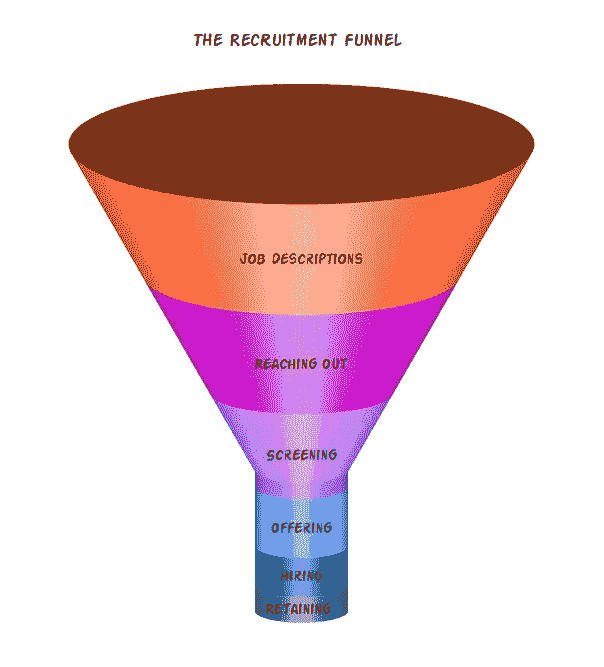

# 如何吸引更多女性(而不是你想的方式)

> 原文：<https://medium.com/hackernoon/how-to-attract-more-women-and-not-the-way-you-think-372203f5a7d7>

**nd3000/Shutterstock.com**

众所周知，女性在科技行业的代表性严重不足。

一些人认为这是“[自然的](https://hackernoon.com/tagged/natural)”鉴于事实，事实上对此无能为力，或者正如我以前无数次听到的那样:“*女性就是不申请……我们对所有人开放招聘，但我们只收到男性的申请……*”。

很有可能你做错了。这一点也不“自然”。你可以通过做一些不同的事情来改变现状。有些比其他的容易，可以算是“速赢”，有些则需要你公司文化的深刻而深刻的改变。我想把它看作是一个自下而上/自上而下的组合过程，以便尽可能快地达到最好的结果。

在这篇文章中，我将给出一些实用的、有科学依据的技巧来调整你的招聘漏斗，以吸引更多女性进入你公司的技术岗位。

在我开始之前，重要的是要说，我绝不是说仅仅因为她们是女性就雇佣不合格的申请人。这显然不是我建议的解决方案，因为我认为那样做只会让女性的情况变得更糟。你知道吗？这实际上也是一个神话。没人会这么做。

**就是这样。我整理了一份清单，列出了你可以在招聘过程中的每一步实际采取的行动，这些行动可以大幅增加公司女性员工的数量。**

我收集这个列表是基于我作为社会心理学家的学术背景，我过去 10 年作为一名软件工程师的经历，以及作为一名科技界女性的经历。

# **速赢——编辑你的工作描述**

**确保你的工作描述包含所有的内容**以获得更多的女性申请者**。**这是正确的做法:

*   **避免使用与性别相关的最高级词汇——避免使用“忍者”/“摇滚明星”/“超级巨星”这样的词，这些词通常更适合男性求职者。女性很少认同这些词，这可能会让她们退出申请。**

*   **指定你真正的“必备条件”——**只写你真正的“必备”要求作为必备条件，其他标准为“最好有”。如果你说你正在寻找一个至少有 8 年经验的人，但你会满足于一个只有 4 年经验的人，不要写 8 年作为最低要求。这是因为研究表明，女性倾向于[只有在符合 100%的标准时才申请职位描述，而男性通常满足于 60%](https://hbr.org/2014/08/why-women-dont-apply-for-jobs-unless-theyre-100-qualified) 。

*   **避免描述男性化的环境**——女性通常更喜欢与他人交流和合作，而不是咄咄逼人和竞争。研究表明,使用描述男性环境的男性词汇会导致女性撤回申请。因此，举例来说，不要使用像“积极的”/“主导的”/“冒险的”这样的术语，而要使用强调一个更为公共和协作的环境的词，比如“提交”/“连接”/“合作”。除此之外，不要吹嘘你办公室的台球桌、免费啤酒和大量的视频游戏。这对你来说可能听起来很诱人，但它也会吓跑一些女性，因为它会给人一种非常男性化的工作场所的印象。总之*取景就是一切*。举一个例子，一所大学[将之前名为*Java 编程入门*的课程更名为*使用 Python 解决科学和工程问题的创造性方法*，使得计算机科学专业的女生比例从 10%上升到 40%。](https://qz.com/192071/how-one-college-went-from-10-female-computer-science-majors-to-40/)

*   小心选择你的(中性)语言——如果你使用的不是中性语言，比如希伯来语、德语或法语，不要使用阳性形式。例如，在希伯来语中，男性开发人员和女性开发人员有两种不同的说法。有几个[选项](https://en.wikipedia.org/wiki/Gender_neutrality_in_languages_with_grammatical_gender#Examples)来处理这件事。你可以通过添加斜线(他/她)来说明你正在寻找任何一个来绕过这一点。通过说你正在寻找一名女性开发人员，让你的信息更加清晰。然后在最后加上一个免责声明，说广告可能会说你正在寻找一位女性申请人，但对所有性别开放。从我的经验来看，这类广告通常会得到更多女性的关注，她们会在社交媒体上互相分享，因为她们觉得你是在特意接近她们。

*   **包含多样的形象**——如果你的工作描述中包含形象，核实这些形象是否具有包容性，是否包含女性形象。如果他们包括一大群人，只有一个女人是不够的。数一数你们图像中的男女比例。此外，确认你照片中的女性是积极的、主动的，并且和男性做着同样的工作(例如，在电脑前编码或者做笔记)。图像的多样性也应适用于其他代表性不足的少数民族，如有色人种、残疾人、不同种族、LGBTQ 和各种年龄组。看看这些例子:

做:

**Rawpixel.com/Shutterstock.com**

不要:

**Matej Kastelic/Shutterstock.com**

# **主动出击——积极寻找代表性不足的人**

在 linkedIn 和其他社交媒体上积极主动地接近女性。与技术社区的敬业女性合作。有很多这样的问题，也有很多解决这些问题的计划。赞助这样的项目，从你的公司派出导师。请他们公布你的工作清单，积极地表明你正在寻找更多的女性员工。请你的招聘人员和求职者在寻找人才时，强调并优先考虑女性申请者。查看 Duolingo 的这篇文章[,这篇文章描述了他们如何通过做所有这些事情来实现新招聘的软件工程师 50:50 的性别比例。](http://making.duolingo.com/how-duolingo-achieved-a-5050-gender-ratio-for-new-software-engineer-hires)

# **调整您的筛选方法**

*   在整理简历时主动消除偏见 —许多研究表明，在筛选简历时存在一种[无意识偏见](https://health.ucdavis.edu/facultydev/pdfs/search-materials/RisingAboveUnconsciousBias.pdf)。实验范式非常普遍和简单:两组人被要求评估完全相同的简历，唯一的区别是申请人的名字，仅此而已。[例如，一项研究](https://www.pnas.org/content/early/2012/09/14/1211286109)发现，仅仅因为将申请人的名字从“约翰”改为“詹妮弗”，就导致了人们认为詹妮弗不够格、不配，而且如果给的话，他的薪水比约翰少 4000 美元！我有没有提到两份简历除了名字之外完全一样？其他代表性不足的群体也是如此。例如，白人名字的简历比黑人名字的简历得到回电的几率高 50%，比亚洲名字的简历高出 28%。由于这些偏见通常是无意识的，为了应对它们，你能做的最简单的事情就是删除个人信息(姓名、照片、婚姻状况等)。)来自候选人简介和简历。甚至还有一个 [chrome 扩展:unbiasify](https://chrome.google.com/webstore/detail/unbiasify/affijhegklbkdinpepgphhlgphnhbenk) ，它隐藏了社交网络上的姓名和个人资料照片，这样你就可以在招聘时专注于真正重要的事情。

*   **减少工作面试/编码测试中的刻板印象威胁-** [刻板印象威胁](https://en.wikipedia.org/wiki/Stereotype_threat)是一种表现可能会恶化的情况，因为担心可能会证实对一个人的社会群体的负面刻板印象，这是社会心理学领域最广泛研究的主题之一[。当一个人被提醒他们的社会群体(例如，他们的性别)，并且对那个社会群体有一个负面的刻板印象(例如，女性不被期望擅长 STEM 领域)，结果](https://diversity.arizona.edu/sites/default/files/stereotype_threat_overview.pdf)[表现可能被削弱](https://www.sciencedirect.com/science/article/pii/S0022103198913737?via%3Dihub)。大多数时候，这种威胁感完全是无意识的，但绝对能影响考生的表现。即使是刻板印象最微妙的线索也可能引发这种情绪，比如作为房间里唯一的女性，仅此一点就可能妨碍表现(如果你想一想，在技术领域作为一名女性意味着不断经历刻板印象的威胁。但那是另一篇博文)。那么你能做什么呢？在求职面试中，尽量避免突出候选人性别的情况，例如，只由男性参加面试，或者参加以男性为主的团队之间的编程测试。确保你的人才库中有足够多的女性面试官，并且有足够多的女性来组织和检查招聘过程中使用的考试。如果你没有，试着带申请人参观你的办公室，在那里她会(希望)见到其他女人。这样，你可以减少刻板印象的威胁，消除焦虑。

*   **教育面试官关于信心差距和骗子综合症**—[编程女孩组织](https://girlswhocode.com/?nabe=5633698805055488:0&utm_referrer=https%3A%2F%2Fwww.google.com%2F)的创始人 Reshma Saujani 在她精彩的 [TED 演讲](https://www.ted.com/talks/reshma_saujani_teach_girls_bravery_not_perfection)中提到，学习编程的女孩总是告诉她们的老师她们不知道如何写代码。老师会看着她的屏幕，她会看到一个空白的文本编辑器。如果她按几次“撤销”，她会看到她的学生写了一些代码，并完全删除了它。都是一样的故事……学生差一点，但她觉得不够好，决定干脆删了。这是因为女性倾向于低估自己的能力和表现，高估自己，不管他们的实际表现如何，而男性倾向于高估自己的能力和表现。研究将这种模式称为“[信心缺口](https://www.theatlantic.com/magazine/archive/2014/05/the-confidence-gap/359815/)”。这会导致[对同样的工作](https://www.techrepublic.com/article/men-in-tech-paid-more-than-women-for-same-job-63-of-the-time/)要价更低，除非你 100%符合要求，否则不会申请工作，如上所述。在极端情况下，这也可能是著名的“T10”冒名顶替综合征的情况，这通常在女性中更常见。这种现象通常描述的是非常有成就的女性，她们总是觉得，每个人迟早都会发现她们没有自己想象的那么聪明或合格，并揭露她们是骗子。在采访女性时，请注意这些现象，并尽可能让她们感到舒适。当你采访一个女人时，注意她是如何描述自己和讲述她所做的事情的。与男性相反，女性通常被认为是谦虚的，不会吹嘘自己的成就。问一些引导性的问题，真正了解她知道什么，以前做过什么。例如，如果她在描述她参与的一个项目，并且一直说“我们”，问她她到底参与了什么！面试的时候要有耐心，要亲切。即使她说她不知道如何回答你的问题，也要试着找出更多她知道的事情。也许她知道 90%的答案却什么都没说是因为她没全明白，怕说错？也许你所认为的“好的表现”对她来说还可以或者还不够好？(请记住上面的“撤销”示例)。承认她做得对，建立她的自信，不要太武断。再说一次，我并不是建议降低标准，只是要多一点意识。

# **比较雇佣条款**

*   **确保你向所有人提供相同的条件**—[对于相同类型的工作、职位和工作时间，性别薪酬差距](https://www.aeaweb.org/articles?id=10.1257/jel.20160995)在一定程度上是存在的，但并不完全如此，因为事实上[女性通常要求更少](https://www.amazon.com/Women-Dont-Ask-Negotiation-Gender-ebook/dp/B002WJM4P6/ref=sr_1_1?s=digital-text&ie=UTF8&qid=1528124925&sr=1-1&keywords=women+don%27t+ask&dpID=41Zgvsp6AAL&preST=_SY445_QL70_&dpSrc=srch)。少多了。他们也不太可能谈判。因此，如果你决定雇佣一名新员工，并向她提供一份工作，一定要给她同等的报酬。即使她期望的薪水比你通常支付的要低，给她你会给同样技能和经验的男性员工的薪水。如果你不确定那会是多少，检查你当前的工资数据。删除姓名，并根据多年的经验、教育、职位和角色进行交叉引用。检查一下你目前的状态是否已经显示出性别差异，并确保你为同样的职位支付同样的工资。每隔几个月做一次比较，确保没有差距，并公开。

*   让父母能够进入你的工作场所——一般来说，家庭友好型的工作场所更吸引父母，尤其是那些经常努力保持著名的“[工作与生活平衡](https://www.thebalancecareers.com/the-double-standard-of-work-life-balance-3516029)”的妈妈们。妈妈和爸爸都喜欢灵活性。具体来说，灵活的工作时间和偶尔在家工作的能力对年轻父母来说至关重要。确保你给予这种灵活性，并限制下午 5 点后开会和聚会的次数[还应该鼓励爸爸们保持健康的工作与生活平衡，不时地早点离开去接他们的孩子，或者在他们生病时呆在家里陪他们。这会让每个人都过得更好。更有甚者，那些也给爸爸们提供育儿假的公司(](https://www.economist.com/international/2017/10/07/the-gender-pay-gap)[像脸书给所有员工提供 4 个月的育儿假](https://www.theguardian.com/technology/2015/nov/27/facebook-four-month-parental-leave-mark-zuckerberg?CMP=fb_gu))正在发表重要声明，表示他们真的关心员工的福祉。许多公司开始遵循这一政策。当女性生孩子时，她们经常感到从工作世界退出的压力，如果她们休长假，她们经常感觉在这段时间里被抛在了后面。以同样的方式对待父亲可以帮助他们成为更好的父亲，并确保他们有相同的起点。这意味着，你不仅[让你的工作场所变得更令人满意](https://www.nytimes.com/2017/11/28/well/family/millennials-see-paternity-leave-as-a-priority.html)并受到家长们的普遍欢迎[，你还消除了招聘中可能存在的关于候选人家庭/婚姻状况的偏见](https://www.forbes.com/sites/shelleyzalis/2018/05/03/why-mandatory-parental-leave-is-good-for-business/#78834aa99ded)。

# 最后一个建议

你可以今天****开始实施这些事情的全部或部分，然后**测试你的结果。仔细跟踪你引入这些变化(或其中的一部分)前后的数字。**

**跟踪你的过程的一个方法是确保女性的比例在整个招聘过程中保持不变。如果在某个时间点，这个比率在下降，这可能意味着在这个特定的阶段出现了问题。**

****

**The Recruitment Funnel**

**用可衡量的 KPI 来定义现实的目标，看看你做得有多好。如果你的公司很大，你只改变了 1%的比率，这仍然是一个非常大的变化。庆祝一下。并告诉我进展如何:)很想听到一些后续。**

**话虽如此，你也可以通过改变公司文化来吸引更多女性。一个不包容的公司是不会成功留住女性人才的。在本系列的下一篇文章中，我将讨论如何让你的工作场所对女性更加包容，并留住你实际招聘的女性，敬请关注！**