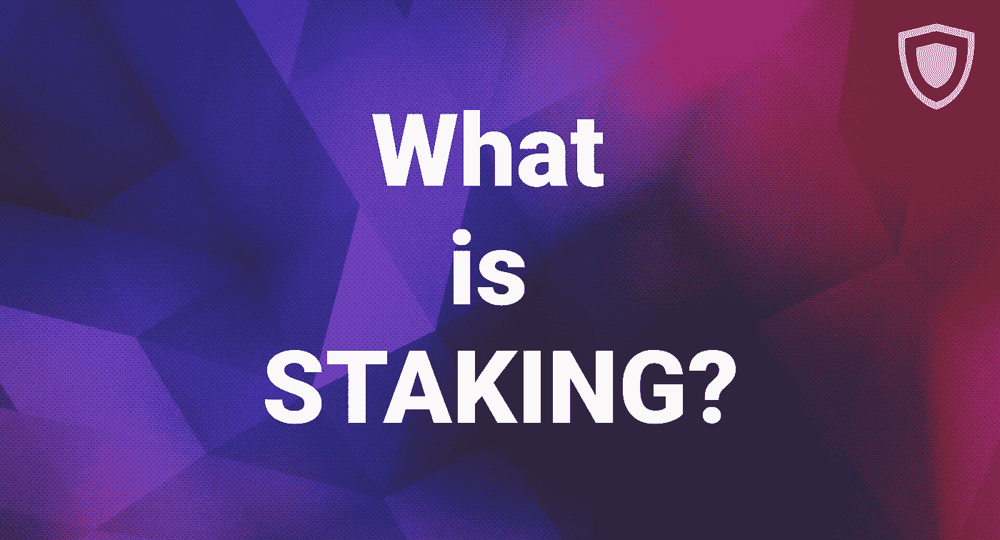

# 如何成为一名矿工，而不是一个

> 原文：<https://medium.com/hackernoon/how-to-become-a-miner-while-not-being-one-what-is-staking-85436640281b>

## 什么是赌注？

听着，我们都想赚点外快。这么说没什么丢人的。有人创业，有人成为自由博主，有人开始投资加密货币——我们都有不同的方式。然而，结果只有一个，那就是利润。

加密交易是为自己赚取一些硬币的好方法，但并不适合所有人。因此，以区块链为基础的货币为人们开始赚钱提供了一种不同的方式。这种方式叫做打桩。

**什么是股权证明？**
PoS(Stake Proof 的缩写)是一种算法一些货币用于创建新的区块并将其添加到区块链中。你持有一些现有的硬币，下注一个新的区块，这一切都有助于验证交易。你拥有的硬币越多，你就越强大。

**打桩是如何工作的？**

与创建区块的通常方式不同——看看比特币，交易通过挖掘节点处理，PoS 协议随机选择他们的“影响者”。有一个硬币持有人池，矿工可以通过在钱包中下注一些硬币来加入。

然后，节点将硬币放入绑定的钱包中，并创建一个区块。在这种情况下，木块与下注的硬币数量成比例。

你看，这个系统很简单。然而，有一个重要的问题——为什么赌博对你个人有好处？

**我为什么要开始下注？**

打桩给采矿经营者带来各种好处。

首先，有了打桩，就不需要购买昂贵的采矿硬件。你所需要的只是一个钱包和一些硬币。

此外，经验丰富的赌注者如果有更多的硬币可以验证网络的交易。很酷，对吧？

PoS 对环境无害。所以，我们所有的绿色朋友们，考虑把打桩作为通常的耗能采矿的一个更好的选择。

最后，但并非最不重要的，是硬币津贴——赌注者持有他们的硬币可以获得一定的百分比。把这当成一个很好的被动收入来源。

**我可以下注哪些硬币？**

**破折号**

DASH 是第一批向世界引入新系统的货币之一。DASH 建立在比特币核心的基础上，还利用了 PrivateSend 和 InstantSend 功能。这种加密硬币可以通过主节点下注——运行主节点的这种加密货币的最小数量是 1000 个 DASH 硬币。

**科莫多**

科莫多是一个帮助发起独立的区块链和 ico 的网络。此外，Komodo 主要关注他们社区的隐私，并实施各种匿名系统来提高交易隐私。网络加密货币 KMD 也有一个下注的机会。用户可以把 KMD 硬币放在他们的钱包里，并从他们作为科莫多赌马者的工作中获得 5%的奖励。

**木卫四**

Callisto Network 是当前加密货币市场上繁荣的平台之一。整个项目是由 ETC 开发团队之一的 Ethereum Commonwealth 的开发者创建的。Callisto 增加了冷赌注特殊功能，作为长期持有人获得一些加密硬币额外津贴的一种方式。使用 CLO，您需要在加密货币[钱包](https://guarda.co/)中冻结一定数量的硬币，等待大约一个月的时间，然后获得奖励(获得他们的赌注百分比)。

嗯，正如你所看到的，有一些机会成为某个秘密社团的贡献者，同时还能得到一些属于你自己的硬币。一般来说，我们建议你考虑将赌注作为一种选择(或许在阅读了更多关于这个过程的资料之后)。下注加密硬币是一项非常简单的活动，可以带来丰厚的利润——既可以谈论生活的物质方面，也可以从对区块链的重要性中获得普遍的满足感。就像他们在 Callisto 说的，#HappyStaking！