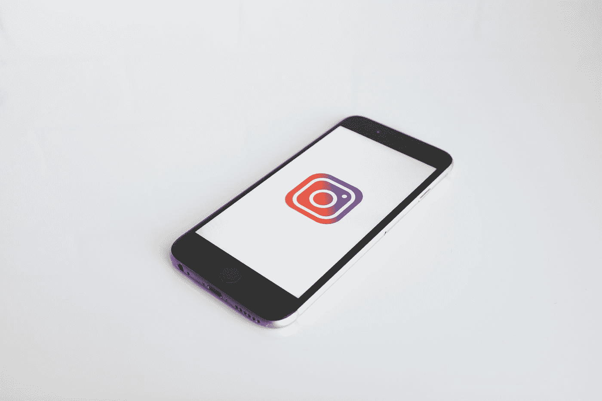
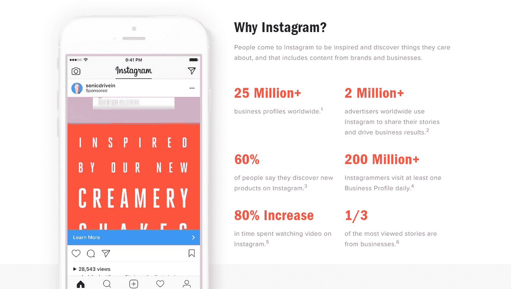

# 如何促进 Instagram 的有机增长

> 原文：<https://medium.com/hackernoon/how-to-boost-your-instagram-growth-organically-e26fac6bef4a>

你是一个品牌或有影响力的人，试图在 Instagram 上增加粉丝。

所以你发布内容，在你的领域追随他人，但似乎没有什么是有效的。当然，你到处都有一些追随者——其中一些实际上就在你的行业里。

但是你想加速这个过程和增长，从你的 IG 账户里掏出钱来。

好消息是——你可以有机地做到这一点。

我们将深入探讨一些您可以使用的方法，但首先，让我们看看您的帐户陷入困境的一些原因。

# Instagrammers 为什么不关注你？

知道你错在哪里将帮助你提高你的 Instagram 营销效果。这对有影响力的人、品牌和任何想在世界第二大社交媒体网络上变得受欢迎的人都适用。

看看下面听起来像不像你。

# 你没有持续发布帖子

你发帖的频率很重要。

为什么？

因为 Instagrammers 是超社交的，积极寻找令人惊叹的内容。因此，如果人们看到你的个人资料，看到你几天没有发帖，他们会认为你不活跃，不会点击“关注”按钮。

即使你已经有了成千上万的关注者，不持续发布内容也会损害你的参与度。

如果你不知道的话，Instagram 的新算法会奖励内容，如果你的帖子获得了很多参与，它会在你的关注者订阅中推送内容。

因此，在发展您的客户时请记住，一致性是关键！

# 你忽略了你的观众

如果你不能吸引你的观众，那么你就损害了你个人或公司品牌的形象。别忘了 Instagram 是一个社交网络——关键词社交。

因此，每天花时间回复评论和评论他人的帖子至关重要。你也应该把寻找和分享他人的内容作为一种常规。

# 你的内容是低质量的或者完全无聊的

没有人想看、读或观看会让他们睡着的内容。或者更糟——伤害他们的眼睛。

这就是发布高质量内容至关重要的原因。你上传的每一个视频和照片都应该是高清的(包括视觉和听觉)。

如果不是，那么用户会比你眨眼的速度还快。

此外，你所涵盖的主题应该足够吸引人，以吸引和保持你的目标受众的注意力。

研究什么是趋势，并尝试围绕这些主题和想法创建内容。你也可以调查你的追随者，看看他们想要什么类型的内容和什么主题。

用投票的方式让他们选择想法。

好吧，那么你能做些什么来积极增加你的 Instagram 账户呢？这里有一些有机营销技巧可以尝试。

# 制定内容策略

如果没有特别的内容，你增加 Instagram 关注的努力不会有什么进展。因此，为了确保你有持续的吸引眼球的内容，你需要一个计划。

你的策略应该包括推出高质量的帖子，这些帖子充满了令人惊叹的视觉效果，以及那些唤起情感或讲述故事的帖子。

当然，你发布的内容类型取决于你所处的行业和你希望吸引的受众。

因此，首先，你应该专注于创造能引发对话、激发灵感或让人发笑的内容。

围绕你的内容创建一个主题是一个好主意，这样当人们看到你的帖子时，他们可以立即将它与你的品牌联系起来。您可以通过使用特定的配色方案、滤镜和布局来实现这一点。

留意哪些表现好(哪些不好)，这样你就知道该继续发布什么了。一旦你有了内容和主题的形式的想法，你就可以创建一个每月的时间表。

有一些工具可以让你的社交媒体帖子自动化，比如 Hootsuite 和 HubSpot。

# 专注于讲故事

今天的人们喜欢故事。因此，如果你想销售一种产品或服务，甚至是你的个人品牌，那么故事必须是你战略的一部分。

它是关于给你的内容赋予叙述性、特征和目的。如果你能够启发、鼓舞和/或娱乐你的观众，那么你就赚了。

还有什么比用 Instagram Stories 分享这些故事更好的方式呢？

迄今为止，每天有 5 亿人使用故事。所以这是一个受欢迎的工具，并被广泛接受。你几乎可以保证用户至少会点击你的视频来看看它是关于什么的。

如果你让他们看得够短、够吸引人，你就能让他们看完整个过程(甚至在之后跟踪你)。

另外，大约 33%最受关注的[故事是由品牌创造的。](https://business.instagram.com/getting-started)

因此，如果你还没有将 Instagram 故事整合到你的活动中，那么是时候开始了！

# 瞄准特定的受众

Instagram 用户超过 10 亿，所以大海里有很多鱼可以钓。但这并不意味着你需要把网撒得又远又广。

虽然这听起来像是一个合理的策略，但它不会产生一致或持久的结果。首先，你不可能取悦所有人。

你应该让你的内容面向特定的人群，让他们产生共鸣。试图为每个人创造内容会冲淡你的反馈，让你的追随者高兴是不可能的。

没有足够的内容分发给每个人。所以你的赌注是坐下来研究你的目标受众。

他们位于何处，年龄多大，从事什么工作？他们的问题、顾虑和愿望如何？

有了这些类型的洞察力，你可以制定一个计划来安抚他们。从他们喜欢消费的内容种类(模因、故事、视频直播)和最吸引他们的话题。

# 使用能够吸引目标受众的标签

好，那么你知道你的观众是谁，他们喜欢什么类型的内容。现在，是时候引起他们的注意了。

标签是帮助非关注者找到你的最有效的方法之一。关键是选择不被过度使用的流行标签，这样你的帖子就不会淹没在内容的海洋中。

如果你在迎合一个特定的社区或城市，包含特定位置的标签也是一个好主意。

密切关注你所在行业的趋势，这样你就可以乘风破浪，潜在地捕捉更多的鱼。

# 尝试不同的帖子和策略

吸引 Instagram 粉丝没有千篇一律的方法。这些人有需求和欲望，你必须去学习和适应。

但是如果不做一点实验，很难做到这一点。你不想对你的策略感到舒适或自满。总有改进的空间。

今天有效的不一定明天就有效。你应该尝试改变你的内容类型、主题(只要是相关的)和方法。

当然，你希望你的策略忠于你的品牌，否则它会显得不真实和垃圾。

您可以测试的一些内容包括:

*   员额频率
*   不同的内容类型(电影、迷因等。)
*   您发布的时间和日期
*   你使用的标签
*   您帖子中的内容

这不是一个包罗万象的列表，但应该给你一个良好的开端。

现在，同样重要的是要注意你的标签也可以帮助组织你的内容。所以在相似的内容上使用相同的标签是最理想的。

这将允许关注者(和非关注者)找到他们正在寻找的内容。你可以把标签想象成文件夹。

您可以使用的一些标签包括:

*   行业标签(#酒店)
*   利基标签(#健康和健康)
*   品牌标签(您的公司或产品/服务名称)
*   社区标签(#GoBucks)
*   位置标签(#奥兰多酒店)
*   活动标签(# 2019 全国妇女日)
*   事件类型标签(#WeddingDay)

这应该让你知道如何使用标签来使你的文章更有组织性和可见性。

# 获得真正的 Instagram 粉丝，而不是假货

你购买 Instagram 粉丝的方法应该是战略性的。你会发现社交媒体上许多有影响力的人会为他们的账户购买追随者。

他们这样做是为了帮助建立他们的信誉，赢得更多的追随者。如今，人们只会关注他们认为受欢迎和值得信赖的账户。你也可以用老办法获得免费的 instagram 赞和关注者，但这不会持续太久。

社交证明是获得这种信任的一部分。

现在，在你去购买追随者之前，你必须确保他们是真实的人和账户，而不是机器人和虚假的个人资料。这将使你的 IG 账户看起来很糟糕，并有可能被封禁或暂停。

在研究了几十种可用的增长服务后，最好的服务是一家名为“点赞标签”的公司。

在[赞](http://hashtagsforlikes.co)标签上，你可以每月付费，从你的目标受众那里获得稳定的真实追随者。这是一种战略性的方法——而不是垃圾邮件式的攻击。

# 开始建立你的 Instagram 账户吧！

如您所见，有许多方法可以让您的客户有机增长。甚至购买关注者也是利用你新发现的社会证据获得更多关注者的有机方式。

一旦你有了足够多的关注者，你会发现获得越来越多的关注者会更容易。

所以，开始整理你的策略，让我们在评论中了解它的效果吧！