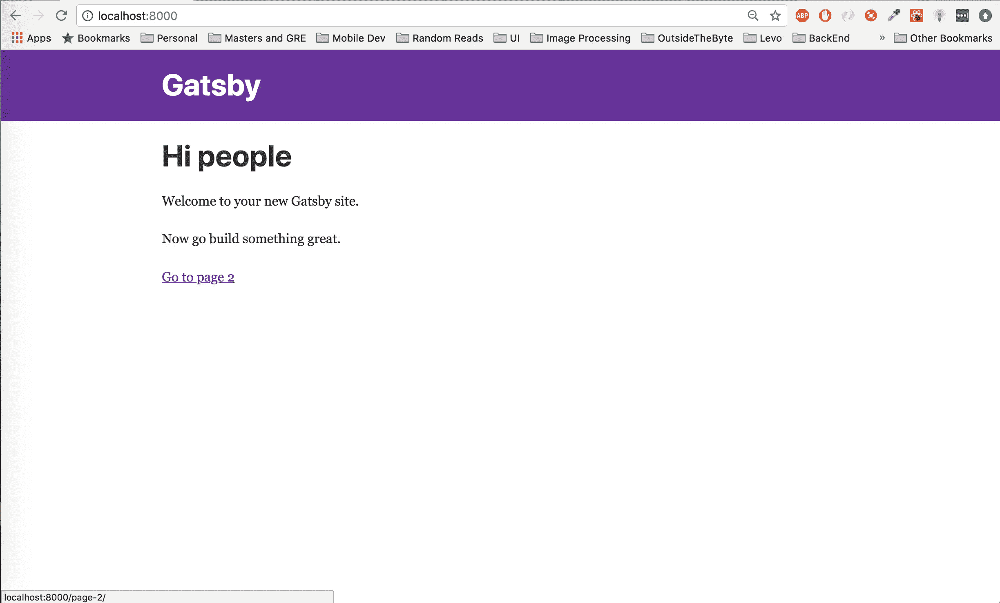

# 如何用 Gatsby 和 Cosmic JS 搭建文档 App

> 原文：<https://medium.com/hackernoon/how-to-build-a-documentation-app-with-gatsby-and-cosmic-js-8aed8b0aeaa5>


文档？…文档。假设你想创造一种方式来轻松地发布和阅读文档，呃…文档。在这篇文章结束时，你将能够做到这一点，所有这些都借助于 Gatsby(一个静态站点生成器)和 Cosmic JS(一个易于设置和使用的内容管理系统)的力量。喝点咖啡，找把舒服的椅子，让我们做点酷的东西。

**TL:DR**

[盖茨比文档 App Demo](https://cosmicjs.com/apps/gatsby-docs)
[查看代码库](https://github.com/cosmicjs/gatsby-docs-app)

**1.0 —简介**

**什么是** [**盖茨比**](https://www.gatsbyjs.org/) ？

Gatsby 是一个易于使用的生成静态网站文件的框架。它与各种热点捆绑在一起，如用于构建 web 组件的 React JS，以及用于处理组件状态的 GraphQL，而无需配置 Redux 之类的东西来处理外部数据。

**那** [**宇宙 JS**](https://cosmicjs.com/) 呢？

宇宙 JS 将处理我们的出版和数据存储。对于这样的应用来说，它很容易设置和实现，而且具有足够的可伸缩性来处理大型团队中更复杂的项目。我们将用它来创建和存储我们的文档内容。这将使我们能够专注于用户如何与我们的应用程序交互，并让 Cosmic JS 完成所有繁重的工作。

**就这些吗？**

嗯，不…我们将把我们的文档从 markdown 转换成 html，因为这是网络浏览器喜欢的。为了做到这一点，我们将使用一个名为[摊牌](https://play.pokemonshowdown.com/)的包，它可以处理解析和转换 markdown 与 HTML。

**有什么要求**？

哦，对了，你需要访问一个终端，一个带有[桶和文档对象](https://cosmicjs.com/getting-started)的 Cosmic JS 帐户，以及一个安装在你机器上的[节点 JS](https://nodejs.org/en/) 的最新版本，以便安装必要的软件使这个应用程序工作。我将使用 yarn 来运行我的构建脚本，但是如果你愿意，你也可以使用 npm。只要记住选择一个(npm 或 yarn)并坚持下去，因为在部署的时候事情会变得有点棘手。

我们来建吧！！

**1.1 —建立我们的开发环境**

要开始，我们需要安装 Gatsby 并安装我们的依赖项。很简单。Gatsby 使用方便的命令行界面(CLI)来构建我们的初始项目文件。首先，我们希望通过使用 npm 全局安装 CLI 来安装它:

`$ npm install -g gatsby-cli`

这使我们能够访问“gatsby”命令，并允许我们初始化我们的项目。运行以下脚本，创建一个填充了项目模板的新目录:

`$ gatsby new gatsby-docs`

稍等片刻，让脚本完成，您会注意到创建了一个名为“gatsby-docs”的新目录。让我们通过改变目录来看看里面有什么:

`$ cd gatsby-docs`

您应该会看到类似如下的目录结构:

```
. 
├── node_modules
├── src
├── .gitignore
├── gatsby-browser.js
├── gatsby-config.js
├── gatsby-node.js
├── gatsby-ssr.js
├── LICENSE
├── package-lock.json
├── package.json
└── README.md
```

如果您习惯于创建节点应用程序，您会对其中的大部分内容感到熟悉，但有些内容会有点陌生。通过执行启动脚本，您应该能够启动并运行开发服务器:

`$ yarn start`

一秒钟后，您应该会看到一个成功提示，让您知道一切都已正确编译，您的应用程序是活的。

现在，您可以打开指向“localhost:8000”的浏览器，查看编译后的输出。它应该看起来非常类似于这样:



恭喜你。你已经建立了一个工作的盖茨比网站。但是，在我们深入了解幕后发生的事情之前，让我们先安装为我们的应用提供动力的其余依赖项:

`$ yarn add cosmicjs showdown highlight.js dotenv node-sass gatsby-plugin-sass gatsby-source-graphql`

哇…那是很多新安装的软件包，但是我发誓每个都非常有用。

*   `cosmicjs`将用于向我们的应用程序添加新内容。
*   是我提到的处理 markdown 和 html 转换的文本解析器。
*   `highlight.js`将在转换后的降价文本中处理语法高亮。
*   `dotenv`是一个环境变量包，它将确保我们的敏感令牌和/或运行时环境是从`. env '文件配置的
*   `node-sass`和`gatsby-plugin-sass`包将允许使用`.scss`文件来设计我们的组件。
*   `gatsby-source-graphql`将允许我们在外部数据上利用 GraphQL 查询(即使用 Cosmic JS GraphQL api)

随着所有这些业务的完成，我们可以查看我们的目录并配置我们的 Gatsby 源代码以正确运行。

**2.0 —配置 Gatsby**

现在我们可以深入我们的目录，并确保 Gatsby 配置正确，可以使用可扩展和合理地支持我们的应用程序的技术。

我们要查看的第一个文件是`gatsby-config.js`。这个文件用于配置高级插件，当我们构建静态文件时，这些插件允许我们编写的任何源代码被正确捆绑。它还包含一些向用户描述我们站点的元数据，可以在我们的 React 组件中查询。

在这里，我们将把新安装的插件添加到你面前的默认配置中。首先，我们只需要将`gatsby-plugin-sass`添加到插件列表中，允许我们导入 sass 文件并利用 sass 为每个组件编写合理的样式规范。

接下来，我们将在`gatsby-source-graphql`的插件列表末尾添加一个对象，它将配置我们的外部 GraphQL API 端点，允许我们从 Cosmic JS 获取数据。事情应该是这样的:

现在我们开始对 Cosmic JS GraphQL API 进行 GraphQL 查询！接下来，让我们谈一会儿盖茨比以及事情将如何破裂。

**2.1 用 Gatsby 构建我们的应用**

我提到过 Gatsby 是一个静态站点生成器，但是这是什么意思呢？Gatsby 采用我们创建的所有花哨代码，并生成使用我们指定的配置文件预先配置的静态文件。通过这样做，我们可以提高站点的性能，这些站点可能有大量的图像、要获取的数据以及其他会降低 web 应用程序速度的资产。

现在让我们创建一些源代码。我们的网站将只使用两个“页面”，一个将作为列出我们创建的文档的主页，另一个用于查看文档。但是为了获取我们将要显示的内容，我们将使用我们最近配置的 GraphQL。我们需要在我们的`gatsby-node.js`文件中添加一些变量，以便让我们的静态文件拥有必要的参数来进行 API 调用。

**创建一个. env 文件并添加你的 Cosmic JS 环境变量**

在你的宇宙 JS 桶>基本设置菜单中，你会在底部看到一个桶段和读写键。复制所有这三个文件，并将它们添加到一个. env 文件中。

在项目根目录下，在终端中键入:

`$ touch .env`

现在创建三行:

我们将在 dotenv 包中使用这些变量，以允许我们的 src 文件在必要时访问这些变量。

**打开** `**gatsby-node.js**` **并添加配置变量到页面**

我们现在将使用 Gatsby 的内置节点 API 来为站点中的每个页面提供对我们刚刚创建的环境变量的访问。首先我们将使用 dotenv 从我们的`.env`文件中导入变量，然后我们将在页面的上下文中显式地设置每个变量。您的文件应该如下所示:

**创建我们的第一页**

现在我们将创建我们的第一个页面，它将获取所有的文档对象，并在我们站点的根目录下显示它们，在`index.js`上。首先，让我们通过在组件目录中创建一个名为 docs - `/src/components/docs/`的文件夹来创建我们的列表，在这个文件夹中，我们将创建一个名为`index.js`的文件。

这将是我们的模块，在获取我们的文档之后，当我们呈现我们的页面*时第一次显示。下面是源代码:*

**这里发生了什么:**

这个页面基本上在我们的`docs`上运行了一个大循环，并返回一些漂亮的 jsx。我们通过 docs 数组进行映射，生成一个来自 Gatsby 的链接，其中包含标题、日期和一些内容，这些内容使用了对已发布文档的描述。

也可以随意将任何`.scss`文件添加到这个目录中，以获得适合给定类名的样式。

**用我们的新组件更新“主页”**

现在我们可以在`/pages/index.js`打开我们的主页文件，导入我们刚刚创建的组件，并将它们添加到我们返回的 jsx 中。

importing our Docs and adding to pages/index.js

现在任何在 Cosmic JS 上创建的`docs`，都会出现在这里的主页上！

请注意文件底部导出的查询。它包含两个字符串类型变量，因为我们在 gatsby-node 配置中设置了**上下文**对象。

随着我们新创建的主页的工作，让我们创建我们的文档视图，它将显示我们发布的文档的内容。

**创建我们的单据显示页面**

我们不是在 Gatsby 的 pages 目录中添加一个新文件，而是创建一个“templates”目录，并创建一个我们可以在构建时配置的模板页面，这样每当创建一个文档时，当我们从 Cosmic JS 获取我们的文档时，就可以创建一个新页面。

首先在项目根目录下创建一个“templates”目录，然后在其中创建一个`docPage.js`文件。

```
. ├── _templates 
| ├── docPage.js
```

现在添加带有导出查询的页面模板，该查询将从 Cosmic JS 获取一个单独的文档。

在我们告诉 Gatsby 它需要使用这个模板创建一个页面之前，这个模板不会发生任何事情。我们这样做是为了让 Gatsby 在使用每个 GraphQL 查询的必要参数在`docPage.js`底部构建页面之前，有机会从 Cosmic JS 获取我们的文档。毕竟我们使用的是静态站点文件。

**更新盖茨比节点建立模板页面**

让我们继续向`gatsby-node.js`添加一个导出函数，这样我们就可以从我们的 GraphQL 数据构建文档页面模板:

现在，当 Gatsby 创建其页面时，即索引页面将获取我们的文档，并为检索到的每个文档创建一个页面，并将所有必要的参数附加到每个页面的页面内容。通过这种方式，我们的模板组件被呈现，我们的 GraphQL 查询应该会成功！

**3.0 部署**

最后，我们可以谈谈部署和静态站点是如何工作的。部署这个坏男孩可能有点棘手，因为这个站点使用静态构建，在部署服务有机会重建之前，不会有新创建文档的必要页面。

我的建议是使用 [netlify](https://www.netlify.com/) 并从 GitHub 或任何存储代码的地方链接您的源代码。从那里你可以触发 buildhooks，以便在特定事件发生时重新构建你的站点。当对象被创建、删除、编辑等时，Cosmic JS 将允许在一个端点上触发 post 请求。所以你可以很容易地将两者联系起来，创造一些奇迹。请记住，如果您希望允许用户在您的 UI 中创建文档:您将需要手动发出 POST 请求，以便在成功创建文档时激活 buildhook。

无论如何，这就是我的全部乡亲！黑客快乐。

*最初发表于*[*cosmicjs.com*](https://cosmicjs.com/articles/how-to-build-a-documentation-app-with-gatsby-and-cosmic-js-jrb4den5)*。*