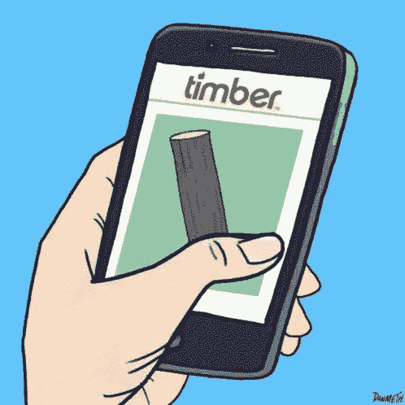
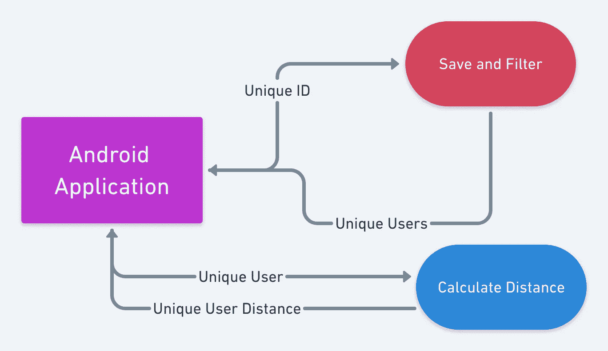
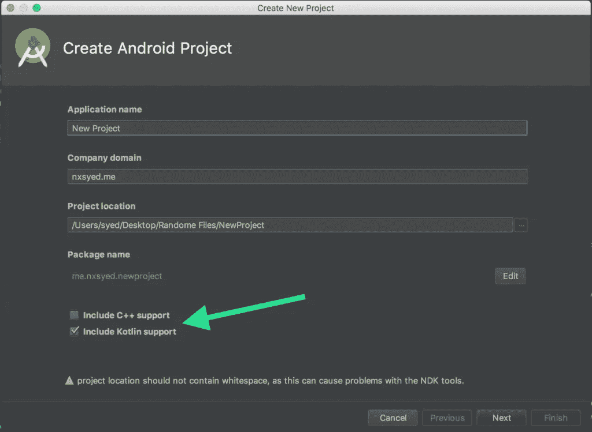

# 我开发了一个应用程序来操纵我约会的机会。

> 原文：<https://medium.com/hackernoon/how-to-build-a-geographically-aware-location-based-android-dating-app-c1aaa26f2f60>

随着超过三分之一的人选择在网上建立有意义的关系，像 Tinder 和 Bumble 这样以即时满足为导向的约会应用蓬勃发展也是理所当然的。这让我开始思考——从头开始开发一个[地理感知移动约会应用](https://www.pubnub.com/solutions/chat/dating-apps/)有多难？事实证明，有了微服务和无服务器设计模式，在实时网络的支持下，这并不困难。

在本教程中，我们将涵盖构建一个移动的、地理感知的约会应用程序的两个非常重要的部分——地理定位和滑动。



为制作这个向[丹](http://danmeth.tumblr.com/post/119457060107/the-sexy-new-social-app-for-bearded-guys)大喊！

# 约会应用的微服务架构

让我们来看看我们的应用程序的流程，并对我们将要构建的内容做一个快速的概述。直截了当地说，当我说**用户**时，我指的是打开 [Android](https://hackernoon.com/tagged/android) 应用程序的人，当我说**合作伙伴**时，我指的是打开应用程序的所有其他用户。

我们知道我们需要找到除用户之外的每一个合作伙伴，我们还需要知道他们的[位置](https://hackernoon.com/tagged/location)。这意味着每个设备都需要共享一个唯一的 ID 和它们的位置。接下来，我们需要每个设备能够检查彼此的设备，同时还可以将它们自己添加到列表中或更新它们的当前位置。一旦用户将自己添加到伙伴列表中，我们可以从列表中选择其他用户，并检查他们与当前用户的距离。

这意味着我们可以将整个系统分成三个部分:

# Android 应用程序

实际的 Android 应用程序发送自己的唯一 id 和位置，并接收其他用户的 ID 和位置。

# 保存并过滤

这个部分从 Android 应用程序获取数据，并返回每个用户的位置和唯一 id，而不是调用该服务的用户。

# 计算距离

这将一个用户的位置和另一个用户的位置结合起来，并返回距离。这涉及到一些数学问题，因为我们将计算两个纬度和经度距离之间的距离。该服务将返回唯一用户和距离。



# 创建微服务

为了让事情变得简单高效，我们需要找到一个提供商来运行我们的微服务。为此，我们将使用 PubNub 函数。

您首先必须使用下面的嵌入表单注册一个帐户。之后，前往[管理仪表板](https://admin.pubnub.com/)并启用功能特性。

这将让我们在 PubNub 上构建出**保存和过滤**功能，以及**计算距离**微服务，并为我们提供我们想要的实时、可扩展的体验。

# 实时保存和过滤用户

我们的客户端应用程序会将当前用户的 ID 和位置发布到一个无服务器的 PubNub 函数，该函数会将位置保存到一个名为 [PubNub KV Store](https://www.pubnub.com/docs/blocks/tutorials/kv-store) 的键集范围的持久性存储中。

从那里，我们的第一个函数将对照 KV Store 中的每一项检查当前 ID，并将其添加到用户列表中。一旦我们有了完整的列表，我们将使用 ID 将该消息发布回设备独有的通道。

*注意:PubNub 函数允许每个函数* *调用最多 3 个请求。*

# 实时计算距离

我们将以数组的形式获取数据。数组的前两个元素是用户的 id，最后两个元素是发起请求的用户的位置。第一个元素是发起者的 ID，第二个元素是可能的刷卡候选项。一旦我们完成计算，我们将发送唯一用户的 ID 和他们离启动器的距离。

该函数的结果如下所示:

```
{ "ID": "Unique User ID", "distance": 5 }
```

# 如何在安卓应用上刷用户

首先，创建一个空的 Android Studio 项目，并选中 Kotlin 支持。



接下来，看看我们要添加到应用程序级 Gradle 文件中的依赖项，以确保我们的应用程序运行顺畅。

第一个依赖项是 **PubNub SDK** ，它将帮助我们发布和订阅我们刚刚创建的逻辑。与 PubNub SDK 相关，我们还需要发布键和订阅键。您可以通过下面的快速设置获得发布和订阅密钥。

其他需要依赖的是我们应用程序的视觉组件——滑动功能。

# 创建用户界面

首先，我们将调整我们的 activity_main.xml 以适应我们的滑动特性，该特性将在我们的`MainActivity.kt`文件中初始化。

接下来，我们将创建每个个人资料卡的 UI，以及每个卡片上的覆盖图，同时考虑用户是向左还是向右滑动。

这就是 UI，现在让我们来看看后端。

# 集成应用程序逻辑

为了完成我们的应用程序，我们将创建四个单独的文件。我们需要的第一个文件是一个类，它将作为每个概要文件的对象，并包含相关的信息。

接下来，我们将创建一个文件，其中包含一些帮助函数来更新我们的配置文件集合。

现在，我们可以将每个概要文件加载到前端。我们将在一个名为`CardStackAdapter`的类中做这件事。

# 将一切缝合在一起

我们可以去查看`MainActivity.kt`文件，看看所有的东西是如何组合在一起的。

让我们快速看一下 onCreate 和 onStart 方法。

我们可以把所有发生的事情分解成三件事。

首先，我们将利用[得到设备的位置**融合到**的位置](https://developers.google.com/location-context/fused-location-provider/)。接下来，我们将订阅与我们的设备 ID 同名的频道，因为我们可以滑动的所有可能的人都发布到该频道。最后，在 **onStart** 中，我们将发布与设备相关的日期，就像 ID 和位置一样。我们在 onStart 和**而不是**onCreate 中发布的原因是，在活动开始之前，我们无法获得所有需要发布的信息。

这样，让我们在 MainActivity 中添加所有功能并使用您的 pub/sub 键(它们在您的[管理仪表板](https://admin.pubnub.com/)中)。最后，我们的文件将如下所示:

让我们运行应用程序吧！在模拟器或设备上，你可以看到滑动功能，以及用户与你的距离。

干得好！想探索更多关于移动约会应用的功能和想法吗？查看我们的[实时约会应用概述](https://www.pubnub.com/solutions/chat/dating-apps/)，了解如何利用 PubNub 的聊天 API 和消息基础设施在全球范围内支持跨平台、快速、安全的约会应用。

*原载于*[*www.pubnub.com*](https://www.pubnub.com/blog/how-to-build-a-location-based-dating-app-in-android/)*。*