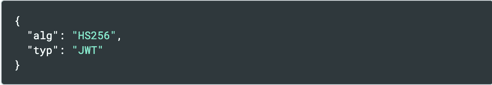
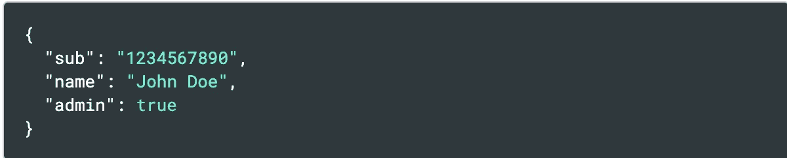
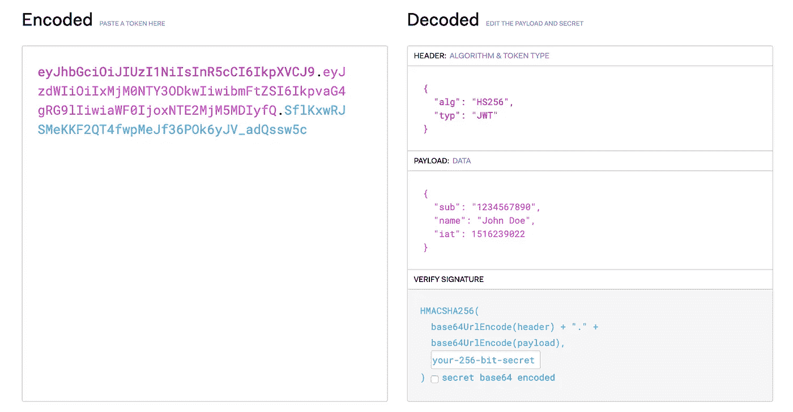
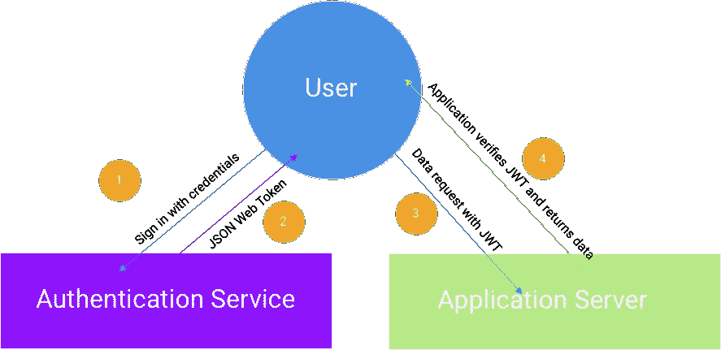
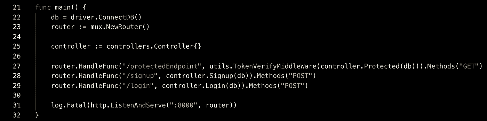
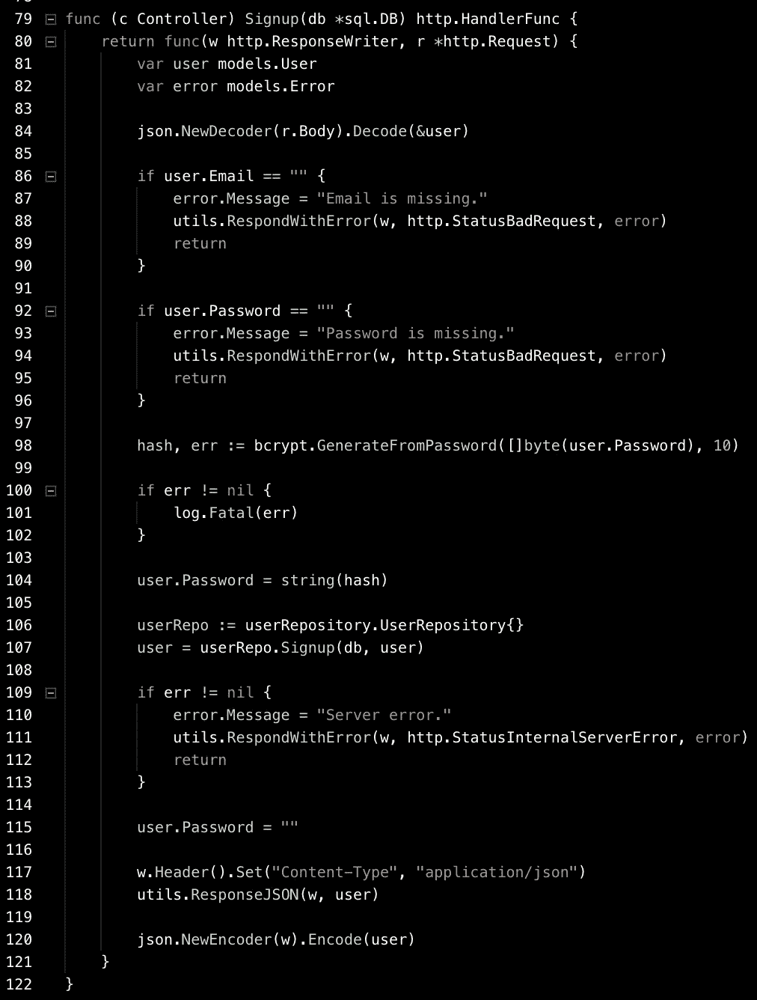
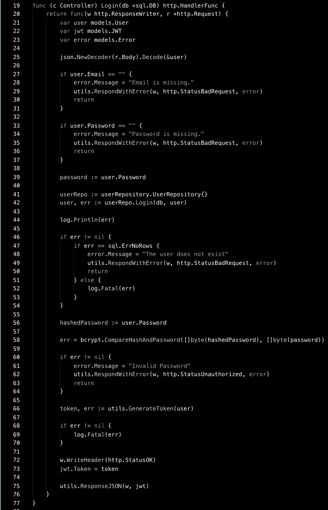
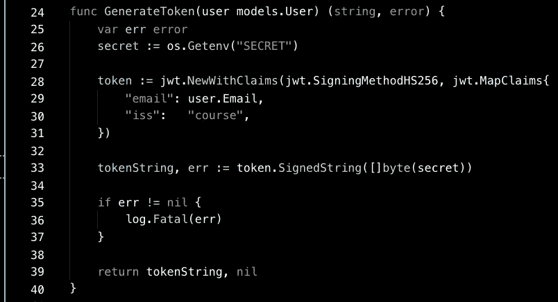
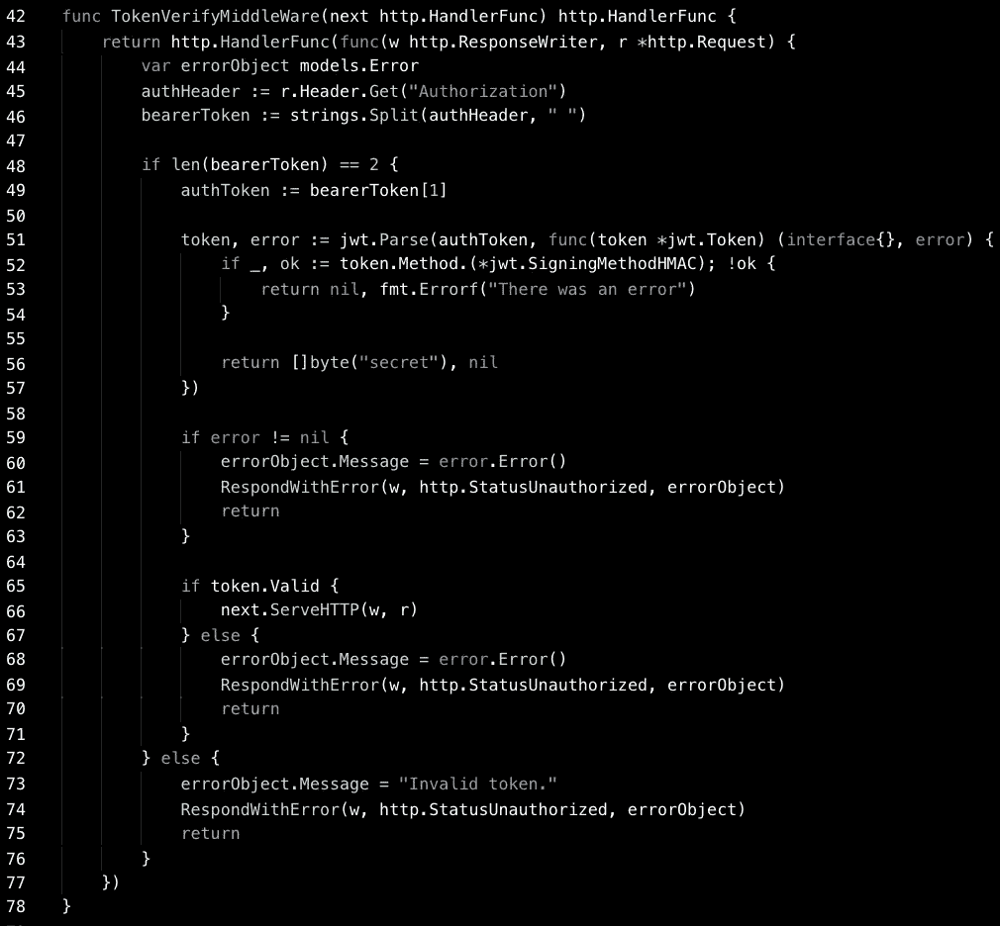

# 如何用 Go 构建 JWT 认证服务

> 原文：<https://medium.com/hackernoon/how-to-build-a-jwt-auth-service-with-go-2af058bc061>

JSON Web 令牌(JWT)是现代应用程序中确保安全认证的一种流行方法。JWT 允许我们以 JSON 对象的形式在双方之间安全地传输信息。该信息是可信的，因为它可以被数字签名。jwt 可以用两种方式签名。

1.  使用秘密的 HMAC 算法——这就是我们在这篇文章中要做的🤓🤓🤓。
2.  使用 **RSA** 或 **ECDSA** 的公钥/私钥对。

## 我们应该什么时候使用 jwt？

**授权**

使用 JWTis 授权的最流行的场景。用户登录后，每个后续请求都将包含 JWT，从而允许用户访问受保护的资源。

**信息交换:**

JWT 是在双方之间安全传输信息的良好协议，因为它具有数字签名的特性，因而是可信的。

## 但是到底什么是 JWT 呢？

从形式上来说， [RFC7519](https://tools.ietf.org/html/rfc7519) 将 JWT 定义为一种安全的方式来表示在双方之间转移的权利主张。

```
The claims in a JWT are encoded as a JSON object that is used as the payload of a JSON Web Signature (JWS) structure or as the plaintext of a JSON Web Encryption (JWE) structure, enabling the claims to be digitally signed or integrity protected with a Message Authentication Code(MAC) and/or encrypted.
```

JWT 是一种编码的、带符号的字符串，具有以下格式:

```
HMACSHA256(
  base64UrlEncode(header) + "." +
  base64UrlEncode(payload),
  secret
) 
```

**头将包含关于令牌类型(JWT)的元数据，以及我们用来签名的算法。**



From jwt.io

**有效载荷将包含索赔。**声明是关于实体和附加数据的声明。有三种类型的声明(如 jwt.io 上所定义的):注册声明、公共声明和私人声明。

*   **注册声明:**一组预定义的声明，它们不是强制性的，但提供了一组有用的可互操作声明。其中有: **iss** (发行人) **exp** (到期时间) **sub** (主体) **aud** (受众)[其他](https://tools.ietf.org/html/rfc7519#section-4.1)。
*   **公共声明**:用户定义——为了避免冲突，它们应该在 [IANA JSON Web 令牌注册表](https://www.iana.org/assignments/jwt/jwt.xhtml)中定义，或者定义为包含抗冲突名称空间的 URI。
*   **私有声明:**为在同意使用信息的各方之间共享信息而创建的自定义声明，既不是注册声明，也不是公共声明。

有效载荷的例子可以是:



这里有一个关于 [jwt.io](https://jwt.io/) 的头部、有效载荷和签名编码/解码的例子。



## 可视化流程

在我们开始编写代码之前，让我们来看一下为您的应用程序使用身份验证服务的流程:



让我们来分解一下事件的流程:

1.  用户使用凭据登录。登录请求被定向到认证服务。
2.  如果登录尝试成功，身份验证服务将创建一个签名的 JWT，并将其返回给客户端。
3.  用户向附加了 JWT 的应用服务器发出后续请求。
4.  对应用服务器的每个请求都要验证 JWT，然后将数据返回给客户端。

## jwt 是如何验证的？

在部署应用程序之前，认证服务和应用程序服务器应该以安全的方式共享一个秘密。每个请求都应该附加一个 JWT，通常在使用承载模式的*授权*报头中。

```
Authorization: Bearer <token>
```

一旦请求到达应用服务器，服务器就可以检查 JWT，执行签名步骤，并检查创建的签名是否与它接收到的签名相匹配。如果没有，我们知道 JWT 是无效的。

## 我们为什么信任 jwt？

一个常见的误解是 JWT 加密数据。**JWT****不加密数据，而是证明发送的数据是由经过认证的来源创建的。我们知道它是经过认证的，因为如果我们能够验证签名，我们就知道签名者必须拥有秘密(或者使用非对称方法时的公钥)。只要我们知道秘密没有被泄露，这种信任模式就是有效的。**

## 构建原型

让我们构建一个工作原型，这样我们就可以更好地了解它在现实环境中是如何工作的。这将是非常通用的，因此您可以将这种方法应用于任何技术。

我们将实现一个具有 3 个端点的服务器:

1.  ***注册- >*** 当客户端提供有效凭证时，该端点将为用户创建一个帐户。
2.  ***登录- >*** 成功登录(凭证正确)后，将向客户端返回一个 JWT。
3.  ***protected endpoint->***只能通过有效 JWT 访问的端点。

让我们看看我们的应用程序的 *main.go* :



*线 22* - >连接到我们的 db

*第 23 行* - >定义我们的 *mux 路由器。*

*第 27–30 行* - >定义了我们的端点+处理程序

让我们看看我们的处理程序的实现。

## 注册



*第 84 行- >* 解析传入的注册请求，并将凭证提取到用户结构。

*第 86–97 行- >* 验证用户是否发送了必要的凭证

*第 98–107 行* - >根据用户密码创建散列

*第 117–120 行* - >对客户端的流响应

## 注册



*第 25 行* - >解析请求中的用户凭证

*第 42 行* - >在数据库中查找用户

*第 45 行* - >保存从数据库中检索到的散列密码为*散列密码*

*line 58* - >散列当前从用户处收到的密码，并将其与我们从数据库中获取的散列进行比较

*第 66 行* - >生成令牌(我们很快会谈到这一点)

*第 75 行* - >将 JSON 编码写入输出流。

## GenerateToken

github.com/dgrijalva/jwt-go 的 JWT 将会和广受欢迎的 JWT 图书馆一起建造。



*第 26 行- >* 在部署到生产之前，我们获取将被设置为环境变量的秘密。

*第 28–33 行* - >用声明创建令牌，用秘密签名。

## 受保护端点

这使用了受保护的端点，并用***token verify middleware***中间件包装它。



*第 45–46 行* - >从传入请求中获取授权头

第 51 行->解析和验证令牌。jwt 库正在重新创建带有头部、有效负载和应用程序秘密的签名(我们将秘密作为匿名 go 函数的第一个返回值传递)。这在[文档中有详细解释。](https://godoc.org/github.com/dgrijalva/jwt-go#example-Parse--Hmac)

*第 66 行- >* 如果令牌有效，这个中间件继续调用下一个函数(在我们的例子中是 *protectedEndpoint* 处理函数)。

这个完整的代码可以在这里找到[。这份回购协议和例子来自 https://github.com/codixir。](https://github.com/Arieg419/jwt-course-refactored)

## 我们什么时候应该使用 JWT？

让我们把 JWT 比作**简单 Web 令牌(SWT)** 和**安全断言标记语言令牌(SAML)。**

JSON 没有 XML 冗长，而且当它被编码时，比 SAML 更小更紧凑。

SWT 只能使用对称方法进行签名。这需要一种安全的秘密共享机制，这需要很大的开销。虽然我们在教程中演示了对称方法，但在使用 JWT 时，我们可以轻松地使用非对称方法，从而简化信任模型并消除易受攻击的秘密共享过程。

## 结论

“JWTs”是一种用于身份验证的互联网级协议，在当今生产中的许多应用程序中都在幕后使用。你还想知道其他认证协议吗？请在评论中告诉我！

## 如果这篇文章有帮助，请订阅并点击鼓掌👏按钮以示支持！⬇⬇

你可以在 [Instagram](https://www.instagram.com/omeragoldberg/) 、 [Linkedin](https://www.linkedin.com/in/omer-goldberg-680b40100/) 和 [Medium](/@omergoldberg) 上关注我，了解更多科技相关内容！