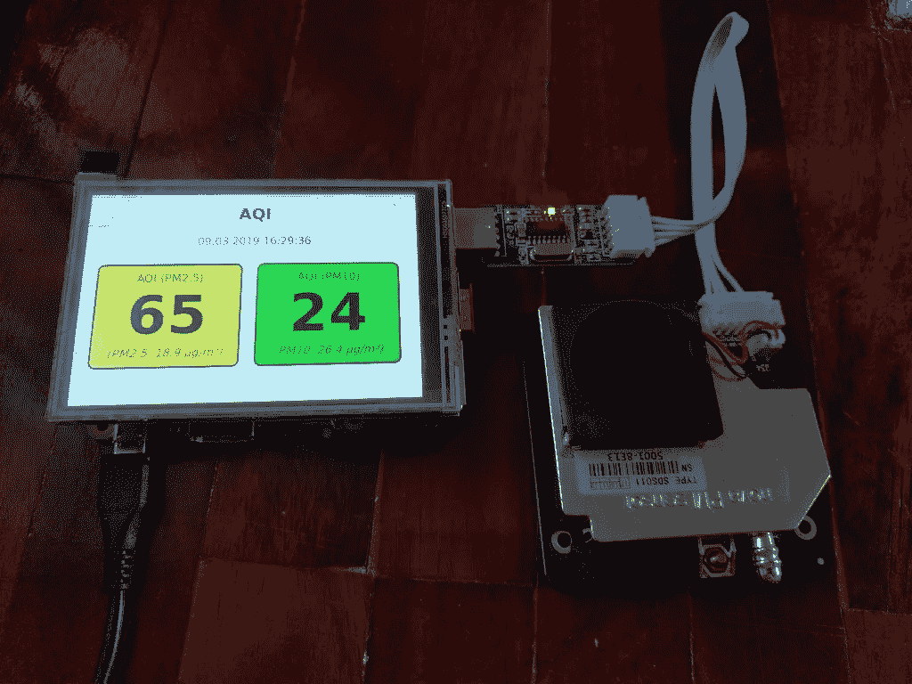

# 如何构建移动颗粒物传感器

> 原文：<https://medium.com/hackernoon/how-to-build-a-mobile-particulate-matter-sensor-a2d5eee693ba>


大约一年前，我写过关于如何用树莓皮和廉价传感器测量空气质量的文章。一定要先看那篇文章！几年来，我们一直在学校和私人场合使用这种装置。然而，这个项目有一个缺点:它不可移植，而是依赖于 WLAN 网络或有线网络连接。如果 Raspberry Pi 和智能手机或电脑不在同一个网络中，您实际上无法访问测量值。这就是为什么前段时间我们在 Raspberry Pi 上增加了一个小屏幕，这样你就可以直接从设备上读取数值了。如何为我们的移动细颗粒物传感器设置这个屏幕，以及需要哪些额外的配置，我想在本文中进行描述。

# 为 Raspberry Pi 设置屏幕

在 [**亚马逊**](https://www.amazon.com/gp/search/ref=as_li_qf_sp_sr_tl?ie=UTF8&tag=openschoolsol-20&keywords=lcd%20raspberry&index=aps&camp=1789&creative=9325&linkCode=ur2&linkId=51d6d7676e10d6c7db203c4a8b3b529a) 或全球速卖通有不同的树莓派展示。从电子纸屏幕到带触摸功能的液晶显示器。我们选择了一款带触控功能的 [**3，5″ LCD**](https://amzn.to/2CcvgpC) ，分辨率为 320×480 像素(型号 MPI3501)。你可以简单地把这个屏幕插到 GPIO 管脚上。它只需要 10-20 美元。同样令人高兴的是，3.5 英寸的显示屏和树莓派差不多大。

如果你打开屏幕并启动树莓派，屏幕会保持白色。这很正常，因为司机失踪了。您必须首先为显示器安装合适的驱动程序。为此，通过 SSH 登录并执行以下命令:

```
$ rm -rf LCD-show 
$ git clone [https://github.com/goodtft/LCD-show.git](https://github.com/goodtft/LCD-show.git) 
$ chmod -R 755 LCD-show 
$ cd LCD-show/
```

根据屏幕型号，您必须执行适当的命令来安装驱动程序。在我们的例子中(对于 MPI3501 型号):

```
$ sudo ./LCD35-show
```

该命令安装适当的驱动程序，然后重启 Raspberry Pi。

# 安装 Pixel 桌面并设置自动启动

下面是我们想要的:如果 Raspberry Pi 启动，我们想显示我们的测量小网站。所以首先你必须安装 pixel 桌面环境(如果你以前用过 Raspian Lite)

```
$ sudo apt install raspberrypi-ui-mods
```

然后是 Chromium 浏览器(我们需要它来显示网站):

```
$ sudo apt install chromium-browser
```

默认情况下，没有为用户“pi”配置自动登录。但是，这是必要的，以便测量值可以在启动后直接显示。否则，您将只能看到登录屏幕。您可以使用 *raspi-config* 工具配置自动登录:

在菜单中选择 **3 引导选项→ B1 桌面/ CLI → B4 桌面自动登录**。

我们的网站启动后，少了一个启动 chromium 的步骤。创建文件夹 ***/home/pi/。config/LX session/LXDE-pi/***:

```
$ mkdir -p /home/pi/config/lxsession/LXDE-pi/
```

然后在这个文件夹中创建 ***autostart*** 文件。

```
$ nano /home/pi/.config/lxsession/LXDE-pi/autostart
```

并粘贴以下代码:

```
#@unclutter 
@xset s off 
@xset -dpms 
@xset s noblank # Open Chrome in full screen mode after boot
@chromium-browser — incognito — kiosk [http://localhost](http://localhost)
```

如果你想隐藏鼠标指针，你必须安装软件包*清除*并删除 ***自动启动*** 文件开头的注释字符:

```
$ sudo apt install unclutter
```



由于我去年对代码做了一些小改动，建议重新下载脚本和 AQI 网站的文件(具体操作见[原文](https://openschoolsolutions.org/measure-particulate-matter-with-a-raspberry-pi/))。

# 结论

添加触摸屏后，您现在拥有了一个移动颗粒物传感器！我们在学校用它来检查教室里的空气质量或做比较测量。有了这个设置，您就不再依赖网络连接或无线局域网了。你可以在任何地方使用小型测量站——甚至可以使用独立于电网的电源组。

*原载于 openschoolsolutions.org*[](https://openschoolsolutions.org/mobile-particulate-matter-sensor/)**。**