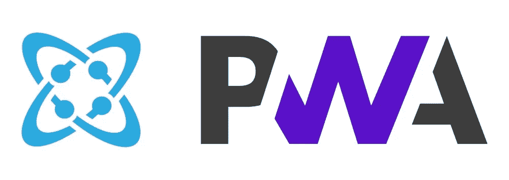
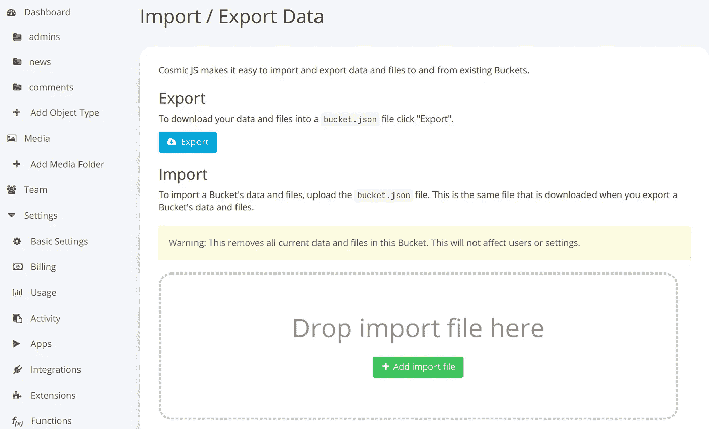
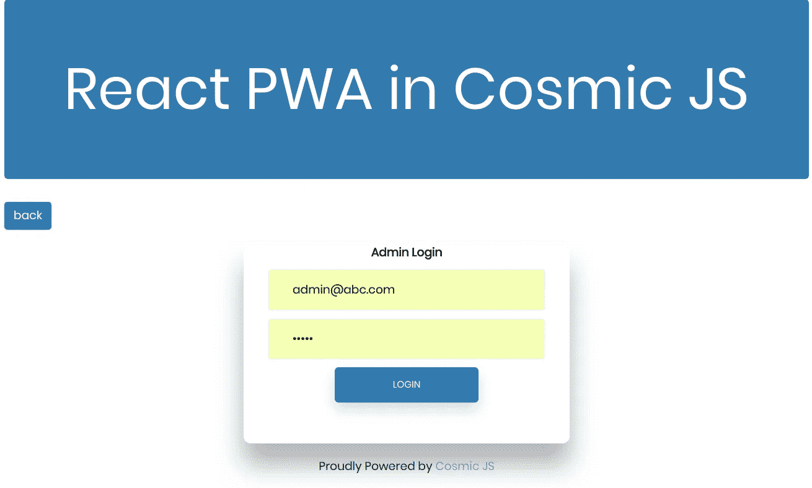
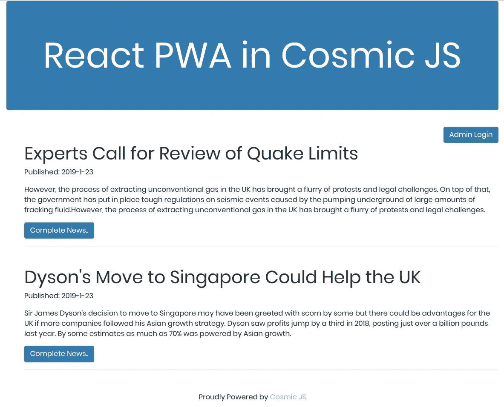
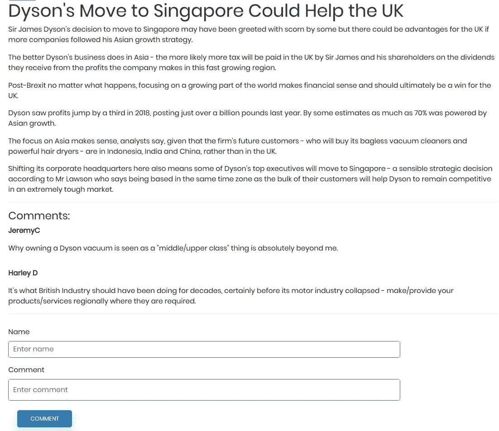
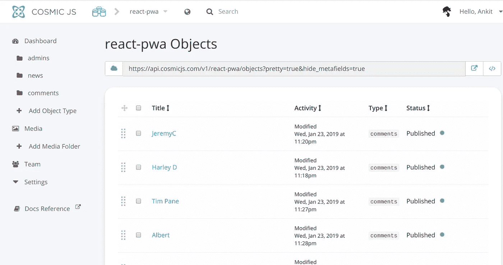
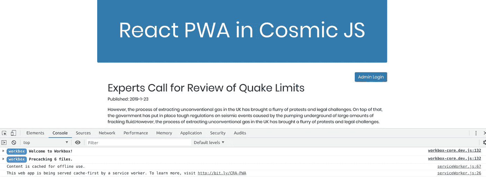
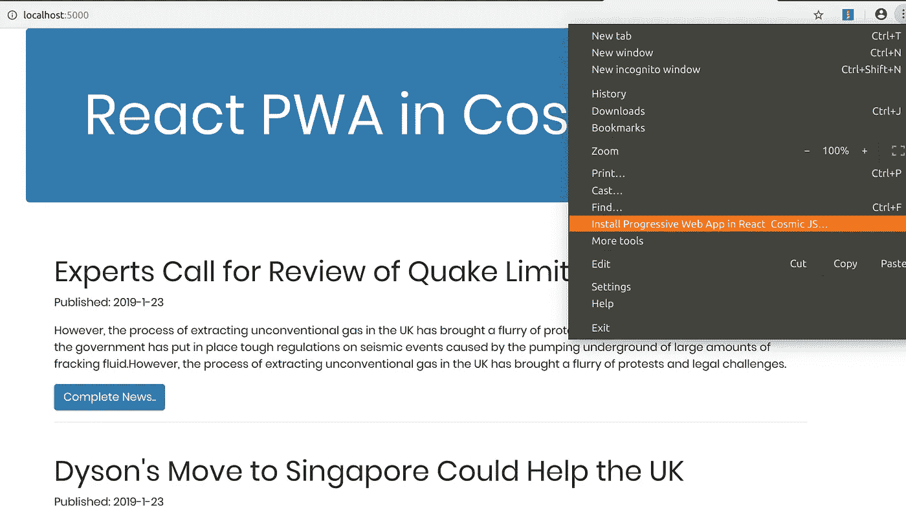
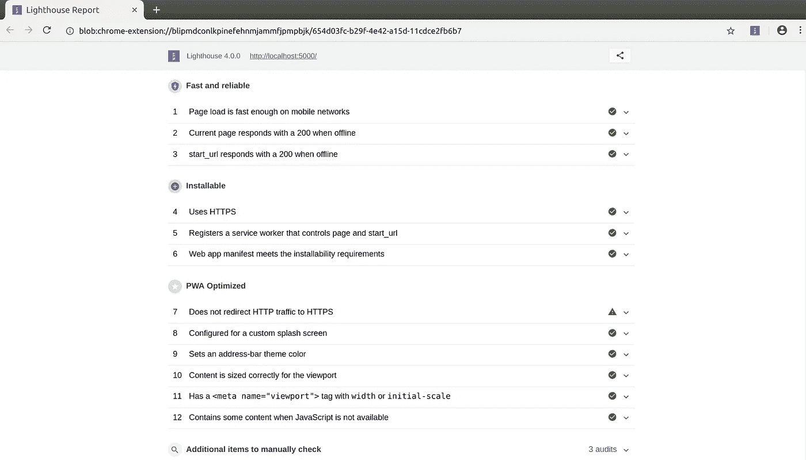
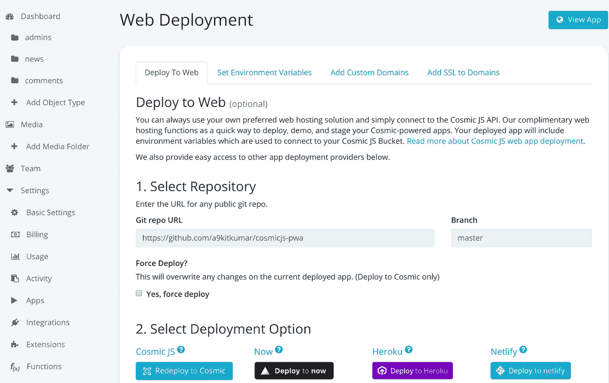

# 如何在 React.js 和 Cosmic JS 中构建 PWA

> 原文：<https://medium.com/hackernoon/how-to-build-a-pwa-in-react-js-and-cosmic-js-8dca0549029c>

React PWA with Cosmic JS

在本教程中，我将向你展示如何使用 React.js 和 [Cosmic JS](https://cosmicjs.com/) 构建一个渐进式 web 应用程序。当您离线时，我们的 PWA 将以状态 200 进行响应。该应用程序将获得数据的最后状态，并在您离线时向您显示。我们将从基础开始，完成应用程序的全部细节。完成后，我们将它部署到宇宙 JS 应用服务器，所以让我们开始吧。

# TL；速度三角形定位法(dead reckoning)

[检验演示](https://cosmicjs.com/apps/react-pwa-with-authentication)

[下载代码库](https://github.com/cosmicjs/react-pwa)

**管理员凭证:**

电子邮件:admin@abc.com

密码:admin

# **我们在建造什么？**

正如标题所解释的，我们正在构建一个渐进式网络应用程序(PWA ),它将显示由管理员发布的新闻。让我们先用简单的词语解释一下 PWA 是什么:

PWA 是一个普通的网站，有一些额外的和独特的功能，使它与众不同。以下是这些功能:

*   您可以在离线时使用这些应用程序，这意味着当互联网断开时，这些应用程序会给出一个响应代码 200
*   第二个最重要的特点是，你可以把它安装在你的设备上(桌面或移动)
*   这些应用在本质上是完全响应的

我们将使用 React.js 和 Cosmic JS 的力量来实现这个应用程序。我们开始吧。

# **要求**

[Node.js](https://nodejs.org/en/) 必须安装在您的系统上才能运行 npm 命令，在它的帮助下，我们将安装 react app。更多信息，可参考[反应文档](https://reactjs.org/docs/getting-started.html)。

# **入门**

现在我们的系统已经配置了所需的模块和工具，我们将使用 Cosmic JS 在 React.js 中创建一个渐进式 web 应用程序项目。转到您想要放置项目的任何特定文件夹，打开控制台(终端)并键入以下命令:

`npx create-react-app react-pwa`

这里 react-pwa 是您的应用程序的名称，然后转到创建的文件夹 react-pwa 并运行命令:

`npm start`

它将编译您的基本 React.js 应用程序，并自动在默认浏览器中打开。默认情况下，它运行在端口号 3000:[http://localhost:3000/](http://localhost:3000/)

# **用 Cosmic JS 配置 React App**

到目前为止，我们刚刚实现了 PWA 的前端部分，现在是时候配置服务器，即宇宙 JS 服务器和数据库。它提供了二合一设施。

首先，[在宇宙 JS](https://cosmicjs.com/signup) 上免费注册，创建你的第一个桶。现在创建一个对象类型，在我们的例子中是 Admin。类似地，再创建两个名为 1)新闻和 2)评论的对象类型。这三种对象类型有不同的用途:admin 将保存 admin 的凭证，News 将保存 Admin 发布的新闻，Comments 将保存用户发布的评论。

现在转到`Settings > Basic Settings`并生成 read_key 和 write_key，并将该页面的所有信息保存在您系统上的一个单独文件中。现在，将所有这些信息放在项目的文件夹中，路径将是:`src>config>config.js`

为了正确管理您的项目，您应该为组件、服务、配置文件、css 和图像创建不同的文件夹。这将有助于任何第三方正确理解您的代码。所有这些文件夹都应该位于 src 文件夹中。所以首先创建它们，然后跳到下一步。

# **现成桶**

对于这个项目，您可以直接将一个存储桶导入到您的仪表板，在这个存储桶中，我们已经创建了对象类型。你必须从我们的 [git repo](https://github.com/cosmicjs/react-pwa) 下载 bucket.json，然后按照步骤操作:选择默认 bucket >进入设置>进入导入/导出，点击“添加导入文件”按钮。它将导入 bucket.json 文件。

这里，我们已经创建了实施 PWA 的平台，让我们进入下一个。

# **管理员登录**

在我们的 bucket 中，有一个对象类型“Admin”。创建一个标题为 admin，元字段为 email & password 的对象。你可以根据你的情况给出邮箱和密码的值。这里我们给出了电子邮件:[admin@abc.com](mailto:admin@abc.com)和密码:管理员。稍后，您可以在我们的演示中使用它们进行管理员登录。

在`src>components>login.js`为管理员创建一个登录页面

在这个页面上，我们只是让管理员登录。我们在对象类型“admin”中静态创建了电子邮件和密码，并使用这些凭据让他登录。这里我们导入了认证服务，在 onSubmit()函数中，我们调用了在认证服务中声明的 login()函数。在 componentDidMount()中，当管理员已经登录时，我们简单地应用了导航。

# **仪表板组件**

在这个组件中，我们只显示了三个链接:主页、添加新闻和注销。从这里管理员可以导航到主页，可以添加新闻或可以注销自己。

加载时，我们应用了导航，如果管理员注销后仍试图访问此页面，导航会将他带到主页。在 logout()函数中，我们清空了本地存储，在 Add News 链接中，我们将管理员导航到 addnews.js。该文件的位置是:`src>components>dashboard.js`

# **添加新闻**

只有管理员才能访问该组件。他可以在这里发布新闻。他可以添加标题、描述和新闻正文。它会将完整的线程保存到 Cosmic JS 服务器上的对象类型“新闻”中。该组件的位置为:`src>components>addnews.js`

# **首页**

在主页上，我们显示所有由管理员发布的新闻。首先检查其编码:

这是 news.js，它在我们应用程序的主页上获取和显示新闻。我们正在解释 getNews()方法的工作原理。如果你的设备在线，那么它会从后端获取数据并显示在模板上，同时保存在浏览器上以供离线使用。如果设备离线，它将从浏览器内存中获取保存的数据并显示给用户。

在这里你可以看到新闻的标题和描述，点击“完整新闻”阅读全文。此链接将带您进入下一个组件:

# **单个新闻组件**

该组件从主页获取您点击的单个新闻。首先检查其编码:

它显示单一的新闻，也有一个评论的选项。与文章相关的评论显示在这里，你也可以添加评论。singleNews()方法一次获取新闻，我们应用了一个过滤器来获取选定的新闻。allComments()函数获取所有评论，并只过滤与这篇文章相关的评论。

# **服务**

有两个服务名为认证服务和新闻服务。让我们逐一解释:

**认证服务:**仅用于管理员登录。定义了一个方法来搜索登录页面提供的电子邮件和密码，并将结果返回给调用方法。

**新闻服务:**这是这个项目的主要服务，它处理这里几乎所有的事情。首先浏览它的编码:

下面我们来逐一解释一下它的方法:

*   addNews():它接受四个参数:标题、描述、新闻正文和日期，并保存在对象类型 News 上
*   getNews():顾名思义，它从对象类型的新闻中获取所有新闻
*   submitComment():这个方法提交对象类型“Comment”中的注释
*   allComments():在 Cosmic JS 服务器上以对象类型“Comments”获取提交的评论

# **数据建模**

我们恰当地管理了 Cosmic JS 上的数据，为此我们创建了一些对象类型来理解每个数据的性质。这里有三种对象类型:管理、新闻和评论。Admin 存储 admin 的信息，news 存储 admin 发布的新闻。Comment object-type 存储我们的新闻应用程序的读者发布的评论。

# **到目前为止我们建造了什么？**

我要明确一点，我们的 app 到现在为止都是普通 app(开发模式)；它没有任何 PWA 特性，所以让我们从本质上开始让它进步。当我们创建这个应用程序时，它已经在 src 文件夹中创建了一个文件 serviceWorker.js，它处理应用程序的渐进性质。在线使用时，自动存储 app 的静态数据，并在 app 离线时进行反映。

我们的应用程序不表现为 PWA，因为在 serviceWorker 中，它被编码为仅在生产模式下成为 PWA。因此，进行构建，然后运行构建，您将在控制台中看到如下消息:

这是应用程序的静态数据捕获。如果要捕捉动态数据，需要手动编码。我们在 news.js 文件中这样做了。当应用程序在线时，我们存储应用程序数据，当应用程序离线时，它会自动调用。因此，要享受它的 PWA 特性，请运行以下命令:

`npm run build`

`serve -s build`

我们的应用程序现在本质上是部分渐进的。它在离线时存储数据，但还不能安装在设备上。我们将在下一步中实现这一点。

# **使 App 完成 PWA**

要完成 PWA，这是最后一步。我们需要编辑 manifest.json，它位于 public 文件夹中。它应该看起来像:

这里我们添加了两个图标的路径，一个用于桌面，另一个用于移动。它们的大小应该完全相同，并且这两个图标应该出现在公共文件夹中。Start_url 显示了构建的路径。这是 manifest 的主要基本编码，现在我们的应用程序本质上是纯渐进式的。

在上面的截图中，你可以清楚地看到 Chrome 浏览器给出了在你的系统上安装 React 应用的选项。

现在，我们正在使用 lighthouse 工具检查应用程序，该工具由 Google 提供，用于检查 PWAs，检查 lighthouse 的输出如下:

在报告中，我们的应用程序实现的每个里程碑，除了第 7 个，这是一个 https 相关的，并将在我们将其部署到支持 HTTPs 的 Cosmic JS 服务器时修复。

# **部署在宇宙服务器上**

现在我们的应用程序已经准备好了，需要在部署到宇宙服务器之前进行一些改进。确保以下内容:

1.  一个公共的 GitHub repo(如果你已经连接了你的 Git 账户，也可以使用私有的)
2.  [Heroku 要求](https://devcenter.heroku.com/)应匹配

您需要遵循一些步骤:

*   使用命令安装 express:`npm install --save express`
*   修改 package.json 文件，并添加以下代码

*   现在，在根文件夹中创建一个文件 app.js，并在其中添加以下代码

最后，您进行了所有必要的更改，现在可以部署了。现在转到:`bucket>setting>deployment`并点击按钮部署到宇宙。成功部署后，您将收到一封电子邮件，并点击“查看应用程序”按钮查看应用程序。

# **判决**

很明显，在 Cosmic JS 的帮助下，我们可以创建强大的应用程序，并且可以部署在他们的服务器上，而无需任何服务器设置或配置。在这里，我们在 Cosmic server 上轻松地创建并部署了 React.js 渐进式应用程序，没有任何困难。您不需要安装任何额外的软件来部署在这里。

对于任何与在 Cosmic JS 中构建应用相关的疑问或评论，[在 Twitter 上联系我们](https://twitter.com/cosmic_js)和[在 Slack 上加入对话](https://cosmicjs.com/community)。