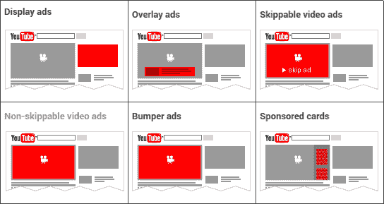

# 如何像 PRO 一样搭建视频变现平台

> 原文：<https://medium.com/hackernoon/how-to-build-a-video-monetization-platform-like-a-pro-8396e0b71c59>

只需要半分钟的视频就能一夜成名。视频有巨大的能力赢得人心，让你成为大众的宠儿。由于互联网及其丰富的可用性，现在任何人都可以通过视频货币化迅速成名致富。

对于那些已经拥有稳定的流行视频库存的视频出版商来说，有一个巨大的在线视频赚钱机会正等待着他们去挖掘。

# 视频货币化的支柱

在世界各地，视频正以四种流行的方式被货币化。它们可以被恰当地称为现代视频流媒体业务的支柱。它们是:

1.  视频点播订阅(SVOD)
2.  基于广告的视频点播(AVOD)
3.  交易视频点播(TVOD)

每一种货币化渠道都有独特的特质和特征，这使它们成为特定业务场景的理想选择。这是他们每个人在现实世界中的工作。

## **订阅视频点播**

SVOD 将频道回放控制权交给了观众。观众决定看什么节目，什么时候看，看多长时间。他们可以在一段固定的时间内无限制地(或按计划)访问视频。这可能是一周、一季、一月或一整年。观众支付固定费用或签订长期合同。

让观众沉迷于屏幕的最受欢迎的视频点播服务包括:

*   Hulu Plus
*   网飞
*   HBO Go
*   亚马逊视频

## **基于广告的视频点播**

在 SVOD，观众需要付费才能观看视频。在 AVOD，这是免费的。相反，观众不得不忍受在播放前、播放中或播放后播放的广告。甚至图像横幅肯定会出现在 AVOD 的视频。观众可以观看任意数量的视频，没有任何时间或日程限制。

YouTube 是 AVOD 的一个完美例子。视频分享网站将几种类型的广告整合到视频中。一些受欢迎的类型包括:

Advert-based video on demand

## **交易视频点播(TVOD)**

TVOD 在交易的基础上工作。观众在每次观看付费的基础上购买内容。考虑购买一个赛季的足球比赛、系列赛等的访问权。TVOD 致力于两种模式:电子销售(EST)和下载租赁(DTR)。在 EST 中，视频资产作为可以通过互联网访问的数字资产出售。至于 DTR，观众可以在短时间内观看视频，直到期限到期。

# 为什么 YouTube 不适合视频货币化

YouTube 是一个成熟的视频货币化平台。但是，你可能不会通过在 YouTube 上发布视频而变得富有。

只有少数 YouTubers 用户微笑着走向银行。不是每个人都能在 YouTube 上淘金。YouTube 对你发布视频并赚钱有几条规定。而且，不确定你真正的努力是否会有结果。

# ***使用 YouTube 轻松实现视频货币化的其他因素包括:***

## **来自各个角落的竞争**

甚至有 GoPro 的孩子也在网上发布视频，一夜之间成为热门。专业人士、业余爱好者和随机视频制作者之间没有偏见。

## **对视频的关注有限**

YouTube 的算法旨在使某些视频看起来像是趋势。可能会有比热门视频更好的视频，你的视频可能就是其中之一。每天上传的视频是百万分之一，很容易丢失。

## **YouTube 分享收入**

免费视频平台。一个体面的仪表板，显示视频分析。全面的视频管理器。所有这些都要付出一些代价，对吗？YouTube 采取的形式是广告客户为将广告整合到你的视频中而支付的收入分成。

## **你没有完全控制权**

你可以放一个水印标志来展示你的品牌。尽管如此，下载你的 YouTube 视频并在你不知情的情况下传播出去还是有可能的。此外，YouTube 也有可能因为你不容易清除的原因而删除你的视频。

# contus v play——新一代视频平台

## ***十秒或十小时，将你所有的视频内容货币化***

[**Contus Vplay**](https://www.contus.com/video-on-demand-solution.php?utm_source=Build Video Monetization Platform&utm_medium=InContentLink&utm_campaign=Hackernoon) 是一个视频点播平台，帮助以多种形式将视频货币化。视频货币化平台是一个可定制的解决方案，可以根据特定的业务需求进行定制。你可以建立一个视频货币化网站，所有的收入货币化模式，包括 SVOD，TVOD，AVOD，按次付费等，以获得最大的收入。

最重要的是，Contus Vplay 以 AES 加密的形式提供了最先进的安全性。这防止了视频被复制、下载、再分发等。

下一代视频解决方案让我们帮助您[建立一个视频货币化](https://www.contus.com/video-on-demand-solution.php?utm_source=Build Video Monetization Platform&utm_medium=InContentLink1&utm_campaign=Hackernoon)平台，它拥有定制的界面和超越普通的视频交付系统。

任何行业，任何视频流需求，任何形式的视频货币化服务，Contus Vplay 都能以钟表般的精准照顾到。

**教育** —面向全球学生群体的实时流讲座

**媒体** —点播电影、连续剧、纪录片等

**体育** —从体育场到用户屏幕的实时体育运动流

**企业**——直播产品发布，制造广泛宣传